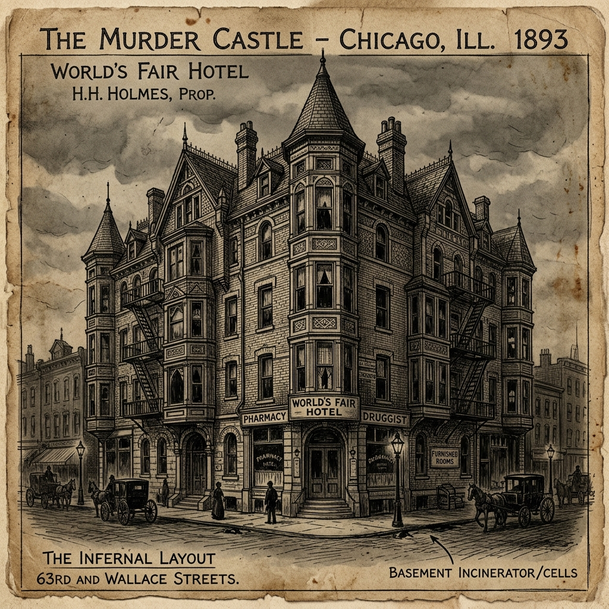
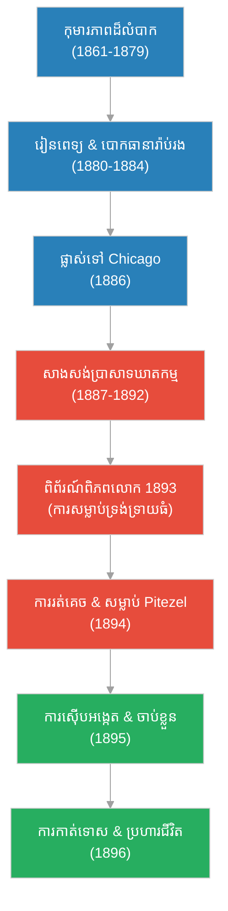

# The Biography of H.H. Holmes (ជីវប្រវត្តិ H.H. Holmes)

**Author:** ichamrong  
**Date:** 2026-06-05  
**Tags:** #hh-holmes #biography #crime-history #serial-killer #murder-castle  
**Category:** Biographies  
**Read Time:** ~15 min  

---

## 📌 មាតិកា (Table of Contents)
- [សេចក្តីផ្តើម៖ បិសាចលាក់មុខ និងវិមានឃាតកម្ម (Intro: The Devil & The Murder Castle)](#0)
- [១. Herman Mudgett៖ ពីក្មេងរងការធ្វើបាប ទៅជាវិញ្ញាណកំណាច (1. True Name & Dark Childhood)](#1)
- [២. និស្សិតពេទ្យ និងការរកស៊ីជាមួយ «សាកសព» (2. Medical Studies & Grave Robbing)](#2)
- [៣. វិមានឃាតកម្ម (Murder Castle)៖ អន្ទាក់ស្លាប់កណ្ដាលក្រុង Chicago (3. Building the Murder Castle)](#3)
- [៤. ពិព័រណ៍ពិភពលោកឆ្នាំ ១៨៩៣៖ ឱកាសមាសរបស់បិសាច (4. The 1893 World's Fair & Victims)](#4)
- [៥. ឃាតកម្មលើដៃគូ និងកុមារ៖ ផែនការចុងក្រោយ (5. The Pitezel Tragedy & Downfall)](#5)
- [៦. វិភាគចិត្តសាស្ត្រ៖ ចរិតលក្ខណៈឃាតករលំដាប់ពិភពលោក (6. Psychological Analysis)](#6)
- [៧. ភាពផ្ទុយគ្នា និងការរិះគន់៖ ផ្នូរបេតុងបិទជិត (7. Paradoxes & Criticisms)](#7)
- [៨. កេរដំណែលយុទ្ធសាស្ត្រ (Legacy Flow)](#8)
- [៩. តើ H.H. Holmes បានបំផុសគំនិតអ្វីខ្លះ? (What Did H.H. Holmes Inspire?)](#9)
- [សេចក្តីសន្និដ្ឋាន (Conclusion)](#10)
- [🔗 ឯកសារទាក់ទង (Related Topics)](#11)
- [ឯកសារយោង (References)](#12)

---

## សេចក្តីផ្តើម៖ បិសាចលាក់មុខ និងវិមានឃាតកម្ម (Intro: The Devil & The Murder Castle)

> **«ខ្ញុំកើតមកដោយមានអារក្សសណ្ឋិតនៅក្នុងខ្លួន។ ខ្ញុំមិនអាចជៀសវាងពីការធ្វើជាឃាតករបានឡើយ មិនខុសពីកវីដែលមិនអាចទប់ទល់នឹងអារម្មណ៍បំផុសគំនិតឱ្យតែងនិពន្ធចម្រៀងនោះទេ» — H.H. Holmes**  
> *(“I was born with the devil in me. I could not help the fact that I was a murderer, no more than the poet can help the inspiration to sing.” — H.H. Holmes)*

តើអ្នកធ្លាប់ស្រមៃទេថា មានមនុស្សម្នាក់ហ៊ានសាងសង់វិមានដ៏ធំមួយនៅកណ្ដាលទីក្រុង គ្រាន់តែដើម្បីទុកជាកន្លែងសម្លាប់មនុស្ស? នេះមិនមែនជារឿងប្រឌិតក្នុងភាពយន្តរន្ធត់នោះទេ ប៉ុន្តែវាជារឿងពិតរបស់ **H.H. Holmes** — ឃាតករស៊េរី (Serial Killer) ដំបូងបង្អស់ និងសាហាវបំផុតម្នាក់ក្នុងប្រវត្តិសាស្ត្រអាមេរិក។ គាត់បានប្រើប្រាស់ភាពឆ្លាតវៃ ភាពទាក់ទាញ និងចំណេះដឹងជាវេជ្ជបណ្ឌិតដើម្បីល្បួងជនរងគ្រោះចូលទៅក្នុងអន្ទាក់ដែលគ្មានផ្លូវចេញ។

---

## ១. Herman Mudgett៖ ពីក្មេងរងការធ្វើបាប ទៅជាវិញ្ញាណកំណាច (1. True Name & Dark Childhood)

H.H. Holmes មានឈ្មោះពិតថា **Herman Webster Mudgett** កើតនៅថ្ងៃទី ១៦ ខែឧសភា ឆ្នាំ ១៨៦១ ក្នុងរដ្ឋ New Hampshire។ កុមារភាពរបស់គាត់ពោរពេញដោយភាពខ្មៅងងឹត៖ ឪពុកជាមនុស្សកាចសាហាវចូលចិត្តប្រើអំពើហិង្សា ហើយនៅសាលារៀន គាត់តែងតែត្រូវបានមិត្តភក្តិធ្វើបាប និងសើចចំអកជាប្រចាំ។

ទោះបីជាយ៉ាងណា Mudgett ឆ្លាតវៃខ្លាំងណាស់ និងរៀនពូកែខុសពីក្មេងធម្មតា។ នៅអាយុ ១៦ ឆ្នាំ គាត់បានរៀបការជាលើកដំបូងជាមួយនារីម្នាក់ឈ្មោះ Clara Lovering។ នេះជាការចាប់ផ្តើមនៃជីវិតពោរពេញដោយការភូតកុហក និងបោកប្រាស់របស់គាត់។

---

## ២. និស្សិតពេទ្យ និងការរកស៊ីជាមួយ «សាកសព» (2. Medical Studies & Grave Robbing)

ក្រោយចប់វិទ្យាល័យ Mudgett បានបន្តរៀនផ្នែកវេជ្ជសាស្ត្រនៅសាកលវិទ្យាល័យ Michigan។ ក្នុងសម័យនោះ (ទសវត្សរ៍ឆ្នាំ ១៨៨០) និស្សិតពេទ្យត្រូវរៀនដោយផ្ទាល់ជាមួយសាកសពមនុស្សពិតៗ។ ឱកាសនេះបានបើកផ្លូវឱ្យ Mudgett បង្កើតមុខរបរខ្មៅងងឹតមួយ៖ **ការលួចសាកសពដើម្បីបោកលុយធានារ៉ាប់រង**។

វិធីបោករបស់គាត់គឺ៖
1. លួចសាកសពចេញពីមន្ទីរពិសោធន៍សាលាពេទ្យ។
2. វាយបំផ្លាញផ្ទៃមុខ ឬប្រើសារធាតុគីមីរំលាយមុខមាត់ឱ្យខូចទ្រង់ទ្រាយ ដើម្បីកុំឱ្យគេស្គាល់អត្តសញ្ញាណ។
3. ក្លែងបន្លំឯកសារធានារ៉ាប់រងអាយុជីវិត និងយកសាកសពទាំងនោះទៅបង្ហាញក្រុមហ៊ុនថាជាសាច់ញាតិរបស់ខ្លួនដែលបានស្លាប់ ដើម្បីបើកយកលុយ។

នៅឆ្នាំ ១៨៨៤ គាត់បានបញ្ចប់ការសិក្សាក្លាយជាវេជ្ជបណ្ឌិត និងបានសម្រេចចិត្តប្តូរឈ្មោះទៅជា **Henry Howard Holmes (H.H. Holmes)** ដើម្បីរត់គេចពីបំណុល និងការសង្ស័យជុំទិស។

> [!IMPORTANT]
> **🧠 យន្តការចិត្តសាស្ត្រនៃការបោកប្រាស់ / Psychological Mechanism of Deception - ការរៀបចំផែនការធានារ៉ាប់រង (Insurance Fraud Manipulation):**
> * «ការប្រើប្រាស់ចំណេះដឹងវេជ្ជសាស្ត្រ និងសាកសពដើម្បីបោកបញ្ឆោតក្រុមហ៊ុនធានារ៉ាប់រង បង្ហាញពីលក្ខណៈសម្គាល់នៃភាពគ្មានការអាណិតអាសូរ និងការមើលឃើញមនុស្សដទៃត្រឹមតែជាឧបករណ៍ដើម្បីសម្រេចគោលបំណងហិរញ្ញវត្ថុប៉ុណ្ណោះ។» (*"Using medical knowledge and corpses to defraud insurance companies showcases the hallmark of lack of empathy, viewing others merely as instruments for financial gain."*).

---

## ៣. វិមានឃាតកម្ម (Murder Castle)៖ អន្ទាក់ស្លាប់កណ្ដាលក្រុង Chicago (3. Building the Murder Castle)

នៅឆ្នាំ ១៨៨៦ Holmes ផ្លាស់ទៅទីក្រុង Chicago និងបានចូលធ្វើការក្នុងឱសថស្ថានមួយ។ ក្រោយមក ស្វាមីរបស់ម្ចាស់ឱសថស្ថាន (លោកស្រី Elizabeth Holton) បានទទួលមរណភាព ហើយលោកស្រីសម្រេចចិត្តឈប់ធ្វើអាជីវកម្ម។ Holmes ក៏បានសុំទិញឱសថស្ថាននោះ រួចទិញដីឡូតិ៍ដ៏ធំមួយនៅទល់មុខហាងដើម្បីសាងសង់អាគារដ៏ធំស្កឹមស្កៃ ដែលអ្នកស្រុកហៅថា **«The Castle» (វិមាន)**។

ដើម្បីកុំឱ្យនរណាម្នាក់ដឹងពីប្លង់ផ្ទះដ៏ចម្លែកនេះ Holmes បានជួលកម្មករសំណង់មកធ្វើការម្តងមួយក្រុមៗ ហើយដេញពួកគេចោលភ្លាមៗនៅពេលពួកគេចាប់ផ្តើមសង្ស័យ។ មានតែគាត់ម្នាក់គត់ដែលដឹងពីអាថ៌កំបាំងនៅក្នុងវិមាននេះ៖

*   **ជាន់ផ្ទាល់ដី៖** ជាហាងលក់គ្រឿងអលង្ការ ហាងស្ករគ្រាប់ ហាងកាត់សក់ ដើម្បីបន្លំភ្នែកធ្វើជាអាគារពាណិជ្ជកម្មធម្មតា។
*   **ជាន់ទីមួយ៖** មាន ៣៥ បន្ទប់ ដែលត្រូវបានរៀបចំដូចជាវាលវង្វេង (Maze)៖ មានទ្វារបើកទៅជួបជញ្ជាំងឥដ្ឋ បន្ទប់គ្មានបង្អួច ចណ្ដើរឡើងទៅជួបដំបូល និងបន្ទប់មិនឮសំឡេង (Soundproof)។
*   **អន្ទាក់ឃាតកម្មដ៏សាហាវ៖**
    *   **បន្ទប់ហ្គាសពុល (Gas Chambers)៖** Holmes អាចបញ្ជាបង្ហូរហ្គាសពុលចូលបន្ទប់ណាមួយក៏បានពីការិយាល័យរបស់គាត់ ដើម្បីសម្លាប់ជនរងគ្រោះដោយមិនបាច់ប្រឡាក់ដៃ។
    *   **បន្ទប់ឡដុត (Oven Rooms)៖** ជញ្ជាំងដែកក្រាស់ភ្ជាប់បំពង់ភ្លើង ដុតកម្តៅជនរងគ្រោះឱ្យឆ្អិនទាំងរស់។
    *   **រន្ធទម្លាក់សាកសព (Chutes)៖** សម្រាប់ទម្លាក់សាកសពពីជាន់លើចុះទៅបន្ទប់ក្រោមដីភ្លាមៗ។
*   **បន្ទប់ក្រោមដី៖** ជាកន្លែងវះកាត់ សម្អាតឆ្អឹងសាកសពដើម្បីផ្គុំជាគ្រោងឆ្អឹងយកទៅលក់ឱ្យសាលាពេទ្យ និងមានអាងទឹកអាស៊ីតសម្រាប់រំលាយសាច់កម្ទេចភស្តុតាង។

> [!TIP]
> **🚀 មេរៀនអនុវត្តក្នុងការការពារខ្លួន / Practical Application - ការយល់ដឹងពីសញ្ញាព្រមាន (Recognizing Red Flags):**
> *   **ការសម្ងាត់ហួសហេតុ (Extreme Secrecy)៖** នៅពេលដែលបុគ្គលម្នាក់ព្យាយាមលាក់បាំងសកម្មភាព ឬផ្លាស់ប្តូរក្រុមការងារញឹកញាប់ដោយគ្មានហេតុផលសមស្រប វាអាចជាសញ្ញាបង្ហាញពីចេតនាទុច្ចរិត។
> *   **ការគ្រប់គ្រងព័ត៌មាន (Information Control)៖** ការបដិសេធមិនឱ្យនរណាម្នាក់ដឹងពីប្លង់ផ្ទះ ឬព័ត៌មានលម្អិតនៃគម្រោង គឺជាការបង្ហាញពីបំណងចង់គ្រប់គ្រងស្ថានការណ៍ទាំងស្រុង។

---

## ៤. ពិព័រណ៍ពិភពលោកឆ្នាំ ១៨៩៣៖ ឱកាសមាសរបស់បិសាច (4. The 1893 World's Fair & Victims)

ឱកាសរកស៊ីដ៏ធំបានមកដល់នៅឆ្នាំ ១៨៩៣ ពេល Chicago រៀបចំពិព័រណ៍ពិភពលោក (World's Fair)។ ភ្ញៀវទេសចររាប់លាននាក់បានមកលេងទីក្រុង។ Holmes បានបើកវិមានរបស់គាត់ជាសណ្ឋាគារសម្រាប់ភ្ញៀវស្នាក់នៅ។ គាត់បានប្រើប្រាស់រូបរាងសង្ហា និងសម្តីផ្អែមល្ហែមដើម្បីល្បួងស្ត្រីក្មេងៗឱ្យទៅស្នាក់នៅទីនោះ។

ជនរងគ្រោះជាច្រើនបានបាត់ខ្លួនជាបន្តបន្ទាប់នៅក្នុងវិមាននេះ រហូតដល់គេប្រសិទ្ធនាមគាត់ថា **«បិសាចក្នុងក្រុងពណ៌ស» (The Devil in the White City)**។

ក្រៅពីភ្ញៀវទេសចរ ជនរងគ្រោះរួមមានស្រីស្នេហ៍ និងបុគ្គលិករបស់គាត់៖
*   **Julia Smythe និងកូនស្រី Pearl៖** Julia ត្រូវជាប្រពន្ធរបស់បុគ្គលិកគាត់ ប៉ុន្តែបានលួចស្រឡាញ់ Holmes រហូតមានផ្ទៃពោះ។ Holmes បានធ្វើពុតជាជួយវះកាត់រំលូតកូនឱ្យនាង តែបានសម្លាប់នាង និងកូនស្រី Pearl ចោលទាំងពីរនាក់។
*   **Minnie Williams និងប្អូនស្រី Nannie Williams៖** Minnie ជានារីអ្នកមានទ្រព្យធន និងមានដីធ្លីនៅតិចសាស។ Holmes បានបោកបញ្ឆោតឱ្យនាងផ្ទេរដីធ្លីមកឱ្យគាត់ក្រោមឈ្មោះក្លែងក្លាយ «Alexander Bond»។ បន្ទាប់មក គាត់បានល្បួង Nannie ឱ្យមកលេង រួចសម្លាប់នាងដោយបង្ខាំងក្នុងបន្ទប់ហ្គាសពុល មុនពេលសម្លាប់ Minnie តាមក្រោយ។

---

## ៥. ឃាតកម្មលើដៃគូ និងកុមារ៖ ផែនការចុងក្រោយ (5. The Pitezel Tragedy & Downfall)

ក្រោយពីវិមានត្រូវភ្លើងឆេះម្ខាងដោយសារ Holmes ប៉ុនប៉ងដុតបោកលុយធានារ៉ាប់រងតែបរាជ័យ គាត់បានរត់ទៅ Texas និងបន្តការបោកប្រាស់ជាមួយដៃគូរបស់គាត់គឺ **Benjamin Pitezel**។

Holmes ធ្លាប់ជាប់គុកខ្លីមួយរយៈនៅ Texas ពីបទលួចសេះ។ ក្នុងគុក គាត់បានប្រាប់មិត្តរួមគុកឈ្មោះ **Marion Hedgepeth** ពីផែនការក្លែងការស្លាប់របស់ខ្លួនឯងដើម្បីបោកលុយ ១០,០០០ ដុល្លារ ដោយសន្យាឱ្យលុយ Hedgepeth ៥០០ ដុល្លារជាថ្នូរនឹងការជួយណែនាំមេធាវី។

ក្រោយចេញពីគុក Holmes បានដូរផែនការ៖
1. ឱ្យ Benjamin Pitezel ធ្វើជាអ្នកក្លែងស្លាប់វិញ ដោយមានការយល់ព្រមពីប្រពន្ធ Pitezel គឺ Carrie។
2. ប៉ុន្តែជំនួសឱ្យការស្វែងរកសាកសពមកបន្លំ Holmes បែរជាសម្លាប់ Pitezel ពិតប្រាកដដោយប្រើសារធាតុពុល Chloroform រួចដុតសាកសពដើម្បីបើកលុយធានារ៉ាប់រង ១០,០០០ ដុល្លារម្នាក់ឯង។
3. Holmes មិនបានចែកលុយឱ្យ Hedgepeth ឬគ្រួសារ Pitezel ឡើយ។ ផ្ទុយទៅវិញ គាត់បានបោក Carrie Pitezel ថាប្តីនាងកំពុងពួននៅឡុងដ៍ ហើយបាននាំកូនៗរបស់ Pitezel ៣ នាក់ (Alice, Nellie, និង Howard) ដើរធ្វើដំណើរឆ្លងកាត់រដ្ឋនានា។
4. Holmes បានសម្លាប់ក្មេងប្រុស Howard នៅ Indianapolis (បំពុល កាត់សាកសពជាដុំៗ និងដុតក្នុងឡភ្លើងកម្តៅផ្ទះ) និងសម្លាប់ Alice និង Nellie នៅ Toronto (បង្ខាំងក្នុងប្រអប់ឈើ បង្ហូរហ្គាស រួចកប់សាកសពក្នុងបន្ទប់ក្រោមដី)។

ការធ្លាក់ចុះរបស់ Holmes កើតឡើងព្រោះ Hedgepeth ខឹងខ្លាំងដែលមិនបានលុយ ៥០០ ដុល្លារ ក៏រាយការណ៍ប្រាប់ប៉ូលីស។ ប៉ូលីសបានចាប់ផ្តើមតាមដាន រកឃើញសាកសពកុមារទាំង ៣ និងបានឆែកឆេរវិមានឃាតកម្មនៅ Chicago រហូតបែកការណ៍រឿងរ៉ាវរន្ធត់ទាំងអស់។

---

## ៦. វិភាគចិត្តសាស្ត្រ៖ ចរិតលក្ខណៈឃាតករលំដាប់ពិភពលោក (6. Psychological Analysis)

ទោះបីជា H.H. Holmes មិនមែនជាទស្សនវិទូ ប៉ុន្តែចរិតលក្ខណៈរបស់គាត់បង្ហាញពីភាពផ្ទុយគ្នាយ៉ាងខ្លាំងរវាង «ភាពទាក់ទាញខាងក្រៅ» និង «ភាពព្រៃផ្សៃខាងក្នុង»។ គាត់បានប្រើប្រាស់ល្បិចកល ចិត្តសាស្ត្របញ្ចុះបញ្ចូល និងការរៀបចំផែនការយ៉ាងហ្មត់ចត់បំផុត។

Holmes មានទំនោរចិត្តសាស្ត្របែប Sociopath ដ៏គ្រោះថ្នាក់បំផុត។ គាត់មានសមត្ថភាពខ្ពស់ក្នុងការគ្រប់គ្រងអារម្មណ៍ខ្លួនឯង (Emotional Control) មិនបង្ហាញភាពភ័យខ្លាច ឬស្តាយក្រោយចំពោះទង្វើឃោរឃៅដែលខ្លួនបានធ្វើឡើយ។ ការប្រព្រឹត្តឃាតកម្មរបស់គាត់ត្រូវបានរៀបចំឡើងដូចជាប្រព័ន្ធឧស្សាហកម្មមួយ ដែលមានការគិតគូរពីដំណាក់កាលចាប់ផ្តើម រហូតដល់ការកម្ទេចភស្តុតាង និងការស្វែងរកផលប្រយោជន៍ហិរញ្ញវត្ថុ។

---

## ៧. ភាពផ្ទុយគ្នា និងការរិះគន់៖ ផ្នូរបេតុងបិទជិត (7. Paradoxes & Criticisms)

> [!WARNING]
> **⚠️ ភាពផ្ទុយគ្នា និងការរិះគន់ចំពោះជីវិតរបស់ H.H. Holmes**
> ១. **ការភ័យខ្លាចការស្លាប់ខ្លួនឯងផ្ទុយពីការសម្លាប់គេ៖** ទោះបីជា Holmes សម្លាប់មនុស្សជាច្រើននាក់ និងវះកាត់សាកសពដោយគ្មានការញញើតដៃក៏ដោយ ប៉ុន្តែមុនពេលត្រូវគេប្រហារជីវិត គាត់បានស្នើសុំឱ្យប៉ូលីសកប់សាកសពរបស់គាត់ជម្រៅ ១០ ហ្វីត (ប្រមាណ ៣ ម៉ែត្រ) និងចាក់បេតុងស៊ីម៉ង់ត៍ពីលើឱ្យក្រាស់ ព្រោះខ្លាចគេជីកកកាយសាកសពរបស់គាត់យកទៅវះកាត់សិក្សាដូចអ្វីដែលគាត់ធ្លាប់ធ្វើដាក់អ្នកដទៃ។
> ២. **ការសារភាពដ៏ច្របូកច្របល់៖** Holmes ធ្លាប់បានសារភាពថាគាត់បានសម្លាប់មនុស្សចំនួន ២៧ នាក់ ប៉ុន្តែនៅក្នុងបញ្ជីឈ្មោះដែលគាត់បានសរសេរ បែរជាមានឈ្មោះមនុស្សមួយចំនួនដែលនៅមានជីវិតពិតប្រាកដនៅឡើយ ដែលបង្ហាញពីចេតនាចង់បង្កើតភាពវឹកវរ និងការភូតកុហកចុងក្រោយរបស់គាត់។ ប៉ូលីសអាចបញ្ជាក់ជាផ្លូវការនូវចំនួនជនរងគ្រោះពិតប្រាកដតែ ៩ នាក់ប៉ុណ្ណោះ ទោះបីជាការប៉ាន់ស្មានខ្លះថាអាចមានរហូតដល់ ២០០ នាក់ក៏ដោយ។

Holmes ត្រូវបានកាត់ទោសប្រហារជីវិតដោយការព្យួរកនៅថ្ងៃទី ៧ ខែឧសភា ឆ្នាំ ១៨៩៦។ ការប្រហារជីវិតមិនបានបណ្តាលឱ្យករបស់គាត់បាក់ភ្លាមៗនោះទេ គឺគាត់ត្រូវរងទុក្ខវេទនាដកចង្កាមាន់អស់រយៈពេលប្រមាណ ១៥ ទៅ ២០ នាទី ទើបគ្រូពេទ្យសន្និដ្ឋានថាបានស្លាប់ជាផ្លូវការ។

ក្រោយការស្លាប់របស់គាត់ មានពាក្យចចាមអារ៉ាមថា គាត់មិនទាន់ស្លាប់ទេ គឺជួលអ្នកផ្សេងឱ្យស្លាប់ជំនួស។ ទោះជាយ៉ាងណា កាលពីប៉ុន្មានឆ្នាំមុន ចៅរបស់គាត់បានស្នើសុំជីកផ្នូរយកទៅធ្វើតេស្ត DNA និងពិនិត្យធ្មេញ ឃើញថាសាកសពក្នុងផ្នូរបេតុងនោះពិតជា H.H. Holmes ពិតប្រាកដមែន។

ចំណែកពាក្យចចាមអារ៉ាមដ៏គួរឱ្យចាប់អារម្មណ៍មួយទៀតគឺ គេសង្ស័យថា Holmes អាចជា **Jack the Ripper** (ឃាតករល្បីឈ្មោះនៅឡុងដ៍) ដោយសារតែការសម្លាប់កើតឡើងក្នុងសម័យកាលតែមួយ ហើយ Holmes មានជំនាញវះកាត់ និងចូលចិត្តធ្វើដំណើរទៅឡុងដ៍ ប៉ុន្តែគ្មានភស្តុតាងច្បាស់លាស់ណាមួយបញ្ជាក់ឡើយ។

---

## ៨. កេរដំណែលយុទ្ធសាស្ត្រ (Legacy Flow)

ខាងក្រោមនេះជាដ្យាក្រាមបង្ហាញពីដំណាក់កាលសំខាន់ៗក្នុងជីវិត និងការធ្លាក់ចុះរបស់ H.H. Holmes៖

---

## ៩. តើ H.H. Holmes បានបំផុសគំនិតអ្វីខ្លះ? (What Did H.H. Holmes Inspire?)

រឿងរ៉ាវដ៏រន្ធត់របស់ H.H. Holmes និង «ប្រាសាទឃាតកម្ម» របស់គាត់បានបន្សល់ទុកនូវឥទ្ធិពលយ៉ាងខ្លាំងក្នុងវប្បធម៌សម័យថ្មី តាមរយៈសៀវភៅ ភាពយន្ត និងការសិក្សាផ្សេងៗ៖

1.  **សៀវភៅ «The Devil in the White City» (២០០៣)៖** និពន្ធដោយ Erik Larson ដែលជានិទានកថាប្រវត្តិសាស្ត្រលក់ដាច់បំផុត និទានពីការសាងសង់ពិព័រណ៍ពិភពលោកឆ្នាំ ១៨៩៣ ស្របពេលនឹងដំណើររឿងឃាតកម្មរបស់ Holmes។
2.  **រឿងភាគ «American Horror Story: Hotel» (Season 5)៖** តួអង្គ James March ដែលជាអ្នកសាងសង់សណ្ឋាគារ Cortez សម្រាប់សម្លាប់មនុស្ស គឺត្រូវបានបំផុសគំនិតដោយផ្ទាល់ពី H.H. Holmes និង Murder Castle របស់គាត់។
3.  **ខ្សែភាពយន្តឯកសារ «H.H. Holmes: America's First Serial Killer» (២០០៤)៖** ដឹកនាំដោយ John Borowski ផ្តោតលើព័ត៌មានលម្អិតនៃជីវិត និងឧក្រិដ្ឋកម្មរបស់គាត់។
4.  **ហ្គេមវីដេអូ «The Dark Pictures Anthology: The Devil in Me» (២០២២)៖** ជាហ្គេមភ័យរន្ធត់ដែលសាច់រឿងផ្តោតលើក្រុមកាត់តវីដេអូឯកសារដែលត្រូវបានគេអញ្ជើញឱ្យទៅលេងផ្ទះមួយដែលចម្លងតាម Murder Castle របស់ H.H. Holmes។
5.  **ការសិក្សាចិត្តសាស្ត្រឧក្រិដ្ឋជន (Criminal Profiling)៖** ករណីរបស់ Holmes ត្រូវបានយកមកសិក្សាយ៉ាងទូលំទូលាយនៅ FBI និងសាលាប៉ូលីសនានា ដើម្បីយល់ដឹងពីសញ្ញាណដំបូងនៃឃាតករស៊េរី និងយន្តការនៃការបោកប្រាស់របស់ពួកបិសាចសង្គម (Sociopaths)។

---

## 🐇 ធ្លាក់ចូលក្នុងរន្ធទន្សាយយុទ្ធសាស្ត្រ (Enter the Strategic Rabbit Hole)
ដើម្បីស្វែងយល់កាន់តែស៊ីជម្រៅអំពីករណីឃាតកម្មដ៏ល្បីល្បាញដទៃទៀត សូមចាប់ផ្តើមដំណើររុករករបស់អ្នកដោយចុចលើតំណភ្ជាប់ខាងក្រោម៖

* 🚀 **[ចាប់ផ្តើមដំណើររុករក (Start the Journey) ➔ ជីវប្រវត្តិនៃឃាតករ Jack the Ripper](jack-the-ripper-biography.md)**

---

## សេចក្តីសន្និដ្ឋាន (Conclusion)

ទោះបីជាពេលវេលាបានកន្លងផុតទៅជាងមួយរយឆ្នាំក៏ដោយ ក៏រឿងរ៉ាវរបស់ H.H. Holmes នៅតែជារឿងរ៉ាវដ៏គួរឱ្យរន្ធត់ និងជាការដាស់តឿនដល់សង្គមអំពីគ្រោះថ្នាក់នៃមនុស្សដែលមានចរិតលក្ខណៈបោកប្រាស់ និងគ្មានក្តីមេត្តាធម៌។ ការលាតត្រដាងការពិតពីក្រោយ «ប្រាសាទឃាតកម្ម» របស់គាត់បានផ្លាស់ប្តូរប្រព័ន្ធស៊ើបអង្កេតរបស់ប៉ូលីសអាមេរិក និងការយល់ដឹងពីចិត្តសាស្ត្រឧក្រិដ្ឋជនរហូតមកដល់បច្ចុប្បន្ន។

---

## 🔗 ឯកសារទាក់ទង (Related Topics)
*   [ជីវប្រវត្តិ Sun Tzu](../../biographies/sun-tzu/01-sun-tzu-biography.md) — ស្វែងយល់អំពីយុទ្ធសាស្ត្រ និងទស្សនវិជ្ជាសឹក។
*   [ឃាតកម្មស៊េរីក្នុងប្រវត្តិសាស្ត្រ](../../historical-serial-killers.md) — រឿងរ៉ាវឃាតកម្មល្បីៗលើពិភពលោក។

---

## ឯកសារយោង (References)
*   **Erik Larson** — *The Devil in the White City: Murder, Magic, and Madness at the Fair that Changed America* (2003)។ សៀវភៅស្រាវជ្រាវប្រវត្តិសាស្ត្រអំពីពិព័រណ៍ឆ្នាំ 1893 និង H.H. Holmes។
*   **John Borowski** — *The Strange Case of Dr. H.H. Holmes* (2005)។ ការសិក្សាវិភាគអំពីប្រវត្តិ និងឯកសារតុលាការរបស់ Holmes។
*   **Harold Schechter** — *Depraved: The Definitive True Story of H.H. Holmes, America's First Serial Killer* (1994)។ សៀវភៅរៀបរាប់លម្អិតបំផុតអំពីឃាតកម្ម និងការស៊ើបអង្កេត។
