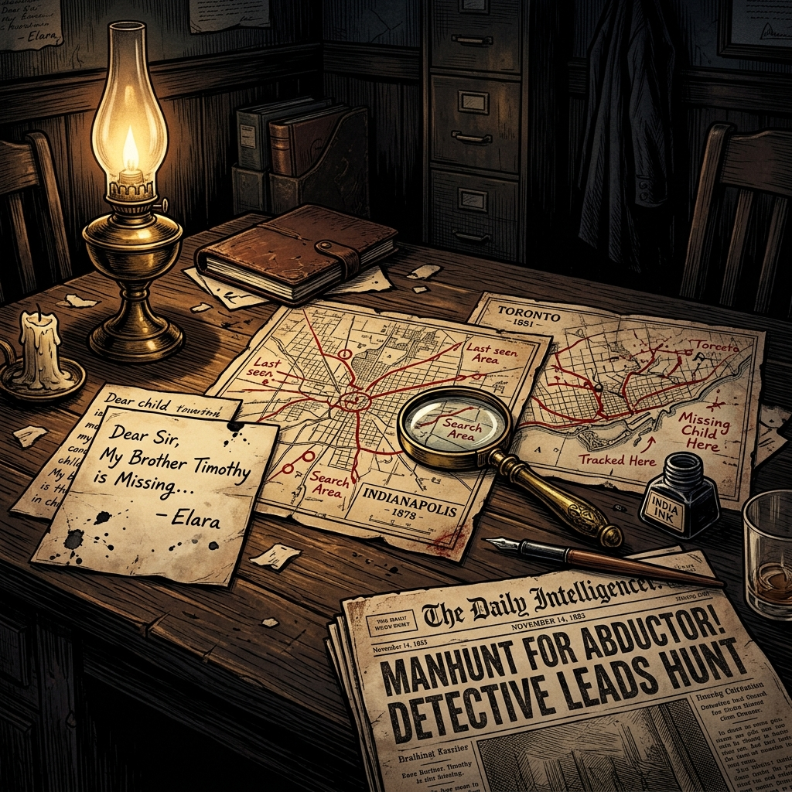
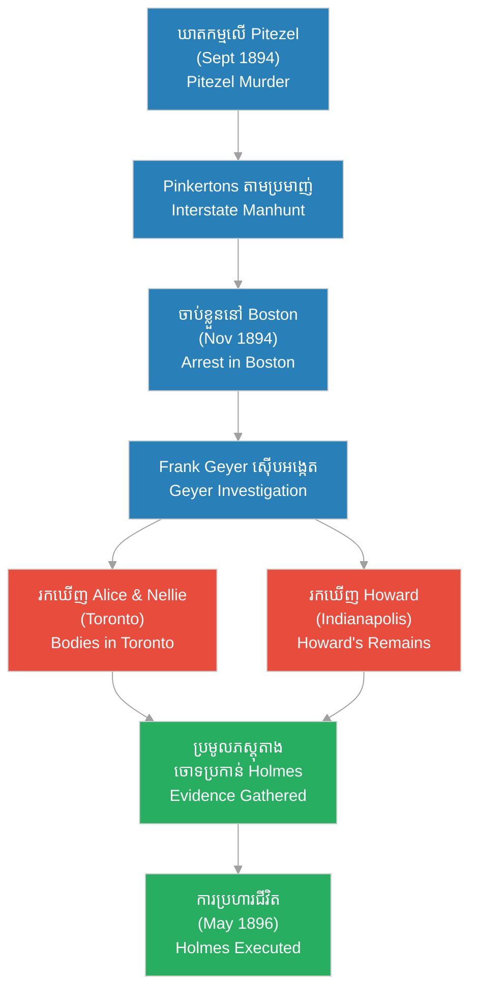

# The Investigation of H.H. Holmes (ការស៊ើបអង្កេតករណី H.H. Holmes)

**Author:** ichamrong  
**Date:** 2026-06-05  
**Tags:** #hh-holmes #investigation #crime-history #detective-geyer #pinkertons  
**Category:** Biographies  
**Read Time:** ~15 min  

---

## 📌 មាតិកា (Table of Contents)
- [សេចក្តីផ្តើម៖ ការលាតត្រដាងការពិតពីក្រោយវិមានឃាតកម្ម (Intro: Unveiling the Murder Castle)](#0)
- [១. ផែនការធានារ៉ាប់រង និងឃាតកម្មលើ Benjamin Pitezel (1. The Insurance Fraud & Murder of Benjamin Pitezel)](#1)
- [២. ការតាមប្រមាញ់ឆ្លងរដ្ឋ និងការចាប់ខ្លួននៅ Boston (2. The Interstate Manhunt & Arrest in Boston)](#2)
- [៣. ភារកិច្ចរបស់លោកស៊ើបអង្កេត Frank Geyer (3. Detective Frank Geyer's Investigation)](#3)
- [៤. ការរកឃើញដ៏រន្ធត់៖ តាមដានដានជើងកុមារ Pitezel (4. The Grim Discoveries: Tracing the Pitezel Children)](#4)
- [៥. តុលាការ ការសារភាព និងការប្រហារជីវិត (5. Trial, Confession, and Execution)](#5)
- [៦. វិភាគចិត្តសាស្ត្រឧក្រិដ្ឋជន និងកេរដំណែលស៊ើបអង្កេត (6. Criminal Profiling & Investigative Legacy)](#6)
- [៧. ដ្យាក្រាមដំណាក់កាលស៊ើបអង្កេត (Investigation Timeline Flow)](#7)
- [សេចក្តីសន្និដ្ឋាន (Conclusion)](#8)
- [🔗 ឯកសារទាក់ទង (Related Topics)](#9)
- [ឯកសារយោង (References)](#10)

---

## សេចក្តីផ្តើម៖ ការលាតត្រដាងការពិតពីក្រោយវិមានឃាតកម្ម (Intro: Unveiling the Murder Castle)

> **«ការពិត​តែងតែ​បន្សល់​ទុក​នូវ​ដាន​ជើង​ជានិច្ច ទោះបីជា​ឃាតករ​ព្យាយាម​លុបបំបាត់​វា​យ៉ាងណា​ក៏ដោយ។» — Detective Frank Geyer**  
> *(“Truth always leaves a trail, no matter how carefully the murderer tries to erase it.” — Detective Frank Geyer)*

នៅពេល​ដែល H.H. Holmes ត្រូវបាន​ចាប់ខ្លួន​នៅ​ចុងឆ្នាំ ១៨៩៤ គ្មាន​នរណា​ម្នាក់​នឹកស្មាន​ដល់​ឡើយ​ថា ការ​ចាប់ខ្លួន​ពី​បទ​បោកប្រាស់​ធានារ៉ាប់រង​ដ៏​តូច​មួយ នឹង​ក្លាយ​ជា​គន្លឹះ​បើក​កកាយ​រឿងរ៉ាវ​ឃាតកម្ម​ដ៏​រន្ធត់ និង​សាហាវ​បំផុត​មួយ​ក្នុង​ប្រវត្តិសាស្ត្រ​សហរដ្ឋអាមេរិក។ ការ​ស៊ើបអង្កេត​លើ​ករណី​របស់​គាត់​មិនមែន​ជា​រឿង​សាមញ្ញ​នោះ​ទេ ប៉ុន្តែ​វា​ជា​បេសកកម្ម​តាមដាន​ដ៏​ល្អិតល្អន់​បំផុត​មួយ​ដែល​គ្មាន​ជំនួយ​ពី​បច្ចេកវិទ្យា​សម័យថ្មី ដូចជា GPS ឬ DNA ឡើយ។

---

## ១. ផែនការធានារ៉ាប់រង និងឃាតកម្មលើ Benjamin Pitezel (1. The Insurance Fraud & Murder of Benjamin Pitezel)

ការ​ធ្លាក់ចុះ​របស់ H.H. Holmes បាន​ចាប់ផ្តើម​ឡើង​ចេញពី​គម្រោងការ​បោកប្រាស់​ធានារ៉ាប់រង​អាយុជីវិត​តម្លៃ ១០,០០០ ដុល្លារ​អាមេរិក (ដែល​ស្មើនឹង​ជិត ៣៥០,០០០ ដុល្លារ​នា​ពេល​បច្ចុប្បន្ន) ជាមួយ​ដៃគូ​ជំនិត​របស់​គាត់​គឺ **Benjamin Pitezel**។

ផែនការ​ដើម​របស់​ពួកគេ​គឺ៖
1. Pitezel ត្រូវ​ទិញ​ធានារ៉ាប់រង​អាយុជីវិត​ពី​ក្រុមហ៊ុន Fidelity Mutual Life Association។
2. បន្ទាប់មក Pitezel ត្រូវ​ធ្វើពុត​ជា​ស្លាប់​ដោយ​សារ​គ្រោះថ្នាក់​ផ្ទុះ​អាគារ​នៅ​ទីក្រុង Philadelphia។
3. Holmes នឹង​រក​សាកសព​ក្លែងក្លាយ​មក​ជំនួស ដើម្បី​ឱ្យ​គ្រួសារ Pitezel និង​រូប​គាត់​បើក​លុយ​ធានារ៉ាប់រង។

ប៉ុន្តែ Holmes មិនបាន​ធ្វើ​តាម​ផែនការ​ឡើយ។ គាត់​បាន​សម្រេចចិត្ត​សម្លាប់ Pitezel ពិតប្រាកដ​នៅ​ថ្ងៃទី ២ ខែកញ្ញា ឆ្នាំ ១៨៩៤ ដោយ​ប្រើប្រាស់​សារធាតុ​គីមី Chloroform ដើម្បី​បំពុល និង​ដុត​សាកសព​របស់ Pitezel ឱ្យ​ខូច​ទ្រង់ទ្រាយ។ បន្ទាប់មក Holmes បាន​ល្បួង​កូនស្រី​ច្បង​របស់ Pitezel គឺ Alice ឱ្យ​ទៅ​មើល និង​បញ្ជាក់​អត្តសញ្ញាណ​សាកសព​របស់​ឪពុក​នាង ដើម្បី​បើក​លុយ​ពី​ក្រុមហ៊ុន​ធានារ៉ាប់រង។

> [!IMPORTANT]
> **🧠 យន្តការចិត្តសាស្ត្រនៃការក្បត់ / Psychological Mechanism of Betrayal:**
> * «សម្រាប់​មនុស្ស​ដែល​មាន​ចរិត​ជា Sociopath ដូចជា Holmes គ្មាន​អ្វី​ដែល​ហៅថា​មិត្តភាព ឬ​ភាព​ស្មោះត្រង់​នោះ​ឡើយ។ ដៃគូ​សហការ​ដូចជា Pitezel គឺ​គ្រាន់តែ​ជា​កូនអុក​មួយ​ដែល​ត្រូវ​លះបង់​ចោល នៅពេល​ដែល​វា​ផ្តល់​ផលប្រយោជន៍​ហិរញ្ញវត្ថុ​ធំជាង​មុន។» (*"For a sociopath like Holmes, friendship and loyalty do not exist. A partner like Pitezel is merely a pawn to be sacrificed when it yields a larger financial payout."*)

---

## ២. ការតាមប្រមាញ់ឆ្លងរដ្ឋ និងការចាប់ខ្លួននៅ Boston (2. The Interstate Manhunt & Arrest in Boston)

ក្រុមហ៊ុន​ធានារ៉ាប់រង **Fidelity Mutual Life Association** មាន​ការ​សង្ស័យ​យ៉ាងខ្លាំង​ចំពោះ​ការ​ស្លាប់​របស់ Pitezel និង​ល្បឿន​នៃ​ការ​ទាមទារ​ប្រាក់។ ពួកគេ​បាន​ជួល **ទីភ្នាក់ងារស៊ើបអង្កេតជាតិ Pinkerton (Pinkerton National Detective Agency)** ដែល​ជា​ភ្នាក់ងារ​ស៊ើបអង្កេត​ឯកជន​ដ៏​ល្បីល្បាញ​បំផុត​នៅ​អាមេរិក ដើម្បី​តាមដាន Holmes។

ភ្នាក់ងារ Pinkertons បាន​តាមដាន Holmes ឆ្លងកាត់​រដ្ឋ​ជាច្រើន៖
* **Philadelphia ➔ Texas ➔ St. Louis ➔ Boston**

Holmes បាន​ព្យាយាម​គេចខ្លួន​ជាមួយ​ Carrie Pitezel (ភរិយា​របស់ Pitezel ដែល​មិនដឹង​ថា​ប្តី​ស្លាប់​ពិតមែន) និង​កូនៗ​របស់​នាង។ នៅ​ទីបំផុត ភ្នាក់ងារ Pinkertons សហការ​ជាមួយ​ប៉ូលីស​ក្រុង Boston បាន​ឆ្មក់​ចាប់ខ្លួន Holmes នៅ​ថ្ងៃទី ១៧ ខែវិច្ឆិកា ឆ្នាំ ១៨៩៤ នៅ​ពេល​គាត់​កំពុង​រៀបចំ​រត់ភៀសខ្លួន​ទៅ​កាន់​ប្រទេស​កាណាដា។ ដំបូង​ឡើយ គាត់​ត្រូវបាន​ឃាត់ខ្លួន​ក្រោម​បទចោទប្រកាន់​បោកប្រាស់​ធានារ៉ាប់រង និង​លួច​សេះ​នៅ Texas។

---

## ៣. ភារកិច្ចរបស់លោកស៊ើបអង្កេត Frank Geyer (3. Detective Frank Geyer's Investigation)

ក្រោយ​ការ​ចាប់ខ្លួន Holmes ប៉ូលីស​បាន​ជួបប្រទះ​នូវ​អាថ៌កំបាំង​ដ៏​ធំ​មួយ៖ កូនៗ ៣ នាក់​របស់ Pitezel គឺ **Alice (អាយុ ១៥ ឆ្នាំ), Nellie (អាយុ ១១ ឆ្នាំ) និង Howard (អាយុ ៨ ឆ្នាំ)** ដែល​ធ្លាប់​ធ្វើដំណើរ​ជាមួយ Holmes បាន​បាត់ខ្លួន​ដោយ​គ្មាន​ដំណឹង។ Holmes បាន​អះអាង​ថា ក្មេងៗ​ទាំងនោះ​កំពុង​ស្នាក់នៅ​យ៉ាង​សុខសាន្ត​ជាមួយ​នឹង​មិត្តភក្តិ​របស់​គាត់​ម្នាក់​ឈ្មោះ 3-Cent-Pete នៅ​ប្រទេស​អង់គ្លេស។

ដោយ​មិន​ជឿ​លើ​សម្តី​របស់ Holmes ប៉ូលីស​ក្រុង Philadelphia បាន​ចាត់តាំង **លោកស៊ើបអង្កេត Frank Geyer** ឱ្យ​ធ្វើការ​ស្វែងរក​ក្មេងៗ​ទាំង ៣ នាក់។ នេះ​ជា​ការ​ចាប់ផ្តើម​នៃ​ការ​ស៊ើបអង្កេត​ដ៏​គួរ​ឱ្យ​កោតសរសើរ​បំផុត​ក្នុង​សតវត្សរ៍​ទី ១៩។ Geyer ត្រូវ​ធ្វើដំណើរ​រាប់ពាន់​ម៉ាយ​តែម្នាក់ឯង ឆ្លងកាត់​រដ្ឋ​នានា និង​ប្រទេស​កាណាដា ដើម្បី​តាមដាន​រាល់​សណ្ឋាគារ ផ្ទះជួល និង​ជម្រក​ដែល Holmes ធ្លាប់​បាន​ស្នាក់នៅ។

---

## ៤. ការរកឃើញដ៏រន្ធត់៖ តាមដានដានជើងកុមារ Pitezel (4. The Grim Discoveries: Tracing the Pitezel Children)

លោកស៊ើបអង្កេត Geyer បាន​ប្រើប្រាស់​វិធីសាស្ត្រ​តាមដាន​ដ៏​ឆ្លាតវៃ៖
1. **លិខិត​ដែល​មិនបាន​ផ្ញើ៖** Geyer បាន​រកឃើញ​សំបុត្រ​ជាច្រើន​ច្បាប់​ដែល​កុមារ Pitezel សរសេរ​ទៅកាន់​ម្តាយ​របស់​ពួកគេ។ Holmes បាន​ដកហូត​សំបុត្រ​ទាំងនោះ និង​មិនដែល​បាន​ផ្ញើ​ចេញ​ឡើយ។ ខ្លឹមសារ​ក្នុង​សំបុត្រ​បាន​បង្ហាញ​ពី​ឈ្មោះ​ទីក្រុង និង​អារម្មណ៍​ភ័យខ្លាច​របស់​កុមារ។
2. **ការ​ស៊ើបសួរ​ផ្ទះជួល៖** នៅក្នុង​ទីក្រុង​នីមួយៗ Geyer បាន​ដើរ​សួរ​ម្ចាស់​ផ្ទះជួល និង​ភ្នាក់ងារ​អចលនទ្រព្យ​ដោយ​បង្ហាញ​រូបថត​ក្មេងៗ។

### ករណី Alice និង Nellie Pitezel (Toronto, Canada)
Geyer តាមដាន​ដានជើង​ទៅដល់​ទីក្រុង Toronto ប្រទេស​កាណាដា។ គាត់​បាន​រកឃើញ​ថា Holmes បាន​ជួល​ផ្ទះ​តូច​មួយ​នៅ​ផ្លូវ ១៦ St. Vincent Street។ Geyer បាន​សុំ​សិទ្ធិ​ឆែកឆេរ និង​ជីក​កកាយ​ដី​នៅ​បន្ទប់​ក្រោមដី​របស់​ផ្ទះ​នោះ។
* **លទ្ធផល​ដ៏​រន្ធត់៖** នៅ​ជម្រៅ​ដី​ប្រមាណ ៣ ហ្វីត Geyer បាន​រកឃើញ​សាកសព​របស់ Alice និង Nellie បាក់​អោប​គ្នា​នៅក្នុង​មឈូស​ឈើ​មួយ។ ពួកគេ​ត្រូវបាន Holmes បង្ខាំង​ទុក​ឱ្យ​ថប់ដង្ហើម និង​ពុល​ហ្គាស​ស្លាប់។

### ករណី Howard Pitezel (Indianapolis, USA)
បន្ទាប់មក Geyer បាន​បន្ត​ស្វែងរក Howard ដែល​ជា​កូនប្រុស​ពៅ។ គាត់​បាន​តាមដាន​ទៅដល់​សង្កាត់ Irvington ក្នុង​ទីក្រុង Indianapolis។
* **លទ្ធផល​ដ៏​រន្ធត់៖** Holmes បាន​ជួល​ផ្ទះ​មួយ​នៅ​ទីនោះ។ នៅក្នុង​បំពង់​ផ្សែង​ឡកម្តៅ​ផ្ទះ Geyer បាន​រកឃើញ​បំណែក​ឆ្អឹង និង​ធ្មេញ​របស់​កុមារ​ដែល​ត្រូវ​ភ្លើង​ឆេះ។ Howard ត្រូវបាន​បំពុល សម្លាប់ និង​កាត់​សាកសព​ជា​ដុំៗ រួច​ដុត​កម្ទេច​នៅក្នុង​ឡ​ភ្លើង។

> [!TIP]
> **🚀 មេរៀនអនុវត្តក្នុងការស៊ើបអង្កេត / Practical Investigative Lessons:**
> * **ការយកចិត្តទុកដាក់លើព័ត៌មានលម្អិត (Attention to Small Details)៖** ការ​រកឃើញ​បំណែក​ឆ្អឹង​តូចៗ​នៅក្នុង​ឡភ្លើង បង្ហាញ​ថា​ភស្តុតាង​អាច​ស្ថិតនៅ​កន្លែង​ដែល​យើង​នឹកស្មាន​មិនដល់។
> * **ការចងក្រងខ្សែសង្វាក់ពេលវេលា (Timeline Reconstruction)៖** ការ​ផ្គុំ​ព្រឹត្តិការណ៍​តាម​កាលបរិច្ឆេទ និង​ទីតាំង គឺជា​គន្លឹះ​ដោះស្រាយ​រាល់​អាថ៌កំបាំង​ស្មុគស្មាញ។
> * **នីតិវិធីស៊ើបអង្កេតវិទ្យាសាស្ត្រ (Scientific Search Procedures)៖** ស្វែងយល់​លម្អិត​អំពី [វិធីសាស្ត្រស៊ើបអង្កេតរបស់លោក Frank Geyer](04-geyer-investigative-methodology.md)។

---

## ៥. តុលាការ ការសារភាព និងការប្រហារជីវិត (5. Trial, Confession, and Execution)

ភស្តុតាង​ដ៏​រឹងមាំ​ដែល​រកឃើញ​ដោយ​លោកស៊ើបអង្កេត Geyer បាន​ផ្លាស់ប្តូរ​បទចោទប្រកាន់​លើ Holmes ពី​បទ​បោកប្រាស់​ធានារ៉ាប់រង ទៅជា​បទ​**ឃាតកម្ម​កម្រិត​ទីមួយ (First-Degree Murder)**។

ក្នុង​អំឡុងពេល​កាត់ទោស Holmes បាន​ព្យាយាម​ការពារ​ខ្លួន​យ៉ាង​ស្វិតស្វាញ ប៉ុន្តែ​ភស្តុតាង​វិទ្យាសាស្ត្រ និង​សាក្សី​ដែល Geyer ប្រមូល​បាន​មាន​ទម្ងន់​ធ្ងន់ធ្ងរ​ពេក។ នៅ​ទីបំផុត តុលាការ​បាន​កាត់ទោស​ប្រហារជីវិត Holmes ដោយ​ព្យួរក។

មុនពេល​ស្លាប់ Holmes ទទួលបាន​លុយ​ពី​កាសែត Hearst ដើម្បី​សរសេរ​ការ​សារភាព​របស់​ខ្លួន៖
* គាត់​បាន​សារភាព​ថា​បាន​សម្លាប់​មនុស្ស​ចំនួន **២៧ នាក់**។
* ប៉ុន្តែ ការ​សារភាព​របស់​គាត់​ភាគច្រើន​ជា​ការ​ភូតកុហក ព្រោះ​ជនរងគ្រោះ​មួយ​ចំនួន​ដែល​គាត់​អះអាង​ថា​បាន​សម្លាប់​នោះ នៅមាន​ជីវិត​ពិតប្រាកដ​នៅឡើយ។
* អ្នកស្រាវជ្រាវ​ជឿជាក់​ថា គាត់​បាន​សម្លាប់​មនុស្ស​ចន្លោះ​ពី ៩ ទៅ ៥០ នាក់ (ការ​ប៉ាន់ស្មាន​ខ្លះ​រហូតដល់ ២០០ នាក់ នៅក្នុង Murder Castle)។

នៅ​ថ្ងៃទី ៧ ខែឧសភា ឆ្នាំ ១៨៩៦ H.H. Holmes ត្រូវបាន​ប្រហារជីវិត។ គាត់​បាន​ស្នើសុំ​ឱ្យ​ចាក់​បេតុង​គ្របដណ្ដប់​លើ​ក្តារមឈូស​របស់​គាត់ ព្រោះ​បារម្ភ​ខ្លាច​មាន​គេ​លួច​ជីក​សាកសព​យក​ទៅ​វះកាត់​ពិសោធន៍ ដូច​អ្វី​ដែល​គាត់​ធ្លាប់​ធ្វើ​ចំពោះ​ជនរងគ្រោះ​ដទៃ។

---

## ៦. វិភាគចិត្តសាស្ត្រឧក្រិដ្ឋជន និងកេរដំណែលស៊ើបអង្កេត (6. Criminal Profiling & Investigative Legacy)

> [!WARNING]
> **⚠️ ការវិភាគចិត្តសាស្ត្រ និងការផ្លាស់ប្តូរប្រព័ន្ធយុត្តិធម៌**
> ១. **ឧក្រិដ្ឋជនបោកប្រាស់ឆ្លាតវៃ (White-Collar to Serial Killer Transition)៖** ករណី​របស់ Holmes បង្ហាញ​ថា ឃាតករ​ស៊េរី​មិនមែន​សុទ្ធតែ​ជា​មនុស្ស​ឆ្កួត​លីលា​នោះ​ទេ ប៉ុន្តែ​អាច​ជា​មនុស្ស​មាន​ការអប់រំ​ខ្ពស់ មាន​មន្តស្នេហ៍ និង​មាន​របៀបរៀបរយ​ល្អឥតខ្ចោះ។
> ២. **ការបង្កើតប្រព័ន្ធព័ត៌មានរួម (Inter-Agency Cooperation)៖** មុន​ករណី​នេះ ប៉ូលីស​រដ្ឋ​នីមួយៗ​មិនសូវ​ចែករំលែក​ព័ត៌មាន​គ្នា​ឡើយ។ ភាព​ជោគជ័យ​របស់ Geyer បាន​ជំរុញ​ឱ្យ​មាន​ការ​បង្កើត​កិច្ចសហការ​ស៊ើបអង្កេត​ឆ្លង​រដ្ឋ ដែល​ជា​គ្រឹះ​នៃ​ទីភ្នាក់ងារ FBI នា​ពេល​បច្ចុប្បន្ន។
> ៣. **ការសិក្សាប្លង់សំណង់ដោយគ្មានឯកសារ (Crime Scene Re-mapping without Blueprints)៖** នៅពេលឆែកឆេរវិមានឃាតកម្ម (Murder Castle) ប៉ូលីសពុំបានរកឃើញប្លង់មេណាមួយឡើយ ដោយសារ Holmes បានដុតបំផ្លាញឯកសារទាំងអស់។ ពួកគេត្រូវវាស់វែងបន្ទប់នីមួយៗដោយដៃផ្ទាល់ និងចងក្រងប្លង់ឡើងវិញបន្ទប់ម្តងមួយៗ ដើម្បីប្រើប្រាស់ជាភស្តុតាងដាក់បន្ទុកក្នុងតុលាការ ដែលនេះជាការចាប់ផ្តើមដំបូងនៃការរៀបចំគំនូរប្លង់កន្លែងកើតហេតុ (Crime Scene Mapping) ក្នុងប្រវត្តិសាស្ត្រប៉ូលីសអាមេរិក។ (*When searching the Murder Castle, police found no blueprints as Holmes had destroyed all documents. They had to manually measure and map each room, establishing the early foundations of crime scene mapping in American policing.*)

សៀវភៅ​របស់​លោកស៊ើបអង្កេត Frank Geyer ដែល​មាន​ចំណងជើង​ថា *«The Holmes-Pitezel Case» (១៨៩៦)* បាន​ក្លាយ​ជា​សៀវភៅ​ណែនាំ​ដ៏​សំខាន់​មួយ​សម្រាប់​ភ្នាក់ងារ​ស៊ើបអង្កេត​ជំនាន់​ក្រោយ​អំពី​វិធីសាស្ត្រ​តាមដាន​ជនសង្ស័យ​ឆ្លង​ដែនដី។

---

## ៧. ដ្យាក្រាមដំណាក់កាលស៊ើបអង្កេត (Investigation Timeline Flow)

ខាងក្រោម​នេះ​ជា​ដ្យាក្រាម​បង្ហាញ​ពី​លំដាប់លំដោយ​នៃ​ការ​ស៊ើបអង្កេត និង​ការ​រកឃើញ​ភស្តុតាង​ដោយ​ភ្នាក់ងារ Pinkertons និង​លោកស៊ើបអង្កេត Frank Geyer៖

---

## 🐇 ធ្លាក់ចូលក្នុងរន្ធទន្សាយយុទ្ធសាស្ត្រ (Enter the Strategic Rabbit Hole)
ដើម្បី​បន្ត​ស្វែងយល់​អំពី​ដំណើររឿង​ប្រវត្តិសាស្ត្រ និង​ជីវប្រវត្តិ​បុគ្គល​ល្បីៗ សូម​ចុច​តំណភ្ជាប់​ខាងក្រោម៖

* 🚀 **[ស្វែងយល់ពីប្រវត្តិលោក Frank Geyer (Frank Geyer Profile) ➔ ជីវប្រវត្តិលោក Frank Geyer](03-detective-frank-geyer.md)**

---

## សេចក្តីសន្និដ្ឋាន (Conclusion)

ការ​ស៊ើបអង្កេត​ករណី H.H. Holmes ដោយ​លោកស៊ើបអង្កេត Frank Geyer មិនត្រឹមតែ​បាន​នាំ​ខ្លួន​ឧក្រិដ្ឋជន​ដ៏​គ្រោះថ្នាក់​បំផុត​មក​កាត់ទោស​ប៉ុណ្ណោះ​ទេ ប៉ុន្តែ​វា​បាន​បង្ហាញ​ឱ្យ​ឃើញ​ពី​តម្លៃ​នៃ​ការ​តស៊ូ ភាព​អត់ធ្មត់ និង​ការ​គិត​បែប​វិទ្យាសាស្ត្រ​ក្នុងការ​ស្វែងរក​ការពិត។ វីរភាព​របស់ Geyer ក្នុងការ​ស្វែងរក​កុមារ Pitezel ត្រូវបាន​កត់ត្រា​ទុក​ក្នុង​ប្រវត្តិសាស្ត្រ​ថា​ជា​ការ​ស៊ើបអង្កេត​ដ៏​អស្ចារ្យ​បំផុត​មួយ ដែល​បាន​ជួយ​បញ្ចប់​យុគសម័យ​នៃ​ការ​ភ័យខ្លាច​បង្កឡើង​ដោយ​បិសាច​លាក់មុខ H.H. Holmes។

---

## 🔗 ឯកសារទាក់ទង (Related Topics)
*   [ជីវប្រវត្តិ H.H. Holmes](01-h-h-holmes-biography.md) — ស្វែងយល់​លម្អិត​អំពី​ប្រវត្តិ​ផ្ទាល់ខ្លួន និង​វិមាន​ឃាតកម្ម។
*   [យន្តការអាជីវកម្មឧក្រិដ្ឋកម្មរបស់ H.H. Holmes](06-holmes-crime-business-model.md) — វិភាគរបៀបរៀបចំផែនការ និងដំណើរការឧក្រិដ្ឋកម្មជាអាជីវកម្មបែបឧស្សាហកម្ម។
*   [មគ្គុទ្ទេសក៍រំសាយអារម្មណ៍ និងសម្អាតចិត្ត](07-mind-decompression-guide.md) — មគ្គុទ្ទេសក៍ស្វែងរកលំនឹងផ្លូវចិត្ត និងតន្ត្រីព្យាបាល។
*   [គម្រោងរឿងភាគដ្រាម៉ា ៥២ ភាគ](08-holmes-drama-episode-guide.md) — គម្រោងសាច់រឿងរឿងភាគ ៥២ ភាគ។
*   [ជីវប្រវត្តិលោក Frank Geyer](03-detective-frank-geyer.md) — ជីវប្រវត្តិ និង​មូលហេតុ​នៃ​ការ​លះបង់​ក្នុង​សំណុំរឿង​នេះ។
*   [វិធីសាស្ត្រស៊ើបអង្កេតរបស់ Frank Geyer](04-geyer-investigative-methodology.md) — វិធីសាស្ត្រ និង​នីតិវិធី​ស៊ើបអង្កេត​វិទ្យាសាស្ត្រ។
*   [ជីវប្រវត្តិ Jack the Ripper](../jack-the-ripper-biography.md) —  ការ​ស៊ើបអង្កេត​ករណី​ឃាតកម្ម​ស៊េរី​នៅ​ទីក្រុង​ឡុងដ៍។

---

## ឯកសារយោង (References)
*   **Frank Geyer** — *The Holmes-Pitezel Case: A History of the Greatest Crime of the Century and of the Search for the Missing Pitezel Children* (1896)។ សៀវភៅ​សរសេរ​ដោយ​លោកស៊ើបអង្កេត​ផ្ទាល់​អំពី​ការ​ស៊ើបអង្កេត។
*   **Erik Larson** — *The Devil in the White City: Murder, Magic, and Madness at the Fair that Changed America* (2003)។ ការ​សិក្សា​ប្រវត្តិសាស្ត្រ​ដ៏​លម្អិត​អំពី H.H. Holmes និង​ពិព័រណ៍​ក្រុង​ឈីកាហ្គោ។
*   **Harold Schechter** — *Depraved: The Definitive True Story of H.H. Holmes, America's First Serial Killer* (1994)។ ការ​ចងក្រង​ឯកសារ​ស៊ើបអង្កេត និង​ភស្តុតាង​តុលាការ។
