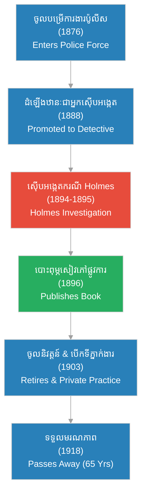

# Detective Frank Geyer (លោកស៊ើបអង្កេត ហ្វ្រែង ហ្គីយឺ)

**Author:** ichamrong  
**Date:** 2026-06-05  
**Tags:** #frank-geyer #detective #crime-history #criminal-profiling #investigation  
**Category:** Biographies  
**Read Time:** ~12 min  

---

## 📌 មាតិកា (Table of Contents)
- [សេចក្តីផ្តើម៖ វីរបុរសពិតពីក្រោយការស៊ើបអង្កេត (Intro: The Real Hero of the Investigation)](#0)
- [១. ប្រវត្តិ និងដំណើរជីវិតរបស់ Frank Geyer (1. Frank Geyer's Background & Early Career)](#1)
- [២. យុគសម័យ «ប៉ូលីសខ្ជិលច្រអូស» និងការស៊ីសំណូក (2. The "Lazy Cops" Era & Political Patronage)](#2)
- [៣. ហេតុអ្វីបានជា Geyer ខុសពីប៉ូលីសដទៃ? (3. Why Did Geyer Excel and Take Such Care?)](#3)
- [៤. ការបដិសេធទេវកថានៃសោកនាដកម្មផ្ទាល់ខ្លួន (4. Debunking the Tragedy Myth)](#4)
- [៥. វិធីសាស្ត្រស៊ើបអង្កេតបែបវិទ្យាសាស្ត្រ (5. Pioneer of Scientific Tracking)](#5)
- [៦. តុល្យភាពចិត្តសាស្ត្រ និងកេរដំណែល (6. Psychological Profile & Legacy)](#6)
- [៧. ដ្យាក្រាមដំណាក់កាលជីវិត និងអាជីពរបស់ Geyer (Geyer's Career Timeline)](#7)
- [សេចក្តីសន្និដ្ឋាន (Conclusion)](#8)
- [🔗 ឯកសារទាក់ទង (Related Topics)](#9)
- [ឯកសារយោង (References)](#10)

---

## សេចក្តីផ្តើម៖ វីរបុរសពិតពីក្រោយការស៊ើបអង្កេត (Intro: The Real Hero of the Investigation)

> **«កាតព្វកិច្ច​របស់​អ្នក​ស៊ើបអង្កេត មិនមែន​ត្រឹមតែ​ចាប់​ខ្លួន​ឧក្រិដ្ឋជន​នោះ​ទេ ប៉ុន្តែ​គឺ​ការ​លាតត្រដាង​ការពិត​ដើម្បី​ផ្តល់​យុត្តិធម៌​ដល់​អ្នក​ដែល​មិនអាច​និយាយ​ការពារ​ខ្លួន​បាន។» — Frank Geyer**  
> *(“The duty of a detective is not merely to arrest the criminal, but to uncover the truth to bring justice to those who can no longer speak for themselves.” — Frank Geyer)*

នៅក្នុង​ដំណើររឿង​ប្រវត្តិសាស្ត្រ​របស់ H.H. Holmes មនុស្ស​ជាច្រើន​តែងតែ​ផ្តោត​អារម្មណ៍​ទៅលើ​ភាព​សាហាវ​ឃោរឃៅ​របស់​ឃាតករ និង​រចនាសម្ព័ន្ធ​ចម្លែក​នៃ «វិមានឃាតកម្ម» (Murder Castle)។ ប៉ុន្តែ វីរបុរស​ពិតប្រាកដ​ដែល​បាន​បញ្ចប់​រឿងរ៉ាវ​ខ្មៅងងឹត​នេះ និង​បាន​នាំមក​នូវ​យុត្តិធម៌​ដល់​ជនរងគ្រោះ គឺ​លោកស៊ើបអង្កេត **Frank Geyer**។ នៅក្នុង​យុគសម័យ​មួយ​ដែល​ប៉ូលីស​ភាគច្រើន​ត្រូវបាន​គេ​មើលឃើញ​ថា​មាន​ភាព​ខ្ជិលច្រអូស និង​ពុករលួយ លោក Frank Geyer បាន​លេចធ្លោ​ឡើង​តាមរយៈ​ភាព​ស្មោះត្រង់ ភាព​អត់ធ្មត់ និង​វិធីសាស្ត្រ​ស៊ើបអង្កេត​បែប​វិទ្យាសាស្ត្រ​ដ៏​ល្អឥតខ្ចោះ។

---

## ១. ប្រវត្តិ និងដំណើរជីវិតរបស់ Frank Geyer (1. Frank Geyer's Background & Early Career)

**Frank Geyer** កើត​នៅ​ឆ្នាំ ១៨NT (១៨៥៣) ក្នុង​ទីក្រុង Philadelphia រដ្ឋ Pennsylvania។ គាត់​បាន​ចូលរួម​ជាមួយ​នាយកដ្ឋាន​ប៉ូលីស​ក្រុង Philadelphia នៅ​ថ្ងៃទី ៦ ខែឧសភា ឆ្នាំ ១៨៧៦។ 

ដំណាក់កាល​ដំបូង​នៃ​អាជីព​របស់​គាត់៖
* **Patrolman (មន្ត្រីល្បាត)៖** គាត់​បាន​ចាប់ផ្តើម​ជា​មន្ត្រី​ល្បាត​ធម្មតា ប៉ុន្តែ​បាន​បង្ហាញ​ពី​សមត្ថភាព​ពិសេស​ក្នុងការ​ចងចាំ​ព័ត៌មាន​លម្អិត និង​ការ​សរសេរ​របាយការណ៍​យ៉ាង​ហ្មត់ចត់។
* **Special Officer (មន្ត្រីពិសេស)៖** ដោយសារ​ការ​ខិតខំ​ប្រឹងប្រែង គាត់​ត្រូវបាន​ដំឡើង​ឋានៈ​ជា​មន្ត្រី​ស៊ើបអង្កេត​ពិសេស។
* **Detective (អ្នកស៊ើបអង្កេត)៖** នៅ​ខែមករា ឆ្នាំ ១៨៨៨ គាត់​ត្រូវបាន​តែងតាំង​ជា​អ្នក​ស៊ើបអង្កេត​ផ្លូវការ​របស់​ទីក្រុង ដែល​ជា​តួនាទី​មួយ​តម្រូវ​ឱ្យ​គាត់​ដោះស្រាយ​ករណី​បោកប្រាស់ និង​ឃាតកម្ម​ស្មុគស្មាញ​បំផុត។

---

## ២. យុគសម័យ «ប៉ូលីសខ្ជិលច្រអូស» និងការស៊ីសំណូក (2. The "Lazy Cops" Era & Political Patronage)

ដើម្បី​យល់​ពី​មូលហេតុ​ដែល Frank Geyer ទទួលបាន​ការ​កោតសរសើរ​ខ្លាំង យើង​ត្រូវ​យល់​ពី​បរិបទ​នៃ​ប្រព័ន្ធ​ប៉ូលីស​អាមេរិក​នៅ​ចុង​សតវត្សរ៍​ទី ១៩ (Gilded Age)៖

*   **ប្រព័ន្ធ Spoils System (នយោបាយ​បក្សពួកនិយម)៖** នាយកដ្ឋាន​ប៉ូលីស​ភាគច្រើន​នា​សម័យនោះ មិនមែន​ជ្រើសរើស​បុគ្គលិក​ផ្អែកលើ​សមត្ថភាព ឬ​ជំនាញ​ស៊ើបអង្កេត​ឡើយ។ ការ​តែងតាំង​ជា​ប៉ូលីស គឺ​ធ្វើឡើង​តាមរយៈ​ឥទ្ធិពល​នយោបាយ ឬ​ការ​សូកប៉ាន់​អ្នកនយោបាយ​ក្នុង​តំបន់។
*   **ភាព​ខ្ជិលច្រអូស និង​អសមត្ថភាព (Laziness & Incompetence)៖** ប៉ូលីស​ភាគច្រើន​មិន​ចូលចិត្ត​ធ្វើការ​តាមដាន​ករណី​លំបាកៗ ឬ​ធ្វើដំណើរ​ឆ្ងាយ​ឆ្លង​រដ្ឋ​ឡើយ។ ប្រសិនបើ​ករណី​ណាមួយ​គ្មាន​តម្រុយ​ច្បាស់លាស់ ឬ​មិន​ផ្តល់​ប្រាក់រង្វាន់​ផ្ទាល់ខ្លួន ពួកគេ​តែងតែ​បោះបង់​ចោល ឬ​ចាត់ទុកជា​ករណី «មនុស្ស​បាត់ខ្លួន​ធម្មតា»។
*   **កង្វះ​កិច្ចសហការ (Lack of Inter-State Cooperation)៖** នាយកដ្ឋាន​ប៉ូលីស​រដ្ឋ​នីមួយៗ​ធ្វើការ​ដាច់ដោយឡែក​ពី​គ្នា។ ប្រសិនបើ​ជនសង្ស័យ​រត់​ឆ្លង​ទៅ​រដ្ឋ​ផ្សេង ប៉ូលីស​ក្នុង​តំបន់​តែងតែ​ឈប់​តាមដាន ព្រោះ​គិតថា​ហួស​ដែន​សមត្ថកិច្ច​របស់​ខ្លួន។

---

## ៣. ហេតុអ្វីបានជា Geyer ខុសពីប៉ូលីសដទៃ? (3. Why Did Geyer Excel and Take Such Care?)

នៅពេល​ដែល H.H. Holmes ត្រូវបាន​ចាប់ខ្លួន និង​បដិសេធ​មិន​ប្រាប់​ពី​កន្លែង​លាក់ខ្លួន​របស់​កុមារ Pitezel ទាំង ៣ នាក់ នាយកដ្ឋាន​ប៉ូលីស​ភាគច្រើន​អាច​នឹង​បោះបង់​ចោល ឬ​ជឿ​សម្តី​ភូតកុហក​របស់ Holmes។ ប៉ុន្តែ Frank Geyer មិន​ធ្វើ​បែប​នោះ​ទេ។ ហេតុផល​ដែល Geyer យកចិត្ត​ទុកដាក់ និង​ខិតខំ​ប្រឹងប្រែង​ក្នុង​ករណី​នេះ រួមមាន៖

1.  **វិជ្ជាជីវៈ​ខ្ពស់ និង​មនសិការ (Professional Ethics & Duty)៖** Geyer ជឿជាក់​យ៉ាង​មុតមាំ​លើ​យុត្តិធម៌ និង​កាតព្វកិច្ច​របស់​ប៉ូលីស។ គាត់​យល់ថា ជីវិត​កុមារ​ស្លូតត្រង់ ៣ នាក់ គឺ​សំខាន់​ជាង​រាល់​ការ​នឿយហត់​ផ្ទាល់ខ្លួន។
2.  **ការសង្ស័យ​ផ្អែកលើ​ភស្តុតាង (Evidence-Based Skepticism)៖** Geyer ជា​មនុស្ស​មិន​ងាយ​ជឿ​សម្តី​របស់​មនុស្ស​ភូតកុហក​ដូចជា Holmes ឡើយ។ នៅពេល Holmes និយាយ​ថា ក្មេងៗ​រស់នៅ​សុខសាន្ត​នៅ​អង់គ្លេស Geyer បាន​កត់សម្គាល់​ភ្លាមៗ​ពី​ភាព​មិន​ស៊ីសង្វាក់​គ្នា​នៃ​លិខិតឆ្លងដែន និង​កាលវិភាគ​ធ្វើដំណើរ​របស់ Holmes។
3.  **ការ​គាំទ្រ​ពី​ក្រុមហ៊ុន​ធានារ៉ាប់រង (Insurance Backing)៖** ក្រុមហ៊ុន Fidelity Mutual Life Association ចង់​លាតត្រដាង​ការពិត​ដើម្បី​ការពារ​លុយ និង​កេរ្តិ៍ឈ្មោះ​របស់​ពួកគេ។ ពួកគេ​បាន​ផ្តល់​ថវិកា និង​សិទ្ធិ​អំណាច​ឱ្យ Geyer ធ្វើដំណើរ​ស៊ើបអង្កេត​ឆ្លង​រដ្ឋ​ដោយ​គ្មាន​ដែន​កំណត់ ដែល​នេះ​ជា​ឱកាស​ដ៏​កម្រ​សម្រាប់​ប៉ូលីស​សម័យនោះ។

> [!IMPORTANT]
> **🧠 យន្តការចិត្តសាស្ត្រនៃការប្តេជ្ញាចិត្ត / Psychological Drive of Investigation:**
> * «ភាព​ខុសគ្នា​រវាង​អ្នកស៊ើបអង្កេត​ពូកែ និង​ប៉ូលីស​ធម្មតា គឺ​ស្ថិតនៅលើ "ការ​យល់ចិត្ត" (Empathy)។ Geyer មិន​ត្រឹមតែ​ចង់​ដោះស្រាយ​សំណុំរឿង​ប៉ុណ្ណោះ​ទេ ប៉ុន្តែ​គាត់​មាន​ចិត្ត​អាណិតអាសូរ​យ៉ាង​ជ្រាលជ្រៅ​ចំពោះ Carrie Pitezel (ម្តាយ​ដែល​ត្រូវ​បាត់បង់​កូនៗ) ដែល​ជម្រុញ​ឱ្យ​គាត់​មិន​ព្រម​បោះបង់​ចោល​រហូតដល់​រកឃើញ​ការពិត។» (*"The difference between a great detective and a regular officer lies in 'empathy.' Geyer did not just want to close a case file; he felt deep sympathy for Carrie Pitezel, driving him to never yield until the truth was found."*)

---

## ៤. ការបដិសេធទេវកថានៃសោកនាដកម្មផ្ទាល់ខ្លួន (4. Debunking the Tragedy Myth)

នៅក្នុង​សៀវភៅ​ល្បីៗ​មួយ​ចំនួន (ដូចជា *The Devil in the White City* របស់ Erik Larson) តែងតែ​មាន​ការ​លើកឡើង​ថា៖
> *«លោក Frank Geyer ខិតខំ​ប្រឹងប្រែង​ស៊ើបអង្កេត​ករណី​កុមារ Pitezel យ៉ាង​មុតមាំ ព្រោះតែ​ភរិយា និង​កូនស្រី​របស់​គាត់​ទើបតែ​បាន​បាត់បង់​ជីវិត​នៅក្នុង​សោកនាដកម្ម​អគ្គិភ័យ មុនពេល​គាត់​ទទួល​សំណុំរឿង​នេះ។»*

ទោះជា​យ៉ាងណា ការស្រាវជ្រាវ​ប្រវត្តិសាស្ត្រ​ចុងក្រោយ​លើ​បញ្ជីឈ្មោះ និង​ឯកសារ​ប៉ូលីស​ក្រុង Philadelphia បាន​បង្ហាញ​ថា **ព័ត៌មាន​នេះ​គឺ​ជា​រឿង​មិនពិត​ឡើយ (A Historical Myth)**៖
* ភរិយា និង​កូនស្រី​របស់​លោក Geyer មិនបាន​បាត់បង់​ជីវិត​នៅក្នុង​គ្រោះ​អគ្គិភ័យ មុនពេល​កើតមាន​សំណុំរឿង​នេះ​ឡើយ។
* ព័ត៌មាន​មិនពិត​នេះ​ត្រូវបាន​បង្កើត​ឡើង ឬ​កត់ត្រា​ច្រឡំ​នៅក្នុង​ប្រលោមលោក​ប្រវត្តិសាស្ត្រ ដើម្បី​បង្កើន​ភាព​រំភើប និង​មនោសញ្ចេតនា​ក្នុង​សាច់រឿង។
* ការពិត​គឺ៖ ជម្រុញ​ចិត្ត​របស់ Frank Geyer មិនមែន​កើតចេញពី​សោកនាដកម្ម​ផ្ទាល់ខ្លួន​នោះ​ទេ ប៉ុន្តែ​កើតចេញពី​**ក្រមសីលធម៌​វិជ្ជាជីវៈ ភាព​ស្មោះត្រង់ និង​ការ​ប្តេជ្ញាចិត្ត​ខ្ពស់​ក្នុង​នាម​ជា​អ្នកស៊ើបអង្កេត​អាជីព**។

---

## ៥. វិធីសាស្ត្រស៊ើបអង្កេតបែបវិទ្យាសាស្ត្រ (5. Pioneer of Scientific Tracking)

Frank Geyer ត្រូវបាន​គេ​ចាត់ទុកថា​ជា​បុព្វបុរស​ម្នាក់​នៃ​វិស័យ **Criminal Profiling (ការវិភាគ​អត្តចរិត​ឧក្រិដ្ឋជន)** និង forensic tracking។ វិធីសាស្ត្រ​ដែល​គាត់​បាន​ប្រើ​រួមមាន៖

*   **ការស៊ើបសួរ​ជា​ប្រព័ន្ធ (Systematic Querying)៖** គាត់​បាន​កាន់​រូបថត​របស់​កុមារ Pitezel ទាំង ៣ នាក់ ដើរ​សួរ​ម្ចាស់​ផ្ទះជួល រាប់រយ​នាក់​តាម​ផ្លូវ​ដែល Holmes ធ្លាប់​ឆ្លងកាត់។
*   **ការ​ចងក្រង​ខ្សែសង្វាក់​ពេលវេលា (Timeline Reconstruction)៖** គាត់​បាន​ប្រមូល​កំណត់ត្រា​ផ្លូវដែក សំបុត្រ​សណ្ឋាគារ និង​សំបុត្រ​ដែល​ក្មេងៗ​សរសេរ​មិនបាន​ផ្ញើ ដើម្បី​កំណត់​ថ្ងៃ​ខែ និង​ទីតាំង​ច្បាស់លាស់​ដែល Holmes បាន​ស្នាក់នៅ។
*   **ការ​ធ្វើការងារ​ដោយ​មិន​ខ្លាច​នឿយហត់ (Relentless Hard Work)៖** ទោះបីជា​ត្រូវ​ជីក​ដី​ដោយ​ផ្ទាល់ដៃ​នៅក្នុង​បន្ទប់​ក្រោមដី​ងងឹតៗ និង​មាន​ក្លិនស្អុយ​នៅ Toronto ក៏ Geyer មិន​ស្ទាក់ស្ទើរ​ឡើយ។

---

## ៦. តុល្យភាពចិត្តសាស្ត្រ និងកេរដំណែល (6. Psychological Profile & Legacy)

> [!WARNING]
> **⚠️ មេរៀនប្រវត្តិសាស្ត្រពីជីវិតរបស់ Frank Geyer**
> ១. **ការ​ប្រឆាំង​នឹង​ប្រព័ន្ធ​ពុករលួយ៖** ភាព​ជោគជ័យ​របស់ Geyer បង្ហាញ​ថា សូម្បីតែ​នៅក្នុង​ប្រព័ន្ធ​ការងារ​ដែល​ពោរពេញ​ដោយ​ភាព​ខ្ជិលច្រអូស និង​បក្សពួកនិយម ក៏​បុគ្គល​ម្នាក់​ដែល​មាន​ការ​ប្តេជ្ញាចិត្ត​ខ្ពស់​អាច​បង្កើត​ផល​ប៉ះពាល់​ជា​វិជ្ជមាន​ដ៏​ធំធេង​សម្រាប់​សង្គម​បាន​ដែរ។
> ២. **ការ​ចងក្រង​ជា​ឯកសារ​ផ្លូវការ៖** ក្រោយ​បញ្ចប់​សំណុំរឿង Geyer មិនបាន​ទុក​ចំណេះដឹង​របស់​គាត់​ចោល​ឡើយ។ សៀវភៅ​របស់​គាត់​បាន​ក្លាយ​ជា​មូលដ្ឋាន​គ្រឹះ​នៃ​សៀវភៅ​ណែនាំ​ប៉ូលីស​ជំនាន់​ក្រោយ។

 Frank Geyer បាន​បន្ត​បម្រើការ​ជា​ប៉ូលីស​រហូតដល់​ឆ្នាំ ១៩MD (១៩០៣) មុនពេល​ចូល​និវត្តន៍ និង​បង្កើត​ទីភ្នាក់ងារ​ស៊ើបអង្កេត​ឯកជន​ផ្ទាល់ខ្លួន។ គាត់​បាន​ទទួលមរណភាព​នៅ​ឆ្នាំ ១៩១៨ ដោយសារ​ជំងឺ​គ្រុនផ្តាសាយ​ធំ (Spanish Flu) ក្នុង​អាយុ ៦៥ ឆ្នាំ ដោយ​បន្សល់ទុក​នូវ​កេរ្តិ៍ឈ្មោះ​ជា​អ្នកស៊ើបអង្កេត​ដ៏​ឆ្នើម និង​ស្មោះត្រង់​បំផុត​ម្នាក់​ក្នុង​ប្រវត្តិសាស្ត្រ​ប៉ូលីស​អាមេរិក។

---

## ៧. ដ្យាក្រាមដំណាក់កាលជីវិត និងអាជីពរបស់ Geyer (Geyer's Career Timeline)

ខាងក្រោម​នេះ​ជា​ដ្យាក្រាម​បង្ហាញ​ពី​អាជីព និង​ការ​រួមចំណែក​របស់ Frank Geyer ក្នុង​ប្រព័ន្ធ​យុត្តិធម៌៖

---

## 🐇 ធ្លាក់ចូលក្នុងរន្ធទន្សាយយុទ្ធសាស្ត្រ (Enter the Strategic Rabbit Hole)
ដើម្បី​ស្វែងយល់​កាន់តែ​ស៊ីជម្រៅ​អំពី​ករណី​របស់ H.H. Holmes សូម​បន្ត​ដំណើររុករក​របស់​អ្នក៖

* 🚀 **[ស្វែងយល់ពីរបៀបតាមប្រមាញ់ Holmes (The Investigation) ➔ ការស៊ើបអង្កេតករណី H.H. Holmes](02-h-h-holmes-investigation.md)**

---

## សេចក្តីសន្និដ្ឋាន (Conclusion)

លោក Frank Geyer បាន​បង្ហាញ​ឱ្យ​ឃើញ​ថា កម្លាំង​ចិត្ត​របស់​មនុស្ស​ម្នាក់​ដែល​ប្រកាន់ខ្ជាប់​នូវ​វិជ្ជាជីវៈ និង​យុត្តិធម៌ គឺ​អាច​ជម្នះ​រាល់​ឧបសគ្គ និង​ប្រព័ន្ធ​ការងារ​ដែល​មិន​រៀបរយ​បាន។ គាត់​មិនបាន​រង់ចាំ ឬ​ធ្វើការ​ដោយ​ខ្ជិលច្រអូស​ដូច​សហសេវិក​ដទៃ​ឡើយ ប៉ុន្តែ​បាន​បោះជំហាន​ទៅមុខ ដើរ​រាប់ពាន់​ម៉ាយ និង​ប្រឈមមុខ​នឹង​រឿងរ៉ាវ​រន្ធត់​ដើម្បី​ស្វែងរក​ការពិត​ជូន​កុមារ​រងគ្រោះ។ នេះ​ជា​មូលហេតុ​ដែល Geyer ត្រូវបាន​គេ​ចងចាំ​រហូតមកដល់​សព្វថ្ងៃ​ក្នុង​នាម​ជា​និមិត្តរូប​នៃ​អ្នកស៊ើបអង្កេត​ពិតប្រាកដ។

---

## 🔗 ឯកសារទាក់ទង (Related Topics)
*   [ការស៊ើបអង្កេតករណី H.H. Holmes](02-h-h-holmes-investigation.md) — ដំណាក់កាល​លម្អិត​នៃការ​តាមដាន និង​ការ​រកឃើញ​សាកសព។
*   [ជីវប្រវត្តិ H.H. Holmes](01-h-h-holmes-biography.md) — ជីវប្រវត្តិ និង​ការ​សាងសង់​វិមាន​ឃាតកម្ម។

---

## ឯកសារយោង (References)
*   **Frank Geyer** — *The Holmes-Pitezel Case: A History of the Greatest Crime of the Century and of the Search for the Missing Pitezel Children* (1896)។ កំណត់ត្រា​ការងារ​ផ្លូវការ​របស់ Geyer។
*   **Philadelphia Police Department Archives** — *Frank Geyer Service Rolls (1876-1903)* (2018)។ ឯកសារ​ប្រវត្តិរូប​ផ្លូវការ​របស់​ប៉ូលីស​ក្រុង Philadelphia។
*   **J.D. Crighton** — *Detective Frank Geyer: The Real Dectective Who Tracked H. H. Holmes* (2017)។ ការស្រាវជ្រាវ​ប្រវត្តិសាស្ត្រ​អំពី​ប្រវត្តិរូប​ពិត​របស់ Geyer។
