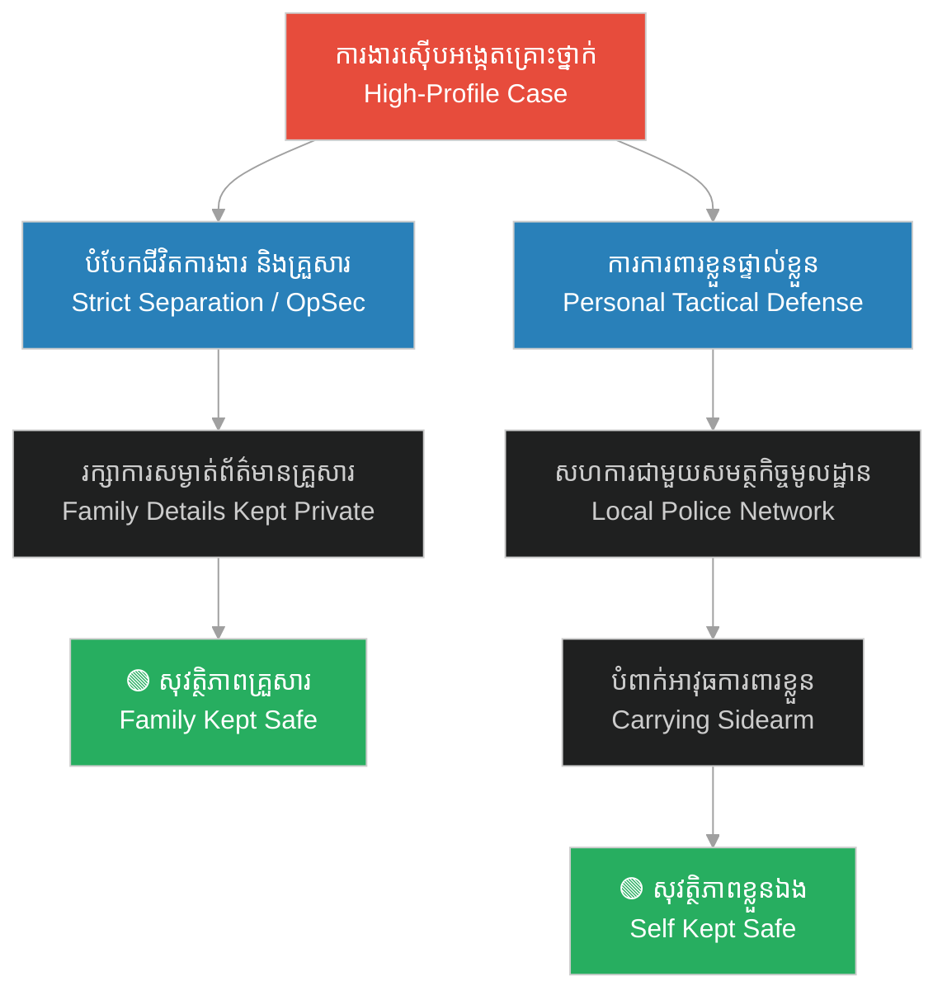

# Managing Fear & Family Protection (ការគ្រប់គ្រងការភ័យខ្លាច និងការការពារសុវត្ថិភាពគ្រួសារ)

**Author:** ichamrong  
**Date:** 2026-06-05  
**Tags:** #frank-geyer #fear-management #family-protection #opsec #psychology  
**Category:** Biographies  
**Read Time:** ~10 min  

---

## 📌 មាតិកា (Table of Contents)
- [សេចក្តីផ្តើម៖ ភាពភ័យខ្លាច និងការងារស៊ើបអង្កេត (Intro: The Reality of Fear in Criminal Detection)](#0)
- [១. ការគ្រប់គ្រងការភ័យខ្លាចតាមរយៈបទពិសោធន៍ (1. Fear Management Through Systematic Exposure)](#1)
- [២. នីតិវិធីការពារខ្លួនតាមរយៈប្រព័ន្ធស្ថាប័ន (2. Tactical Self-Protection & Institutional Networking)](#2)
- [៣. ការរក្សាឯកជនភាព និងសុវត្ថិភាពគ្រួសារ (3. Strict Family OpSec & Debunking Myths)](#3)
- [៤. គំនិតអនុវត្តសម័យទំនើប៖ ការពារខ្លួន និងក្រុមគ្រួសារ (4. Modern Applications: Threat Modeling & Security)](#4)
- [៥. ដ្យាក្រាមប្រព័ន្ធការពារខ្លួន និងគ្រួសារ (Self & Family Protection Loop Diagram)](#5)
- [សេចក្តីសន្និដ្ឋាន (Conclusion)](#6)
- [🔗 ឯកសារទាក់ទង (Related Topics)](#7)
- [ឯកសារយោង (References)](#8)

---

## សេចក្តីផ្តើម៖ ភាពភ័យខ្លាច និងការងារស៊ើបអង្កេត (Intro: The Reality of Fear in Criminal Detection)

> **«ភាព​ក្លាហាន មិនមែន​ជា​ការ​គ្មាន​ការ​ភ័យខ្លាច​នោះ​ទេ ប៉ុន្តែ​វា​គឺ​ជា​ការ​វិនិច្ឆ័យ​ថា​មាន​អ្វី​ផ្សេង​ទៀត​ដែល​សំខាន់​ជាង​ការ​ភ័យខ្លាច។» — Frank Geyer**  
> *(“Courage is not the absence of fear, but the judgment that something else is more important than fear.” — Frank Geyer)*

ការ​ស៊ើបអង្កេត​លើ​ឧក្រិដ្ឋជន​សាហាវៗ ដូចជា H.H. Holmes មិនត្រឹមតែ​ទាមទារ​ជំនាញ​ស៊ើបអង្កេត​ប៉ុណ្ណោះ​ទេ ប៉ុន្តែ​ក៏​ទាមទារ​នូវ​ភាព​រឹងមាំ​ផ្នែក​ផ្លូវចិត្ត​ផងដែរ។ មនុស្ស​ជាច្រើន​តែងតែ​ចោទសួរ​ថា៖ នៅពេល​ស៊ើបអង្កេត​សំណុំរឿង​ដ៏​គ្រោះថ្នាក់ តើ​លោក Frank Geyer មិន​ភ័យខ្លាច​ចំពោះ​សុវត្ថិភាព​ខ្លួនឯង និង​ក្រុម​គ្រួសារ​របស់​លោក​ទេឬ? 

Investigating violent criminals, like H.H. Holmes, demanded not only detective skills but also psychological resilience. Many often ask: when pursuing such a dangerous case, was Frank Geyer not terrified for his own safety and the security of his family?

---

## ១. ការគ្រប់គ្រងការភ័យខ្លាចតាមរយៈបទពិសោធន៍ (1. Fear Management Through Systematic Exposure)

ភាព​ក្លាហាន​របស់​លោក Geyer មិនមែន​កើតឡើង​ដោយ​ចៃដន្យ​ឡើយ។ វា​គឺ​ជា​លទ្ធផល​នៃ​ការ​ហ្វឹកហាត់ និង​ការ​ប្រឈមមុខ​នឹង​គ្រោះថ្នាក់​ជា​ប្រចាំ។

Geyer’s courage was not accidental. It was the result of systematic exposure and years of dealing with dangerous environments.

* **ការអនុវត្ត (The Method):** លោក Geyer បាន​ចូលរួម​ជាមួយ​នាយកដ្ឋាន​ប៉ូលីស​ក្រុង Philadelphia តាំងពី​ឆ្នាំ ១៨៧៦ ក្នុងនាម​ជា​មន្ត្រី​ល្បាត​ក្នុង​តំបន់​ដែល​មាន​អត្រា​ឧក្រិដ្ឋកម្ម​ខ្ពស់។ បទពិសោធន៍​ជាក់ស្តែង​ជិត ២០ ឆ្នាំ មុនពេល​ទទួល​សំណុំរឿង Holmes បាន​ជួយ​ឱ្យ​គាត់​បង្កើត​នូវ «ភាព​ស៊ាំ​នឹង​ការ​ភ័យខ្លាច» (Desensitization)។
* **យន្តការចិត្តសាស្ត្រ (Psychological Mechanism):** នៅពេល​មនុស្ស​យើង​ប្រឈមមុខ​នឹង​ស្ថានភាព​គ្រោះថ្នាក់​ជា​ប្រចាំ ខួរក្បាល​នឹង​រៀន​គ្រប់គ្រង​សារធាតុ Adrenaline ដោយ​មិន​បង្ហាញ​ការ​តក់ស្លុត ឬ​ភ័យស្លន់ស្លោ​ឡើយ។ គាត់​ផ្តោត​លើ​នីតិវិធី​ការងារ ជាជាង​អារម្មណ៍​ភ័យខ្លាច។
* **The Method (English):** Geyer joined the Philadelphia Police Department in 1876 as a patrol officer in high-crime districts. Over nearly two decades before the Holmes case, this daily exposure helped him build psychological desensitization to danger.
* **Psychological Mechanism (English):** When exposed to threats routinely, the brain learns to regulate adrenaline. Instead of panicking, he focused entirely on the operational procedure rather than personal emotions.

---

## ២. នីតិវិធីការពារខ្លួនតាមរយៈប្រព័ន្ធស្ថាប័ន (2. Tactical Self-Protection & Institutional Networking)

ទោះបីជា​លោក Geyer ត្រូវ​ធ្វើដំណើរ​រាប់ពាន់​ម៉ាយ​តែម្នាក់ឯង តែ​គាត់​មិនដែល​ដាក់​ខ្លួន​ក្នុង​ស្ថានភាព​គ្រោះថ្នាក់​ដោយ​គ្មាន​ការ​ការពារ​ឡើយ។

Although Geyer traveled thousands of miles alone, he never put himself in danger without tactical safety protocols.

* **ការអនុវត្ត (The Method):** 
  1. **បណ្តាញ​ស្ថាប័ន (Institutional Network):** នៅ​រាល់​ទីក្រុង​ដែល​គាត់​ទៅដល់ គាត់​តែងតែ​ទៅ​ជួប​ប៉ូលីស​ក្នុង​តំបន់ និង​ភ្នាក់ងារ Pinkertons ដើម្បី​សុំ​កិច្ចសហការ និង​កម្លាំង​ការពារ។ គាត់​មិនដែល​ទៅ​ឆែកឆេរ​ទីតាំង​សង្ស័យ​តែម្នាក់ឯង​ឡើយ។
  2. **ការ​ការពារ​ខ្លួន​ផ្ទាល់ខ្លួន (Personal Defense):** ដូច​ជា​អ្នកស៊ើបអង្កេត​អាជីព​ទូទៅ គាត់​តែងតែ​មាន​អាវុធខ្លី​ប្រចាំកាយ (Service Revolver) សម្រាប់​ការ​ការពារ​ខ្លួន​ភ្លាមៗ។
* **The Method (English):** 
  1. **Institutional Network:** In every new town, Geyer's first protocol was coordinating with local police chiefs and the Pinkerton Agency. He never raided or searched a suspect property without local armed backup.
  2. **Personal Defense:** Like all professional detectives of his era, he carried a service revolver at all times for immediate personal protection.

---

## ៣. ការរក្សាឯកជនភាព និងសុវត្ថិភាពគ្រួសារ (3. Strict Family OpSec & Debunking Myths)

ក្តី​បារម្ភ​ដ៏​ធំ​មួយ​របស់​មនុស្ស​ល្បីៗ ឬ​អ្នកស៊ើបអង្កេត គឺ​ការ​ដែល​សត្រូវ​ងាក​ទៅ​វាយប្រហារ​ក្រុមគ្រួសារ​របស់​ពួកគេ​វិញ។ លោក Geyer យល់ច្បាស់​ពី​ចំណុច​នេះ។

A major concern for high-profile figures or detectives is their family being targeted. Geyer managed this risk through strict operational security.

* **ការអនុវត្ត (The Method):** 
  1. **ការ​បដិសេធ​ទេវកថា (Myth Debunked):** ផ្ទុយពី​ប្រលោមលោក ឬ​សៀវភៅ​មួយ​ចំនួន​ដែល​ថា​ប្រពន្ធ និង​កូនស្រី​របស់​គាត់​ត្រូវបាន​ដុត​សម្លាប់ ភរិយា​របស់​លោក Geyer (Mary) និង​កូនស្រី (Susan) គឺ​រស់នៅ​ដោយ​សុវត្ថិភាព និង​មាន​អាយុ​វែង​នៅ Philadelphia។
  2. **ការ​រក្សា​ការសម្ងាត់​គ្រួសារ (Strict OpSec):** Geyer បាន​បំបែក​ជីវិត​ការងារ និង​ជីវិត​គ្រួសារ​ឱ្យ​ដាច់ស្រឡះ​ពីគ្នា។ គាត់​មិនដែល​បណ្តោយ​ឱ្យ​ព័ត៌មាន​លម្អិត​អំពី​ទីកន្លែង​រស់នៅ ឬ​រូបថត​គ្រួសារ​លេចធ្លាយ​ទៅកាន់​សារព័ត៌មាន​ឡើយ។
* **The Method (English):** 
  1. **Myth Debunked:** Contrary to popular fictional accounts claiming Geyer's family died in a fire, his wife, Mary, and daughter, Susan, lived safe, long lives in Philadelphia.
  2. **Strict OpSec:** Geyer separated his work from his private life. He strictly controlled the release of his home address and family photos to the yellow press, keeping his family out of the public spotlight.

---

## ៤. គំនិតអនុវត្តសម័យទំនើប៖ ការពារខ្លួន និងក្រុមគ្រួសារ (4. Modern Applications: Threat Modeling & Security)

មេរៀន​ពី​លោក Geyer អាច​យក​មក​អនុវត្ត​ក្នុង​សម័យទំនើប​សម្រាប់​បុគ្គល​ដែល​មាន​ការងារ​ប្រឈមមុខ​នឹង​គ្រោះថ្នាក់ ឬ​មនុស្ស​ល្បីៗ៖

Geyer's protective principles remain highly applicable for modern high-profile professionals, engineers, and public figures:

* **ការ​គ្រប់គ្រង​ព័ត៌មាន (Information Control):** កុំ​បង្ហោះ​ព័ត៌មាន​លម្អិត​អំពី​គ្រួសារ សាលារៀន​របស់​កូន ឬ​ទីតាំង​រស់នៅ​លើ​បណ្តាញ​សង្គម។ នេះ​ជា​ការ​អនុវត្ត OpSec សម័យទំនើប។
* **ការ​ពឹងផ្អែក​លើ​ប្រព័ន្ធ​សុវត្ថិភាព (Systemic Security):** កុំ​ព្យាយាម​ដោះស្រាយ​បញ្ហា​សុវត្ថិភាព​តែម្នាក់ឯង។ ត្រូវ​កសាង​បណ្តាញ​ការពារ​ជាមួយ​សមត្ថកិច្ច ឬ​ក្រុមហ៊ុន​សន្តិសុខ​អាជីព។
* **Modern Translation:** Implement digital OpSec (keeping family names, schools, and home locations off social media) and build professional defense networks rather than attempting solo security.

---

## ៥. ដ្យាក្រាមប្រព័ន្ធការពារខ្លួន និងគ្រួសារ (Self & Family Protection Loop Diagram)

ដ្យាក្រាម​ខាងក្រោម​បង្ហាញ​ពី​របៀប​ដែល​លោក Geyer រៀបចំ​ប្រព័ន្ធ​ការពារ​សុវត្ថិភាព​ជា​វដ្ត​បិទជិត៖

The following diagram illustrates the closed-loop protection system Geyer established to ensure personal and family safety:

---

## សេចក្តីសន្និដ្ឋាន (Conclusion)

ការភ័យខ្លាច​គឺជា​រឿង​ធម្មជាតិ​របស់​មនុស្ស ប៉ុន្តែ​តាមរយៈ​ការ​ហ្វឹកហាត់ បង្កើត​នីតិវិធី​ការពារ​ខ្លួន​ឱ្យ​បាន​ត្រឹមត្រូវ និង​ការ​រក្សា​ការសម្ងាត់​ព័ត៌មាន​ផ្ទាល់ខ្លួន យើង​អាច​គ្រប់គ្រង​វា និង​ធានា​សុវត្ថិភាព​ដល់​មនុស្ស​ជា​ទីស្រឡាញ់​របស់​យើង​បាន​យ៉ាង​មាន​ប្រសិទ្ធភាព ដូច​អ្វី​ដែល​លោក Frank Geyer បាន​ធ្វើ​កាលពី ១៣០ ឆ្នាំ​មុន។

Fear is a natural human response. However, through training, structured safety procedures, and confidentiality, we can manage it and guarantee the safety of our loved ones, just as Frank Geyer did 130 years ago.

---

## 🔗 ឯកសារទាក់ទង (Related Topics)
*   [ជីវប្រវត្តិលោក Frank Geyer](03-detective-frank-geyer.md) — ជីវប្រវត្តិ និង​ដំណើរជីវិត​ទូទៅ​របស់​លោក។
*   [វិធីសាស្ត្រស៊ើបអង្កេតរបស់ Frank Geyer](04-geyer-investigative-methodology.md) — វិធីសាស្ត្រ និង​នីតិវិធី​ស៊ើបអង្កេត​វិទ្យាសាស្ត្រ។
*   [ការស៊ើបអង្កេតករណី H.H. Holmes](02-h-h-holmes-investigation.md) — ដំណើរការ​លម្អិត​នៃការ​ស្វែងរក​កុមារ។

---

## ឯកសារយោង (References)
*   **Frank Geyer** — *The Holmes-Pitezel Case: A History of the Greatest Crime of the Century and of the Search for the Missing Pitezel Children* (1896)។ កំណត់ត្រា​ការងារ​ផ្លូវការ​របស់ Geyer។
*   **J.D. Crighton** — *Detective Frank Geyer: The Real Detective Who Tracked H. H. Holmes* (2017)។ ការស្រាវជ្រាវ​ប្រវត្តិសាស្ត្រ​អំពី​ប្រវត្តិរូប​ពិត​របស់ Geyer។
