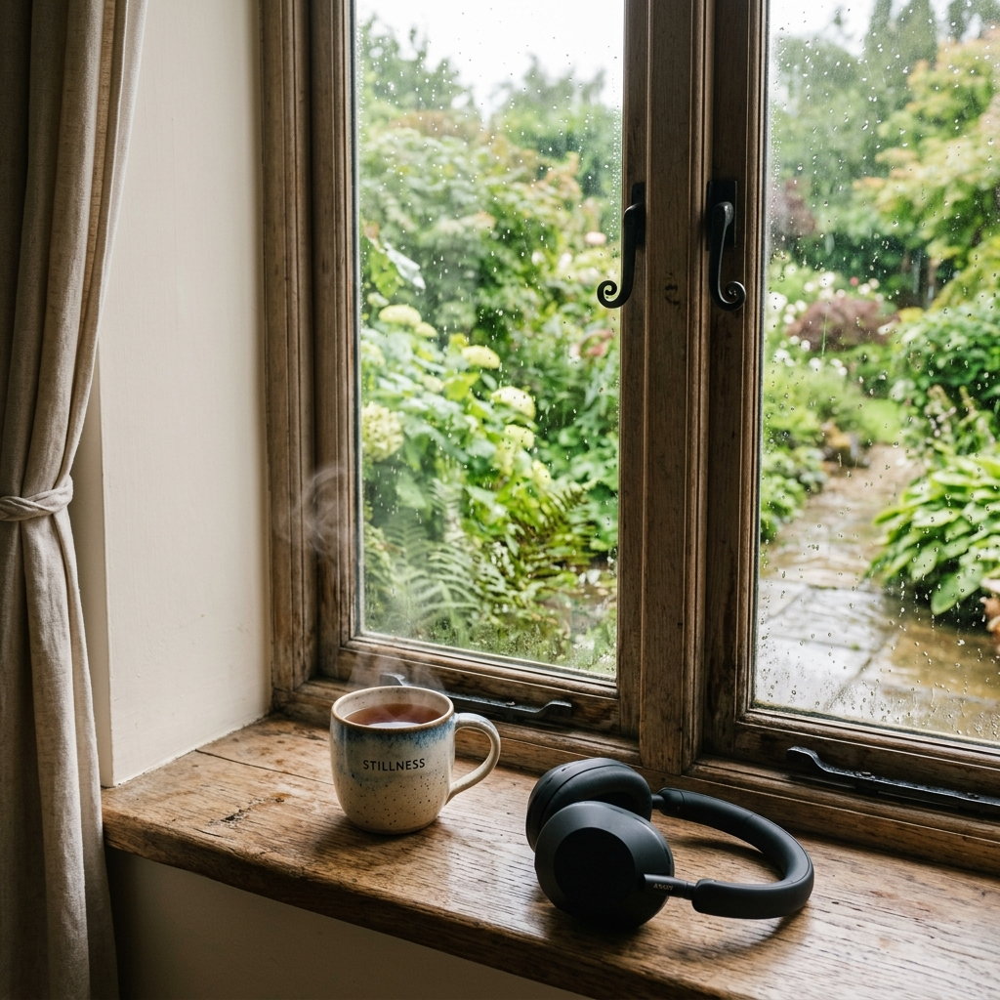

# Mind Decompression Guide (មគ្គុទ្ទេសក៍រំសាយអារម្មណ៍ និងសម្អាតចិត្ត)

**Author:** ichamrong  
**Date:** 2026-06-05  
**Tags:** #mindfulness #decompression #mental-health #relaxation #sound-therapy  
**Category:** Biographies  
**Read Time:** ~8 min  

---

## 📌 មាតិកា (Table of Contents)
- [សេចក្តីផ្តើម៖ ហេតុអ្វីយើងត្រូវរំសាយអារម្មណ៍? (Intro: Why We Need to Decompress)](#0)
- [១. បន្សាបផ្នត់គំនិត Holmes៖ ត្រឡប់មកកាន់បច្ចុប្បន្នភាព (1. Neutralizing the Holmes Mindset: Return to Presence)](#1)
- [២. វិធីសាស្ត្របង្កើតលំនឹងផ្លូវចិត្ត និងអារម្មណ៍ (2. Practical Grounding Exercises)](#2)
- [៣. ការព្យាបាលដោយសំឡេង និងតន្ត្រីស្ងប់ស្ងាត់ (3. Soundscapes & Calming Playlists)](#3)
- [សេចក្តីសន្និដ្ឋាន (Conclusion)](#4)
- [🔗 ឯកសារទាក់ទង (Related Topics)](#5)

---

## សេចក្តីផ្តើម៖ ហេតុអ្វីយើងត្រូវរំសាយអារម្មណ៍? (Intro: Why We Need to Decompress)

> **«ចិត្តរបស់យើងប្រៀបដូចជាទឹកថ្លា។ នៅពេលយើងកូរវាជាមួយរឿងរ៉ាវខ្មៅងងឹត វានឹងល្អក់កករ។ ប៉ុន្តែប្រសិនបើយើងទុកវាឱ្យនៅស្ងៀម វានឹងត្រឡប់មកថ្លាស្អាតឡើងវិញជាមិនខាន។»**  
> *(“Our mind is like clear water. When we stir it with dark narratives, it becomes cloudy. But if we let it sit in stillness, it will naturally become clear again.”)*

ការអាន និងសិក្សាអំពីប្រវត្តិសាស្ត្រឧក្រិដ្ឋកម្ម និងផែនការឃាតកម្មដ៏ស្មុគស្មាញរបស់ H.H. Holmes អាចបន្សល់ទុកនូវឥទ្ធិពលអវិជ្ជមាន ឬភាពតានតឹងដក់ជាប់ក្នុងចិត្តគំនិតរបស់យើងដោយមិនដឹងខ្លួន។ ខួរក្បាលរបស់មនុស្សមានទំនោរស្រូបយកអារម្មណ៍ជុំវិញខ្លួន ដូច្នេះហើយ បន្ទាប់ពីឆ្លងកាត់ការស្រាវជ្រាវដ៏គួរឱ្យរន្ធត់នេះ ការរំសាយអារម្មណ៍ (Decompression) គឺជាជំហានចាំបាច់មួយដើម្បីសម្អាតចិត្តគំនិត និងនាំយកភាពស្ងប់ស្ងាត់វិជ្ជមានត្រឡប់មកវិញ។

Reading about crime history and the calculated horrors of H.H. Holmes can leave a heavy emotional residue on our subconscious. The human brain naturally absorbs the tension of dark narratives. Therefore, taking a moment to intentionally decompress is essential to cleanse our minds and restore mental clarity.

---

## ១. បន្សាបផ្នត់គំនិត Holmes៖ ត្រឡប់មកកាន់បច្ចុប្បន្នភាព (1. Neutralizing the Holmes Mindset: Return to Presence)

H.H. Holmes គឺជាតំណាងនៃ **«ផ្នត់គំនិតគិតគូរហួសហេតុ និងព្រងើយកន្តើយ» (Hyper-Calculating & Transactional Mindset)**។ គាត់មើលឃើញមនុស្សដទៃជាវត្ថុ ឬជាលេខកូដសម្ងាត់សម្រាប់ទាញយកប្រាក់ចំណេញ។ ដើម្បីបន្សាបផ្នត់គំនិតដ៏ខ្មៅងងឹតនេះ យើងត្រូវតែអនុវត្តសកម្មភាពផ្ទុយគ្នា៖

Holmes represents a hyper-calculating, sociopathic mindset that views human beings as mere transactions. To cleanse this, we must consciously lean into the opposite state of mind:

*   **ពីការគិតប្រព័ន្ធ មកកាន់ការដឹងគុណ (From Systems to Empathy)៖** ជំនួសឱ្យការគិតរៀបចំផែនការ ឬវិភាគទិន្នន័យចាក់ស្រែះ ចូរផ្អាកខួរក្បាល រួចសម្លឹងមើលមនុស្សជុំវិញខ្លួនដោយក្តីស្រឡាញ់ និងក្តីមេត្តា។ ការបង្ហាញការដឹងគុណចំពោះសេចក្តីសុខតូចៗក្នុងជីវិត ជួយបង្កើតថាមពលវិជ្ជមានឡើងវិញ។
*   **ពីការគិតគូរប្លង់ មកកាន់ភាពជាធម្មជាតិ (From Blueprints to Organic Living)៖** គំនិតរបស់ Holmes ពោរពេញដោយបន្ទាត់ត្រង់ ជញ្ជាំងខណ្ឌ និងអន្ទាក់សម្ងាត់។ ចូរផ្លាស់ប្តូរវាដោយការសម្លឹងមើលសម្រស់ធម្មជាតិ ដែលមានទម្រង់មិនស្មើគ្នា ដូចជា សន្លឹកឈើ ខ្យល់បក់ ឬតំណក់ទឹកភ្លៀង ដើម្បីរំសាយបន្ទាត់គំនិតដ៏តឹងតែង។
*   **Empathy Practice (English)៖** Step away from analytical logic and reconnect with human empathy. Look at those around you with warmth and appreciate the simple safety and comfort of the present moment.
*   **Organic Connection (English)៖** Discard the mental image of strict structural blueprints and locked rooms. Focus instead on nature—its irregular, flowing forms like green leaves, falling rain, and shifting clouds.

---

## ២. វិធីសាស្ត្របង្កើតលំនឹងផ្លូវចិត្ត និងអារម្មណ៍ (2. Practical Grounding Exercises)

ប្រសិនបើអ្នកមានអារម្មណ៍ថា ចិត្តគំនិតនៅតែវិលវល់ជាមួយរឿងរ៉ាវរបស់វិមានឃាតកម្ម ចូរអនុវត្តវិធីសាស្ត្របង្កើតលំនឹងផ្លូវចិត្ត (Grounding) ខាងក្រោមនេះ ដើម្បីទាញចិត្តមកកាន់ទីកន្លែងដែលមានសុវត្ថិភាពនាពេលបច្ចុប្បន្ន៖

Use these simple somatic exercises to anchor your awareness back to safety and reality:

### វិធីសាស្ត្រឥន្ទ្រិយារម្មណ៍ ៥-៤-៣-២-១ (The 5-4-3-2-1 Sensory Method)
ចូរអង្គុយឱ្យស្រួល បន្ធូរស្មា រួចស្វែងរក៖
1.  **វត្ថុ ៥ យ៉ាង** ដែលអ្នកអាចមើលឃើញនៅជុំវិញខ្លួន (ឧ. កែវទឹក សៀវភៅ ដើមឈើ កៅអី ប៊ិច)។
2.  **វត្ថុ ៤ យ៉ាង** ដែលអ្នកអាចប៉ះពាល់ និងដឹងពីវាយនភាព (ឧ. តុឈើត្រជាក់ ក្រណាត់អាវ ទូរស័ព្ទ កម្រាលព្រំ)।
3.  **សំឡេង ៣ យ៉ាង** ដែលអ្នកអាចឮ (ឧ. សំឡេងកង្ហារ សំឡេងឡានពីចម្ងាយ សំឡេងស្លឹកឈើបក់)។
4.  **ក្លិន ២ យ៉ាង** ដែលអ្នកអាចហិតដឹង (ឧ. ក្លិនកាហ្វេ ក្លិនសាប៊ូ ក្លិនភ្លៀង)។
5.  **រសជាតិ ១ យ៉ាង** ដែលអ្នកអាចដឹង (ឧ. រសជាតិនៃទឹកថ្លា ឬតែក្រូចឆ្មារ)។

### ការដកដង្ហើមបែបប្រអប់ (Box Breathing)
*   **ដកដង្ហើមចូល** យឺតៗតាមច្រមុះ រាប់ ១ ដល់ ៤។
*   **ទប់ដង្ហើម** ទុកឱ្យស្ងៀម រាប់ ១ ដល់ ៤។
*   **ដកដង្ហើមចេញ** យឺតៗតាមមាត់ រាប់ ១ ដល់ ៤។
*   **ផ្អាកដង្ហើម** មុននឹងចាប់ផ្តើមឡើងវិញ រាប់ ១ ដល់ ៤។
*   *ធ្វើឡើងវិញពី ៣ ទៅ ៥ ជុំ ដើម្បីសម្រួលចង្វាក់បេះដូង និងកាត់បន្ថយសារធាតុ Cortisol (អរម៉ូនស្ត្រេស)។*

---

## ៣. ការព្យាបាលដោយសំឡេង និងតន្ត្រីស្ងប់ស្ងាត់ (3. Soundscapes & Calming Playlists)

សំឡេងគឺជាឧបករណ៍ដ៏មានឥទ្ធិពលបំផុតក្នុងការលាងជម្រះភាពស្មុគស្មាញពីខួរក្បាល។ ចូរស្វែងរកប្រភេទតន្ត្រីខាងក្រោមនៅលើបណ្តាញ **YouTube Music** ឬកម្មវិធីតន្ត្រីនានា ដើម្បីជួយសម្អាតចិត្តគំនិត៖

Audio is a fast path to emotional reset. Search for these calming styles on **YouTube Music** to soothe your nervous system:

*   **១. Binaural Beats (រលកសំឡេងប្រេកង់អាល់ហ្វា ឬថេតា)៖**
    *   *តួនាទី*៖ ជួយកាត់បន្ថយការថប់បារម្ភ និងជួយឱ្យខួរក្បាលមានតុល្យភាពឡើងវិញ។
    *   *ពាក្យគន្លឹះស្វែងរក*៖ `Binaural Beats for Anxiety Release` / `528Hz Mental Cleanse`.
*   **២. Lo-Fi Chill & Ambient Beats (ចង្វាក់ Lo-Fi ស្រាលៗ)៖**
    *   *តួនាទី*៖ សំឡេងភ្លេងដែលដដែលៗយឺតៗ ជួយឱ្យបេះដូងលោតស្មើល្អ និងបង្កើតអារម្មណ៍កក់ក្តៅ។
    *   *ពាក្យគន្លឹះស្វែងរក*៖ `Lofi study calm` / `Late night lofi cafe`.
*   **៣. Nature Ambient Soundscapes (សំឡេងធម្មជាតិពិតៗ)៖**
    *   *តួនាទី*៖ លាងជម្រះគំនិតវិលវល់ដោយសំឡេងទឹកហូរ ខ្យល់ព្រៃ ឬសំឡេងទឹកភ្លៀង។
    *   *ពាក្យគន្លឹះស្វែងរក*៖ `Rainforest window ambience` / `Cozy cabin rain sound`.
*   **៤. Neoclassical Solitude (ព្យាណូបែបអារម្មណ៍ស្ងប់ស្ងាត់)៖**
    *   *តួនាទី*៖ សម្លេងព្យាណូដ៏ទន់ភ្លន់របស់សិល្បករដូចជា Ludovico Einaudi ឬ Yiruma ជួយសម្រាលអារម្មណ៍តានតឹង។
    *   *ពាក្យគន្លឹះស្វែងរក*៖ `Calm neoclassical piano playlist`.

---

## សេចក្តីសន្និដ្ឋាន (Conclusion)

ការរៀនសូត្រពីប្រវត្តិសាស្ត្រឧក្រិដ្ឋកម្ម ជួយឱ្យយើងយល់ពីសង្គម និងការការពារខ្លួន។ ប៉ុន្តែ ការថែរក្សាផ្លូវចិត្ត និងតុល្យភាពអារម្មណ៍ផ្ទាល់ខ្លួនគឺជាកាតព្វកិច្ចចម្បង។ ចូរញ៉ាំទឹកក្តៅឧណ្ហៗមួយកែវ ដាក់កាសស្តាប់តន្ត្រីធម្មជាតិស្ងប់ស្ងាត់ និងបន្ធូរអារម្មណ៍ឱ្យបានពេញលេញ។ ពិភពលោកបច្ចុប្បន្នរបស់អ្នកមានសុវត្ថិភាព និងពោរពេញដោយភាពស្រស់បំព្រង។

Studying dark histories helps us understand and protect our communities. However, guarding your peace of mind is your most important duty. Pour yourself a warm drink, put on a calming nature playlist, and let go of the past. The present moment is safe, peaceful, and yours to enjoy.

---

## 🔗 ឯកសារទាក់ទង (Related Topics)
*   [ជីវប្រវត្តិ H.H. Holmes](01-h-h-holmes-biography.md) — វិលត្រឡប់ទៅមើលប្រវត្តិនៃវិមានឃាតកម្ម។
*   [យន្តការអាជីវកម្មឧក្រិដ្ឋកម្មរបស់ H.H. Holmes](06-holmes-crime-business-model.md) — ការវិភាគយន្តការអាជីវកម្មរបស់ Holmes។
*   [ការគ្រប់គ្រងការភ័យខ្លាច និងសុវត្ថិភាពគ្រួសារ](05-managing-fear-and-family-protection.md) — មេរៀនស្តីពីការគ្រប់គ្រងអារម្មណ៍ភ័យខ្លាចរបស់លោក Frank Geyer។
