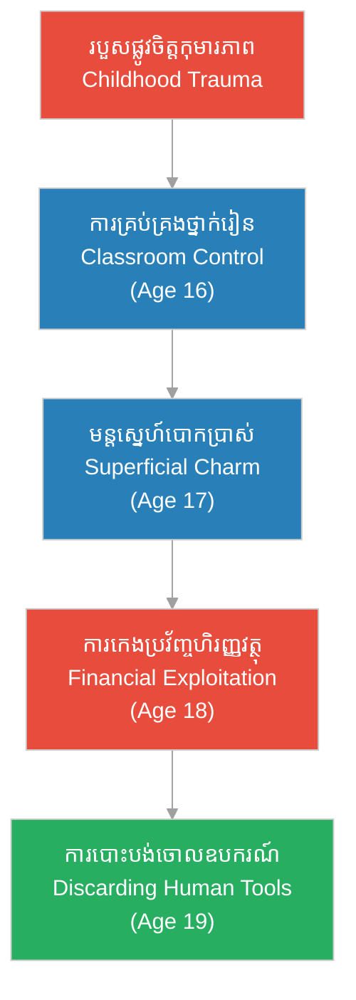

# Episode 2: ការលះបង់របស់ Clara (Clara's Sacrifice)

**Author:** ichamrong  
**Date:** 2026-06-06  
**Tags:** #hh-holmes #screenplay #episode-2 #gilded-age #manipulation #financial-fraud  
**Category:** Biographies  
**Read Time:** ~12 min  

---

## 📌 មាតិកា (Table of Contents)
- [សេចក្តីផ្តើម៖ អាពាហ៍ពិពាហ៍ជាឧបករណ៍ (Introduction: Marriage as a Transaction)](#0)
- [១. ប្លង់ទី ១៖ ថ្នាក់រៀននៅក្រុង Alton (Scene 1: The Alton Classroom - Age 16)](#1)
- [២. ប្លង់ទី ២៖ មន្តស្នេហ៍ល្បួងបោកប្រាស់ (Scene 2: Manipulative Charm - Age 17)](#2)
- [៣. ប្លង់ទី ៣៖ ការកេងប្រវ័ញ្ចហិរញ្ញវត្ថុ (Scene 3: Financial Exploitation - Age 18)](#3)
- [៤. ប្លង់ទី ៤៖ ការបោះបង់ចោលដ៏ត្រជាក់ (Scene 4: The Cold Abandonment - Age 19)](#4)
- [៥. យន្តការចិត្តសាស្ត្រនៃការវិវឌ្ឍ (Psychological Evolution Loop)](#5)
- [សេចក្តីសន្និដ្ឋាន (Conclusion)](#6)
- [🔗 ឯកសារទាក់ទង (Related Topics)](#7)

---

## សេចក្តីផ្តើម៖ អាពាហ៍ពិពាហ៍ជាឧបករណ៍ (Introduction: Marriage as a Transaction)

រឿងភាគទី ២ នេះ បង្ហាញពីរបៀបដែល Herman Mudgett (ក្រោយមកក្លាយជា H.H. Holmes) បានវិវឌ្ឍយន្តការការពារខ្លួនកុមារភាព ទៅជាការគ្រប់គ្រង និងការកេងប្រវ័ញ្ចលើអ្នកដទៃ។ ដំណើររឿងចាប់ផ្តើមពីតួនាទីជាគ្រូបង្រៀនវ័យក្មេង ដែលជាកន្លែងដំបូងគេរៀនសូត្រពីអំណាច និងការគ្រប់គ្រង មុនពេលឈានទៅប្រើប្រាស់មន្តស្នេហ៍បោកប្រាស់រៀបការជាមួយនាង Clara Lovering ដើម្បីជាប្រភពហិរញ្ញវត្ថុបម្រើដល់ការសិក្សាពេទ្យរបស់គេ។

This second episode dramatizes how Herman Mudgett (later H.H. Holmes) transitions from a defensive childhood posture into active interpersonal control and predation. The narrative traces his time as a teenage schoolteacher—where he first exercises authority and control—to his courtship and marriage of Clara Lovering, exploiting her family's finances to fund his medical school tuition.

---

## ១. ប្លង់ទី ១៖ ថ្នាក់រៀននៅក្រុង Alton (Scene 1: The Alton Classroom - Age 16)

**ទីតាំង៖** សាលារៀនក្រុង Alton, រដ្ឋ New Hampshire, ឆ្នាំ ១៨៧៧ (វេលាថ្ងៃត្រង់)  
**Location:** The Alton Schoolhouse, New Hampshire, 1877 (Midday)

**សកម្មភាព៖** Herman Mudgett (អាយុ ១៦ ឆ្នាំ ស្លៀកពាក់ស្អាតបាត សក់សិតរៀបរយ និងមានទឹកមុខត្រជាក់ស្ងប់) កំពុងឈរនៅមុខក្តារខៀន បង្រៀនសិស្សតូច ៗ ចំនួន ១៥ នាក់។ គេប្រើប្រាស់សំឡេងស្ងប់ស្ងាត់ ប៉ុន្តែម៉ឺងម៉ាត់បំផុត។ គ្មានការវាយដំរាងកាយដូចឪពុកគេឡើយ ប៉ុន្តែគេប្រើអំណាចផ្លូវចិត្តដើម្បីគ្រប់គ្រងសិស្ស។  
**Action:** Herman Mudgett (16 years old, neatly dressed, hair combed back with a cold, poised expression) stands before a blackboard teaching 15 younger students. He uses a calm but intensely firm voice. Avoiding the physical violence of his father, he exerts psychological dominance to command order.

*   **ហឺមែន (Herman)៖** "ច្បាប់ និងសណ្តាប់ធ្នាប់ គឺជាអ្វីដែលបែងចែកមនុស្សចេញពីសត្វលោក។ អ្នកណាដែលមិនគោរពច្បាប់ នឹងត្រូវដកហូតសិទ្ធិស្មើភាពគ្នា។ ចូរសរសេរមេរៀនឡើងវិញឱ្យបានស្ងៀមស្ងាត់បំផុត។"  
    *   *"Rules and order are what separate man from beasts. Anyone who violates these boundaries forfeits their right to participate. Copy the board in absolute silence."*
*   **សិស្សប្រុសម្នាក់ (Young Student)៖** (និយាយតិច ៗ ទាំងភ័យខ្លាច) "លោកគ្រូ Mudgett... ខ្ញុំមិនយល់ពីលំហាត់នេះទេ..."  
    *   *(Whimpering in fear)* *"Mr. Mudgett... I don't understand this problem..."*
*   **ហឺមែន (Herman)៖** (ដើរទៅជិតយឺត ៗ សម្លឹងចំភ្នែកសិស្សដោយគ្មានអារម្មណ៍) "កំហុសកើតឡើងពីភាពខ្ជិលច្រអូស និងការខ្វះការយកចិត្តទុកដាក់។ ឯងចង់ឱ្យខ្ញុំកត់ឈ្មោះឯងចូលក្នុង «[បញ្ជីវាស់វែងវិន័យ](../keyword/discipline-ledger.md)» ឬ?"  
    *   *(Walking over slowly, staring flatly into the boy's eyes)* *"Errors arise from laziness and lack of concentration. Do you wish to have your name registered in my ['discipline ledger'](../keyword/discipline-ledger.md)?"*

**ការពិពណ៌នា៖** ក្មេងប្រុសតូចនោះឱនក្បាលចុះទាំងញាប់ញ័រ រួចប្រញាប់សរសេរមេរៀនឡើងវិញ។ Herman ដើរត្រឡប់មកតុគ្រូ និងបើកសៀវភៅកត់ត្រារបស់ខ្លួន។ គេសរសេរឈ្មោះសិស្ស និងចំណាត់ថ្នាក់វិន័យដោយដៃដ៏ស្ងប់ស្ងាត់។ គេមានអារម្មណ៍ពេញចិត្តចំពោះ «ភាពស្ងប់ស្ងាត់» និង «ការគ្រប់គ្រង» ដែលខ្លួនអាចបង្កើតបាននៅក្នុងបន្ទប់នេះ។ នេះជាកន្លែងដែលគេដឹងថា ចំណេះដឹង និងរបាំងមុខដ៏ស្ងប់ស្ងាត់ អាចផ្តល់ឱ្យគេនូវអំណាចលើអ្នកដទៃ។  
**Description:** The young student lowers his head in terror and writes rapidly. Herman returns to his desk, opening his personal notebook. He records student names and behavioral metrics with a steady hand. He relishes the absolute control and silence he has engineered. Here, he discovers that intellect and a poised mask grant him complete authority over others.

---

## ២. ប្លង់ទី ២៖ មន្តស្នេហ៍ល្បួងបោកប្រាស់ (Scene 2: Manipulative Charm - Age 17)

**ទីតាំង៖** ផ្ទះគ្រួសារ Lovering, ទីក្រុង Alton, ឆ្នាំ ១៨check៧៨ (វេលារសៀល)  
**Location:** The Lovering Homestead, Alton, 1878 (Afternoon)

**សកម្មភាព៖** Herman Mudgett (អាយុ ១៧ ឆ្នាំ ឥឡូវមានរូបរាងជាយុវជនសមរម្យ និងគួរឱ្យទុកចិត្ត) កំពុងអង្គុយនៅក្នុងបន្ទប់ទទួលភ្ញៀវជាមួយ Clara Lovering (អាយុ ១៨ ឆ្នាំ នារីស្លូតត្រង់ កូនស្រីម្ចាស់កសិដ្ឋានមានទ្រព្យ) និងឪពុករបស់នាងគឺលោក John Lovering។ Herman ប្រើសម្តីផ្អែមល្ហែម និងបង្ហាញភាពថ្លៃថ្នូរដើម្បីទាក់ទាញចិត្តគ្រួសារនេះ។  
**Action:** Herman Mudgett (17 years old, now presenting as a respectable and trustworthy young man) sits in the parlor with Clara Lovering (18 years old, innocent daughter of a wealthy farmer) and her father, John Lovering. Herman deploys his polished charm to gain their confidence.

*   **ហឺមែន (Herman)៖** "លោកពុក Lovering បទពិសោធន៍ជាគ្រូបង្រៀនរបស់ខ្ញុំ បានធ្វើឱ្យខ្ញុំយល់ច្បាស់ពីតម្រូវការសណ្តាប់ធ្នាប់ និងការអប់រំ។ ខ្ញុំចង់បន្តការសិក្សាផ្នែកវេជ្ជសាស្ត្រ ដើម្បីបំរើដល់សង្គមជាតិ តែថ្លៃសិក្សាពិតជាធំធេងណាស់..."  
    *   *"Mr. Lovering, my experience as a teacher has deepened my respect for order and education. I wish to pursue medical studies to serve society, though the tuition is quite substantial..."*
*   **ចន ឡូវើរីង (John Lovering)៖** "Herman ឯងជាយុវជនមានការងារច្បាស់លាស់ និងមានមហិច្ឆតាល្អ។ Clara កូនស្រីខ្ញុំតែងតែនិយាយសរសើរពីភាពស្មោះត្រង់របស់ឯង។"  
    *   *"Herman, you are an employed and highly ambitious young man. My daughter Clara always speaks of your integrity."*
*   **ក្លារ៉ា (Clara)៖** (ញញឹមដោយក្តីស្រឡាញ់ និងអៀនប្រៀន) "លោកពុក... Herman ជាមនុស្សពូកែ និងមានចិត្តធម៌ណាស់។ គាត់ប្រាកដជានឹងក្លាយជាគ្រូពេទ្យដ៏ល្អម្នាក់។"  
    *   *(Smiling with devotion)* *"Father... Herman is brilliant and very kind. He will surely become a successful doctor."*
*   **ហឺមែន (Herman)៖** (ចាប់ដៃ Clara ដោយក្តីថ្នមបំភ័ន្ត) "ខ្ញុំសន្យថានឹងប្រើចំណេះដឹងទាំងអស់ដើម្បីមើលថែ Clara និងបង្កើតគ្រួសារដ៏មានសុភមង្គលមួយ។"  
    *   *(Taking Clara's hand with simulated tenderness)* *"I promise to use my medical career to provide for Clara and build a secure family."*

**ការពិពណ៌នា៖** Herman ញញឹមដោយភាពកក់ក្តៅ ប៉ុន្តែភ្នែកពណ៌ខៀវរបស់គេនៅតែត្រជាក់ស្រេប ដដែល។ គេសម្លឹងមើលទៅ Clara មិនមែនជាមនុស្សជាទីស្រឡាញ់ឡើយ ប៉ុន្តែជា «ធនធានហិរញ្ញវត្ថុ» និងជាស្ពានចម្លងគេទៅកាន់សាលាពេទ្យ។  
**Description:** Herman performs a warm smile, but his blue eyes remain empty and observant. He views Clara not as a human partner, but as a financial asset—a bridge to fund his medical ambitions.

---

## ៣. ប្លង់ទី ៣៖ ការកេងប្រវ័ញ្ចហិរញ្ញវត្ថុ (Scene 3: Financial Exploitation - Age 18)

**ទីតាំង៖** បន្ទប់ជួលដ៏ត្រជាក់, ក្រុង Burlington, រដ្ឋ Vermont, ឆ្នាំ ១៨៧៩ (វេលាយប់ជ្រៅ)  
**Location:** A Cold Rented Room, Burlington, Vermont, 1879 (Late Night)

**សកម្មភាព៖** Herman អង្គុយវះកាត់សត្វកណ្តុរងាប់នៅលើតុ ភ្នែកសម្លឹងមើលគំនូរប្លង់កាយវិភាគវិទ្យា។ បន្ទប់ពោរពេញដោយភាពត្រជាក់ និងងងឹត។ Clara (ឥឡូវជាភរិយារបស់គេ) ដើរចូលមកបន្ទប់ទាំងហត់នឿយខ្លាំង ដោយហុចកាបូបលុយតូចមួយឱ្យគេ។  
**Action:** Herman sits dissecting a dead mouse at his desk, his eyes studying anatomy sketches. The room is dark and cold. Clara (now his wife) enters physically drained, handing him a small purse of money.

*   **ក្លារ៉ា (Clara)៖** "Herman នេះជាប្រាក់ទាំងអស់ដែលអូនរកបានពីការងាររោងចក្រក្នុងសប្តាហ៍នេះ... និងលុយដែលលោកពុកផ្ញើមកបន្ថែម។ ខ្លួនប្រាណអូនឈឺចាប់ និងហត់នឿយខ្លាំងណាស់..."  
    *   *"Herman, here is all the money I earned from the textile mill this week... and the extra funds from father. My body aches, and I am so exhausted..."*
*   **ហឺមែន (Herman)៖** (ទទួលយកកាបូបលុយដោយមិនងាកមើលមុខនាង) "ល្អណាស់ Clara។ ប៉ុន្តែថ្លៃសាលានៅឆ្នាំក្រោយនឹងត្រូវបង់មុនកាលកំណត់។ ចូរប្រាប់ឪពុកអូនឱ្យផ្ទេរលុយមកបន្ថែមទៀតភ្លាម ៗ មក។"  
    *   *(Taking the purse without looking at her)* *"Good, Clara. But next year's tuition must be prepaid. Tell your father to expedite the transfer of additional funds immediately."*
*   **ក្លារ៉ា (Clara)៖** (យំខ្សឹបខ្សួល) "Herman... តើបងមើលឃើញអូនជាភរិយា ឬគ្រាន់តែជាម៉ាស៊ីនរកលុយឱ្យបង? បងលែងនិយាយរកអូន បងមើលឃើញតែសាកសព និងឆ្អឹងសត្វ..."  
    *   *(Weeping)* *"Herman... do you see me as your wife, or merely as a machine to extract money? You never speak to me, only staring at bones and carcasses..."*
*   **ហឺមែន (Herman)៖** (ងើបមុខឡើងសម្លឹងនាងដោយភាពត្រជាក់ស្រេប) "Clara ជីវិតគឺជា[លំហូរនៃធនធាន និងការរៀបចំយន្តការ](../keyword/flow-of-resources-and-mechanics.md)។ [ភាពទន់ជ្រាយផ្លូវចិត្ត](../keyword/emotional-sentimentality.md)គ្មានតម្លៃបម្រើដល់ភាពជោគជ័យរបស់យើងឡើយ។"  
    *   *(Looking up with a chillingly flat expression)* *"Clara, life is merely a [flow of resources and mechanics](../keyword/flow-of-resources-and-mechanics.md). [Emotional sentimentality](../keyword/emotional-sentimentality.md) serves no functional purpose in our advancement."*

**ការពិពណ៌នា៖** Herman ងាកទៅវះកាត់សត្វវិញដោយដៃដ៏ស្ងប់ស្ងាត់បំផុត។ សម្រែក និងទឹកភ្នែករបស់ភរិយាមិនអាចជ្រាបចូលទៅក្នុងចិត្តដែលបានផ្តាច់អារម្មណ៍ទាំងស្រុងរបស់គេឡើយ។  
**Description:** Herman returns to his dissection with a perfectly steady hand. His wife's tears bounce off his completely dissociated mind, unable to penetrate his functional exterior.

---

## ៤. ប្លង់ទី ៤៖ ការបោះបង់ចោលដ៏ត្រជាក់ (Scene 4: The Cold Abandonment - Age 19)

**ទីតាំង៖** ស្ថានីយរថភ្លើងក្រុង Burlington (វេលាព្រលឹមស្រាង ៗ, ឆ្នាំ ១៨៨០)  
**Location:** Burlington Train Station (Dawn, 1880)

**សកម្មភាព៖** Herman ឈរកាន់វ៉ាលីដែក រៀបចំឡើងរថភ្លើងទៅកាន់រដ្ឋ Michigan ដើម្បីបន្តការសិក្សាពេទ្យ។ Clara ឈរយំឱបកូនប្រុសទើបនឹងកើតរបស់ពួកគេគឺ Robert ទាំងអស់សង្ឃឹម។  
**Action:** Herman stands holding a metal trunk, preparing to board a train to Michigan for medical school. Clara stands weeping, holding their newborn son, Robert, in despair.

*   **ក្លារ៉ា (Clara)៖** "Herman! បងយកលុយរបស់គ្រួសារអូនទាំងអស់ទៅហើយ... ហេតុអ្វីបងមិនឱ្យអូន និងកូនទៅជាមួយផង? តើបងបោះបង់ពួកយើងចោលមែនទេ?"  
    *   *"Herman! You took all of my family's money... why won't you let us come with you? Are you abandoning us?"*
*   **ហឺមែន (Herman)៖** (និយាយដោយគ្មានការរំភើបចិត្ត) "Michigan គ្មានកន្លែងសមរម្យសម្រាប់ទារកឡើយ។ ចូរនៅទីនេះជាមួយឪពុកម្តាយអូនចុះ ពួកគេមានធនធានគ្រប់គ្រាន់ដើម្បីចិញ្ចឹមនាង។"  
    *   *(Speaking without a trace of emotion)* *"Michigan has no functional accommodation for an infant. Stay with your parents; they possess the resources to maintain you."*
*   **ក្លារ៉ា (Clara)៖** "តើបងនឹងត្រឡប់មកវិញទេ? តើបងនៅស្រឡាញ់ពួកយើងទេ?"  
    *   *"Will you ever return? Do you still care for us?"*
*   **ហឺមែន (Herman)៖** (ថើបថ្ងាសនាងដោយគ្មានកម្តៅ) "ខ្ញុំសន្យាថានឹងទាក់ទងមកវិញ។ ចូរថែខ្លួន។"  
    *   *(Kissing her forehead coldly)* *"I promise to maintain contact. Take care."*

**ការពិពណ៌នា៖** Herman ដើរឡើងរថភ្លើងដោយមិនងាកក្រោយសម្លឹងមើលប្រពន្ធ និងកូនម្តងទៀតឡើយ។ នៅពេលរថភ្លើងចេញដំណើរ Herman យកសៀវភៅកត់ត្រារបស់ខ្លួនមកបើកមើល រួចគូសឆូតលើឈ្មោះ «Clara Lovering» ចេញពីបញ្ជីទ្រព្យសកម្មរបស់គេ។ គេដកដង្ហើមធំដោយក្តីធូរស្រាល និងរីករាយនឹង «ភាពស្ងៀមស្ងាត់» នៃដំណើរទៅមុខ។  
**Description:** Herman boards the carriage without a single backward glance. As the train pulls away, Herman opens his notebook and draws a clean line through the name "Clara Lovering"—she has been fully depreciated. He breathes a sigh of relief, smiling at the absolute silence of the road ahead.

---

## ៥. យន្តការចិត្តសាស្ត្រនៃការវិវឌ្ឍ (Psychological Evolution Loop)

ដ្យាក្រាមខាងក្រោមបង្ហាញពីរបៀបដែល Herman ផ្លាស់ប្តូរការគ្រប់គ្រងផ្លូវចិត្តក្នុងថ្នាក់រៀន ទៅជាការកេងប្រវ័ញ្ចហិរញ្ញវត្ថុគ្រួសារ៖

The following diagram maps how Herman's psychological need for control evolved from the schoolroom to active relational predation:

> [!IMPORTANT]
> **🧠 យន្តការចិត្តសាស្ត្រ / Psychological Mechanism - [ការគ្រប់គ្រងលើអ្នកដទៃ (Interpersonal Control)](../keyword/emotional-dissociation.md):**
> * «សម្រាប់ Herman តួនាទីជាគ្រូបង្រៀនគឺជាឱកាសដំបូងក្នុងការបំប្លែងភាពភ័យខ្លាចពីអតីតកាល ទៅជាការគ្រប់គ្រងផ្លូវចិត្តលើអ្នកដទៃ ដើម្បីកុំឱ្យខ្លួនក្លាយជាជនរងគ្រោះម្តងទៀត។» (*"For Herman, the schoolroom is the first platform to convert his past victimization into active psychological control over others, ensuring he is never the victim again."*).
> 
> **🤫 យន្តការចិត្តសាស្ត្រ / Psychological Mechanism - [ការបោះបង់ចោលឧបករណ៍ (Discarding Tools)](../keyword/preserving-the-silence.md):**
> * «នៅពេលដែល Clara និងគ្រួសារនាងអស់តម្លៃកេងប្រវ័ញ្ចហិរញ្ញវត្ថុ Herman កាត់ផ្តាច់នាងចេញពីបញ្ជីជីវិតភ្លាម ៗ ដោយគ្មានការរារែកចិត្ត ឬអាណិតអាសូរឡើយ។» (*"Once Clara and her family are financially depleted, Herman discards them with mechanical efficiency, completely insulated from guilt or empathy."*).

---

## សេចក្តីសន្និដ្ឋាន (Conclusion)

> **«មនុស្សទាំងអស់ប្រៀបដូចជាសៀវភៅ ឬគ្រឿងម៉ាស៊ីន... យើងប្រើប្រាស់ពួកវាដើម្បីរៀនសូត្រ និងសម្រេចគោលដៅ រួចបិទវាទុកចោល» — H.H. Holmes**
> 
> **“All people are like books or machines... we use them to learn and achieve our goals, then we shut them away.” — H.H. Holmes**

រឿងភាគទី ២ បិទបញ្ចប់ដោយ Herman អង្គុយលើរថភ្លើង សម្លឹងមើលទៅកាន់ទីក្រុង Ann Arbor ដោយក្តីសង្ឃឹម និងការត្រៀមខ្លួនសម្រាប់ប្រតិបត្តិការថ្មីនៅក្នុងសាលាពេទ្យ។

Episode 2 concludes with Herman sitting on the train, gazing toward Ann Arbor with cold anticipation, ready to launch his next phase of scientific fraud in medical school.

---

## 🔗 ឯកសារទាក់ទង (Related Topics)
*   **[Episode 1: ស្រមោលកុមារភាព (Shadows of New Hampshire)](ep-01-shadows-of-new-hampshire.md)** — ស្គ្រីបភាគទី ១ ដែលជាសាច់រឿងគ្រឹះនៃកុមារភាពរបស់ Young Herman។
*   **[បញ្ជីវាស់វែងវិន័យ (Discipline Ledger)](../keyword/discipline-ledger.md)** — យន្តការតាមដាន និងគ្រប់គ្រងចិត្តសាស្ត្រសិស្សក្នុងសាលារៀនរបស់ Herman Mudgett។
*   **[លំហូរនៃធនធាន និងការរៀបចំយន្តការ (Flow of Resources and Mechanics)](../keyword/flow-of-resources-and-mechanics.md)** — ទស្សនៈបែបសម្ភារៈនិយមជ្រុលរបស់ Herman Mudgett ដែលចាត់ទុកជីវិតសត្វលោកជាវត្ថុ។
*   **[ភាពទន់ជ្រាយផ្លូវចិត្ត (Emotional Sentimentality)](../keyword/emotional-sentimentality.md)** — ការបដិសេធរបស់ Herman Mudgett ចំពោះមនោសញ្ចេតនា និងក្តីស្រឡាញ់របស់មនុស្ស។
*   **[ជីវប្រវត្តិ H.H. Holmes](../01-h-h-holmes-biography.md)** — ស្វែងយល់លម្អិតអំពីប្រវត្តិផ្ទាល់ខ្លួន និងវិមានឃាតកម្ម។
*   **[គម្រោងរឿងភាគដ្រាម៉ា ៦៣ ភាគ](../08-holmes-drama-episode-guide.md)** — គម្រោងសាច់រឿងរឿងភាគ ៦៣ ភាគ។
