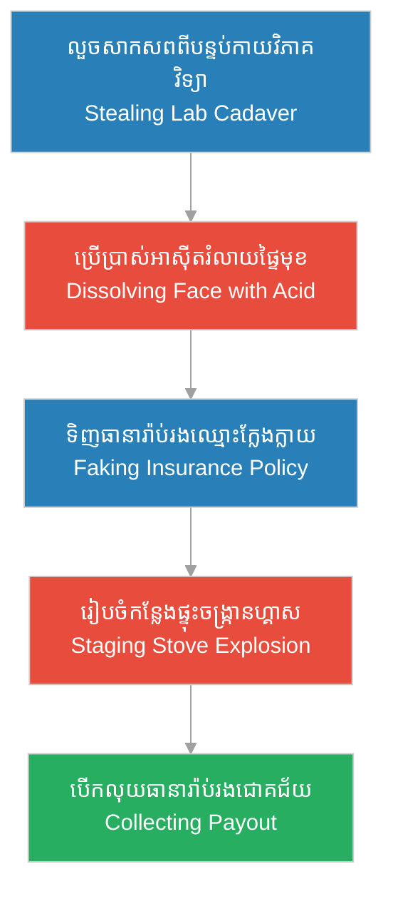

# Episode 3: មន្ទីរពិសោធន៍ខ្មៅងងឹត (The Cadaver Market)

**Author:** ichamrong  
**Date:** 2026-06-07  
**Tags:** #hh-holmes #screenplay #episode-3 #cadaver-market #grave-robbing #insurance-fraud #anatomy-lab  
**Category:** Biographies  
**Read Time:** ~12 min  

---

## 📌 មាតិកា (Table of Contents)
- [សេចក្តីផ្តើម៖ សហគ្រិនភាពនៃសេចក្តីស្លាប់ (Introduction: The Entrepreneurship of Death)](#0)
- [១. ប្លង់ទី ១៖ បន្ទប់កាយវិភាគវិទ្យាដ៏ត្រជាក់ (Scene 1: The Cold Anatomy Lab - Ann Arbor)](#1)
- [២. ប្លង់ទី ២៖ ខ្សែសង្វាក់ផ្គត់ផ្គង់សាកសពខ្មៅងងឹត (Scene 2: The Dark Corpse Supply Chain)](#2)
- [៣. ប្លង់ទី ៣៖ ការពិសោធន៍រំលាយអត្តសញ្ញាណ (Scene 3: Experimenting with Disfigurement)](#3)
- [៤. ប្លង់ទី ៤៖ ប្លង់មេនៃការបោកប្រាស់ធានារ៉ាប់រង (Scene 4: The Insurance Fraud Blueprint)](#4)
- [៥. យន្តការចិត្តសាស្ត្រនៃការវិវឌ្ឍ (Psychological Evolution Loop)](#5)
- [សេចក្តីសន្និដ្ឋាន (Conclusion)](#6)
- [🔗 ឯកសារទាក់ទង (Related Topics)](#7)

---

## សេចក្តីផ្តើម៖ សហគ្រិនភាពនៃសេចក្តីស្លាប់ (Introduction: The Entrepreneurship of Death)

រឿងភាគទី ៣ នេះ នាំយើងទៅកាន់ដំណាក់កាលសិក្សាផ្នែកវេជ្ជសាស្ត្ររបស់ Herman Mudgett នៅសាកលវិទ្យាល័យ Michigan ក្នុងទសវត្សរ៍ឆ្នាំ ១៨៨០។ នៅទីនោះ គេបានរកឃើញថា សាកសពមនុស្សមិនត្រឹមតែជាឧបករណ៍សិក្សាប៉ុណ្ណោះទេ ប៉ុន្តែវាជា «ទំនិញ» ដែលមានតម្លៃខ្ពស់នៅក្នុងទីផ្សារងងឹត។ ដំណើររឿងបង្ហាញពីការវិវឌ្ឍរបស់គេ ពីការស៊ាំនឹងសាកសព ទៅជាការពិសោធន៍គីមីដើម្បីលុបបំបាត់អត្តសញ្ញាណមនុស្ស និងការបង្កើតផែនការបោកប្រាស់ធានារ៉ាប់រងអាយុជីវិតជាលើកដំបូងបង្អស់។

This third episode follows Herman Mudgett during his medical studies at the University of Michigan in the 1880s. There, he discovers that human corpses are not merely educational tools, but highly valued commodities in the black market. The narrative traces his evolution from anatomical familiarity to active chemical disfigurement experiments, culminating in his very first successful life insurance fraud scheme.

---

## ១. ប្លង់ទី ១៖ បន្ទប់កាយវិភាគវិទ្យាដ៏ត្រជាក់ (Scene 1: The Cold Anatomy Lab - Ann Arbor)

**ទីតាំង៖** បន្ទប់កាយវិភាគវិទ្យា, សាកលវិទ្យាល័យ Michigan, ឆ្នាំ ១៨៨២ (វេលាថ្ងៃត្រង់)  
**Location:** The Anatomy Laboratory, University of Michigan, 1882 (Midday)

**សកម្មភាព៖** Herman Webster Mudgett (អាយុ ២១ ឆ្នាំ ស្លៀកពាក់អាវក្រៅពេទ្យពណ៌សស្អាត) កំពុងឈរក្បែរតុដែកដែលមានសាកសពមនុស្សស្រោបដោយក្រណាត់កៅស៊ូ។ និស្សិតពេទ្យដទៃទៀតមានទឹកមុខស្លេកស្លាំង ខ្លះខ្ទប់ច្រមុះដោយសារក្លិនថ្នាំ formaldehyde និងក្លិនស្អុយរលួយ។ ប៉ុន្តែ Herman បង្ហាញទឹកមុខស្ងប់ស្ងាត់ និងដកដង្ហើមចូលយ៉ាងវែង ហាក់បីដូចជាមានអារម្មណ៍ផាសុកភាពជាខ្លាំង។  
**Action:** Herman Webster Mudgett (21 years old, wearing a clean white medical apron) stands beside a steel table holding a rubber-sheeted human cadaver. Other medical students look pale, some covering their noses to block the pungent smell of formaldehyde and decay. Herman, however, exhibits a calm expression, taking a deep breath as if finding absolute comfort in the room.

*   **សាស្ត្រាចារ្យ ហឺដម៉ាន់ (Professor Herdman)៖** "នៅចំពោះមុខអ្នកទាំងអស់គ្នា គឺជាគ្រឿងម៉ាស៊ីនដ៏អស្ចារ្យបំផុតរបស់ធម្មជាតិ។ វាមិនវិលវល់ មិននិយាយស្តី និងត្រៀមខ្លួនជាស្រេចសម្រាប់ការសិក្សា។ នៅក្នុងបន្ទប់នេះ អ្នកត្រូវតែទុកអារម្មណ៍ និងក្តីមេត្តារបស់អ្នកនៅខាងក្រៅទ្វារ។ គ្រប់សរសៃឈាម និងឆ្អឹងនីមួយៗ គ្រាន់តែជាផ្នែកនៃយន្តការរូបវន្តប៉ុណ្ណោះ។"  
    *   *"Before you lies nature's most intricate machine. It is still, silent, and ready for dissection. In this hall, you must leave your emotions and sentiments at the door. Every vessel and bone is merely a component of a physical mechanism."*
*   **និស្សិតពេទ្យម្នាក់ (Classmate)៖** (និយាយទាំងចង់ក្អួត) "លោកសាស្ត្រាចារ្យ... ខ្ញុំមិនអាចទ្រាំនឹងក្លិននេះបានទេ... វាហាក់ដូចជាព្រលឹងរបស់ពួកគេនៅវិលវល់នៅទីនេះ..."  
    *   *(Gagging)* *"Professor... I cannot stand the stench... it feels as though their spirits are still lingering in this room..."*
*   **ហឺមែន (Herman)៖** (និយាយដោយសំឡេងស្ងប់ស្ងាត់ទៅកាន់មិត្តរួមថ្នាក់) "ពួកគេគ្មានព្រលឹងទៀតឡើយ។ សេចក្តីស្លាប់បានដោះលែងពួកគេពីភាពវឹកវរ។ អ្វីដែលនៅសេសសល់ គឺត្រឹមតែគ្រឿងម៉ាស៊ីនដែលខូច និងឈប់ដំណើរការ។ គ្រឿងម៉ាស៊ីនមិនអាចធ្វើបាបយើងឡើយ។"  
    *   *(Speaking in a cool, level tone)* *"There are no souls left here. Death has released them from chaos. What remains is merely a broken, inert machine. And machines cannot harm us."*

**ការពិពណ៌នា៖** Herman លូកដៃប៉ះនឹងសរសៃសាច់ត្រជាក់របស់សាកសពដោយគ្មានការញញើតដៃឡើយ។ ភាពស្ងៀមស្ងាត់នៅក្នុងបន្ទប់សាកសព ធ្វើឱ្យគេនឹកឃើញដល់ភាពស្ងប់ស្ងាត់នៅក្នុងព្រៃជ្រៅនៃស្រុកកំណើតរបស់គេ។ វាជាកន្លែងដែលគ្មានការវាយដំ និងគ្មានសម្រែកកំហឹងរបស់ឪពុកគេ។ គេមានអារម្មណ៍ថា ខ្លួនជាម្ចាស់ និងជាអ្នកគ្រប់គ្រងលើរូបកាយគ្មានវិញ្ញាណទាំងនេះ។ នេះជាការវិវឌ្ឍនៃ **«ការចាប់អារម្មណ៍លើកាយវិភាគវិទ្យា» ([Anatomical Fascination](../keyword/anatomical-fascination.md))** របស់គេ។  
**Description:** Herman touches the cold tissue of the cadaver without a hint of hesitation. The heavy silence of the dissection room reminds him of the quiet woods back in New Hampshire. Here, there is no violence, no screams of his abusive father. He feels like a master, a controller of these soulless vessels. His childhood [anatomical fascination](../keyword/anatomical-fascination.md) has matured into functional command.

---

## ២. ប្លង់ទី ២៖ ខ្សែសង្វាក់ផ្គត់ផ្គង់សាកសពខ្មៅងងឹត (Scene 2: The Dark Corpse Supply Chain)

**ទីតាំង៖** បន្ទប់ក្រោមដីនៃសាលាពេទ្យ, Ann Arbor, ឆ្នាំ ១៨៨៣ (វេលាយប់ជ្រៅ ពោរពេញដោយភ្លៀងធ្លាក់ខ្លាំង)  
**Location:** The Basement Receiving Dock, Medical School, Ann Arbor, 1883 (Late Night, pouring rain)

**សកម្មភាព៖** Herman កំពុងអង្គុយគូរគំនូរប្លង់ឆ្អឹងនៅក្នុងបន្ទប់ក្រោមដីដ៏ងងឹតស្រអាប់។ គេស្រាប់តែឮសំឡេងរទេះសេះ និងការខ្សឹបខ្សៀវគ្នានៅខាងក្រៅទ្វារដែក។ គេក៏ពន្លត់ភ្លើងចង្កៀង និងពួននៅក្នុងស្រមោលជញ្ជាំង។ យុវជនពីរនាក់ដែលជាអ្នកលួចជីកសាកសព (Resurrectionists) បានរុញរទេះឈើមួយដែលមានសាកសពស្រោបដោយបាវធ្យូងចូលមក ជួបជាមួយជំនួយការមន្ទីរពិសោធន៍។  
**Action:** Herman is sketching skeletal charts in the dimly lit basement. He hears the sound of a carriage and hushed voices outside the heavy iron door. Extinguishing his gas lamp, he retreats into the deep shadows. Two body snatchers (resurrectionists) wheel in a wooden cart carrying a fresh corpse wrapped in coal sacks, meeting the lab assistant.

*   **អ្នកលួចសាកសពទី ១ (Grave Robber 1)៖** "សាកសពនេះទើបតែជីកចេញពីផ្នូរថ្មីៗកាលពីល្ងាចមិញប៉ុណ្ណោះ។ សាច់នៅណែនល្អ គ្មានស្លាកស្នាមខូចខាតឡើយ។ ហានិភ័យឥឡូវធំណាស់ ប៉ូលីសយាមកាមខ្លាំង ពួកយើងសុំសាមសិបដុល្លារសម្រាប់ការដឹកជញ្ជូននេះ។"  
    *   *"This one was lifted from a fresh grave just this evening. The tissue is intact, no damage. The risks are high now with the town sheriff patrol, we want thirty dollars for this delivery."*
*   **ជំនួយការមន្ទីរពិសោធន៍ (Lab Assistant)៖** "ថ្លៃណាស់! សាកសពមុនខូចគុណភាពលឿនពេក។ ខ្ញុំអាចឱ្យបានត្រឹមតែម្ភៃប្រាំដុល្លារប៉ុណ្ណោះ។ ចូរយកលុយនេះទៅ ហើយប្រញាប់ចេញទៅតាមច្រកក្រោយភ្លាម។"  
    *   *"Too expensive! The last subject decayed too quickly. I can only offer twenty-five. Take the money and clear out through the back alley."*
*   **ហឺមែន (Herman)៖** (ខ្សឹបនិយាយម្នាក់ឯងក្នុងស្រមោលងងឹត) "សាកសពមនុស្សម្នាក់មានតម្លៃត្រឹមតែម្ភៃប្រាំដុល្លារ... នៅក្នុងភ្នែករបស់ពួកគេ សេចក្តីស្លាប់គ្រាន់តែជាផលិតផលដែលមានតម្លៃថេរ។ ប្រសិនបើជីវិតអាចកែច្នៃបាន ហេតុអ្វីយើងមិនអាចកំណត់តម្លៃរបស់វាដោយខ្លួនឯង?"  
    *   *(Whispering in the shadows)* *"A human body is worth merely twenty-five dollars... in their eyes, death is just a product with a fixed price tag. If life can be manufactured, why can we not determine its value ourselves?"*

**ការពិពណ៌នា៖** Herman សម្លឹងមើលទៅលុយដុល្លារដែលហុចឱ្យគ្នា និងសម្លឹងមើលសាកសពដែលត្រូវបានគេបោះចោលលើកម្រាលបេតុង។ គេដឹងថា ពិភពលោកសម័យ Gilded Age គឺជាកន្លែងដែលអ្វីៗគ្រប់យ៉ាងអាចទិញលក់បាន។ នេះជាការបំផុសគំនិតឱ្យគេយល់ឃើញពី **«លំហូរនៃធនធាន និងការរៀបចំយន្តការ» ([Flow of Resources and Mechanics](../keyword/flow-of-resources-and-mechanics.md))** — ដែលជីវិត និងសាកសពមនុស្ស គឺជាវត្ថុធាតុហិរញ្ញវត្ថុដែលអាចទាញយកផលចំណេញបាន។  
**Description:** Herman watches the exchange of cash and the careless handling of the body on the concrete floor. He realizes that in the Gilded Age, everything is a transactional asset. This sparks his understanding of the [flow of resources and mechanics](../keyword/flow-of-resources-and-mechanics.md)—concluding that human bodies, dead or alive, are financial assets waiting to be liquidated.

---

## ៣. ប្លង់ទី ៣៖ ការពិសោធន៍រំលាយអត្តសញ្ញាណ (Scene 3: Experimenting with Disfigurement)

**ទីតាំង៖** បន្ទប់ពិសោធន៍គីមីកាយវិភាគវិទ្យា, ឆ្នាំ ១៨៨៣ (វេលាយប់ជ្រៅ)  
**Location:** The Anatomy Chemistry Lab, 1883 (Late Night)

**សកម្មភាព៖** Herman ស្ថិតនៅក្នុងបន្ទប់ពិសោធន៍តែម្នាក់ឯង ដោយមានចង្កៀងហ្គាសមួយបំភ្លឺ។ នៅលើតុវះកាត់ មានសាកសពបុរសម្នាក់ដែលសាលាពេទ្យបានទិញមក។ Herman យកដបកែវដែលមានអាស៊ីតនីទ្រិច (Nitric Acid) មកកាន់ រួចរៀបចំឧបករណ៍វះកាត់ធ្មេញ និងឡាម។ គេចាប់ផ្តើមធ្វើពិសោធន៍កែប្រែទម្រង់មុខសាកសព ដើម្បីសាកល្បងថាតើអត្តសញ្ញាណរបស់មនុស្សម្នាក់អាចលុបបំបាត់ចោលបានដោយងាយស្រួលកម្រិតណា។  
**Action:** Herman is alone in the laboratory, illuminated by a flickering gas jet. On the dissection table lies a male cadaver purchased by the school. Herman holds a glass bottle of nitric acid, alongside dental extraction tools and a scalpel. He begins experimenting with disfiguring the corpse's facial features to test how easily a human identity can be erased.

*   **ហឺមែន (Herman)៖** (និយាយទៅកាន់សាកសពទាំងស្ងប់ស្ងាត់) "តើឯងជានរណាពីមុនមក? ជាកម្មកររោងចក្រ? ឬជាអ្នកដំណើរគ្មានផ្ទះសម្បែង? វាមិនសំខាន់ឡើយ។ នៅក្នុងបន្ទប់នេះ អតីតកាលរបស់ឯងត្រូវបានលុបចោល។ ឯងនឹងក្លាយជាអ្នកណាក៏បាន ទៅតាមអ្វីដែលខ្ញុំសរសេរនៅលើក្រដាស។ អត្តសញ្ញាណគ្រាន់តែជាសំបកក្រៅដ៏ស្តើងមួយប៉ុណ្ណោះ។"  
    *   *(Speaking softly to the corpse)* *"Who were you before? A factory laborer? A nameless traveler? It matters not. In this room, your past is deleted. You will become whoever I dictate on paper. Identity is merely a paper-thin label."*
*   **ហឺមែន (Herman)៖** (ចាក់អាស៊ីតយឺតៗលើផ្ទៃមុខសាកសព ផ្សែងគីមីហុយឡើង និងសាច់ចាប់ផ្តើមរលាយខូចទ្រង់ទ្រាយ) "អាស៊ីតរំលាយស្បែក និងសាច់... ដង្កាប់ដកធ្មេញផ្លាស់ប្តូរទម្រង់មាត់។ ប៉ូលីស និងគ្រួសាររបស់ឯង នឹងគ្មានថ្ងៃស្គាល់ឯងឡើយ។ ឯងគឺជាវត្ថុធាតុដើមដ៏ល្អឥតខ្ចោះ។"  
    *   *(Pouring acid slowly onto the face, chemical smoke rises as the flesh dissolves)* *"Acid dissolves the skin and tissue... dental forceps alter the jaw configuration. The police and your family will never recognize you. You are now the perfect raw material."*

**ការពិពណ៌នា៖** Herman ប្រើប្រាស់ឡាម និងឧបករណ៍វះកាត់កែសម្រួលទម្រង់មុខសាកសពដោយដៃដ៏ហ្មត់ចត់បំផុត។ គេមិនបង្ហាញអារម្មណ៍ខ្ពើមឆ្អើម ឬភ័យខ្លាចឡើយ។ ចិត្តរបស់គេបានផ្តាច់អារម្មណ៍ទាំងស្រុងពីតម្លៃមនុស្សធម៌។ គេកត់ត្រាលទ្ធផលនៃការរលាយសាច់ និងការផ្លាស់ប្តូរទម្រង់ធ្មេញទៅក្នុងសៀវភៅកត់ត្រាខ្មៅរបស់ខ្លួន ដោយចាត់ទុកវាជាផ្នែកមួយនៃ «ទ្រព្យសកម្ម» ដែលអាចប្រើប្រាស់បោកប្រាស់ធានារ៉ាប់រងបាន។  
**Description:** Herman works meticulously with the scalpel and instruments to alter the facial structure. He displays no disgust or fear, his mind completely insulated from human sentiment. He records the chemical reactions and dental extractions in his black notebook, classifying the disfigured subject as a verified "asset" for his insurance designs.

---

## ៤. ប្លង់ទី ៤៖ ប្លង់មេនៃការបោកប្រាស់ធានារ៉ាប់រង (Scene 4: The Insurance Fraud Blueprint)

**ទីតាំង៖** បន្ទប់ជួលរបស់ Herman, Ann Arbor, ឆ្នាំ ១៨៨៤ (វេលាព្រលឹមស្រាងៗ)  
**Location:** Herman's Rented Room, Ann Arbor, 1884 (Dawn)

**សកម្មភាព៖** Herman អង្គុយនៅតុសរសេរកូដ និងរៀបចំឯកសារ។ លើតុមានកិច្ចសន្យាធានារ៉ាប់រងអាយុជីវិតតម្លៃ ១,០០០ ដុល្លារ ក្រោមឈ្មោះក្លែងក្លាយ «H. W. Lovering»។ លោក ជេនគីន (Jenkins) ដែលជាភ្នាក់ងារធានារ៉ាប់រង និងជាអ្នកត្រួតពិនិត្យសាកសព បានមកដល់ផ្ទះជួលមួយកន្លែង ដែល Herman បានរៀបចំដាក់សាកសពកែប្រែមុខមាត់ឱ្យដូចជាការស្លាប់ដោយគ្រោះថ្នាក់ផ្ទុះចង្ក្រានហ្គាស។  
**Action:** Herman sits at a desk cluttered with documents. On the table is a $1,000 life insurance policy under the fictitious name "H. W. Lovering." Mr. Jenkins, an insurance inspector, arrives at a staged rented room where Herman has placed the disfigured cadaver to look like an accidental stove explosion victim.

*   **ជេនគីន (Jenkins)៖** (ពិនិត្យមើលសាកសពដែលរលាកខ្លាំងលើគ្រែ និងខ្ទប់ច្រមុះ) "គ្រោះថ្នាក់នេះពិតជាគួរឱ្យរន្ធត់ណាស់ លោក Mudgett។ ផ្ទុះចង្ក្រានហ្គាសធ្វើឱ្យមុខមាត់របស់គាត់រលាកខ្ទេចមើលមិនស្គាល់ឡើយ។ ប៉ុន្តែទំហំខ្លួនប្រាណ និងប្រវត្តិធ្មេញដែលបាត់បង់ ស្របគ្នាទៅនឹងព័ត៌មាននៅក្នុងឯកសារធានារ៉ាប់រងរបស់លោក H. W. Lovering។"  
    *   *(Inspecting the badly disfigured body on the bed, covering his nose)* *"This accident is tragic, Mr. Mudgett. The stove explosion burned his face beyond recognition. However, the physical build and the dental anomalies match the records submitted for Mr. H. W. Lovering's policy."*
*   **ហឺមែន (Herman)៖** (ធ្វើពុតជាយំសោក និងយកកន្សែងជូតភ្នែកដែលគ្មានទឹកភ្នែក) "គាត់គឺជាមិត្តភក្តិដ៏ល្អបំផុតរបស់ខ្ញុំ... យើងបានមករៀនពេទ្យជាមួយគ្នា។ ខ្ញុំពិតជាមិនអាចជឿថាគាត់ត្រូវចាកចេញពីយើងលឿនបែបនេះឡើយ។ ទឹកប្រាក់ធានារ៉ាប់រងនេះ នឹងជួយសម្រាលការលំបាកដល់ក្រុមគ្រួសាររបស់គាត់ដែលនៅជនបទ..."  
    *   *(Simulating grief, dabbing dry eyes with a handkerchief)* *"He was my dearest friend... we came to medical school together. I cannot believe he is taken from us so suddenly. This insurance payout will help alleviate the hardship of his family back home..."*
*   **ជេនគីន (Jenkins)៖** (ហុចឯកសារឱ្យ Herman ចុះហត្ថលេខា) "ខ្ញុំយល់ពីការបាត់បង់របស់លោក។ ខ្ញុំនឹងចុះហត្ថលេខាបញ្ជាក់ការស្លាប់ ដើម្បីឱ្យក្រុមហ៊ុនបញ្ចេញប្រាក់ធានារ៉ាប់រងនេះទៅឱ្យលោកដែលជាអ្នកទទួលផល។ សូមទទួលចូលរួមរំលែកទុក្ខផង។"  
    *   *(Handing Herman the claim document for signature)* *"I understand your grief. I will sign the death certification so the company can release the benefits to you as the designated beneficiary. My condolences."*

**ការពិពណ៌នា៖** នៅពេលដែលលោក Jenkins ដើរចេញពីបន្ទប់បាត់ភ្លាម ទឹកមុខយំសោករបស់ Herman បានប្រែប្រួលជាស្នាមញញឹមដ៏ត្រជាក់ និងសាហាវបំផុត។ គេចុះហត្ថលេខាលើឯកសារ និងរាប់លុយក្រដាសធនាគារដែលទទួលបានដោយម្រាមដៃដ៏ស្ងប់ស្ងាត់។ គេបានបង្កើត «រូបមន្ត» ជោគជ័យមួយ៖ **«សាកសពដែលលួចបាន + ការលុបមុខមាត់ + ក្រដាសធានារ៉ាប់រង = ធនធានហិរញ្ញវត្ថុ»**។ គេត្រៀមខ្លួនរួចជាស្រេចដើម្បីចាកចេញពី Ann Arbor ឆ្ពោះទៅកាន់ទីក្រុងធំជាងនេះ។  
**Description:** The moment Jenkins exits, Herman's grieving expression vanishes, replaced by a cold, calculating smile. He signs the document and counts the banknotes with a steady, quiet hand. He has successfully validated his formula: [stolen body + disfigured identity + insurance paper = financial capital]. He is now ready to leave Ann Arbor, aiming for a much larger stage.

---

## ៥. យន្តការចិត្តសាស្ត្រនៃការវិវឌ្ឍ (Psychological Evolution Loop)

ដ្យាក្រាមខាងក្រោមបង្ហាញពីខ្សែសង្វាក់នៃការបោកប្រាស់ធានារ៉ាប់រងដំបូងរបស់ Herman Mudgett៖

The following diagram maps the workflow of Herman Mudgett's first successful insurance fraud scheme:

> [!IMPORTANT]
> **🧠 យន្តការចិត្តសាស្ត្រ / Psychological Mechanism - [ការចាប់អារម្មណ៍លើកាយវិភាគវិទ្យា (Anatomical Fascination)](../keyword/anatomical-fascination.md):**
> * «សម្រាប់ Herman ការសិក្សាសាកសពមិនមែនដើម្បីជួយសង្គ្រោះជីវិតមនុស្សឡើយ ប៉ុន្តែវាជាការសិក្សាអំពីការរុះរើគ្រឿងម៉ាស៊ីនសរីរាង្គ ដើម្បីរំលាយអត្តសញ្ញាណ និងគ្រប់គ្រងសេចក្តីស្លាប់។» (*"For Herman, medical training was not to heal, but to study the disassembly of the organic machine to dissolve identity and dominate death."*).
> 
> **🤫 យន្តការចិត្តសាស្ត្រ / Psychological Mechanism - [លំហូរនៃធនធាន និងការរៀបចំយន្តការ (Flow of Resources and Mechanics)](../keyword/flow-of-resources-and-mechanics.md):**
> * «នៅក្នុងប្លង់ទី ៤ Herman បង្ហាញពីសមត្ថភាពខ្ពស់ក្នុងការគ្រប់គ្រងអារម្មណ៍ ដោយសម្តែងការយំសោកដើម្បីបោកប្រាស់ភ្នាក់ងារធានារ៉ាប់រង។ គេមើលឃើញសាកសព និងកិច្ចសន្យាក្រដាស ត្រឹមតែជាយន្តការរាវរកធនធានហិរញ្ញវត្ថុប៉ុណ្ណោះ។» (*"In Scene 4, Herman demonstrates superb emotional manipulation, feigning grief to deceive the insurance agent. He views the corpse and paper contracts purely as mechanics to extract financial resources."*).

---

## សេចក្តីសន្និដ្ឋាន (Conclusion)

> **«សេចក្តីស្លាប់ គឺជាការដោះលែងដ៏ស្ងប់ស្ងាត់... ហើយវាក៏ជាស្ពាននាំយើងទៅកាន់ទ្រព្យសម្បត្តិ ប្រសិនបើយើងដឹងពីរបៀបលុបបំបាត់អត្តសញ្ញាណរបស់វា» — H.H. Holmes**
> 
> **“Death is a quiet release... and also a bridge to wealth, if one knows how to dissolve its identity.” — H.H. Holmes**

រឿងភាគទី ៣ បិទបញ្ចប់ដោយ Herman Webster Mudgett វេចខ្ចប់វ៉ាលីដែករបស់ខ្លួន និងទទួលសញ្ញាបត្រវេជ្ជសាស្ត្រ។ គេសម្លឹងមើលទៅមុខដោយទឹកមុខញញឹមស្រស់បស់ ប៉ុន្តែភ្នែកត្រជាក់ស្រេប ត្រៀមខ្លួនប្តូរឈ្មោះទៅជា H.H. Holmes ដើម្បីចាប់ផ្តើមអាជីវកម្មឧក្រិដ្ឋកម្មពិតប្រាកដនៅទីក្រុង Chicago។

Episode 3 concludes with Herman Webster Mudgett packing his metal trunk and receiving his medical diploma. He gazes ahead with a polished smile but hollow eyes, ready to assume the name H.H. Holmes and launch his true criminal enterprise in Chicago.

---

## 🔗 ឯកសារទាក់ទង (Related Topics)
*   **[Episode 2: ការលះបង់របស់ Clara (Clara's Sacrifice)](ep-02-claras-sacrifice.md)** — ស្គ្រីបភាគទី ២ ដែលបង្ហាញពីអាពាហ៍ពិពាហ៍ដំបូង និងការកេងប្រវ័ញ្ចហិរញ្ញវត្ថុ។
*   **[Episode 4: ការផ្លាស់ប្តូរអត្តសញ្ញាណ (H.H. Holmes is Born)](ep-04-h-h-holmes-is-born.md)** — ស្គ្រីបភាគទី ៤ ដែលជាការរត់គេចខ្លួនប្តូរឈ្មោះ និងការធ្វើដំណើរឆ្ពោះទៅក្រុង Chicago។
*   **[ការចាប់អារម្មណ៍លើកាយវិភាគវិទ្យា (Anatomical Fascination)](../keyword/anatomical-fascination.md)** — ឫសគល់ចិត្តសាស្ត្រនៃការស្រឡាញ់សាកសព និងការរៀបចំផែនការរបស់ Herman។
*   **[លំហូរនៃធនធាន និងការរៀបចំយន្តការ (Flow of Resources and Mechanics)](../keyword/flow-of-resources-and-mechanics.md)** — ផ្នត់គំនិតដែលចាត់ទុកជីវិត និងរូបកាយមនុស្សជាទ្រព្យសកម្មសម្ភារៈ។
*   **[ការបំបែកអារម្មណ៍ (Dissociation)](../keyword/emotional-dissociation.md)** — យន្តការការពារខ្លួនដែលវិវឌ្ឍទៅជាការលុបបំបាត់ក្តីមេត្តាចំពោះជនរងគ្រោះ។
*   **[ជីវប្រវត្តិ H.H. Holmes](../01-h-h-holmes-biography.md)** — ជីវប្រវត្តិនៃការវិវឌ្ឍជីវិត និងវិមានឃាតកម្មរបស់ Holmes។
*   **[គម្រោងរឿងភាគដ្រាម៉ា ៦៣ ភាគ](../08-holmes-drama-episode-guide.md)** — ផែនការ និងការសង្ខេបរឿងភាគទូរទស្សន៍ទាំង ៦៣ ភាគ។
