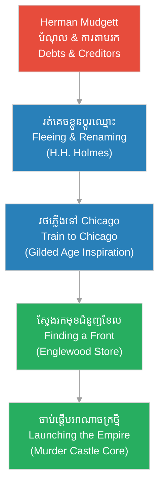

# Episode 4: ការផ្លាស់ប្តូរអត្តសញ្ញាណ (H.H. Holmes is Born)

**Author:** ichamrong  
**Date:** 2026-06-07  
**Tags:** #hh-holmes #screenplay #episode-4 #gilded-age #chicago #transformation #robber-barons  
**Category:** Biographies  
**Read Time:** ~12 min  

---

## 📌 មាតិកា (Table of Contents)
- [សេចក្តីផ្តើម៖ ការរលាយរលត់ និងការចាប់កំណើតថ្មី (Introduction: Dissolution and Rebirth)](#0)
- [១. ប្លង់ទី ១៖ ការគេចខ្លួនពីម្ចាស់បំណុល (Scene 1: Evading the Creditors - Moorhead, MN)](#1)
- [២. ប្លង់ទី ២៖ ការបំផុសគំនិតពីពួកមហាសេដ្ឋីផ្តាច់មុខ (Scene 2: Gilded Age Inspiration - The Train)](#2)
- [៣. ប្លង់ទី ៣៖ ការឈានជើងចូលទីក្រុងពណ៌ស (Scene 3: Entering the Windy City - Chicago)](#3)
- [៤. ប្លង់ទី ៤៖ ការស្វែងរកខែលការពារអាជីវកម្ម (Scene 4: Finding the Front - Englewood)](#4)
- [៥. យន្តការចិត្តសាស្ត្រនៃការវិវឌ្ឍ (Psychological Evolution Loop)](#5)
- [សេចក្តីសន្និដ្ឋាន (Conclusion)](#6)
- [🔗 ឯកសារទាក់ទង (Related Topics)](#7)

---

## សេចក្តីផ្តើម៖ ការរលាយរលត់ និងការចាប់កំណើតថ្មី (Introduction: Dissolution and Rebirth)

រឿងភាគទី ៤ នេះ បង្ហាញពីរបត់ជីវិតដ៏សំខាន់របស់ Herman Mudgett នៅពេលដែលកេរ្តិ៍ឈ្មោះចាស់របស់គេត្រូវបានបំផ្លាញដោយបំណុល និងការសង្ស័យពីសមត្ថកិច្ច។ ដើម្បីរស់រាន និងសម្រេចមហិច្ឆតាធំ គេត្រូវតែសម្លាប់អត្តសញ្ញាណចាស់របស់ខ្លួនចោល ហើយបង្កើតអត្តសញ្ញាណថ្មីមួយឡើង គឺ **Henry Howard Holmes (H.H. Holmes)**។ ដំណើររឿងបង្ហាញពីការធ្វើដំណើរតាមរថភ្លើងឆ្ពោះទៅកាន់ទីក្រុង Chicago និងការទទួលបានការបំផុសគំនិតពីយន្តការអាជីវកម្មផ្តាច់មុខរបស់ពួកមហាសេដ្ឋីសម័យ Gilded Age មុនពេលគេស្វែងរកឃើញឱសថស្ថានរបស់លោកស្រី Holton ដើម្បីធ្វើជាខែលការពារប្រតិបត្តិការរបស់ខ្លួន។

This fourth episode dramatizes the critical turning point in Herman Mudgett's life when his old identity is ruined by debts and growing institutional suspicion. To survive and achieve his grand ambitions, he must systematically destroy his old self and engineer a new persona: **Henry Howard Holmes (H.H. Holmes)**. The narrative details his train journey to Chicago, his fascination with Gilded Age corporate monopolization, and his arrival at Mrs. Holton's drugstore in Englewood to establish his first commercial front.

---

## ១. ប្លង់ទី ១៖ ការគេចខ្លួនពីម្ចាស់បំណុល (Scene 1: Evading the Creditors - Moorhead, MN)

**ទីតាំង៖** ការិយាល័យវេជ្ជសាស្ត្របណ្តោះអាសន្ន, ទីក្រុង Moorhead, រដ្ឋ Minnesota, ឆ្នាំ ១៨៨៥ (វេលាព្រលប់)  
**Location:** A Temporary Medical Office, Moorhead, Minnesota, 1885 (Dusk)

**សកម្មភាព៖** Herman Webster Mudgett (អាយុ ២៤ ឆ្នាំ មានទឹកមុខហត់នឿយ ប៉ុន្តែមានរបាំងមុខស្ងប់ស្ងាត់) កំពុងប្រមូលឯកសារ និងប្រាក់កាក់ដាក់ក្នុងវ៉ាលីដែក។ នៅខាងក្រៅទ្វារ មានសំឡេងគោះខ្លាំងៗ និងសំឡេងស្រែកខឹងសម្បាររបស់ម្ចាស់បំណុល និងអតិថិជនដែលរងការបោកប្រាស់។ Herman យកសំបុត្រកំណើត និងឯកសារឈ្មោះ «Herman Webster Mudgett» មកដុតបំផ្លាញចោលនៅក្នុងឡភ្លើងយ៉ាងត្រជាក់ស្រេប។  
**Action:** Herman Webster Mudgett (24 years old, exhausted but wearing a cold, composed mask) packs papers and cash into his metal trunk. Outside, heavy pounding shakes the wooden door, accompanied by the angry shouts of creditors and defrauded clients. Herman takes his birth certificate and papers carrying the name "Herman Webster Mudgett" and burns them in the stove.

*   **ម្ចាស់បំណុល (Creditor)៖** (ស្រែកគំហកពីខាងក្រៅ និងបុកទ្វារ) "បើកទ្វារភ្លាម លោកគ្រូពេទ្យ Mudgett! ឯងជំពាក់លុយថ្លៃថ្នាំ និងថ្លៃជួលផ្ទះពីរខែហើយ! កុំគិតថានឹងរត់គេចខ្លួនបានឱ្យសោះ!"  
    *   *(Shouting from outside, rattling the door)* *"Open the door, Dr. Mudgett! You owe money for the chemical supply and two months of rent! Don't think you can run away from this!"*
*   **ហឺមែន (Herman)៖** (និយាយតិចៗម្នាក់ឯង សម្លឹងមើលទៅក្រដាសដែលកំពុងឆេះខ្ទេច) "Herman Mudgett ជំពាក់លុយពួកគេ... Herman Mudgett គឺជាមនុស្សទន់ខ្សោយ និងងាយរងគ្រោះ។ ដូច្នេះ គ្មានហេតុផលណាដែលត្រូវរក្សាអត្តសញ្ញាណនេះទៀតឡើយ។ សេចក្តីស្លាប់របស់ Mudgett គឺជាការចាប់ផ្តើមនៃរូបខ្ញុំពិតប្រាកដ។"  
    *   *(Whispering to himself, watching the papers crumble into ash)* *"Herman Mudgett owes them... Herman Mudgett was weak and vulnerable. Therefore, there is no functional reason to maintain this name. The death of Mudgett is the birth of who I truly am."*

**ការពិពណ៌នា៖** Herman ផ្លាស់ប្តូរការស្លៀកពាក់ ពាក់មួក និងបិទពុកមាត់សិប្បនិម្មិត។ គេមើលកញ្ចក់ សម្លឹងមើលទៅភ្នែកពណ៌ខៀវត្រជាក់ស្រេបរបស់ខ្លួន។ គេសរសេរឈ្មោះថ្មីមួយលើក្រដាសកត់ត្រាស្អាត៖ «Dr. Henry Howard Holmes»។ គេយកស្មាស្ពាយវ៉ាលី រួចឡើងតាមបង្អួចក្រោយគេចខ្លួនទៅក្នុងភាពងងឹតនៃរាត្រី ដោយបន្សល់ទុកតែបន្ទប់ទទេស្អាត និងផេះសំបុត្រកំណើតរបស់ខ្លួន។ នេះជាការអនុវត្តជាក់ស្តែងនៃ **«ការបំបែកអារម្មណ៍ និងការលុបបំបាត់អតីតកាល» ([Emotional Dissociation](../keyword/emotional-dissociation.md))**។  
**Description:** Herman changes his attire, donning a formal bowler hat and grooming his mustache. He gazes into the mirror, looking directly into his cold, expressionless blue eyes. He writes a new name on a clean sheet of paper: "Dr. Henry Howard Holmes." Lifting his trunk, he climbs out of the back window into the dark alley, leaving behind an empty room and the ashes of his birth name. This is a practical application of his deep [emotional dissociation](../keyword/emotional-dissociation.md) to delete his past.

---

## ២. ប្លង់ទី ២៖ ការបំផុសគំនិតពីពួកមហាសេដ្ឋីផ្តាច់មុខ (Scene 2: Gilded Age Inspiration - The Train)

**ទីតាំង៖** ខាងក្នុងទូរថភ្លើងលំដាប់ទីមួយ ធ្វើដំណើរឆ្ពោះទៅទីក្រុង Chicago, ឆ្នាំ ១៨៨៦ (វេលាថ្ងៃត្រង់)  
**Location:** Inside a First-Class Train Carriage bound for Chicago, 1886 (Midday)

**សកម្មភាព៖** H.H. Holmes (ឥឡូវមានរូបរាងជាវេជ្ជបណ្ឌិតវ័យក្មេង សង្ហា និងគួរឱ្យទាក់ទាញ) កំពុងអានកាសែតដែលចុះផ្សាយពីរឿងរ៉ាវរបស់ពួកមហាសេដ្ឋីឧស្សាហកម្មដូចជា Rockefeller និង Carnegie។ គេកំពុងអង្គុយទល់មុខជាមួយពាណិជ្ជករក្រុង Chicago ម្នាក់ឈ្មោះ លោក អាល់ដ្រីច (Mr. Aldrich) ដែលស្លៀកពាក់យ៉ាងប្រណីត និងជក់បារីសេហ្គា។  
**Action:** H.H. Holmes (now presenting as a handsome, charming young doctor) reads a newspaper detailing the empires of robber barons like Rockefeller and Carnegie. He sits opposite a wealthy Chicago merchant, Mr. Aldrich, who is dressed in fine wool, smoking a cigar.

*   **លោក អាល់ដ្រីច (Mr. Aldrich)៖** "ទីក្រុង Chicago មិនមែនសម្រាប់មនុស្សទន់ជ្រាយឡើយ លោកគ្រូពេទ្យវ័យក្មេង។ វាជាទីក្រុងរបស់ដែកថែប ធ្យូងថ្ម និងកម្លាំងពលកម្ម។ បើឯងមានមហិច្ឆតា ទីនោះជាកន្លែងដែលឯងអាចកសាងអាណាចក្រផ្ទាល់ខ្លួនបាន ប្រសិនបើឯងដឹងពីរបៀបគ្រប់គ្រងយន្តការអាជីវកម្ម។"  
    *   *"Chicago is no place for the sentimental, young doctor. It is a city of steel, coal, and raw labor. If you possess ambition, it is the only place where you can build an empire, provided you master the business machinery."*
*   **ហូម (Holmes)៖** (ញញឹមដោយភាពទាក់ទាញ) "ខ្ញុំចាប់អារម្មណ៍ខ្លាំងលើការរៀបចំប្រព័ន្ធ។ ពួកមហាសេដ្ឋីធំៗ ពួកគេមិនត្រឹមតែលក់ផលិតផលឡើយ ប៉ុន្តែពួកគេគ្រប់គ្រងខ្សែសង្វាក់ផ្គត់ផ្គង់ទាំងមូល។ នោះជាស្ថាបត្យកម្មដ៏ល្អឥតខ្ចោះ។"  
    *   *(Smiling with charm)* *"I am fascinated by systems. The great monopolists do not merely sell products; they control the entire supply chain. That is the ultimate architecture."*
*   **លោក អាល់ដ្រីច (Mr. Aldrich)៖** "ពិតណាស់! អាថ៌កំបាំងគឺ៖ លុបបំបាត់ការប្រកួតប្រជែង បំបែកចំណែកការងារ កាត់បន្ថយការចំណាយលើកម្លាំងពលកម្ម និងប្រើប្រាស់ច្បាប់ដើម្បីការពារខ្លួន។ ក្នុងអាជីវកម្មសម័យនេះ មនោសញ្ចេតនា គឺជាមាត់ច្រកនៃភាពក្ស័យធន។"  
    *   *"Exactly! The secret is to eliminate competition, compartmentalize labor, minimize waste, and leverage the law to insulate yourself. In modern enterprise, sentimentality is the gateway to bankruptcy."*

**ការពិពណ៌នា៖** Holmes ងក់ក្បាលយល់ស្រប។ គេយកសៀវភៅកត់ត្រាមកគូរប្លង់ដ្យាក្រាម។ គេមិនគូរប្លង់អាជីវកម្មលក់ថ្នាំឡើយ ប៉ុន្តែគេកំពុងអនុវត្តគោលការណ៍ផ្តាច់មុខសម័យ Gilded Age ទៅលើឧក្រិដ្ឋកម្ម៖ ការលុបបំបាត់ភស្តុតាង ការបំបែកការងារកម្មករសំណង់ និងការចាត់ទុកជនរងគ្រោះជាវត្ថុធាតុដើម។ នេះជាការបង្កើតផ្នត់គំនិត **«លំហូរនៃធនធាន និងការរៀបចំយន្តការ» ([Flow of Resources and Mechanics](../keyword/flow-of-resources-and-mechanics.md))** ក្នុងកម្រិតឧស្សាហកម្ម។  
**Description:** Holmes nods in agreement. He opens his notebook to draw diagrams. However, he is not sketching a standard retail pharmacy layout; he is applying Gilded Age monopolization to crime: eliminating traces, compartmentalizing labor, and treating human lives as raw material. His [flow of resources and mechanics](../keyword/flow-of-resources-and-mechanics.md) framework is scaling up to industrial levels.

---

## ៣. ប្លង់ទី ៣៖ ការឈានជើងចូលទីក្រុងពណ៌ស (Scene 3: Entering the Windy City - Chicago)

**ទីតាំង៖** ស្ថានីយរថភ្លើងក្រុង Chicago (វេលារសៀល, ឆ្នាំ ១៨៨៦)  
**Location:** The Chicago Train Terminal (Afternoon, 1886)

**សកម្មភាព៖** ផ្សែងខ្មៅហុយចេញពីរថភ្លើង លាយឡំជាមួយសំឡេងមនុស្សរាប់ពាន់នាក់ សម្រែកកម្មករ និងចលនាឡានទឹកកក។ Chicago គឺជាទីក្រុងដែលរីកលូតលាស់យ៉ាងលឿន និងចលាចលបំផុត។ H.H. Holmes ដើរចុះពីរថភ្លើង កាន់វ៉ាលីដែក។ គេសម្លឹងមើលទៅលើអគារខ្ពស់ៗ និងហ្វូងមនុស្សដោយភាពស្ងប់ស្ងាត់បំផុត។ គេមិនមានអារម្មណ៍តក់ស្លុត ឬភ័យខ្លាចឡើយ មានតែការពេញចិត្តនឹងភាពស្ងៀមស្ងាត់ក្នុងចិត្តរបស់គេ កណ្តាលចលាចលទីក្រុង។  
**Action:** Black soot pours from the train, blending with the roar of thousands of travelers, shouting teamsters, and industrial activity. Chicago is a booming, chaotic metropolis. H.H. Holmes steps off the passenger car, carrying his steel trunk. He gazes at the rising structures and rushing crowds with utter calm, untouched by panic.

*   **ហូម (Holmes)៖** (សម្លឹងមើលហ្វូងមនុស្ស និយាយតិចៗ) "ទីក្រុងដ៏ធំ គឺជាកន្លែងលាក់ខ្លួនដ៏ល្អបំផុត។ មនុស្សរាប់ម៉ឺននាក់ដើរកាត់គ្នាដោយមិនស្គាល់ឈ្មោះ។ គ្មាននរណាម្នាក់ដឹងថាអ្នកជិតខាងរបស់ខ្លួនជានរឡើយ។ នៅក្នុងចលាចលនេះ ខ្ញុំនឹងកសាងវិមានផ្ទាល់ខ្លួនរបស់ខ្ញុំ។"  
    *   *(Looking at the faceless crowd, whispering)* *"A great city is the ultimate shield. Tens of thousands pass each other without names. No one knows who their neighbor is. In this chaos, I will construct my private sanctuary."*

**ការពិពណ៌នា៖** Holmes កែសម្រួលមួក bowler របស់គេ រួចដើរទៅមុខដោយរលូនកណ្តាលហ្វូងមនុស្ស។ គេដឹងថា ទីក្រុងដែលគ្មានសណ្តាប់ធ្នាប់ច្បាស់លាស់ និងការរីកលូតលាស់លឿនហួសហេតុនេះ គឺជាបរិយាកាសដ៏ល្អឥតខ្ចោះសម្រាប់ប្រតិបត្តិការរបស់គេ។ គ្មាននរណាម្នាក់នឹងតាមដានរាល់ការបាត់ខ្លួនរបស់ជនបរទេស ឬយុវតីដែលមកស្វែងរកការងារធ្វើនៅក្នុងទីក្រុងពណ៌សនេះឡើយ។  
**Description:** Holmes adjusts his bowler hat and glides smoothly through the rushing crowd. He recognizes that this rapidly growing, poorly regulated metropolis provides the perfect ecosystem for his plans. No one will track the disappearance of transient workers or young women arriving to seek fortune in the Gilded City.

---

## ៤. ប្លង់ទី ៤៖ ការស្វែងរកខែលការពារអាជីវកម្ម (Scene 4: Finding the Front - Englewood)

**ទីតាំង៖** ឱសថស្ថានរបស់លោកស្រី Holton, ផ្លូវលេខ ៦៣ និង Wallace, តំបន់ Englewood, Chicago, ឆ្នាំ ១៨៨៦ (វេលាព្រលប់)  
**Location:** Mrs. Holton's Drugstore, 63rd and Wallace St, Englewood, Chicago, 1886 (Dusk)

**សកម្មភាព៖** H.H. Holmes ដើរតាមដងផ្លូវកខ្វក់នៃជាយក្រុង Englewood។ គេឈប់នៅមុខឱសថស្ថានមួយដែលចាស់ និងមានសភាពស្ងប់ស្ងាត់។ តាមរយៈបង្អួចកញ្ចក់ គេមើលឃើញលោកស្រី Elizabeth Holton (ស្ត្រីចំណាស់ ទឹកមុខហត់នឿយ និងមានទុក្ខសោក) កំពុងរៀបចំថ្នាំតែម្នាក់ឯង។ Holmes បើកទ្វារដើរចូលមកដោយប្រើស្នាមញញឹមដ៏ទាក់ទាញ មន្តស្នេហ៍ និងសំឡេងទន់ភ្លន់គួរឱ្យទុកចិត្តបំផុត។  
**Action:** H.H. Holmes walks down the muddy streets of Englewood. He stops before a quiet, traditional drugstore. Through the glass, he observes Mrs. Elizabeth Holton—an elderly, exhausted woman carrying visible grief—stocking shelves alone. Holmes opens the door, presenting his most polished, charming smile and a soothing, professional voice.

*   **លោកស្រី ហូលតុន (Mrs. Holton)៖** (ងើបមុខឡើងទាំងហត់នឿយ) "សូមស្វាគមន៍... តើលោកចង់រកទិញថ្នាំអ្វីដែរ?"  
    *   *(Looking up wearily)* *"Welcome... how may I help you this evening?"*
*   **ហូម (Holmes)៖** "ជំរាបសួរលោកស្រី។ ខ្ញុំគឺវេជ្ជបណ្ឌិត Henry Howard Holmes ថ្មីៗនេះទើបតែបានបញ្ចប់ការសិក្សាពីសាកលវិទ្យាល័យ Michigan។ ខ្ញុំបានដើរកាត់ទីនេះ និងឃើញថាលោកស្រីកំពុងគ្រប់គ្រងហាងដ៏ធំនេះតែម្នាក់ឯង។ តើស្វាមីរបស់លោកស្រីទៅណាដែរ?"  
    *   *"Good evening, madam. I am Dr. Henry Howard Holmes, recently graduated from the University of Michigan. I was passing by and noticed you managing this large shop entirely alone. Is your husband not available to assist you?"*
*   **លោកស្រី ហូលតុន (Mrs. Holton)៖** (ភ្នែកស្រអាប់ចុះ) "ស្វាមីខ្ញុំ... គាត់បានទទួលមរណភាពកាលពីប៉ុន្មានខែមុននេះហើយ។ ខ្ញុំពិតជាហត់នឿយខ្លាំងណាស់ក្នុងការមើលថែហាង និងគ្រប់គ្រងបញ្ជីឥណទាននេះ..."  
    *   *(Her eyes dimming)* *"My husband... he passed away a few months ago. I am deeply exhausted trying to maintain the inventory and manage these credit ledgers..."*
*   **ហូម (Holmes)៖** (ចាប់ដៃនាងដោយក្តីបារម្ភបំភ័ន្ត) "ខ្ញុំពិតជាមានការសោកស្តាយខ្លាំងណាស់ចំពោះការបាត់បង់របស់លោកស្រី។ ចំណេះដឹងផ្នែកវេជ្ជសាស្ត្រ និងការគ្រប់គ្រងឱសថស្ថានរបស់ខ្ញុំ អាចជួយសម្រាលការលំបាករបស់លោកស្រីបាន។ ប្រសិនបើលោកស្រីអនុញ្ញាត ខ្ញុំចង់ចូលធ្វើការជាជំនួយការនៅទីនេះ ដើម្បីមើលថែអាជីវកម្ម និងជួយលោកស្រីឱ្យមានពេលសម្រាក។"  
    *   *(Taking her hand with simulated empathy)* *"I am deeply sorry for your loss, madam. My medical background and training in pharmaceutical administration can ease your burden. If you permit, I would be honored to work as your assistant here, managing the daily operations to grant you some well-deserved rest."*

**ការពិពណ៌នា៖** លោកស្រី Holton ញញឹមដោយភាពធូរស្រាល និងពេញចិត្តនឹងសម្តីគួរឱ្យទុកចិត្តរបស់គ្រូពេទ្យវ័យក្មេងម្នាក់នេះ។ Holmes សម្លឹងមើលជុំវិញហាង មិនមែនមើលឱសថឡើយ ប៉ុន្តែគេមើលឃើញឱកាសក្នុងការគ្រប់គ្រងដីធ្លី ឥណទាន និងការប្រើប្រាស់ហាងនេះជាខែលបិទបាំងសកម្មភាពពិតរបស់ខ្លួននាពេលអនាគត។ របាំងមុខរបស់គេត្រូវបានរៀបចំឡើងយ៉ាងល្អឥតខ្ចោះ។  
**Description:** Mrs. Holton smiles with immense relief, charmed by the young doctor's polite and capable demeanor. Holmes scans the interior, looking past the apothecary jars to see the potential for controlling real estate, credit lines, and establishing the perfect front for his future operations. His mask is flawless.

---

## ៥. យន្តការចិត្តសាស្ត្រនៃការវិវឌ្ឍ (Psychological Evolution Loop)

ដ្យាក្រាមខាងក្រោមបង្ហាញពីខ្សែសង្វាក់នៃការបំប្លែងខ្លួនពី Herman Mudgett ទៅជា H.H. Holmes៖

The following diagram maps the structural transition from Herman Mudgett to the industrial corporate criminal H.H. Holmes:

> [!IMPORTANT]
> **🧠 យន្តការចិត្តសាស្ត្រ / Psychological Mechanism - [ការបំបែកអារម្មណ៍ (Dissociation)](../keyword/emotional-dissociation.md):**
> * «នៅក្នុងប្លង់ទី ១ Holmes ដុតបំផ្លាញឯកសារឈ្មោះ Herman Mudgett ចោលដោយគ្មានការរារែកចិត្ត។ វាជាការលុបបំបាត់អតីតកាល និងអត្តសញ្ញាណចាស់ទាំងស្រុង ដើម្បីកុំឱ្យមានផលប៉ះពាល់ដល់យន្តការការពារខ្លួនរបស់គេ។» (*"In Scene 1, Holmes burns his birth records without hesitation. It represents the complete erasure of his past and old identity, protecting his functional survival mechanisms."*).
> 
> **🤫 យន្តការចិត្តសាស្ត្រ / Psychological Mechanism - [លំហូរនៃធនធាន និងការរៀបចំយន្តការ (Flow of Resources and Mechanics)](../keyword/flow-of-resources-and-mechanics.md):**
> * «នៅក្នុងប្លង់ទី ៤ Holmes ប្រើប្រាស់ភាពទាក់ទាញខាងក្រៅ និងការយំសោក/ការអាណិតអាសូរក្លែងក្លាយ ដើម្បីគ្រប់គ្រងចិត្តសាស្ត្ររបស់លោកស្រី Holton។ គេចាត់ទុកនាងត្រឹមតែជាឧបករណ៍សរីរាង្គមួយដើម្បីទទួលបានឱសថស្ថានធ្វើជាខែលការពារប៉ុណ្ណោះ។» (*"In Scene 4, Holmes deploys superficial charm and simulated empathy to manipulate Mrs. Holton. He treats her merely as a functional organic instrument to acquire the drugstore front."*).

---

## សេចក្តីសន្និដ្ឋាន (Conclusion)

> **«Herman Mudgett បានស្លាប់បាត់បង់ជីវិតទៅហើយ... នៅក្នុងទីក្រុងដ៏អស្ចារ្យនេះ មានតែ H.H. Holmes ម្នាក់គត់ដែលនឹងសាងសង់អាណាចក្រថ្មីមួយ» — H.H. Holmes**
> 
> **“Herman Mudgett is dead... in this great city, only H.H. Holmes remains to construct a new empire.” — H.H. Holmes**

រឿងភាគទី ៤ បិទបញ្ចប់ដោយ H.H. Holmes ឈរនៅក្នុងឱសថស្ថានរបស់លោកស្រី Holton សម្លឹងមើលទៅក្រៅបង្អួចឆ្ពោះទៅកាន់ដីឡូតិ៍ទំនេរទល់មុខហាង។ ភ្នែកពណ៌ខៀវត្រជាក់ស្រេបរបស់គេចាប់ផ្តើមគូរប្លង់មេនៃ «វិមានស្រមោល» នៅក្នុងក្បាលរបស់គេជាលើកដំបូង។

Episode 4 concludes with H.H. Holmes standing inside Mrs. Holton's pharmacy, gazing out the window at the vacant lot across the street. His cold blue eyes begin drafting the silent blueprints of his future Castle for the first time.

---

## 🔗 ឯកសារទាក់ទង (Related Topics)
*   **[Episode 3: មន្ទីរពិសោធន៍ខ្មៅងងឹត (The Cadaver Market)](ep-03-the-cadaver-market.md)** — ស្គ្រីបភាគទី ៣ ដែលជាការសិក្សាពេទ្យ និងការបោកធានារ៉ាប់រងដំបូងនៅ Michigan។
*   **[លំហូរនៃធនធាន និងការរៀបចំយន្តការ (Flow of Resources and Mechanics)](../keyword/flow-of-resources-and-mechanics.md)** — ទស្សនៈដែលចាត់ទុកជីវិត និងមនុស្សជាឧបករណ៍រូបវន្តសម្រាប់អាជីវកម្ម។
*   **[ការបំបែកអារម្មណ៍ (Dissociation)](../keyword/emotional-dissociation.md)** — យន្តការការពារចិត្តដែលលុបបំបាត់អតីតកាល និងមនោសញ្ចេតនា។
*   **[ជីវប្រវត្តិ H.H. Holmes](../01-h-h-holmes-biography.md)** — ជីវប្រវត្តិនៃការវិវឌ្ឍជីវិត និងវិមានឃាតកម្មរបស់ Holmes។
*   **[គម្រោងរឿងភាគដ្រាម៉ា ៦៣ ភាគ](../08-holmes-drama-episode-guide.md)** — ផែនការ និងការសង្ខេបរឿងភាគទូរទស្សន៍ទាំង ៦៣ ភាគ។
