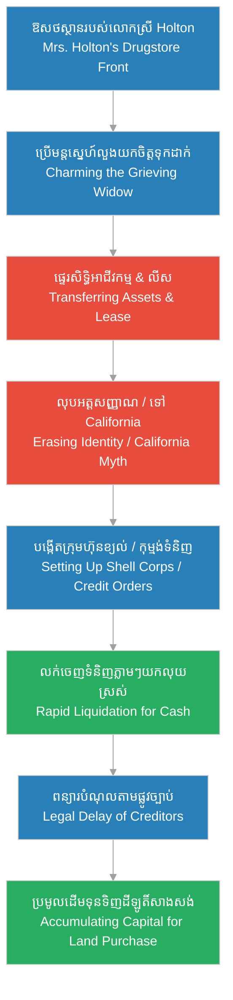

# Episode 5: ឱសថស្ថាននៅផ្លូវលេខ ៦៣ (The Englewood Front)

**Author:** ichamrong  
**Date:** 2026-06-07  
**Tags:** #hh-holmes #screenplay #episode-5 #gilded-age #chicago #business-fraud #credit-manipulation #manipulation  
**Category:** Biographies  
**Read Time:** ~12 min  

---

## 📌 មាតិកា (Table of Contents)
- [សេចក្តីផ្តើម៖ គ្រឹះនៃអាណាចក្រពាណិជ្ជកម្ម (Introduction: The Commercial Foundation)](#0)
- [១. ប្លង់ទី ១៖ ការរៀបចំសណ្តាប់ធ្នាប់ (Scene 1: Organizing the Front - Englewood, Chicago)](#1)
- [២. ប្លង់ទី ២៖ ការបាត់ខ្លួនដោយស្ងៀមស្ងាត់ (Scene 2: The Silent Disappearance)](#2)
- [៣. ប្លង់ទី ៣៖ ការលេងល្បែងឥណទាន (Scene 3: Credit Manipulation)](#3)
- [៤. ប្លង់ទី ៤៖ ចក្ខុវិស័យនៃវិមានស្រមោល (Scene 4: The Vision of the Castle)](#4)
- [៥. យន្តការបោកប្រាស់ និងរង្វង់ឥណទាន (Credit Fraud & Consolidation Loop)](#5)
- [សេចក្តីសន្និដ្ឋាន (Conclusion)](#6)
- [🔗 ឯកសារទាក់ទង (Related Topics)](#7)

---

## សេចក្តីផ្តើម៖ គ្រឹះនៃអាណាចក្រពាណិជ្ជកម្ម (Introduction: The Commercial Foundation)

រឿងភាគទី ៥ នេះ បង្ហាញពីការចាប់ផ្តើមប្រតិបត្តិការរបស់ H.H. Holmes នៅក្នុងតំបន់ Englewood ទីក្រុង Chicago។ Holmes បានប្រើប្រាស់ឱសថស្ថានរបស់លោកស្រី Holton ធ្វើជាខែលការពារអាជីវកម្ម និងជាឧបករណ៍ហិរញ្ញវត្ថុដំបូងបង្អស់។ តាមរយៈការគ្រប់គ្រងស្តុកទំនិញ ទំនាក់ទំនងជាមួយអតិថិជន និងការបង្កើតល្បែងបោកប្រាស់ឥណទានយ៉ាងស្មុគស្មាញ គេបានប្រែក្លាយឱសថស្ថាននេះទៅជាប្រភពចំណូលដ៏ធំ មុនពេលធ្វើវិស្វកម្មដីធ្លីដើម្បីទិញដីឡូតិ៍សាងសង់វិមានរបស់ខ្លួន។

This fifth episode dramatizes the launch of H.H. Holmes' operations in Englewood, Chicago. Holmes utilizes Mrs. Holton's drugstore as both a corporate front and an initial financial instrument. Through systematic inventory consolidation, customer manipulation, and complex credit schemes, he transforms the quiet pharmacy into a highly profitable engine, eventually securing the real estate required to build his Castle.

---

## ១. ប្លង់ទី ១៖ ការរៀបចំសណ្តាប់ធ្នាប់ (Scene 1: Organizing the Front - Englewood, Chicago)

**ទីតាំង៖** ឱសថស្ថានរបស់លោកស្រី Holton, តំបន់ Englewood, Chicago, ឆ្នាំ ១៨៨៦ (វេលាថ្ងៃត្រង់)  
**Location:** Mrs. Holton's Drugstore, Englewood, Chicago, 1886 (Midday)

**សកម្មភាព៖** H.H. Holmes (អាយុ ២៥ ឆ្នាំ ស្លៀកពាក់អាវអៀមឱសថការីស្អាតបាត) កំពុងឈរលើកាំជណ្តើរតូចមួយ រៀបចំដបថ្នាំ និងក្រឡគីមីសាស្ត្រនៅលើធ្នើឈើដោយភាពហ្មត់ចត់បំផុត។ លោកស្រី Elizabeth Holton ឈរសម្លឹងមើលពីក្រោយបញ្ជរដោយទឹកមុខកក់ក្តៅ និងមានក្តីសង្ឃឹម។ អតិថិជនក្នុងស្រុកម្នាក់ឈ្មោះ លោកស្រី ក្លាក (Mrs. Clark) ដើរចូលមកហាង។ Holmes ចុះពីជណ្តើរភ្លាម ៗ និងទទួលស្វាគមន៍នាងដោយស្នាមញញឹមគួរឱ្យទាក់ទាញ។  
**Action:** H.H. Holmes (25 years old, wearing a clean pharmacist's apron) stands on a small step ladder, organizing glass medicine bottles and apothecary jars on dark wooden shelves with absolute, surgical precision. Mrs. Elizabeth Holton watches him from behind the counter with a warm, hopeful expression. A local customer, Mrs. Clark, enters the shop. Holmes steps down immediately, greeting her with his charming and polished mask.

*   **ហូម (Holmes)៖** "ជំរាបសួរលោកស្រី Clark។ ថ្ងៃនេះអាកាសធាតុប្រែប្រួលត្រជាក់ខ្លាំង តើជំងឺក្អករបស់កូនប្រុសលោកស្រីបានធូរស្រាលខ្លះហើយឬនៅ?"  
    *   *"Good afternoon, Mrs. Clark. The weather has grown quite cold today. Has your son's cough improved since your last visit?"*
*   **លោកស្រី ក្លាក (Mrs. Clark)៖** (ញញឹមដោយភាពរីករាយ និងភ្ញាក់ផ្អើល) "ឱ! វេជ្ជបណ្ឌិត Holmes លោកពិតជាមានការចងចាំល្អណាស់។ ថ្នាំសុីរ៉ូដែលលោកផ្សំឱ្យកាលពីសប្តាហ៍មុន ពិតជាមានប្រសិទ្ធភាពខ្លាំងណាស់។ ហាងនេះតាំងពីមានលោកមកជួយមើលថែ ឃើញថាមានសណ្តាប់ធ្នាប់ និងស្អាតបាតជាងមុនឆ្ងាយណាស់។"  
    *   *(Smiling with delight)* *"Oh, Dr. Holmes, you have an extraordinary memory. The syrup you prepared last week worked wonders. This shop has become so organized and clean since you arrived."*
*   **ហូម (Holmes)៖** (ហុចដបថ្នាំដែលរៀបចំរួចឱ្យនាងដោយក្តីបារម្ភបំភ័ន្ត) "វាជាកាតព្វកិច្ចរបស់ខ្ញុំក្នុងការមើលថែសុខភាពអ្នក Englewood ទាំងអស់គ្នា។ លោកស្រី Holton បានលះបង់កម្លាំងកាយចិត្តច្រើនណាស់សម្រាប់ហាងនេះ ខ្ញុំគ្រាន់តែចង់ជួយសម្រាលការលំបាករបស់គាត់ប៉ុណ្ណោះ។"  
    *   *(Handing her a prepared bottle with simulated care)* *"It is my duty to look after the health of everyone in Englewood. Mrs. Holton has dedicated so much to this shop; I only wish to ease her burden."*
*   **លោកស្រី ហូលតុន (Mrs. Holton)៖** (និយាយទៅកាន់លោកស្រី Clark ទាំងកោតសរសើរ) "Herman... សុំទោស គឺលោកគ្រូពេទ្យ Holmes គាត់ជាមនុស្សពូកែ និងឧស្សាហ៍ព្យាយាមណាស់។ គាត់បានរៀបចំប្រព័ន្ធបញ្ជីស្តុកទំនិញឡើងវិញទាំងអស់ ដែលធ្វើឱ្យខ្ញុំធូរស្រាលចិត្តជាខ្លាំង។"  
    *   *(Speaking to Mrs. Clark with admiration)* *"Herman... excuse me, Dr. Holmes is a brilliant and diligent young man. He has restructured our entire inventory system, which has given me immense peace of mind."*

**ការពិពណ៌នា៖** នៅពេលដែលលោកស្រី Clark ដើរចេញទៅ Holmes ងាកមកមើលបញ្ជីស្តុកទំនិញនៅលើតុវិញភ្លាម។ ស្នាមញញឹមដែលមានមន្តស្នេហ៍នៅលើផ្ទៃមុខរបស់គេបានបាត់បង់ទៅជាភាពស្ងប់ស្ងាត់ និងគ្មានអារម្មណ៍។ ម្រាមដៃរបស់គេបើកទំព័រសៀវភៅតាមដានលំហូរឥណទាន និងចំណូលហាង។ គេមិនមើលឃើញអតិថិជនជាមនុស្សដែលត្រូវមើលថែឡើយ ប៉ុន្តែជា «លំហូរធនធាន» ថេរដែលនឹងបម្រើដល់ជំហានបន្ទាប់របស់គេ។  
**Description:** The moment Mrs. Clark exits, Holmes turns back to the inventory ledger. The warm, charming smile instantly vanishes, replaced by a cold, flat expression. His fingers flip through the credit accounts and revenue streams. He does not view customers as patients to heal, but as steady [flows of resources](../keyword/flow-of-resources-and-mechanics.md) to serve his next steps.

---

## ២. ប្លង់ទី ២៖ ការបាត់ខ្លួនដោយស្ងៀមស្ងាត់ (Scene 2: The Silent Disappearance)

**ទីតាំង៖** ការិយាល័យខាងក្រោយឱសថស្ថាន, ឆ្នាំ ១៨៨៦ (វេលាយប់ជ្រៅ)  
**Location:** The Back Office of the Drugstore, late 1886 (Late Night)

**សកម្មភាព៖** ចង្កៀងប្រេងកាតមួយបំភ្លឺបន្ទប់ទទួលភ្ញៀវតូចរបស់ការិយាល័យ។ លោកស្រី Holton អង្គុយនៅលើកៅអីផ្តៅទាំងហត់នឿយខ្លាំង។ លើតុមានកិច្ចសន្យាផ្ទេរសិទ្ធិគ្រប់គ្រង និងការលក់អាជីវកម្មឱសថស្ថានទៅឱ្យ H.H. Holmes។ Holmes ឈរក្បែរនាង ដោយដៃម្ខាងកាន់ប៊ិច និងហុចក្រដាសឱ្យនាងចុះហត្ថលេខាដោយសំឡេងទន់ភ្លន់ល្បួងចិត្ត។  
**Action:** A single kerosene lamp illuminates the cozy back office. Mrs. Holton sits wearily in a wicker rocking chair. On the desk lies a contract transferring the drugstore's lease, assets, and operational control to H.H. Holmes. Holmes stands beside her, holding a fountain pen and presenting the document with a soothing, persuasive tone.

*   **ហូម (Holmes)៖** "លោកស្រី Holton ដូចដែលយើងបានពិភាក្សាគ្នា កិច្ចសន្យានេះនឹងធានាថា លោកស្រីទទួលបានប្រាក់ចំណូលប្រចាំខែថេរ ដោយមិនបាច់ហត់នឿយមើលថែហាងទៀតឡើយ។ លោកស្រីអាចទៅសម្រាកលំហែកាយនៅរដ្ឋ California ជាមួយសាច់ញាតិដោយគ្មានការបារម្ភ។"  
    *   *"Mrs. Holton, as we discussed, this agreement guarantees you a fixed monthly income without the physical strain of running the shop. You can travel to California to rest with your relatives, free of any business worries."*
*   **លោកស្រី ហូលតុន (Mrs. Holton)៖** (សម្លឹងមើលឯកសារទាំងស្ទាក់ស្ទើរ និងចុះហត្ថលេខា) "ខ្ញុំទុកចិត្តលោក វេជ្ជបណ្ឌិត Holmes។ លោកបានមើលថែហាងនេះដូចជាស្វាមីខ្ញុំនៅរស់។ ខ្ញុំពិតជាចង់សម្រាកពីភាពទុក្ខសោកទាំងនេះណាស់..."  
    *   *(Staring at the paper hesitantly before signing)* *"I trust you, Dr. Holmes. You have managed this shop just as my late husband would have. I truly wish to leave this grief behind..."*
*   **ហូម (Holmes)៖** (ទទួលយកក្រដាសចុះហត្ថលេខា រួចញញឹមយ៉ាងស្ងប់ស្ងាត់) "លោកស្រីបានសម្រេចចិត្តត្រឹមត្រូវហើយ។ ចូរទុកអ្វី ៗ គ្រប់យ៉ាងឱ្យខ្ញុំចាត់ចែងចុះ។ ឡានដឹកឥវ៉ាន់របស់លោកស្រីនឹងមកដល់នៅវេលាព្រលឹមស្រាង ៗ ស្អែកនេះ។"  
    *   *(Taking the signed document, smiling coldly)* *"You have made the correct decision, madam. Leave all operational details to me. Your carriage will arrive at dawn tomorrow."*

**ការពិពណ៌នា៖** Holmes សម្លឹងមើលទៅហត្ថលេខា «Elizabeth Holton» នៅលើក្រដាសផ្ទេរសិទ្ធិដោយភ្នែកបញ្ចេញពន្លឺគួរឱ្យខ្លាច។ ក្រោយយប់នោះ លោកស្រី Holton មិនដែលត្រូវបានគេឃើញនៅក្នុងតំបន់ Englewood ទៀតឡើយ។ នៅពេលអ្នកជិតខាងសួរនាំអំពីនាង Holmes ឆ្លើយតបយ៉ាងត្រជាក់ និងទន់ភ្លន់ថា នាងបានធ្វើដំណើរទៅរស់នៅជាអចិន្ត្រៃយ៍នៅ California ព្រោះមិនចង់ឃើញកន្លែងចាស់ដែលបន្សល់ទុករបួសផ្លូវចិត្ត។ កៅអីផ្តៅរបស់នាងត្រូវបានគេទុកចោលនៅក្នុងភាពងងឹតនៃបន្ទប់ក្រោមដី។ នេះបង្ហាញពីការអនុវត្ត **«ការលុបបំបាត់អត្តសញ្ញាណ និងការបោះបង់ចោលឧបករណ៍» ([Discarding Human Tools](../keyword/emotional-dissociation.md))**។  
**Description:** Holmes stares at the signature "Elizabeth Holton" with a chillingly triumphant gaze. Following that night, Mrs. Holton is never seen in Englewood again. Whenever neighbors inquire about her, Holmes calmly explains that she has relocated permanently to California to escape the painful memories of her late husband. Her rocking chair is left gathering dust in the dark basement. This highlights his systematic method of [discarding human tools](../keyword/emotional-dissociation.md) once they are depleted of utility.

---

## ៣. ប្លង់ទី ៣៖ ការលេងល្បែងឥណទាន (Scene 3: Credit Manipulation)

**ទីតាំង៖** ការិយាល័យផ្ទាល់ខ្លួនរបស់ Holmes នៅក្នុងឱសថស្ថាន, ឆ្នាំ ១៨៨៧ (វេលារសៀល)  
**Location:** Holmes' Private Office inside the Drugstore, 1887 (Afternoon)

**សកម្មភាព៖** Holmes អង្គុយនៅតុសរសេរកូដរបស់ខ្លួន ដែលពោរពេញដោយឯកសារបញ្ជាទិញទំនិញ និងលិខិតទាមទារបំណុលហួសកាលកំណត់ (Overdue Invoices)។ តំណាងក្រុមហ៊ុនផ្គត់ផ្គង់គីមីសាស្ត្រម្នាក់ឈ្មោះ លោក ហ្វ្រេដវែល (Mr. Fredwell) ឈរកាន់ឯកសារបំណុល និងបង្ហាញទឹកមុខតានតឹង។ Holmes ហុចកែវស្រាឱ្យគេដោយភាពព្រងើយកន្តើយ និងដកដង្ហើមវែងយ៉ាងធូរស្រាល។  
**Action:** Holmes sits at his desk, surrounded by catalogs, supply orders, and red-stamped overdue invoices. A representative from a major chemical supply house, Mr. Fredwell, stands holding unpaid billing records with an anxious expression. Holmes, perfectly relaxed, pours him a glass of whiskey, exhibiting a calm and unworried posture.

*   **លោក ហ្វ្រេដវែល (Mr. Fredwell)៖** "លោកគ្រូពេទ្យ Holmes ក្រុមហ៊ុនរបស់យើងមិនអាចបញ្ចេញទំនិញបន្ថែមទៀតបានទេ! វិក្កយបត្រថ្លៃថ្នាំ formaldehyde និងអាស៊ីតកាលពីបីខែមុន តម្លៃបួនរយដុល្លារ មិនទាន់ត្រូវបានទូទាត់ឡើយ។ យើងត្រូវចាត់វិធានការតាមផ្លូវច្បាប់ ប្រសិនបើគ្មានការបង់ប្រាក់នៅថ្ងៃនេះ។"  
    *   *"Dr. Holmes, our firm cannot release further chemical shipments! The invoice for formaldehyde and acid from three months ago, totaling four hundred dollars, remains unpaid. We will proceed with legal action if payment is not settled today."*
*   **ហូម (Holmes)៖** (និយាយដោយសំឡេងទន់ភ្លន់ និងយកលុយដប់ដុល្លារហុចឱ្យគេ) "ខ្ញុំយល់ពីការងាររបស់លោក លោក Fredwell។ ហាងរបស់យើងកំពុងពង្រីកសាខាថ្មី ដែលធ្វើឱ្យលំហូរលុយស្រស់របស់ខ្ញុំត្រូវប្រើប្រាស់ក្នុងគម្រោងសំណង់។ នេះជាប្រាក់បម្រុងដំបូងសម្រាប់លោកផ្ទាល់។ សូមលោកជួយពន្យារពេលបញ្ជីនេះពីរសប្តាហ៍ទៀតចុះ ខ្ញុំនឹងទូទាត់ប្រាក់ទាំងអស់តាមរយៈធនាគារលំដាប់ទីមួយនៅ Chicago។"  
    *   *(Speaking softly, slipping a ten-dollar bill to Fredwell)* *"I understand your position, Mr. Fredwell. Our business is currently expanding to a new facility, which has temporarily tied up my cash flow in construction assets. Accept this small gratuity for your trouble. Delay the collection report for just two weeks, and I will settle the balance through our premier Chicago bank."*
*   **លោក ហ្វ្រេដវែល (Mr. Fredwell)៖** (ទទួលយកលុយបង្កប់ រួចទឹកមុខប្រែប្រួលជាធូរស្រាល) "អូ... ខ្ញុំយល់ហើយ លោកគ្រូពេទ្យ Holmes។ មហិច្ឆតារបស់លោកពិតជាធំធេងណាស់។ ខ្ញុំនឹងកែសម្រួលកាលបរិច្ឆេទបញ្ជីនេះឱ្យ។ សូមលោកប្រញាប់ទូទាត់តាមការសន្យាផង។"  
    *   *(Pocketing the bribe, his posture relaxing)* *"Ah... I see, Dr. Holmes. Your expansions are indeed impressive. I will adjust the billing date in my report. Please ensure the payment is completed as promised."*

**ការពិពណ៌នា៖** នៅពេលលោក Fredwell ដើរចេញទៅ Holmes យកប៊ិចមកឆូតលើឈ្មោះក្រុមហ៊ុនផ្គត់ផ្គង់នោះ រួចសរសេរឈ្មោះក្រុមហ៊ុនថ្មីមួយទៀតដែលគេទើបតែបង្កើតឡើងក្រោមឈ្មោះក្លែងក្លាយ។ គេប្រើប្រាស់វិធីសាស្ត្រ **«បញ្ជីវាស់វែងវិន័យ» ([Discipline Ledger](../keyword/discipline-ledger.md))** ក្នុងការកត់ត្រាពេលវេលាទារបំណុល និងការបង្កើតក្រុមហ៊ុនខ្យល់ដើម្បីបញ្ជាទិញសម្ភារៈជំពាក់លុយម្តងហើយម្តងទៀត។ គេដឹងថា នៅក្នុងច្បាប់ពាណិជ្ជកម្មសម័យ Gilded Age ភាពយឺតយ៉ាវនៃប្រព័ន្ធតុលាការ គឺជាចន្លោះប្រហោងដ៏ល្អឥតខ្ចោះសម្រាប់គេក្នុងការទាញយកផលចំណេញហិរញ្ញវត្ថុដោយឥតគិតថ្លៃ។  
**Description:** As soon as Fredwell departs, Holmes crosses out the supplier's name in his registry, replacing it with a newly registered shell corporation under a different alias. He applies his functional [Discipline Ledger](../keyword/discipline-ledger.md) framework to track debt collection cycles, rotating shell companies to purchase industrial quantities of materials on credit. He leverages the Gilded Age's slow judicial system, turning legal inefficiencies into a profitable engine to extract free capital.

---

## ៤. ប្លង់ទី ៤៖ ចក្ខុវិស័យនៃវិមានស្រមោល (Scene 4: The Vision of the Castle)

**ទីតាំង៖** កាច់ជ្រុងផ្លូវលេខ ៦៣ និង Wallace, តំបន់ Englewood, ឆ្នាំ ១៨៨៧ (វេលាព្រលប់)  
**Location:** The Corner of 63rd and Wallace St, Englewood, 1887 (Dusk)

**សកម្មភាព៖** ភ្លៀងធ្លាក់រិច ៗ ធ្វើឱ្យដងផ្លូវ Englewood ពោរពេញដោយភក់ជ្រាំ។ H.H. Holmes ឈរនៅកាច់ជ្រុងផ្លូវ កាន់ដំបងច្រត់ និងពាក់អាវធំពណ៌ខ្មៅវែង។ គេសម្លឹងមើលទៅដីឡូតិ៍ទំនេរដ៏ធំមួយនៅទល់មុខឱសថស្ថានរបស់ខ្លួន។ ផ្សែងខ្មៅចេញពីរោងចក្រឧស្សាហកម្មនៅខាងក្រោយជះកាត់មេឃពណ៌ប្រផេះ ហាក់បីដូចជាពន្លឺស្រអាប់នៃសតវត្សរ៍ថ្មី។ ភ្នែកពណ៌ខៀវត្រជាក់ស្រេបរបស់គេមិនព្រិចឡើយ គេចាប់ផ្តើមគូរប្លង់អគារដ៏ធំមួយនៅក្នុងគំនិត។  
**Action:** A light drizzle falls, turning the unpaved streets of Englewood into dark mud. H.H. Holmes stands on the corner, holding a walking cane, wearing his long black woolen coat. He gazes intently at the large vacant lot across from his drugstore. Black industrial smoke billows in the background against a heavy grey sky, framing the dawn of a new century. His cold blue eyes remain fixed on the empty space, actively drafting a massive structural vision in his mind.

*   **ហូម (Holmes)៖** (និយាយខ្សឹបម្នាក់ឯងក្នុងខ្យល់ត្រជាក់) "ឱសថស្ថាននេះគ្រាន់តែជាជំហានដំបូងប៉ុណ្ណោះ។ នៅក្នុងដីឡូតិ៍នេះ ខ្ញុំនឹងសាងសង់ម៉ាស៊ីនដ៏ធំមួយ... ម៉ាស៊ីនដែលដំណើរការដោយគ្មានសំឡេង គ្មានការរំខាន និងគ្រប់គ្រងរាល់លំហូរជីវិត និងសេចក្តីស្លាប់។ ជញ្ជាំងដែក បំពង់ហ្គាសពុល និងឡដុតនៅក្នុងបន្ទប់ក្រោមដី... ទីក្រុង Chicago នឹងផ្តល់ឱ្យខ្ញុំនូវវត្ថុធាតុដើមទាំងអស់ដែលខ្ញុំត្រូវការ។"  
    *   *(Whispering into the cold wind)* *"This drugstore is merely the foundation. On this lot, I will construct a massive machine... a machine that operates silently, without interruption, controlling the flow of life and death. Brick walls, gas pipes, and a crematorium in the basement... Chicago will supply all the raw material I require."*

**ការពិពណ៌នា៖** Holmes ញញឹមយ៉ាងស្ងប់ស្ងាត់ រួចដើរត្រឡប់ចូលទៅក្នុងឱសថស្ថានវិញ។ គេដឹងថា គេមានធនធានគ្រប់គ្រាន់ហើយក្នុងការទិញដីធ្លីនេះ និងជួលជាងសំណង់មកសាងសង់អគារជាន់ទីពីរ។ ផែនការប្លង់មេនៃ «វិមានឃាតកម្ម» ត្រូវបានបង្កើតឡើងយ៉ាងលម្អិតនៅក្នុងខួរក្បាលរបស់គេ។ គេត្រៀមខ្លួនជាស្រេចដើម្បីចាប់ផ្តើមជំហានបន្ទាប់នៃការធ្វើវិស្វកម្មឧក្រិដ្ឋកម្មដ៏ធំបង្អស់ក្នុងប្រវត្តិសាស្ត្រ។  
**Description:** Holmes performs a quiet smile and walks back into the pharmacy. He has consolidated enough assets and credit lines to purchase the land and begin construction on a massive three-story structure. The blueprints of the Murder Castle are now fully drafted in his mind. He is ready to initiate the next phase of his industrial criminal enterprise.

---

## ៥. យន្តការបោកប្រាស់ និងរង្វង់ឥណទាន (Credit Fraud & Consolidation Loop)

ដ្យាក្រាមខាងក្រោមបង្ហាញពីរង្វង់យន្តការដែល H.H. Holmes ប្រើប្រាស់ដើម្បីកសាងហិរញ្ញវត្ថុ និងគ្រប់គ្រងអាជីវកម្មរបស់លោកស្រី Holton៖

The following diagram maps the strategic loop Holmes engineered to extract financial resources and consolidate his control over the drugstore:

> [!IMPORTANT]
> **🧠 យន្តការចិត្តសាស្ត្រ / Psychological Mechanism - [លំហូរនៃធនធាន និងការរៀបចំយន្តការ (Flow of Resources and Mechanics)](../keyword/flow-of-resources-and-mechanics.md):**
> * «នៅក្នុងប្លង់ទី ២ Holmes មើលឃើញលោកស្រី Holton ត្រឹមតែជាកោសិកាជីវសាស្ត្រមួយដែលកាន់កាប់ធនធានដីធ្លី។ នៅពេលដែលនាងចុះហត្ថលេខាផ្ទេរអាជីវកម្មរួច នាងលែងមានតម្លៃប្រើប្រាស់ទៀតហើយ។ Holmes កាត់នាងចេញពីប្រព័ន្ធដោយគ្មានការសោកស្តាយ ឬស្ទាក់ស្ទើរឡើយ។» (*"In Scene 2, Holmes views Mrs. Holton merely as a biological cell holding real estate resources. Once she signs the transfer, her functional utility is depleted. Holmes drops her from the system without a trace of guilt or hesitation."*).
> 
> **🤫 យន្តការចិត្តសាស្ត្រ / Psychological Mechanism - [បញ្ជីវាស់វែងវិន័យ (Discipline Ledger)](../keyword/discipline-ledger.md):**
> * «នៅក្នុងប្លង់ទី ៣ Holmes អនុវត្តវិន័យដ៏តឹងរ៉ឹងក្នុងការរៀបចំបញ្ជីបំណុល និងការកំណត់ពេលវេលាគេចវេសច្បាប់។ គេគ្រប់គ្រងរាល់ទំនាក់ទំនងជាមួយភ្នាក់ងារទារលុយដោយមិនឱ្យមានអារម្មណ៍ភ័យខ្លាច ឬតក់ស្លុតប៉ះពាល់ដល់ការសម្រេចផែនការធំឡើយ។» (*"In Scene 3, Holmes applies strict discipline in managing his debt logs and legal evasion timelines. He regulates all interactions with collectors, ensuring fear or panic never interferes with his overarching blueprint."*).

---

## សេចក្តីសន្និដ្ឋាន (Conclusion)

> **«នៅក្នុងអាជីវកម្មសម័យថ្មី ឥណទានគឺជាទម្រង់នៃអំណាចដ៏អស្ចារ្យបំផុត... វាអនុញ្ញាតឱ្យយើងសាងសង់អាណាចក្រដោយប្រើប្រាស់ទ្រព្យសម្បត្តិរបស់អ្នកដទៃ» — H.H. Holmes**
> 
> **“In modern enterprise, credit is the ultimate form of power... it allows us to build empires using the assets of others.” — H.H. Holmes**

រឿងភាគទី ៥ បិទបញ្ចប់ដោយ Holmes បើកទ្វារក្រោយឱសថស្ថាន សម្លឹងមើលទៅកាន់មេឃដែលពោរពេញដោយពពកខ្មៅស្រអាប់ និងផុកផុយ។ គេកាន់គំនូរប្លង់ដីឡូតិ៍ដែលទើបតែទិញបានដោយជោគជ័យ ត្រៀមខ្លួនសម្រាប់ជំហានពិតប្រាកដនៃការបង្កើតវិស័យសំណង់ compartmentalized នៅភាគបន្ទាប់។

Episode 5 concludes with Holmes opening the back door of the pharmacy, looking up at the soot-filled sky of Chicago. He holds the deed to the newly acquired vacant lot, ready to launch the compartmentalized construction of his Castle in the next episode.

---

## 🔗 ឯកសារទាក់ទង (Related Topics)
*   **[Episode 4: ការផ្លាស់ប្តូរអត្តសញ្ញាណ (H.H. Holmes is Born)](ep-04-h-h-holmes-is-born.md)** — ស្គ្រីបភាគទី ៤ ដែល Holmes ប្តូរអត្តសញ្ញាណ និងធ្វើដំណើរមក Chicago។
*   **[Episode 6: ជីវិតស្ទួននៅ Wilmette (The Double Life)](ep-06-the-double-life.md)** — ស្គ្រីបភាគទី ៦ ដែល Holmes រៀបការជាមួយ Myrta Belknap និងចាប់ផ្តើមរស់នៅជាពីរ។
*   **[លំហូរនៃធនធាន និងការរៀបចំយន្តការ (Flow of Resources and Mechanics)](../keyword/flow-of-resources-and-mechanics.md)** — ទស្សនៈដែលចាត់ទុកជីវិត និងសាកសពជាទ្រព្យសកម្មរូបវន្ត។
*   **[បញ្ជីវាស់វែងវិន័យ (Discipline Ledger)](../keyword/discipline-ledger.md)** — វិធីសាស្ត្រតាមដាន និងគ្រប់គ្រងចិត្តសាស្ត្រ និងសកម្មភាពហិរញ្ញវត្ថុរបស់ Holmes។
*   **[ជីវប្រវត្តិ H.H. Holmes](../01-h-h-holmes-biography.md)** — ជីវប្រវត្តិនៃការវិវឌ្ឍជីវិត និងវិមានឃាតកម្មរបស់ Holmes។
*   **[គម្រោងរឿងភាគដ្រាម៉ា ៦៣ ភាគ](../08-holmes-drama-episode-guide.md)** — ផែនការ និងការសង្ខេបរឿងភាគទូរទស្សន៍ទាំង ៦៣ ភាគ។
