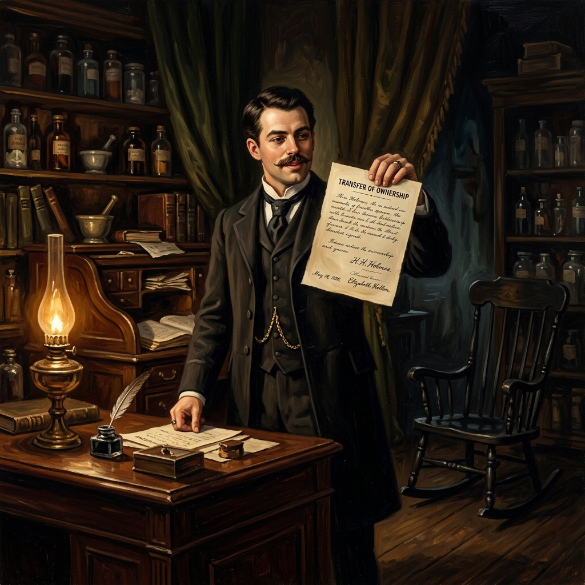
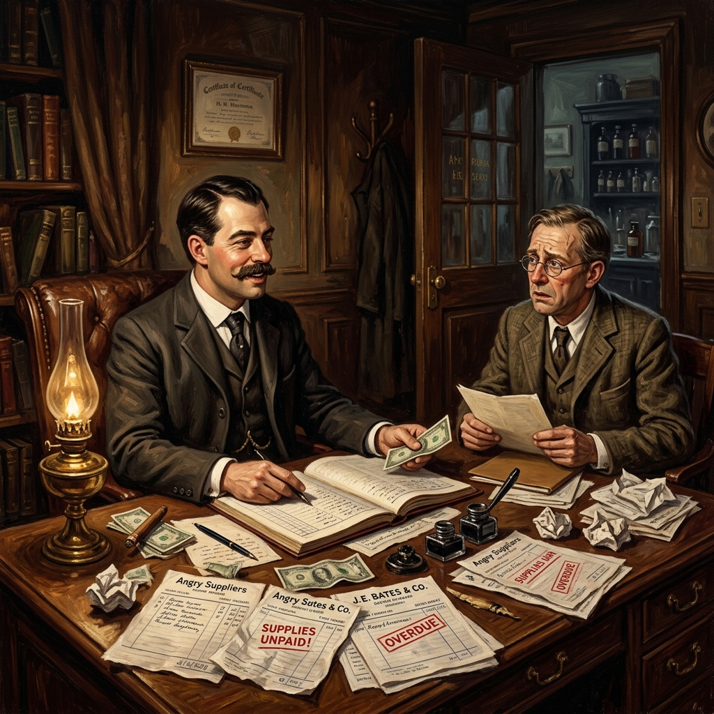
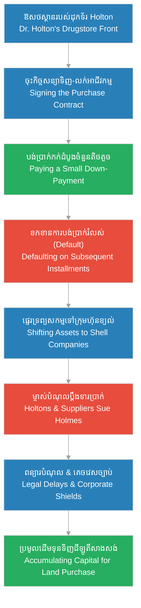

# Episode 5: ឱសថស្ថាននៅផ្លូវលេខ ៦៣ (The Englewood Front)

**Author:** ichamrong  
**Date:** 2026-06-07  
**Tags:** #hh-holmes #screenplay #episode-5 #gilded-age #chicago #business-fraud #credit-manipulation #manipulation #historical-case-study  
**Category:** Biographies  
**Read Time:** ~12 min  

---

## 📌 មាតិកា (Table of Contents)
- [សេចក្តីផ្តើម៖ គ្រឹះនៃអាណាចក្រពាណិជ្ជកម្ម (Introduction: The Commercial Foundation)](#0)
- [១. ប្លង់ទី ១៖ ការរៀបចំសណ្តាប់ធ្នាប់ (Scene 1: Organizing the Front - Englewood, Chicago)](#1)
- [២. ប្លង់ទី ២៖ កិច្ចសន្យា និងការខកខានការទូទាត់ (Scene 2: The Contract and the Default)](#2)
- [៣. ប្លង់ទី ៣៖ ការគេចវេសពីម្ចាស់បំណុល (Scene 3: Evading the Creditors)](#3)
- [៤. ប្លង់ទី ៤៖ ចក្ខុវិស័យនៃវិមានស្រមោល (Scene 4: The Vision of the Castle)](#4)
- [៥. យន្តការបោកប្រាស់ និងរង្វង់ឥណទាន (Credit Fraud & Consolidation Loop)](#5)
- [សេចក្តីសន្និដ្ឋាន (Conclusion)](#6)
- [🔗 ឯកសារទាក់ទង (Related Topics)](#7)

---

## សេចក្តីផ្តើម៖ គ្រឹះនៃអាណាចក្រពាណិជ្ជកម្ម (Introduction: The Commercial Foundation)

រឿងភាគទី ៥ នេះ បង្ហាញពីការចាប់ផ្តើមប្រតិបត្តិការរបស់ H.H. Holmes នៅក្នុងតំបន់ Englewood ទីក្រុង Chicago ស្របទៅនឹងអង្គហេតុប្រវត្តិសាស្ត្រពិត។ Holmes មិនបានសម្លាប់ម្ចាស់ឱសថស្ថានឡើយ។ ផ្ទុយទៅវិញ គេបានចូលធ្វើការជាស្មៀននៅក្នុងហាងរបស់ **ដុកទ័រ Elizabeth Sarah (E.S.) Holton** (វេជ្ជបណ្ឌិតស្រ្តី) និងស្វាមីរបស់នាងគឺលោក William Holton។ Holmes បានធ្វើវិស្វកម្មហិរញ្ញវត្ថុដើម្បីទិញអាជីវកម្មនេះ ប៉ុន្តែបានខកខានការទូទាត់ប្រាក់ (Default) និងប្រើប្រាស់ចន្លោះប្រហោងច្បាប់ពាណិជ្ជកម្មដើម្បីគេចវេសពីបណ្តឹង ខណៈដែលប្តីប្រពន្ធ Holton នៅមានជីវិត និងបន្តប្តឹងទារប្រាក់ពីគេ។

This fifth episode aligns with the verified historical facts of H.H. Holmes' operations in Englewood, Chicago. Correcting the sensationalized myth, Holmes did not murder the pharmacy owner. Instead, he worked as a clerk for **Dr. Elizabeth Sarah (E.S.) Holton** (a female physician) and her husband, William Holton. Holmes engineered a contract to purchase the business, defaulted on the payments, and exploited legal loopholes to insulate himself from their lawsuits, while the Holtons remained alive and actively pursued him in court.

---

## ១. ប្លង់ទី ១៖ ការរៀបចំសណ្តាប់ធ្នាប់ (Scene 1: Organizing the Front - Englewood, Chicago)

**ទីតាំង៖** ឱសថស្ថានរបស់ដុកទ័រ Holton, តំបន់ Englewood, Chicago, ឆ្នាំ ១៨៨៦ (វេលាថ្ងៃត្រង់)  
**Location:** Dr. Holton's Drugstore, Englewood, Chicago, 1886 (Midday)

**សកម្មភាព៖** H.H. Holmes (អាយុ ២៥ ឆ្នាំ ស្លៀកពាក់អាវអៀមឱសថការីស្អាតបាត) កំពុងឈរលើកាំជណ្តើរតូចមួយ រៀបចំដបថ្នាំ និងក្រឡគីមីសាស្ត្រនៅលើធ្នើឈើដោយភាពហ្មត់ចត់បំផុត។ ដុកទ័រ Elizabeth Sarah Holton (ស្ត្រីវ័យ ៣០ ឆ្នាំ ប្លែកពីនារីសម័យនោះដោយមានកែវភ្នែកឆ្លាតវៃ ម៉ឺងម៉ាត់ និងស្លៀកពាក់អាវធំវិជ្ជាជីវៈ) ឈរសម្លឹងមើលពីក្រោយបញ្ជរ រួចញញឹមដោយការពេញចិត្តចំពោះការងាររបស់គេ។ អតិថិជនម្នាក់ឈ្មោះ លោកស្រី ក្លាក (Mrs. Clark) ដើរចូលមកហាង។ Holmes ចុះពីជណ្តើរភ្លាម ៗ និងទទួលស្វាគមន៍នាងដោយស្នាមញញឹមគួរឱ្យទាក់ទាញ។  
**Action:** H.H. Holmes (25 years old, wearing a clean pharmacist's apron) stands on a small step ladder, organizing glass medicine bottles and apothecary jars on dark wooden shelves with absolute, surgical precision. Dr. Elizabeth Sarah Holton (a female physician in her 30s, wearing professional attire with a sharp, intelligent gaze) watches him from behind the counter, smiling in approval. A customer, Mrs. Clark, enters. Holmes steps down immediately, greeting her with his charming, polished mask.

*   **ហូម (Holmes)៖** "ជំរាបសួរលោកស្រី Clark។ ថ្ងៃនេះអាកាសធាតុប្រែប្រួលត្រជាក់ខ្លាំង តើជំងឺក្អករបស់កូនប្រុសលោកស្រីបានធូរស្រាលខ្លះហើយឬនៅ?"  
    *   *"Good afternoon, Mrs. Clark. The weather has grown quite cold today. Has your son's cough improved since your last visit?"*
*   **លោកស្រី ក្លាក (Mrs. Clark)៖** (ញញឹមដោយភាពរីករាយ និងភ្ញាក់ផ្អើល) "ឱ! វេជ្ជបណ្ឌិត Holmes លោកពិតជាមានការចងចាំល្អណាស់។ ថ្នាំសុីរ៉ូដែលលោកផ្សំឱ្យកាលពីសប្តាហ៍មុន ពិតជាមានប្រសិទ្ធភាពខ្លាំងណាស់។ ហាងនេះតាំងពីមានលោកមកជួយមើលថែ ឃើញថាមានសណ្តាប់ធ្នាប់ និងស្អាតបាតជាងមុនឆ្ងាយណាស់។"  
    *   *(Smiling with delight)* *"Oh, Dr. Holmes, you have an extraordinary memory. The syrup you prepared last week worked wonders. This shop has become so organized and clean since you arrived."*
*   **ហូម (Holmes)៖** (ហុចដបថ្នាំដែលរៀបចំរួចឱ្យនាងដោយក្តីបារម្ភបំភ័ន្ត) "វាជាកាតព្វកិច្ចរបស់ខ្ញុំក្នុងការមើលថែសុខភាពអ្នក Englewood ទាំងអស់គ្នា។ ដុកទ័រ Holton បានលះបង់កម្លាំងកាយចិត្តច្រើនណាស់សម្រាប់ហាងនេះ ខ្ញុំគ្រាន់តែចង់ជួយសម្រាលការលំបាករបស់គាត់ប៉ុណ្ណោះ។"  
    *   *(Handing her a prepared bottle with simulated care)* *"It is my duty to look after the health of everyone in Englewood. Dr. Holton has dedicated so much to this shop; I only wish to ease her burden."*
*   **ដុកទ័រ ហូលតុន (Dr. Holton)៖** (និយាយទៅកាន់លោកស្រី Clark ទាំងកោតសរសើរ) "Herman... សុំទោស គឺលោកគ្រូពេទ្យ Holmes គាត់ជាមនុស្សពូកែ និងឧស្សាហ៍ព្យាយាមណាស់។ គាត់បានរៀបចំប្រព័ន្ធបញ្ជីស្តុកទំនិញឡើងវិញទាំងអស់ ដែលធ្វើឱ្យខ្ញុំធូរស្រាលចិត្តជាខ្លាំង។"  
    *   *(Speaking to Mrs. Clark with admiration)* *"Herman... excuse me, Dr. Holmes is a brilliant and diligent young man. He has restructured our entire inventory system, which has given me immense peace of mind."*

**ការពិពណ៌នា៖** នៅពេលដែលលោកស្រី Clark ដើរចេញទៅ Holmes ងាកមកមើលបញ្ជីស្តុកទំនិញនៅលើតុវិញភ្លាម។ ស្នាមញញឹមដែលមានមន្តស្នេហ៍នៅលើផ្ទៃមុខរបស់គេបានបាត់បង់ទៅជាភាពស្ងប់ស្ងាត់ និងគ្មានអារម្មណ៍។ ម្រាមដៃរបស់គេបើកទំព័រសៀវភៅតាមដានលំហូរឥណទាន និងចំណូលហាង។ គេមិនមើលឃើញអតិថិជនជាមនុស្សដែលត្រូវមើលថែឡើយ ប៉ុន្តែជា «លំហូរធនធាន» ថេរដែលនឹងបម្រើដល់ជំហានបន្ទាប់របស់គេ។  
**Description:** The moment Mrs. Clark exits, Holmes turns back to the inventory ledger. The warm, charming smile instantly vanishes, replaced by a cold, flat expression. His fingers flip through the credit accounts and revenue streams. He does not view customers as patients to heal, but as steady [flows of resources](../keyword/flow-of-resources-and-mechanics.md) to serve his next steps.

---

## ២. ប្លង់ទី ២៖ កិច្ចសន្យា និងការខកខានការទូទាត់ (Scene 2: The Contract and the Default)

**ទីតាំង៖** ការិយាល័យខាងក្រោយឱសថស្ថាន, ឆ្នាំ ១៨៨៦ (វេលាយប់ជ្រៅ)  
**Location:** The Back Office of the Drugstore, late 1886 (Late Night)

**សកម្មភាព៖** ចង្កៀងប្រេងកាតមួយបំភ្លឺបន្ទប់ទទួលភ្ញៀវតូចរបស់ការិយាល័យ។ ដុកទ័រ Elizabeth Sarah Holton អង្គុយនៅលើកៅអីផ្តៅ និងស្វាមីរបស់នាងគឺលោក William Holton (បុរសវ័យកណ្តាល សក់ល្បាយស្កូវ ទឹកមុខហ្មត់ចត់) អង្គុយក្បែរគ្នា។ លើតុមានកិច្ចសន្យាទិញ-លក់អាជីវកម្មឱសថស្ថាន។ Holmes ឈរក្បែរពួកគេ ដោយដៃម្ខាងកាន់ប៊ិច និងហុចក្រដាសឱ្យពួកគេចុះហត្ថលេខា។  
**Action:** A single kerosene lamp illuminates the back office. Dr. Elizabeth Sarah Holton sits in a wicker rocking chair next to her husband, William Holton (a middle-aged, graying businessman). On the desk lies the formal purchase contract for the drugstore. Holmes stands beside them, holding a fountain pen, presenting the paper for their final signatures.

*   **ហូម (Holmes)៖** "ដុកទ័រ Holton និងលោក William កិច្ចសន្យានេះនឹងធានាថា លោកទាំងពីរទទួលបានថ្លៃលក់អាជីវកម្មចំនួនប្រាំមួយរយដុល្លារ ដោយបង់រំលស់ប្រចាំខែថេរ។ ខ្ញុំនឹងទទួលបន្ទុកគ្រប់គ្រងស្តុក និងបំណុលទាំងអស់។ លោកទាំងពីរអាចបន្តរស់នៅ និងប្រកបវិជ្ជាជីវៈពេទ្យដោយគ្មានការខ្វល់ខ្វាយរឿងហាងទៀតឡើយ។"  
    *   *"Dr. Holton and Mr. William, this agreement guarantees you a purchase price of six hundred dollars, structured in regular monthly installments. I will assume all liabilities and inventory risks. You may focus on your medical practice without operational concerns."*
*   **វីលៀម ហូលតុន (William Holton)៖** (ពិនិត្យមើលកិច្ចសន្យា រួចងក់ក្បាល) "លក្ខខណ្ឌបង់ប្រាក់រំលស់នេះសមរម្យណាស់ វេជ្ជបណ្ឌិត Holmes។ ខ្ញុំនិង Elizabeth ត្រូវការពេលវេលាដើម្បីពង្រីកគ្លីនិកព្យាបាលឯកជនរបស់យើង។ ខ្ញុំសង្ឃឹមថាលោកនឹងទូទាត់ប្រាក់ប្រចាំខែឱ្យបានទៀងទាត់។"  
    *   *(Inspecting the contract, nodding)* *"The installment terms are acceptable, Dr. Holmes. Elizabeth and I need time to focus on our private medical practice. I expect the monthly transfers to be completed systematically."*
*   **ហូម (Holmes)៖** (ទទួលយកក្រដាសចុះហត្ថលេខា រួចញញឹមយ៉ាងស្ងប់ស្ងាត់) "ពិតណាស់ លោក William។ ខ្ញុំជាមនុស្សគោរពកិច្ចសន្យា និងវិន័យហិរញ្ញវត្ថុបំផុត។"  
    *   *(Taking the signed document, smiling calmly)* *"Of course, Mr. William. I respect contract integrity and financial discipline above all else."*

**ការពិពណ៌នា៖** Holmes ទទួលយកកិច្ចសន្យា និងធ្វើពុតជាបង់ប្រាក់កក់ដំបូងចំនួនតិចតួច។ ក្រោយមក នៅពេលដែលកាលកំណត់បង់ប្រាក់រំលស់ប្រចាំខែបានឈានចូលមកដល់ Holmes ចាប់ផ្តើមគេចវេស និងខកខានការទូទាត់ប្រាក់ (Default) ទាំងស្រុង។ ប្តីប្រពន្ធ Holton មិនបានបាត់ខ្លួនទៅ California ដូចពាក្យចចាមអារ៉ាមឡើយ។ ពួកគេនៅតែមានជីវិតរស់នៅ និងមានការខឹងសម្បារជាខ្លាំង រួចចាប់ផ្តើមរៀបចំឯកសារផ្លូវច្បាប់ដើម្បីប្តឹងទារប្រាក់ពី Holmes តាមរយៈប្រព័ន្ធតុលាការក្រុង Chicago។  
**Description:** Holmes accepts the contract, paying only a minimal initial deposit. Once the subsequent monthly installments fall due, Holmes systematically defaults on the payments. The Holtons do not vanish to California as early rumors suggested; they remain very much alive and furious, preparing civil lawsuits to chase Holmes through the Chicago courts.

---

## ៣. ប្លង់ទី ៣៖ ការគេចវេសពីម្ចាស់បំណុល (Scene 3: Evading the Creditors)

**ទីតាំង៖** ការិយាល័យផ្ទាល់ខ្លួនរបស់ Holmes នៅក្នុងឱសថស្ថាន, ឆ្នាំ ១៨៨៧ (វេលារសៀល)  
**Location:** Holmes' Private Office inside the Drugstore, 1887 (Afternoon)

**សកម្មភាព៖** Holmes អង្គុយនៅតុសរសេរកូដរបស់ខ្លួន ដែលពោរពេញដោយឯកសារបញ្ជាទិញទំនិញ និងលិខិតទាមទារបំណុលហួសកាលកំណត់ (Overdue Invoices)។ តំណាងក្រុមហ៊ុនផ្គត់ផ្គង់គីមីសាស្ត្រម្នាក់ឈ្មោះ លោក ហ្វ្រេដវែល (Mr. Fredwell) ឈរកាន់ឯកសារបំណុល និងបង្ហាញទឹកមុខតានតឹង។ William Holton ដើរចូលមកបន្ទប់ទាំងកំហឹង ដោយកាន់ដីកាកោះហៅតុលាការ។ Holmes ហុចកែវស្រាឱ្យពួកគេដោយភាពព្រងើយកន្តើយ និងដកដង្ហើមវែងយ៉ាងធូរស្រាល។  
**Action:** Holmes sits relaxed at his desk, surrounded by chemical catalogs and red-stamped overdue invoices. Mr. Fredwell, the chemical supply collector, stands holding unpaid billing records with an anxious expression. William Holton enters the room in a quiet rage, holding a civil court summons. Holmes, completely unbothered, offers them whiskey, exhibiting a calm and unworried posture.

*   **វីលៀម ហូលតុន (William Holton)៖** (បោកដីកាតុលាការលើតុ) "Mudgett! ឬ Holmes! ឈ្មោះអីក៏ដោយ! ឯងខកខានការបង់លុយថ្លៃទិញហាងប្រាំខែជាប់គ្នាហើយ! ដីកាតុលាការនេះនឹងបង្ខំឱ្យឯងបង់លុយ ឬប្រគល់ហាងមកឱ្យយើងវិញភ្លាម!"  
    *   *(Slamming the summons on the desk)* *"Mudgett! Or Holmes! Whatever your name is! You have defaulted on the drugstore purchase for five consecutive months! This summons will force you to pay or surrender the business immediately!"*
*   **ហូម (Holmes)៖** (និយាយដោយសំឡេងទន់ភ្លន់ និងគ្មានការភ័យខ្លាច) "លោក William ដីកានេះកោះហៅឈ្មោះ «Herman W. Mudgett» ផ្អែកលើកិច្ចសន្យាដើម។ ប៉ុន្តែអាជីវកម្មឱសថស្ថាននេះ ឥឡូវជាកម្មសិទ្ធិផ្លូវច្បាប់របស់ក្រុមហ៊ុន «H.H. Holmes & Co.» ដែលជាស្ថាប័នដាច់ដោយឡែក។ លោកត្រូវប្តឹងក្រុមហ៊ុននោះវិញ។ ដំណើរការតុលាការប្រហែលជាត្រូវចំណាយពេលពីរឆ្នាំទៀត។"  
    *   *(Speaking in a cool, level tone, untouched by panic)* *"Mr. William, this summons names 'Herman W. Mudgett' based on the original contract. However, this pharmacy is now legally held by 'H.H. Holmes & Co.'—a distinct corporate entity. You must sue the corporation instead. The docket backlogs will take at least two years."*
*   **លោក ហ្វ្រេដវែល (Mr. Fredwell)៖** "ចុះថ្លៃថ្នាំ formaldehyde របស់ក្រុមហ៊ុនខ្ញុំវិញ? លោកគ្រូពេទ្យ Holmes នេះជាវិក្កយបត្រហួសកាលកំណត់!"  
    *   *"And what about my chemical supplier invoice, Dr. Holmes? This bill is months overdue!"*
*   **ហូម (Holmes)៖** (ហុចលុយដប់ដុល្លារឱ្យ Fredwell យ៉ាងស្ងៀមស្ងាត់) "ខ្ញុំយល់ពីការងាររបស់លោក លោក Fredwell។ ក្រុមហ៊ុនថ្មីរបស់ខ្ញុំនឹងរៀបចំបញ្ជីទូទាត់ឡើងវិញ។ សូមជួយពន្យារពេលបញ្ជីនេះពីរសប្តាហ៍ទៀតចុះ។"  
    *   *(Slipping a ten-dollar bill to Fredwell)* *"I understand your position, Mr. Fredwell. My new corporation is restructuring its accounts. Delay the collection report for just two weeks."*

**ការពិពណ៌នា៖** នៅពេលដែលលោក Fredwell និង William Holton ដើរចេញទៅទាំងខកចិត្ត Holmes យកប៊ិចមកកត់ត្រានៅក្នុងសៀវភៅកត់ត្រាខ្មៅរបស់ខ្លួន។ គេប្រើប្រាស់វិធីសាស្ត្រ **«បញ្ជីវាស់វែងវិន័យ» ([Discipline Ledger](../keyword/discipline-ledger.md))** ដើម្បីតាមដានរាល់ការប្តឹងផ្តល់ផ្លូវច្បាប់ និងការកំណត់ពេលវេលាគេចវេសតាមបណ្តឹងរបស់ប្តីប្រពន្ធ Holton។ គេដឹងថា នៅក្នុងច្បាប់ពាណិជ្ជកម្មសម័យ Gilded Age ភាពយឺតយ៉ាវនៃប្រព័ន្ធតុលាការ និងការបង្កើតក្រុមហ៊ុនខ្យល់ គឺជាចន្លោះប្រហោងដ៏ល្អឥតខ្ចោះសម្រាប់គេក្នុងការលួចបន្លំ និងទាញយកផលចំណេញហិរញ្ញវត្ថុដោយឥតគិតថ្លៃ។  
**Description:** As Fredwell and William Holton depart frustrated, Holmes notes the dates in his black registry. He applies his functional [Discipline Ledger](../keyword/discipline-ledger.md) framework to track the civil lawsuits filed by the Holtons and chemical firms, scheduling legal corporate shifts just ahead of court actions. He leverages the Gilded Age's slow judicial system, using corporate shells to extract free capital and block collection efforts.

---

## ៤. ប្លង់ទី ៤៖ ចក្ខុវិស័យនៃវិមានស្រមោល (Scene 4: The Vision of the Castle)

**ទីតាំង៖** កាច់ជ្រុងផ្លូវលេខ ៦៣ និង Wallace, តំបន់ Englewood, ឆ្នាំ ១៨៨៧ (វេលាព្រលប់)  
**Location:** The Corner of 63rd and Wallace St, Englewood, 1887 (Dusk)

**សកម្មភាព៖** ភ្លៀងធ្លាក់រិច ៗ ធ្វើឱ្យដងផ្លូវ Englewood ពោរពេញដោយភក់ជ្រាំ។ H.H. Holmes ឈរនៅកាច់ជ្រុងផ្លូវ កាន់ដំបងច្រត់ និងពាក់អាវធំពណ៌ខ្មៅវែង។ គេសម្លឹងមើលទៅដីឡូតិ៍ទំនេរដ៏ធំមួយនៅទល់មុខឱសថស្ថានរបស់ខ្លួន។ ផ្សែងខ្មៅចេញពីរោងចក្រឧស្សហកម្មនៅខាងក្រោយជះកាត់មេឃពណ៌ប្រផេះ ហាក់បីដូចជាពន្លឺស្រអាប់នៃសតវត្សរ៍ថ្មី។ ភ្នែកពណ៌ខៀវត្រជាក់ស្រេបរបស់គេមិនព្រិចឡើយ គេចាប់ផ្តើមគូរប្លង់អគារដ៏ធំមួយនៅក្នុងគំនិត។  
**Action:** A light drizzle falls, turning the unpaved streets of Englewood into dark mud. H.H. Holmes stands on the corner, holding a walking cane, wearing his long black woolen coat. He gazes intently at the large vacant lot across from his drugstore. Black industrial smoke billows in the background against a heavy grey sky, framing the dawn of a new century. His cold blue eyes remain fixed on the empty space, actively drafting a massive structural vision in his mind.

*   **ហូម (Holmes)៖** (និយាយខ្សឹបម្នាក់ឯងក្នុងខ្យល់ត្រជាក់) "បំណុល និងបណ្តឹងរបស់ប្តីប្រពន្ធ Holton គ្រាន់តែជាបញ្ហាក្រដាសស្នាមប៉ុណ្ណោះ។ ដើមទុនដែលខ្ញុំមិនបានបង់ឱ្យពួកគេ និងលុយបានមកពីការលក់ទំនិញជំពាក់បំណុលគីមី នឹងក្លាយជាគ្រឹះថ្មដំបូងសាងសង់ម៉ាស៊ីនដ៏ធំមួយ... ម៉ាស៊ីនដែលដំណើរការដោយគ្មានសំឡេង គ្មានការរំខាន និងគ្រប់គ្រងរាល់លំហូរជីវិត និងសេចក្តីស្លាប់។ ជញ្ជាំងដែក បំពង់ហ្គាសពុល និងឡដុតនៅក្នុងបន្ទប់ក្រោមដី... ទីក្រុង Chicago នឹងផ្តល់ឱ្យខ្ញុំនូវវត្ថុធាតុដើមទាំងអស់ដែលខ្ញុំត្រូវការ។"  
    *   *(Whispering into the cold wind)* *"The Holtons' lawsuits are merely administrative noise. The capital withheld from their purchase payments, combined with the chemical supplies liquidated on credit, will fund the first stones of a massive machine... a machine operating silently, controlling the flow of life and death. Brick walls, gas pipes, and a basement furnace... Chicago will supply all the raw material I require."*

**ការពិពណ៌នា៖** Holmes ញញឹមយ៉ាងស្ងប់ស្ងាត់ រួចដើរត្រឡប់ចូលទៅក្នុងឱសថស្ថានវិញ។ គេដឹងថា គេមានធនធានគ្រប់គ្រាន់ហើយក្នុងការទិញដីធ្លីនេះ និងជួលជាងសំណង់មកសាងសង់អគារជាន់ទីពីរ។ ផែនការប្លង់មេនៃ «វិមានឃាតកម្ម» ត្រូវបានបង្កើតឡើងយ៉ាងលម្អិតនៅក្នុងខួរក្បាលរបស់គេ។ គេត្រៀមខ្លួនជាស្រេចដើម្បីចាប់ផ្តើមជំហានបន្ទាប់នៃការធ្វើវិស្វកម្មឧក្រិដ្ឋកម្មដ៏ធំបង្អស់ក្នុងប្រវត្តិសាស្ត្រ។  
**Description:** Holmes performs a quiet smile and walks back into the pharmacy. He has consolidated enough assets and credit lines to purchase the land and begin construction on a massive three-story structure. The blueprints of the Murder Castle are now fully drafted in his mind. He is ready to initiate the next phase of his industrial criminal enterprise.

---

## ៥. យន្តការបោកប្រាស់ និងរង្វង់ឥណទាន (Credit Fraud & Consolidation Loop)

ដ្យាក្រាមខាងក្រោមបង្ហាញពីរង្វង់យន្តការដែល H.H. Holmes ប្រើប្រាស់ដើម្បីកសាងហិរញ្ញវត្ថុ និងគេចវេសពីបណ្តឹងរបស់ប្តីប្រពន្ធ Holton៖

The following diagram maps the strategic loop Holmes engineered to extract financial resources and evade the Holtons' lawsuits:

> [!IMPORTANT]
> **🧠 យន្តការចិត្តសាស្ត្រ / Psychological Mechanism - [លំហូរនៃធនធាន និងការរៀបចំយន្តការ (Flow of Resources and Mechanics)](../keyword/flow-of-resources-and-mechanics.md):**
> * «នៅក្នុងប្លង់ទី ២ Holmes ចាត់ទុកកិច្ចសន្យា និងទំនាក់ទំនងជាមួយប្តីប្រពន្ធ Holton ត្រឹមតែជាយន្តការផ្ទេរធនធានប៉ុណ្ណោះ។ គេមិនខ្វល់ខ្វាយពីក្រមសីលធម៌នៃការបង់ប្រាក់ ឬការខឹងសម្បាររបស់ពួកគេឡើយ ដោយសារចិត្តរបស់គេបានផ្តាច់អារម្មណ៍ទាំងស្រុងពីតម្លៃមនុស្សធម៌។» (*"In Scene 2, Holmes treats contracts and relationships with the Holtons merely as mechanics for resource transfer. He is unconcerned with payment ethics or their frustration, his mind fully insulated from human empathy."*).
> 
> **🤫 យន្តការចិត្តសាស្ត្រ / Psychological Mechanism - [បញ្ជីវាស់វែងវិន័យ (Discipline Ledger)](../keyword/discipline-ledger.md):**
> * «នៅក្នុងប្លង់ទី ៣ Holmes អនុវត្តវិន័យដ៏តឹងរ៉ឹងក្នុងការរៀបចំបញ្ជីបំណុល និងការកំណត់ពេលវេលាគេចវេសច្បាប់។ គេគ្រប់គ្រងរាល់ទំនាក់ទំនងជាមួយភ្នាក់ងារទារលុយ និងដីកាកោះហៅរបស់តុលាការ ដោយមិនឱ្យមានអារម្មណ៍ភ័យខ្លាច ឬតក់ស្លុតប៉ះពាល់ដល់ការសម្រេចផែនការធំឡើយ។» (*"In Scene 3, Holmes applies strict discipline in managing his debt logs and legal evasion timelines. He regulates all interactions with collectors and court summons, ensuring fear or panic never interferes with his overarching blueprint."*).

---

## សេចក្តីសន្និដ្ឋាន (Conclusion)

> **«នៅក្នុងអាជីវកម្មសម័យថ្មី ឥណទានគឺជាទម្រង់នៃអំណាចដ៏អស្ចារ្យបំផុត... វាអនុញ្ញាតឱ្យយើងសាងសង់អាណាចក្រដោយប្រើប្រាស់ទ្រព្យសម្បត្តិរបស់អ្នកដទៃ» — H.H. Holmes**
> 
> **“In modern enterprise, credit is the ultimate form of power... it allows us to build empires using the assets of others.” — H.H. Holmes**

រឿងភាគទី ៥ បិទបញ្ចប់ដោយ Holmes បើកទ្វារក្រោយឱសថស្ថាន សម្លឹងមើលទៅកាន់មេឃដែលពោរពេញដោយពពកខ្មៅស្រអាប់ និងផុកផុយ។ គេកាន់គំនូរប្លង់ដីឡូតិ៍ដែលទើបតែទិញបានដោយជោគជ័យ ត្រៀមខ្លួនសម្រាប់ជំហានពិតប្រាកដនៃការបង្កើតវិស័យសំណង់ compartmentalized នៅភាគបន្ទាប់។

Episode 5 concludes with Holmes opening the back door of the pharmacy, looking up at the soot-filled sky of Chicago. He holds the deed to the newly acquired vacant lot, ready to launch the compartmentalized construction of his Castle in the next episode.

---

## 🔗 ឯកសារទាក់ទង (Related Topics)
*   **[Episode 4: ការផ្លាស់ប្តូរអត្តសញ្ញាណ (H.H. Holmes is Born)](ep-04-h-h-holmes-is-born.md)** — ស្គ្រីបភាគទី ៤ ដែល Holmes ប្តូរអត្តសញ្ញាណ និងធ្វើដំណើរមក Chicago។
*   **[Episode 6: ជីវិតស្ទួននៅ Wilmette (The Double Life)](ep-06-the-double-life.md)** — ស្គ្រីបភាគទី ៦ ដែល Holmes រៀបការជាមួយ Myrta Belknap និងចាប់ផ្តើមរស់នៅជាពីរ។
*   **[លំហូរនៃធនធាន និងការរៀបចំយន្តការ (Flow of Resources and Mechanics)](../keyword/flow-of-resources-and-mechanics.md)** — ទស្សនៈដែលចាត់ទុកជីវិត និងសាកសពជាទ្រព្យសកម្មរូបវន្ត។
*   **[បញ្ជីវាស់វែងវិន័យ (Discipline Ledger)](../keyword/discipline-ledger.md)** — វិធីសាស្ត្រតាមដាន និងគ្រប់គ្រងចិត្តសាស្ត្រ និងសកម្មភាពហិរញ្ញវត្ថុរបស់ Holmes។
*   **[ជីវប្រវត្តិ H.H. Holmes](../01-h-h-holmes-biography.md)** — ជីវប្រវត្តិនៃការវិវឌ្ឍជីវិត និងវិមានឃាតកម្មរបស់ Holmes។
*   **[គម្រោងរឿងភាគដ្រាម៉ា ៦៣ ភាគ](../08-holmes-drama-episode-guide.md)** — ផែនការ និងការសង្ខេបរឿងភាគទូរទស្សន៍ទាំង ៦៣ ភាគ។
