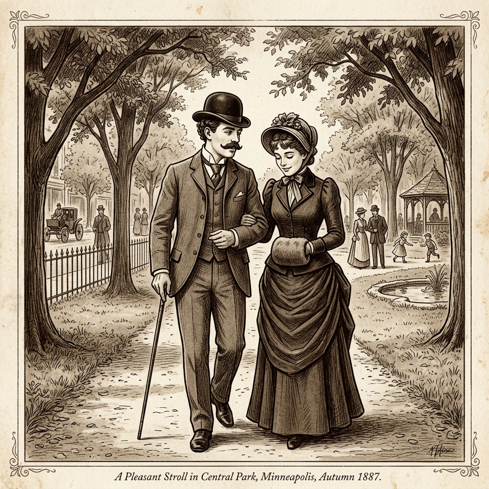
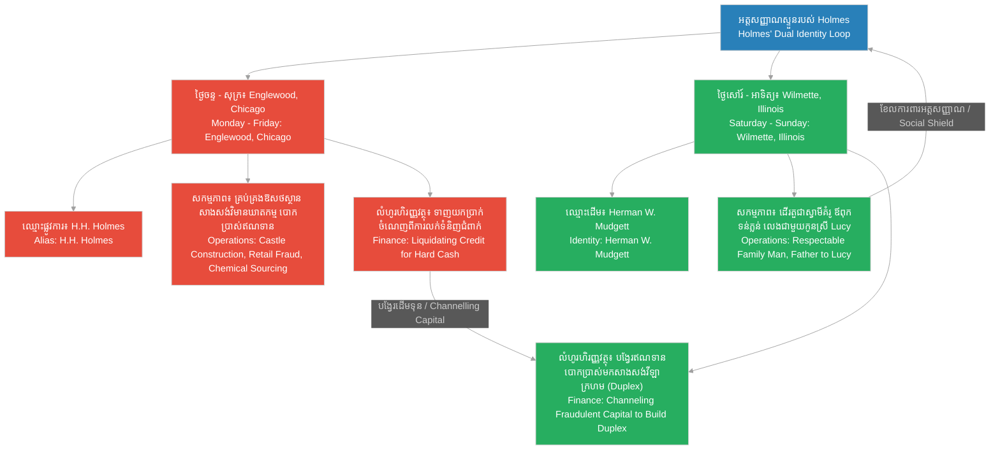

# Episode 6: ជីវិតស្ទួននៅ Wilmette (The Double Life)

**Author:** ichamrong  
**Date:** 2026-06-07  
**Tags:** #hh-holmes #screenplay #episode-6 #gilded-age #wilmette #bigamy #double-life #construction-fraud #historical-case-study  
**Category:** Biographies  
**Read Time:** ~15 min  

---

## 📌 មាតិកា (Table of Contents)
- [សេចក្តីផ្តើម៖ ការបែងចែកពិភពលោកពីរ (Introduction: The Separation of Two Worlds)](#0)
- [១. ប្លង់ទី ១៖ អាពាហ៍ពិពាហ៍ខុសច្បាប់ (Scene 1: The Bigamous Marriage - Minneapolis/Chicago)](#1)
- [២. ប្លង់ទី ២៖ ជីវិតស្ទួន និងការបង្កើតកូនស្រី (Scene 2: The Double Life and the Birth of Lucy)](#2)
- [៣. ប្លង់ទី ៣៖ ការកសាងវិមានក្រហម និងការបោកប្រាស់ជាងសំណង់ (Scene 3: The Red Duplex and Construction Fraud)](#3)
- [៤. ប្លង់ទី ៤៖ ការបែងចែកពិភពលោកពីរ (Scene 4: The Separation of Worlds - Englewood/Wilmette)](#4)
- [៥. ភស្តុភារនៃការរស់នៅស្ទួន (Logistics of the Double Life)](#5)
- [សេចក្តីសន្និដ្ឋាន (Conclusion)](#6)
- [🔗 ឯកសារទាក់ទង (Related Topics)](#7)

---

## សេចក្តីផ្តើម៖ ការបែងចែកពិភពលោកពីរ (Introduction: The Separation of Two Worlds)

រឿងភាគទី ៦ នេះ ផ្អែកលើករណីសិក្សាប្រវត្តិសាស្ត្រពិតនៃអាពាហ៍ពិពាហ៍ទីពីររបស់ H.H. Holmes ជាមួយកញ្ញា **Myrta Belknap** នៅថ្ងៃទី ២៨ ខែមករា ឆ្នាំ ១៨៨៧ ក្នុងទីក្រុង Minneapolis។ Holmes បានរៀបការជាមួយនាងទាំងខ្លួននៅមានចំណងអាពាហ៍ពិពាហ៍ស្របច្បាប់ជាមួយប្រពន្ធដំបូងគឺ Clara Lovering (ដែលកំពុងរស់នៅឯរដ្ឋ New Hampshire) ដែលធ្វើឱ្យអាពាហ៍ពិពាហ៍នេះក្លាយជាមោឃៈ និងជាការប្រព្រឹត្តខុសច្បាប់ប្តីប្រពន្ធពីរ (Bigamy)។ ភាគនេះបង្ហាញពីការសាងសង់ផ្ទះវីឡាទ្វេវីឡា (Duplex) ដ៏ធំមួយនៅតំបន់ជាយក្រុង Wilmette រដ្ឋ Illinois និងរបៀបដែល Holmes ប្រើប្រាស់វិធីសាស្ត្របោកប្រាស់ឥណទានដដែល ៗ ដើម្បីសាងសង់ផ្ទះនេះដោយមិនបង់ប្រាក់ឱ្យជាងសំណង់ ព្រមទាំងការបែងចែកដាច់ស្រឡះរវាងជីវិតគ្រួសារដ៏សុភាពរាបសារ និងប្រតិបត្តិការឃាតកម្មងងឹតនៅក្នុងវិមាន Englewood។

This sixth episode is based on the documented historical case study of H.H. Holmes' second marriage to **Myrta Belknap** on January 28, 1887, in Minneapolis. While still legally married to his first wife, Clara Lovering (who remained in New Hampshire), Holmes committed bigamy, rendering this second union legally void. The episode dramatizes the construction of a large Queen Anne-style duplex in the suburb of Wilmette, Illinois, illustrating how Holmes applied his signature credit-fraud techniques to build the home without paying local contractors, while establishing a rigid separation between his respectable suburban family life and his dark criminal operations inside the Englewood Castle.

---

## ១. ប្លង់ទី ១៖ អាពាហ៍ពិពាហ៍ខុសច្បាប់ (Scene 1: The Bigamous Marriage - Minneapolis/Chicago)

**ទីតាំង៖** ព្រះវិហារតូចមួយក្នុងក្រុង Minneapolis រដ្ឋ Minnesota រួចបន្តទៅលើទូរថភ្លើងឆ្ពោះទៅក្រុង Chicago, ដើមឆ្នាំ ១៨៨៧  
**Location:** A small chapel in Minneapolis, Minnesota, followed by a passenger train heading to Chicago, early 1887

**សកម្មភាព៖** Herman Webster Mudgett (បង្ហាញខ្លួនក្រោមឈ្មោះជា H.H. Holmes ស្លៀកពាក់អាវធំវែងប្រណីត និងពាក់មួកប៊ូល័រ) ឈរកាន់ដៃ Myrta Belknap (នារីវ័យក្មេងទន់ភ្លន់ ទឹកមុខទាក់ទាញ និងស្លៀកពាក់រ៉ូបអាពាហ៍ពិពាហ៍ពណ៌សបែបសាមញ្ញ)។ លោកគ្រូគង្វាលកំពុងអានពាក្យសម្បថអាពាហ៍ពិពាហ៍។ Holmes ញញឹមយ៉ាងស្រទន់ និងសម្លឹងមើល Myrta ដោយកែវភ្នែកពណ៌ខៀវដ៏កក់ក្តៅបំភ័ន្ត។ បន្ទាប់មក រូបភាពកាត់ទៅកាន់បន្ទប់ទូរថភ្លើងលំដាប់ខ្ពស់។ Myrta កំពុងគេងលក់ដោយផ្អែកក្បាលលើស្មារបស់ Holmes ខណៈដែល Holmes កំពុងអានកាសែតពាណិជ្ជកម្មក្រុង Chicago ដោយទឹកមុខស្ងប់ស្ងាត់ និងគ្មានអារម្មណ៍។  
**Action:** Herman Webster Mudgett (appearing under the alias H.H. Holmes, dressed in an elegant wool frock coat and a bowler hat) stands holding hands with Myrta Belknap (a gentle, attractive young woman wearing a simple white Victorian wedding gown). A clergyman reads the marriage vows. Holmes smiles warmly, gazing into Myrta's eyes with simulated devotion. The scene cuts to a first-class train carriage. Myrta sleeps peacefully with her head resting on Holmes' shoulder, while Holmes reads a Chicago business newspaper, his face cold, calm, and detached.

*   **គ្រូគង្វាល (Clergyman)៖** "តើអ្នកព្រមទទួលយកនាង Myrta Belknap ធ្វើជាភរិយាស្របច្បាប់ និងសន្យាថានឹងស្មោះត្រង់ចំពោះនាងពេញមួយជីវិតដែរឬទេ?"  
    *   *"Do you take Myrta Belknap to be your lawfully wedded wife, promising to cherish and remain faithful to her so long as you both shall live?"*
*   **ហូម (Holmes)៖** (និយាយដោយសំឡេងច្បាស់ ៗ និងគ្មានការស្ទាក់ស្ទើរ) "ខ្ញុំបាទយល់ព្រម។"  
    *   *(Speaking clearly, without hesitation)* *"I do."*
*   **ហូម (Holmes)៖** (និយាយខ្សឹបជាមួយ Myrta នៅលើទូរថភ្លើង ខណៈនាងភ្ញាក់ដឹងខ្លួនតិច ៗ) "គេងឱ្យស្រួលចុះ Myrta ទីក្រុង Chicago នឹងក្លាយជាកន្លែងចាប់ផ្តើមជីវិតថ្មីដ៏រុងរឿងរបស់យើង។ ខ្ញុំនឹងកសាងផ្ទះដ៏ស្រស់ស្អាតមួយសម្រាប់អូន និងគ្រួសាររបស់យើង។"  
    *   *(Whispering to Myrta on the train as she stirs awake)* *"Rest, Myrta. Chicago will be the beginning of our prosperous new life. I will build a beautiful home for you and our family."*
*   **ម៉ឺតា (Myrta)៖** (និយាយដោយក្តីសង្ឃឹម និងទន់ភ្លន់) "ខ្ញុំជឿជាក់លើបង Herman។ បងជាស្វាមីដ៏ល្អបំផុត ដែលព្រះប្រទានមកឱ្យខ្ញុំ។"  
    *   *(Speaking softly, full of hope)* *"I trust you, Herman. You are the finest husband I could have ever hoped for."*

**ការពិពណ៌នា៖** Holmes ឱបនាងថ្នម ៗ ប៉ុន្តែកែវភ្នែករបស់គេងាកទៅសម្លឹងមើលផ្ទាំងកញ្ចក់បង្អួចរថភ្លើងវិញ។ គេដឹងថា នៅក្នុងថតតុឯកសាររបស់គេនៅ New Hampshire គេមិនទាន់បានលែងលះជាមួយ Clara Lovering ឡើយ។ សម្រាប់ Holmes ពិធីអាពាហ៍ពិពាហ៍នេះគ្រាន់តែជាល្បែងសង្គមមួយ ដើម្បីបង្កើតទំនុកចិត្តសីលធម៌ និងធានាឱ្យបាននូវមុខមាត់ជាអ្នកជំនួញរៀបរយម្នាក់ក្នុងសង្គមក្រុង Chicago តែប៉ុណ្ណោះ។  
**Description:** Holmes holds her gently, but his gaze shifts cold to the train window. He knows that in his records back in New Hampshire, he remains legally married to Clara Lovering. For Holmes, this ceremony is merely a social performance to manufacture respectability and establish a stable, moral cover for his business activities in Chicago.

---

## ២. ប្លង់ទី ២៖ ជីវិតស្ទួន និងការបង្កើតកូនស្រី (Scene 2: The Double Life and the Birth of Lucy)

**ទីតាំង៖** ផ្ទះជួលតូចមួយរបស់ឪពុកម្តាយ Myrta នៅក្នុងតំបន់ Wilmette រដ្ឋ Illinois, ឆ្នាំ ១៨៨៩  
**Location:** A small rented cottage of Myrta's parents in the suburb of Wilmette, Illinois, 1889

**សកម្មភាព៖** នៅក្នុងបន្ទប់ទទួលភ្ញៀវដ៏កក់ក្តៅ មានចើងកនដុតអុសបំភ្លឺពន្លឺពណ៌មាស។ Myrta អង្គុយលើសាឡុង មើលទៅ Holmes ដែលកំពុងបីកូនស្រីទើបនឹងកើតគឺទារិកា Lucy ដោយការថ្នាក់ថ្នម។ គេលួងលោមក្មេងដោយសំឡេងទន់ភ្លន់ និងកាយវិការដូចជាឪពុកដែលស្រឡាញ់កូនបំផុត។ ភ្លាម ៗ នោះ រូបភាពកាត់ទៅកាន់កាច់ជ្រុងផ្លូវងងឹតនៃសណ្ឋាគារ Castle ក្នុងតំបន់ Englewood នាពេលយប់។ Holmes កំពុងឈរកាន់គំនូរប្លង់សំណង់ជញ្ជាំងពីរជាន់ ជជែកគ្នាជាមួយជាងសំណង់ដោយទឹកមុខម៉ឺងម៉ាត់ និងទាមទារការសម្ងាត់ខ្ពស់។  
**Action:** Inside a warm living room, a fireplace glows with golden light. Myrta sits on the sofa, watching Holmes gently cradle their newborn daughter, Lucy. He cradles the infant with soft whispers and the posture of a loving, doting father. The scene suddenly cuts to the dark, rain-slicked corner of the Castle in Englewood at night. Holmes stands holding blueprint designs for the second-floor partition walls, instructing a foreman in a cold, demanding voice.

<!-- [IMAGE: H.H. Holmes' domestic life in Wilmette. H.H. Holmes holds his baby daughter Lucy in a cozy Victorian parlor, with Myrta Belknap looking on. (Image generation rate-limited, to be added later)] -->

*   **ម៉ឺតា (Myrta)៖** "មើលចុះ Herman... Lucy គេងលក់លង់លក់ក្នុងដៃបងយ៉ាងស្ងប់ស្ងាត់។ បងហាក់ដូចជាហត់នឿយណាស់ក្នុងប៉ុន្មានខែនេះ ដោយសារត្រូវធ្វើដំណើរទៅមក Englewood រាល់ថ្ងៃ។"  
    *   *"Look, Herman... Lucy sleeps so peacefully in your arms. You must be exhausted these past months, traveling back and forth to Englewood every day."*
*   **ហូម (Holmes)៖** "ការងារនៅហាងថ្នាំកំពុងរីកចម្រើនខ្លាំងណាស់ Myrta។ ខ្ញុំត្រូវចាត់ចែងគម្រោងសំណង់អគារថ្មី ដើម្បីធានាអនាគតហិរញ្ញវត្ថុរបស់ Lucy និងអូន។ ការនឿយហត់របស់ខ្ញុំ គឺដើម្បីគ្រួសារយើងទាំងមូល។"  
    *   *"The pharmacy business is expanding rapidly, Myrta. I must manage the new building project to secure Lucy's and your financial future. My labor is entirely for our family."*
*   **ម៉ឺតា (Myrta)៖** "ប៉ុន្តែបងមិនសូវមានពេលនៅផ្ទះជាមួយយើងសោះ។ តើបងអាចសម្រាកនៅទីនេះរាល់ចុងសប្តាហ៍បានទេ?"  
    *   *"But you are rarely home with us. Can you promise to spend every weekend here with us?"*
*   **ហូម (Holmes)៖** (ថើបក្បាលទារិកា Lucy ថ្នម ៗ រួចហុចនាងឱ្យ Myrta) "ពិតណាស់ Myrta ខ្ញុំនឹងនៅទីនេះរាល់ថ្ងៃចុងសប្តាហ៍។ ពិភពលោកខាងក្រៅពោរពេញដោយភាពច្របូកច្របល់ ប៉ុន្តែផ្ទះរបស់យើងនៅទីនេះ គឺជាកន្លែងសន្តិសុខបំផុតរបស់ខ្ញុំ។"  
    *   *(Gently kissing baby Lucy's forehead and handing her to Myrta)* *"Of course, Myrta. I will remain here every weekend. The world outside is chaotic, but our home here is my sanctuary."*

**ការពិពណ៌នា៖** ទឹកមុខរបស់ Holmes បង្ហាញពីភាពស្មោះត្រង់គ្មានកន្លែងទាស់ ប៉ុន្តែខួរក្បាលរបស់គេកំពុងគណនាពីពេលវេលាកំណត់នៃការដឹកជញ្ជូន និងរបៀបគ្រប់គ្រងពេលវេលា។ គេបានបែងចែកជីវិតជាពីរ៖ ថ្ងៃចន្ទដល់ថ្ងៃសុក្រ គេគឺជា «H.H. Holmes» អ្នកជំនួញមិនចេះនឿយហត់ និងជាមេខ្លោងឧក្រិដ្ឋកម្មនៅ Englewood ចំណែកថ្ងៃសៅរ៍ និងអាទិត្យ គេគឺជា «Herman Mudgett» ស្វាមីដ៏គំរូ និងជាឪពុកដ៏ទន់ភ្លន់នៅ Wilmette។ ពិភពលោកទាំងពីរនេះមិនដែលជួបគ្នាឡើយ។  
**Description:** Holmes' face shows flawless sincerity, but his mind actively calculates transit timetables and schedule management. He compartmentalizes his existence completely: from Monday to Friday, he is "H.H. Holmes," the relentless businessman and mastermind in Englewood; on weekends, he shifts to "Herman Mudgett," the respectable husband and gentle father in Wilmette. These two spheres remain strictly separated.

---

## ៣. ប្លង់ទី ៣៖ ការកសាងវិមានក្រហម និងការបោកប្រាស់ជាងសំណង់ (Scene 3: The Red Duplex and Construction Fraud - Wilmette)

**ទីតាំង៖** ការិយាល័យបណ្តោះអាសន្ននៅការដ្ឋានសំណង់, ផ្លូវ John, តំបន់ Wilmette, ឆ្នាំ ១៨៩១  
**Location:** A temporary office at the construction site, John Street, Wilmette, 1891

**សកម្មភាព៖** អគារវីឡាទ្វេ (Duplex) បែប Queen Anne ដ៏ប្រណីត (លាបពណ៌ក្រហមចាស់ មានប៉មមូលខ្ពស់ និង veranda ទូលាយ) កំពុងសាងសង់ជិតរួចរាល់។ Holmes ឈរនៅការដ្ឋាន ជជែកជាមួយលោក ថូម៉ាស (Mr. Thomas) ដែលជាជាងឈើ និងមេការសំណង់ក្នុងស្រុក។ លោក Thomas បង្ហាញវិក្កយបត្រថ្លៃពលកម្ម និងឈើប្រណីតដែលមានតម្លៃប្រាំបីរយដុល្លារ។ Holmes ហុចកិច្ចសន្យាថ្មីមួយទៀតឱ្យគាត់ដោយទឹកមុខស្ងប់ស្ងាត់។  
**Action:** A large, distinctive Queen Anne-style duplex (painted dark red, featuring turrets and a wide veranda) stands near completion. Holmes stands at the site, conversing with Mr. Thomas, a local carpenter and building contractor. Mr. Thomas presents an invoice for lumber and labor totaling eight hundred dollars. Holmes calmly hands him a structured corporate promissory note instead.

<!-- [IMAGE: Construction of the red Queen Anne-style duplex in Wilmette. H.H. Holmes negotiates with local builders while workers assemble the structure. (Image generation rate-limited, to be added later)] -->

*   **លោក ថូម៉ាស (Mr. Thomas)៖** "លោកគ្រូពេទ្យ Mudgett គ្រឿងឈើ និងការតុបតែងប៉មចំហៀងត្រូវបានបញ្ចប់រួចរាល់ហើយ។ កម្មកររបស់ខ្ញុំត្រូវការបើកប្រាក់ឈ្នួលប្រចាំខែនេះ។ នេះជាវិក្កយបត្រសរុប។"  
    *   *"Dr. Mudgett, the exterior woodwork and the side turret construction are complete. My crew needs their monthly wages cleared. Here is the total billing."*
*   **ហូម (Holmes)៖** (ពិនិត្យវិក្កយបត្រ រួចនិយាយដោយសំឡេងទន់ភ្លន់) "ការងាររបស់លោកពិតជាល្អឥតខ្ចោះណាស់ លោក Thomas។ ទោះជាយ៉ាងណា គណនីធនាគាររបស់ក្រុមហ៊ុន «Wilmette Investment Co.» ដែលគ្រប់គ្រងសំណង់នេះ កំពុងរង់ចាំការផ្ទេរឥណទានពី Chicago។ ខ្ញុំនឹងហុចប័ណ្ណសន្យាទូទាត់ប្រាក់ (Promissory Note) រយៈពេលសាមសិបថ្ងៃនេះឱ្យលោកសិន ដោយបូកបន្ថែមការប្រាក់ប្រាំភាគរយ។"  
    *   *(Inspecting the invoice, speaking smoothly)* *"Your craftsmanship is exceptional, Mr. Thomas. However, the corporate account of 'Wilmette Investment Co.' which manages this construction, is awaiting a credit transfer from Chicago. I will issue you a thirty-day promissory note, adding a five percent interest premium."*
*   **លោក ថូម៉ាស (Mr. Thomas)៖** (ស្ទាក់ស្ទើរ ប៉ុន្តែចាញ់បោកភាពរាក់ទាក់របស់ Holmes) "សាមសិបថ្ងៃ... ល្អហើយ លោកគ្រូពេទ្យ។ លោកជាមនុស្សមានកេរ្តិ៍ឈ្មោះល្អ និងមានផ្ទះធំនៅទីនេះ ខ្ញុំជឿថាប័ណ្ណនេះនឹងដោះស្រាយបាន។"  
    *   *(Hesitant, but disarmed by Holmes' polished demeanor)* *"Thirty days... Very well, Doctor. You are a well-regarded resident with a grand house here; I trust this note will be honored."*

**ការពិពណ៌នា៖** នៅពេលដែលលោក Thomas ដើរចេញទៅ Holmes សម្លឹងមើលទៅសំណង់អគារពណ៌ក្រហមដ៏ធំធ្លីដោយស្នាមញញឹមចំអក។ គេដឹងថា ក្រុមហ៊ុន «Wilmette Investment Co.» គ្រាន់តែជាក្រុមហ៊ុនក្រដាសដែលគ្មានទ្រព្យសកម្មពិតប្រាកដឡើយ។ នៅពេលប័ណ្ណសន្យាទូទាត់ប្រាក់ហួសកាលកំណត់ Holmes នឹងពន្យារពេល និងដោះសារដដែល ៗ រហូតដល់ជាងសំណង់បោះបង់ ឬបង្ខំចិត្តប្តឹងផ្តល់។ គេបានសាងសង់ផ្ទះដ៏ប្រណីតនេះដោយប្រើប្រាស់ពលកម្ម និងសម្ភារៈឥតគិតថ្លៃរបស់អ្នកស្រុក Wilmette ទាំងស្រុង ដែលជាវិធីសាស្ត្រដូចគ្នានឹងការកសាងវិមាន Englewood ដែរ។  
**Description:** As Mr. Thomas departs, Holmes looks up at the grand red duplex with a subtle, mocking smile. He knows that the "Wilmette Investment Co." is a shell entity with zero capitalization. When the note expires, Holmes will deploy administrative delays and excuses until the contractors grow exhausted or file liens. He has built this suburban estate utilizing free local labor and materials on credit, replicating the exact financial strategy used for the Englewood Castle.

---

## ៤. ប្លង់ទី ៤៖ ការបែងចែកពិភពលោកពីរ (Scene 4: The Separation of Worlds - Englewood/Wilmette)

**ទីតាំង៖** ផ្ទះពណ៌ក្រហមនៅ Wilmette (ផ្នែកម្ខាងរបស់ Holmes) និងការិយាល័យក្នុងវិមាន Castle, ឆ្នាំ ១៨៩៣  
**Location:** The Wilmette Duplex (Holmes' side) and the private office of the Englewood Castle, 1893

**សកម្មភាព៖** ល្ងាចថ្ងៃអាទិត្យ ភ្លៀងធ្លាក់រលឹមស្រិច ៗ។ Holmes កំពុងពាក់អាវធំ និងកាន់ដំបងច្រត់ ត្រៀមខ្លួនចាកចេញទៅស្ថានីយរថភ្លើង។ Myrta ឈរក្បែរទ្វារ មើលទៅគេដោយកែវភ្នែកពោរពេញដោយមន្ទិលសង្ស័យ និងការព្រួយបារម្ភ។ នាងព្យាយាមស្វែងរកចម្លើយពីរាល់ការបាត់ខ្លួន និងសំបុត្រប្លែក ៗ ដែលផ្ញើមកផ្ទះ។ Holmes ស្ទាបថ្ពាល់នាងថ្នម ៗ និងនិយាយលួងលោមនាង មុនពេលដើរចេញទៅ។ រូបភាពកាត់ទៅកាន់ប៉ូលីសស៊ើបអង្កេតក្រុង Chicago ឆែកឆេរផ្ទះ Wilmette នេះនៅឆ្នាំ ១៨៩៤ ដោយគាស់ជញ្ជាំង និងកម្រាលឥដ្ឋ ប៉ុន្តែមិនជួបបន្ទប់សម្ងាត់ ឬភស្តុតាងឧក្រិដ្ឋកម្មណាមួយឡើយ។ ផ្ទះនេះមានតែបន្ទប់រស់នៅធម្មតា និងភាពទទេស្អាត។  
**Action:** Sunday evening, a light drizzle falls. Holmes puts on his dark wool coat and takes his walking cane, preparing to depart for the train station. Myrta stands near the doorway, watching him with an expression of growing doubt and worry, seeking answers about his frequent absences and the strange collection letters arriving at the house. Holmes gently cups her face, speaking soothing words before stepping out. The scene cuts to Chicago police detectives in 1894, thoroughly searching the Wilmette duplex, tearing open walls and floorboards, only to find a perfectly normal suburban home with absolutely no secret traps or criminal evidence.

<!-- [IMAGE: H.H. Holmes departing the Wilmette duplex at dusk. He kisses Myrta goodbye, heading toward Englewood. (Image generation rate-limited, to be added later)] -->

*   **ម៉ឺតា (Myrta)៖** "Herman... មានមនុស្សមកសួររកបងនៅទីនេះពីរដងហើយក្នុងសប្តាហ៍នេះ។ ពួកគេនិយាយថា បងជំពាក់លុយថ្លៃឈើ និងថ្លៃគ្រឿងដែកសំណង់។ ហើយហេតុអ្វីបានជាបងត្រូវត្រឡប់ទៅ Englewood ទាំងយប់បែបនេះ?"  
    *   *"Herman... men came searching for you twice this week. They claim you owe payments for the lumber and iron fittings. And why must you return to Englewood in the middle of this rain?"*
*   **ហូម (Holmes)៖** "មនុស្សទាំងនោះគ្រាន់តែយល់ច្រឡំរឿងគណនេយ្យប៉ុណ្ណោះ Myrta។ ខ្ញុំកំពុងរៀបចំប្រព័ន្ធបញ្ជីគណនេយ្យឡើងវិញ។ បញ្ហានៅសណ្ឋាគារ Englewood ត្រូវការវត្តមានរបស់ខ្ញុំជាបន្ទាន់ ដើម្បីការពារប្រភពចំណូលរបស់យើង។ កុំបារម្ភអី ទឹកចិត្ត និងក្តីស្រឡាញ់របស់ខ្ញុំគឺនៅទីនេះជានិច្ច។"  
    *   *"Those men are merely confused by bookkeeping delays, Myrta. I am resolving the accounting discrepancies. The hotel in Englewood requires my immediate presence to secure our revenue. Do not worry; my heart and my family remain here."*
*   **ម៉ឺតា (Myrta)៖** (ដកដង្ហើមធំ រួចឱបគេ) "សូមមើលថែខ្លួនផង Herman។ ខ្ញុំគ្រាន់តែចង់ឱ្យគ្រួសារយើងរស់នៅធម្មតា និងមានសុវត្ថិភាពប៉ុណ្ណោះ។"  
    *   *(Sighing, hugging him)* *"Take care of yourself, Herman. I only wish for our family to live a normal, quiet life."*
*   **ហូម (Holmes)៖** (ថើបថ្ងាសនាង រួចនិយាយយ៉ាងស្រទន់) "វាជាជីវិតធម្មតា និងមានសុវត្ថិភាពបំផុត Myrta។ គ្មានអ្វីអាចមករំខានផ្ទះរបស់យើងបានឡើយ។"  
    *   *(Kissing her forehead, speaking softly)* *"It is a perfectly safe and normal life, Myrta. Nothing will ever disturb this home."*

**ការពិពណ៌នា៖** Holmes ដើរចេញទៅក្នុងភាពងងឹត និងបាត់ស្រមោលទៅកាន់ស្ថានីយរថភ្លើង។ គេបានសម្រេចចិត្តយ៉ាងម៉ឺងម៉ាត់ក្នុងការមិនសាងសង់បន្ទប់សម្ងាត់ ឬឧបករណ៍សម្លាប់មនុស្សណាមួយនៅក្នុងផ្ទះ Wilmette ឡើយ។ ផ្ទះនេះគឺជា «អាសនៈនៃភាពត្រឹមត្រូវ» របស់គេ។ គេចង់រក្សា Myrta និង Lucy ឱ្យស្អាតស្អំ និងគ្មានការសង្ស័យ ដើម្បីជាខែលការពារអត្តសញ្ញាណរបស់គេ ពីការតាមរករបស់ប៉ូលីស និងសង្គមខាងក្រៅ។ ភាពស្ងប់ស្ងាត់នៅ Wilmette គឺជាចំណុចផ្ទុយស្រឡះ និងជាភាពឃោរឃៅបំផុតនៃចិត្តសាស្ត្រដែលបែងចែកដាច់ស្រឡះរបស់ Holmes។  
**Description:** Holmes walks out into the damp darkness, heading toward the train platform. He made a conscious, strategic decision to construct no hidden traps or disposal facilities within the Wilmette property. This duplex is his "altar of respectability." He keeps Myrta and Lucy completely insulated and oblivious, serving as a clean social shield against external suspicion. The quiet domesticity of Wilmette is the ultimate testament to Holmes' chilling capacity for absolute mental compartmentalization.

---

## ៥. ភស្តុភារនៃការរស់នៅស្ទួន (Logistics of the Double Life)

ដ្យាក្រាមខាងក្រោមបង្ហាញពីរបៀបដែល H.H. Holmes បែងចែក និងគ្រប់គ្រងពេលវេលា ហិរញ្ញវត្ថុ និងអត្តសញ្ញាណរវាងពិភពលោកទាំងពីរ៖

The following diagram maps the logistical separation Holmes engineered to maintain his dual existence:

> [!IMPORTANT]
> **🧠 យន្តការចិត្តសាស្ត្រ / Psychological Mechanism - [លំហូរនៃធនធាន និងការរៀបចំយន្តការ (Flow of Resources and Mechanics)](../keyword/flow-of-resources-and-mechanics.md):**
> * «នៅក្នុងប្លង់ទី ៣ Holmes ចាត់ទុកជាងសំណង់ និងសម្ភារៈនៅក្នុងតំបន់ Wilmette ត្រឹមតែជាកម្លាំងពលកម្ម និងវត្ថុធាតុដើមឥតគិតថ្លៃ ដែលត្រូវស្រូបទាញតាមយន្តការក្រដាសរបស់ក្រុមហ៊ុនខ្យល់។ គេមិនយល់ឃើញថាការបោកប្រាស់នេះប៉ះពាល់ដល់កិត្តិយសគ្រួសារឡើយ ព្រោះខួរក្បាលរបស់គេបែងចែកប្រតិបត្តិការហិរញ្ញវត្ថុដាច់ស្រឡះពីមនោសញ្ចេតនា។» (*"In Scene 3, Holmes treats contractors and building materials in Wilmette merely as free labor and raw resources to be absorbed through his shell company mechanisms. He does not view this fraud as a stain on his family honor, his mind completely divorcing financial operations from emotional attachments."*).
> 
> **🤫 យន្តការចិត្តសាស្ត្រ / Psychological Mechanism - [បញ្ជីវាស់វែងវិន័យ (Discipline Ledger)](../keyword/discipline-ledger.md):**
> * «នៅក្នុងប្លង់ទី ៤ Holmes អនុវត្តវិន័យខ្ពស់ក្នុងការគ្រប់គ្រងអត្តសញ្ញាណពីរផ្សេងគ្នា ដោយមិនឱ្យពិភពលោកងងឹតនៅ Englewood មកលាយឡំនឹងពិភពលោកស្អាតស្អំនៅ Wilmette ឡើយ។ គេលុបបំបាត់រាល់ភស្តុតាង និងឧបករណ៍ឧក្រិដ្ឋកម្មចេញពីផ្ទះ Wilmette ទាំងស្រុង ដើម្បីរក្សាវាជាទីជម្រកផ្លូវច្បាប់ និងជាខែលការពារសង្គមដ៏មានប្រសិទ្ធភាពបំផុត។» (*"In Scene 4, Holmes exercises high discipline in regulating his twin identities, ensuring the dark world of Englewood never bleeds into the clean suburban life of Wilmette. He strips the Wilmette house of all physical criminal traces, keeping it as a legal sanctuary and an effective social shield."*).

---

## សេចក្តីសន្និដ្ឋាន (Conclusion)

> **«មនុស្សជាច្រើនគិតថាបិសាចត្រូវតែមានស្នែង និងរូបរាងគួរឱ្យខ្លាច... ប៉ុន្តែបិសាចពិតប្រាកដ គឺជាអ្នកដែលដើរចូលមកផ្ទះអោបថើបកូនស្រីរបស់គេដោយក្តីស្រឡាញ់ មុនពេលធ្វើដំណើរត្រឡប់ទៅមើលការងារសាងសង់បន្ទប់សម្លាប់មនុស្សនៅទីក្រុង» — ការពិពណ៌នាចិត្តសាស្ត្រសង្គម**
> 
> **“Many believe a monster must have horns and a terrifying form... but the true monster is the one who returns home to kiss his daughter with genuine affection, before catching the train to oversee the construction of death chambers in the city.” — Sociological Perspective**

រឿងភាគទី ៦ បិទបញ្ចប់ដោយទិដ្ឋភាព Holmes អង្គុយនៅក្នុងទូរថភ្លើងចាកចេញពី Wilmette នាពេលយប់។ គេបើកគំនូរប្លង់នៃវិមាន «Murder Castle» ក្នុងតំបន់ Englewood ដែលឥឡូវនេះមានការបន្ថែមគំនិតសាងសង់ជញ្ជាំងសម្ងាត់ និងរៀបចំច្រកផ្លូវក្រោមដីរួចរាល់ ត្រៀមខ្លួនសម្រាប់ភាគទី ៧ ដែលនឹងបង្ហាញពីប្លង់មេដ៏លម្អិតនៃវិមានមរណៈនេះ។

Episode 6 concludes with Holmes sitting on the night train departing Wilmette. He unfolds the blueprints of the Englewood Murder Castle, which now feature additions for secret partition walls and basement access chutes, setting the stage for Episode 7, which will detail the drafting of the secret blueprints.

---

## 🔗 ឯកសារទាក់ទង (Related Topics)
*   **[Episode 5: ឱសថស្ថាននៅផ្លូវលេខ ៦៣ (The Englewood Front)](ep-05-the-englewood-front.md)** — ស្គ្រីបភាគទី ៥ ដែលបង្ហាញពីការទិញឱសថស្ថានរបស់ដុកទ័រ Holton និងល្បិចឥណទាន។
*   **[Episode 7: ប្លង់មេនៃសេចក្តីស្លាប់ (The Secret Blueprint)](ep-07-the-secret-blueprint.md)** — ស្គ្រីបភាគទី ៧ ដែល Holmes ចាប់ផ្តើមគូរប្លង់មេនៃវិមាន និងការ compartmentalization របស់ជាងសំណង់។
*   **[លំហូរនៃធនធាន និងការរៀបចំយន្តការ (Flow of Resources and Mechanics)](../keyword/flow-of-resources-and-mechanics.md)** — ទស្សនៈចិត្តសាស្ត្រដែលចាត់ទុកជីវិតជាទ្រព្យសកម្មរូបវន្ត។
*   **[បញ្ជីវាស់វែងវិន័យ (Discipline Ledger)](../keyword/discipline-ledger.md)** — វិធីសាស្ត្រគ្រប់គ្រងចិត្ត និងការងារហិរញ្ញវត្ថុរបស់ Holmes។
*   **[ជីវប្រវត្តិ H.H. Holmes](../01-h-h-holmes-biography.md)** — ជីវប្រវត្តិនៃការវិវឌ្ឍជីវិត និងវិមានឃាតកម្មរបស់ Holmes។
*   **[គម្រោងរឿងភាគដ្រាម៉ា ៦៣ ភាគ](../08-holmes-drama-episode-guide.md)** — ផែនការ និងការសង្ខេបរឿងភាគទូរទស្សន៍ទាំង ៦៣ ភាគ។
