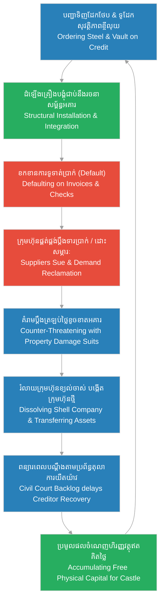

# Episode 8: ជាងសំណង់គ្មានឈ្មោះ (Rotated Labor)

**Author:** ichamrong  
**Date:** 2026-06-07  
**Tags:** #hh-holmes #screenplay #episode-8 #gilded-age #chicago #construction-fraud #rotated-labor #vault-installation #civil-lawsuits #historical-case-study  
**Category:** Biographies  
**Read Time:** ~15 min  

---

## 📌 មាតិកា (Table of Contents)
- [សេចក្តីផ្តើម៖ យន្តការបោកប្រាស់ឥណទានជាន់គ្នា (Introduction: The Pyramided Fraud System)](#0)
- [១. ប្លង់ទី ១៖ ការបោកប្រាស់ក្រុមហ៊ុនផ្គត់ផ្គង់ដែកថែប (Scene 1: Defrauding the Steel Suppliers)](#1)
- [២. ប្លង់ទី ២៖ ការដំឡើងទូដែក និងការបោកប្រាស់ក្រុមហ៊ុនទូសុវត្ថិភាព (Scene 2: Defrauding the Safe Maker)](#2)
- [៣. ប្លង់ទី ៣៖ ការបង្វិលក្រុមជាងសំណង់ជាប្រព័ន្ធ (Scene 3: Systematic Crew Rotation)](#3)
- [៤. ប្លង់ទី ៤៖ ការរៀបចំដោះស្រាយបណ្តឹងរដ្ឋប្បវេណី (Scene 4: Juggling Civil Lawsuits)](#4)
- [៥. យន្តការឥណទានបោកប្រាស់ជាប្រព័ន្ធ (The Pyramiding Credit Fraud System)](#5)
- [សេចក្តីសន្និដ្ឋាន (Conclusion)](#6)
- [🔗 ឯកសារទាក់ទង (Related Topics)](#7)

---

## សេចក្តីផ្តើម៖ យន្តការបោកប្រាស់ឥណទានជាន់គ្នា (Introduction: The Pyramided Fraud System)

រឿងភាគទី ៨ នេះ ផ្អែកលើករណីសិក្សាប្រវត្តិសាស្ត្រពិតនៃវិធីសាស្ត្រ «បោកប្រាស់ឥណទានជាន់គ្នា» (Pyramiding Credit Fraud) ដែល H.H. Holmes ប្រើប្រាស់ដើម្បីទិញសម្ភារសំណង់ធុនធ្ងន់ និងបញ្ចប់ការសាងសង់ជញ្ជាំង និងគ្រឿងបង្គុំអគារ Castle ក្នុងតំបន់ Englewood ទីក្រុង Chicago ក្នុងចន្លោះឆ្នាំ ១៨៨៨ ដល់ ១៨៩០។ Holmes បានទិញធ្នឹមដែកថែបពីក្រុមហ៊ុន **Aetna Iron and Steel Co.** និងទិញទូដែកសុវត្ថិភាពធំ (Walk-in Vault) ពីក្រុមហ៊ុនផលិតទូដែកក្រុង Chicago ដោយប្រើប្រាស់ឥណទាន និងការបញ្ជាទិញក្រោមឈ្មោះក្រុមហ៊ុនខ្យល់ រួចខកខានការទូទាត់ប្រាក់ (Default) ទាំងស្រុង។ Holmes បានប្រើប្រាស់ចន្លោះប្រហោងច្បាប់ពាណិជ្ជកម្ម និងប្រព័ន្ធតុលាការរដ្ឋប្បវេណីដ៏យឺតយ៉ាវ ដើម្បីពន្យារពេលបណ្តឹង ខណៈដែលអគាររបស់គេត្រូវបានសាងសង់រួចរាល់ដោយប្រើប្រាស់សម្ភារៈ និងកម្លាំងពលកម្មឥតគិតថ្លៃទាំងស្រុង។

This eighth episode is based on the documented historical case study of the "pyramiding credit fraud" system H.H. Holmes engineered to procure heavy building materials and complete the Castle's structural framework in Englewood, Chicago, between 1888 and 1890. Holmes ordered steel girders from the **Aetna Iron and Steel Co.** and a massive walk-in vault from a Chicago safe manufacturer on credit using shell aliases, subsequently defaulting on all payments. He exploited Gilded Age commercial legal loopholes and Chicago's backlogged civil court docket to tie up creditors in litigation, while completing his structural machine entirely with free materials and swindled labor.

---

## ១. ប្លង់ទី ១៖ ការបោកប្រាស់ក្រុមហ៊ុនផ្គត់ផ្គង់ដែកថែប (Scene 1: Defrauding the Steel Suppliers)

**ទីតាំង៖** ការដ្ឋានសំណង់អគារ Castle, ផ្លូវលេខ ៦៣ និង Wallace St, ឆ្នាំ ១៨៨៩ (វេលាព្រឹកព្រលឹម)  
**Location:** The Castle Construction Site, 63rd and Wallace St, 1889 (Dawn)

**សកម្មភាព៖** រទេះសេះធុនធ្ងន់ជាច្រើនគ្រឿងកំពុងដឹកជញ្ជូនធ្នឹមដែកថែប និងសសរដែកខ្នាតធំមកដល់ការដ្ឋានសំណង់។ កម្មករកំពុងលើកដែកចុះ។ Holmes (ស្លៀកពាក់អាវធំវែងប្រណីត កាន់បញ្ជីផ្ទៀងផ្ទាត់ទំនិញ) ឈរជជែកជាមួយលោក វ៉ាន់ស៍ (Mr. Vance) ដែលជាភ្នាក់ងារទារប្រាក់មកពីក្រុមហ៊ុន Aetna Iron and Steel Co.។ Holmes បង្ហាញភាពស្និទ្ធស្នាល និងហុចក្រដាសបញ្ជាក់ការទូទាត់ប្រាក់តាមធនាគារ (Bank Draft) ក្លែងក្លាយឱ្យទៅគាត់។ ប៉ុន្តែ បន្ទាប់មករូបភាពកាត់ទៅកាន់ពីរបីសប្តាហ៍ក្រោយមក លោក Vance ត្រឡប់មកការដ្ឋានវិញទាំងកំហឹង ដោយកាន់វិក្កយបត្រហួសកាលកំណត់តម្លៃមួយពាន់ពីររយដុល្លារ។  
**Action:** Heavy horse-drawn flatbeds deliver massive iron girders and structural steel columns to the construction site. Laborers hoist the heavy components. Holmes (wearing an elegant overcoat, holding a checklist ledger) stands conversing with Mr. Vance, a collection agent from Aetna Iron and Steel Co. Holmes acts warmly, presenting a simulated bank draft. The scene cuts to weeks later: Mr. Vance returns to the site in a quiet rage, holding an overdue invoice for twelve hundred dollars.

<!-- [IMAGE: H.H. Holmes discussing with the Aetna Steel collector. He stands near the iron girders, presenting credit papers with a calm expression. (Image generation rate-limited, to be added later)] -->

*   **លោក វ៉ាន់ស៍ (Mr. Vance)៖** "លោកគ្រូពេទ្យ Holmes នេះជាលើកទីបីហើយដែលខ្ញុំមកទីនេះ។ ធនាគារបានបដិសេធសេចក្តីព្រាងច្បាប់ទូទាត់ប្រាក់របស់លោក! ក្រុមហ៊ុន Aetna ត្រូវការឱ្យលោកទូទាត់លុយមួយពាន់ពីររយដុល្លារថ្លៃដែកថែបនេះភ្លាម!"  
    *   *"Dr. Holmes, this is the third time I have come here. The bank rejected your draft! Aetna demands the immediate clearance of the twelve hundred dollars for these structural steel girders!"*
*   **ហូម (Holmes)៖** (និយាយដោយសំឡេងត្រជាក់ និងស្ងប់ស្ងាត់បំផុត) "លោក Vance ខ្ញុំយល់ពីការបារម្ភរបស់លោក។ ទោះជាយ៉ាងណា កិច្ចសន្យាបញ្ជាទិញនេះត្រូវបានចុះហត្ថលេខាក្រោមឈ្មោះក្រុមហ៊ុន «H.H. Holmes & Co.» ដែលជាសហគ្រាសដាច់ដោយឡែក។ គណនេយ្យកររបស់ខ្ញុំកំពុងធ្វើសវនកម្មលើការដឹកជញ្ជូន ព្រោះយើងបានរកឃើញស្នាមប្រេះបន្តិចបន្តួចលើសសរដែកពីរគ្រាប់។ ដំណើរការនេះត្រូវចំណាយពេលសាមសិបថ្ងៃទៀតដើម្បីផ្ទៀងផ្ទាត់បច្ចេកទេស។"  
    *   *(Speaking in a cool, level tone)* *"Mr. Vance, I understand your position. However, this purchase agreement was signed by 'H.H. Holmes & Co.'—a separate corporate enterprise. My auditors are reviewing the shipment, as we detected structural hairline fractures on two steel columns. The technical inspection will require another thirty days."*
*   **លោក វ៉ាន់ស៍ (Mr. Vance)៖** "ស្នាមប្រេះអី? ដែកទាំងនេះត្រូវបានតំឡើងទៅក្នុងគ្រឿងបង្គុំជាន់ទីពីររួចទៅហើយ! ឯងកំពុងប្រើប្រាស់វាដើម្បីគាំទ្រជញ្ជាំងអគាររបស់ឯង! នេះជាការលួចបន្លំ!"  
    *   *"Fractures? Those girders are already riveted into your second-floor framework! You are using them to support your building right now! This is theft!"*
*   **ហូម (Holmes)៖** "ប្រសិនបើលោកមិនពេញចិត្តនឹងដំណើរការសវនកម្មរបស់ខ្ញុំទេ លោកអាចដាក់ពាក្យប្តឹងទៅតុលាការរដ្ឋប្បវេណីបាន។ ខ្ញុំធានាថា ក្រុមហ៊ុនខ្ញុំនឹងឆ្លើយតបតាមនីតិវិធីច្បាប់។"  
    *   *"If you are unsatisfied with my auditing timeline, you are free to seek recourse in civil court. I assure you my corporation will respond within legal parameters."*

**ការពិពណ៌នា**៖ Mr. Vance ដើរចេញទៅវិញទាំងខឹងសម្បារ និងគ្មានជម្រើសក្រៅពីប្តឹងតុលាការ។ Holmes ងាកទៅមើលសសរដែកថែបដ៏រឹងមាំដែលទ្រទ្រង់ជាន់ទីពីរ។ គេប្រើប្រាស់ដែកទាំងនោះរួចរាល់ហើយ ហើយដឹងថា បណ្តឹងរដ្ឋប្បវេណីរបស់ក្រុមហ៊ុន Aetna នឹងត្រូវចំណាយពេលពីរបីឆ្នាំនៅក្នុងតុលាការក្រុង Chicago ដែលមានសំណុំរឿងកកស្ទះជាច្រើន។ គេបានទទួលដែកថែបដោយឥតគិតថ្លៃដើម្បីកសាងគ្រឹះម៉ាស៊ីនរបស់គេ។  
**Description:** Mr. Vance departs furious, left with no option but civil litigation. Holmes turns back to inspect the massive iron pillars supporting the second floor. He has already utilized the steel, knowing Aetna's civil suit will languish for years in Chicago's backlogged court docket. He has secured free structural steel to frame his machine.

---

## ២. ប្លង់ទី ២៖ ការដំឡើងទូដែក និងការបោកប្រាស់ក្រុមហ៊ុនទូសុវត្ថិភាព (Scene 2: Defrauding the Safe Maker)

**ទីតាំង៖** ជាន់ទីពីរនៃអគារ Castle, ឆ្នាំ ១៨៨៩ (វេលារសៀល)  
**Location:** The Second Floor of the Castle, 1889 (Afternoon)

**សកម្មភាព៖** ក្រុមកម្មករមកពីក្រុមហ៊ុនផលិតទូដែកក្រុង Chicago កំពុងប្រើប្រាស់ខ្សែពួរ និងធ្នឹមឈើដើម្បីអូស និងដំឡើងទូដែកសុវត្ថិភាពធំ (Walk-in Vault) ដែលមានកម្រាស់ដែកក្រាស់ និងទ្វារដែកធ្ងន់ ទៅក្នុងបន្ទប់ដេកកណ្តាលនៃជាន់ទីពីរ។ Holmes ឈរមើលដោយស្ងប់ស្ងាត់ ខណៈដែលតំណាងក្រុមហ៊ុនទូដែកម្នាក់ឈ្មោះ លោក មីល័រ (Mr. Miller) ឈរក្បែរគេដោយកាន់វិក្កយបត្រថ្លៃទូដែក និងពលកម្មដំឡើងចំនួនប្រាំរយដុល្លារ។  
**Action:** A crew of workmen from a Chicago safe manufacturer use ropes and winches to hoist and bolt a massive, thick steel-plated walk-in vault into the central bedroom suite of the second floor. Holmes watches calmly, while the safe company representative, Mr. Miller, stands beside him holding the invoice for the safe and installation labor totaling five hundred dollars.

<!-- [IMAGE: Workers bolting the massive steel vault into the second floor. H.H. Holmes stands nearby observing, holding a pocket watch. (Image generation rate-limited, to be added later)] -->

*   **លោក មីល័រ (Mr. Miller)៖** "ទូដែកត្រូវបានដំឡើង និងបាញ់ខ្ទាស់ជាប់នឹងកម្រាលឈើ និងជញ្ជាំងឥដ្ឋរួចរាល់ហើយ លោកគ្រូពេទ្យ Holmes។ ខ្ទាស់ដែក និងសោសុវត្ថិភាពដំណើរការល្អណាស់។ នេះជាវិក្កយបត្រប្រាំរយដុល្លារ ដូចបានព្រមព្រៀង។"  
    *   *"The vault is bolted and secured to the floor joists and brickwork, Dr. Holmes. The steel locks and hinges are functional. Here is the invoice for five hundred dollars as agreed."*
*   **ហូម (Holmes)៖** "ល្អណាស់ លោក Miller។ សោនេះរឹងមាំ និងមិនឮសំឡេងចេញចូលឡើយ។ ចំពោះការទូទាត់ប្រាក់ ខ្ញុំបានផ្ញើមូលប្បទានប័ត្រតាមប្រៃសណីយ៍ទៅកាន់ការិយាល័យធំរបស់លោកកាលពីម្សិលមិញរួចហើយ។"  
    *   *"Excellent, Mr. Miller. The seals are airtight and soundproof. Regarding the payment, my office mailed a corporate check to your headquarters yesterday."*
*   **លោក មីល័រ (Mr. Miller)៖** (ត្រឡប់មកវិញពីរខែក្រោយមកជាមួយកម្មករពីរនាក់ និងឡានដឹកទំនិញ) "Holmes! មូលប្បទានប័ត្ររបស់ឯងគ្មានលុយទេ! ឯងមិនទាន់បង់លុយថ្លៃទូដែកនេះសូម្បីតែមួយដុល្លារ! កម្មកររបស់ខ្ញុំនឹងមកដោះទូដែកនេះយកទៅវិញភ្លាម!"  
    *   *(Returning two months later with two movers and a wagon)* *"Holmes! Your check bounced! You haven't paid a single dollar for this vault! My men are going to uninstall and reclaim it right now!"*
*   **ហូម (Holmes)៖** (ហុចកែវតែឱ្យ Miller យ៉ាងទន់ភ្លន់ និងគ្មានភាពតានតឹង) "លោក Miller លោកអាចដោះវាទៅវិញបានគ្រប់ពេល។ ប៉ុន្តែទូដែកនេះត្រូវបានខ្ទាស់ជាប់នឹងធ្នឹមដែកថែបរបស់អគារ និងរៀបឥដ្ឋបិទជិតជុំវិញរួចទៅហើយ។ ប្រសិនបើកម្មកររបស់លោកធ្វើឱ្យខូចខាតដល់ឥដ្ឋជញ្ជាំង ឬគ្រឿងបង្គុំអគាររបស់ខ្ញុំសូម្បីតែមួយអ៊ីញ ខ្ញុំនឹងប្តឹងទារជំងឺចិត្តមួយម៉ឺនដុល្លារពីក្រុមហ៊ុនរបស់លោកភ្លាម។ សូមអញ្ជើញធ្វើតាមការគួរចុះ។"  
    *   *(Offering Miller tea with a polite, relaxed posture)* *"Mr. Miller, you are free to reclaim your property at any time. However, this vault is now bolted directly to the building's structural steel and enclosed in masonry partition walls. If your movers damage a single brick or iron support, I will sue your firm for ten thousand dollars in structural damages. Please, proceed as you wish."*

**ការពិពណ៌នា៖** ជាងដំឡើងទូដែកមើលទៅជញ្ជាំងឥដ្ឋ និងទូដែកដ៏ធ្ងន់ រួចដឹងថាពួកគេមិនអាចដោះវាចេញដោយគ្មានការវាយកម្ទេចជញ្ជាំងឡើយ។ លោក Miller ញ័រដៃទាំងកំហឹង ប៉ុន្តែមិនហ៊ានបញ្ជាឱ្យកម្មករចាប់ផ្តើមឡើយ។ ពួកគេបង្ខំចិត្តចាកចេញទៅវិញទាំងដៃទទេ ខណៈដែល Holmes ញញឹមយ៉ាងត្រជាក់ និងបិទទ្វារដែកសុវត្ថិភាពនោះភ្លាម ៗ។ ទូដែកដ៏ធ្ងន់ និងមិនឮសំឡេងនេះ បានក្លាយជាបន្ទប់ឃុំឃាំង និងជាផ្នែកមួយនៃម៉ាស៊ីនមរណៈរបស់គេដោយមិនចំណាយប្រាក់សូម្បីតែមួយសេន។  
**Description:** The safe installers look at the heavy vault and the surrounding brickwork, realizing it is impossible to remove without demolishing the walls. Miller shakes with anger but dares not order the removal. They depart empty-handed, while Holmes smiles coldly, shutting the vault's heavy steel door. The airtight, soundproof safe has become a permanent chamber in his machine, obtained entirely for free.

---

## ៣. ប្លង់ទី ៣៖ ការបង្វិលក្រុមជាងសំណង់ជាប្រព័ន្ធ (Scene 3: Systematic Crew Rotation)

**ទីតាំង៖** ជាន់ទីពីរនៃអគារ Castle, ឆ្នាំ ១៨៨៩-១៨៩០  
**Location:** The Second Floor of the Castle, 1889-1890

**សកម្មភាព៖** បង្ហាញជាទិដ្ឋភាពចលនាលឿន (Montage) នៃការសាងសង់ជញ្ជាំង និងការរៀបចំប្រព័ន្ធទឹក និងហ្គាស។ ជាងសំណង់ និងជាងទឹកផ្សេង ៗ គ្នា មកធ្វើការជាក្រុមដាច់ដោយឡែក។ Holmes ជួលពួកគេមកធ្វើការសាងសង់ផ្នែកខ្លី ៗ នៃអគារ រួចរកលេសដេញពួកគេចេញមុនពេលកំណត់បើកលុយប្រចាំខែ។ គេចង្អុលបង្ហាញពីកំហុសបច្ចេកទេសតូចតាច ដើម្បីគេចវេសមិនបង់ប្រាក់ និងធ្វើឱ្យពួកគេចាកចេញដោយក្តីខកចិត្ត។  
**Action:** A fast-paced montage depicts the construction of partition walls and the installation of plumbing and gas lines. Different construction crews and plumbers work on isolated sections. Holmes hires them for short, compartmentalized tasks, then finds excuses to fire them right before their monthly payments fall due. He points out minor structural imperfections to default on their invoices, forcing them to leave frustrated.

<!-- [IMAGE: Montage of different construction workers at the Castle. Holmes stands in the center pointing out minor flaws to a frustrated plumber. (Image generation rate-limited, to be added later)] -->

*   **ហូម (Holmes)៖** (និយាយទៅកាន់ជាងទឹកក្រុមទី ១) "ប្រព័ន្ធបំពង់ហ្គាសនេះបត់បែនមិនស្មើគ្នា និងគ្មានសុវត្ថិភាពឡើយ។ ខ្ញុំមិនអាចទទួលយកការងារអន់ថយបែបនេះបានទេ។ កិច្ចសន្យារបស់លោកត្រូវបានលុបចោល!"  
    *   *(Speaking to Plumber Crew 1)* *"This gas line layout is misaligned and unsafe. I cannot accept such incompetent craftsmanship. Your contract is nullified!"*
*   **ជាងទឹកក្រុមទី ១ (Plumber 1)៖** "ប៉ុន្តែលោកគ្រូពេទ្យ នេះជាគំនូរប្លង់ដែលលោកបានប្រគល់ឱ្យខ្ញុំ! ខ្ញុំបានធ្វើតាមការណែនាំរបស់លោកយ៉ាងលម្អិត..."  
    *   *"But Doctor, this is the exact diagram you handed me! I followed your design specifications precisely..."*
*   **ហូម (Holmes)៖** (និយាយទៅកាន់ជាងឈើក្រុមទី ២ ក្នុងប្លង់បន្ទាប់) "កម្រាលឈើនេះមានសំឡេងក្រេកក្រកខ្លាំងណាស់ ពេលដើរកាត់។ នេះជាការរំលោភលើគុណភាពសំណង់។ ចាកចេញពីអគាររបស់ខ្ញុំភ្លាម!"  
    *   *(Speaking to Carpenter Crew 2 in the next sequence)* *"These floorboards creak excessively. This is a clear breach of our structural quality agreement. Vacate my premises immediately!"*
*   **ជាងឈើក្រុមទី ២ (Carpenter 2)៖** "ឯងជាមនុស្សបោកប្រាស់! ឯងដេញជាងសំណង់ចេញរាល់ពីរសប្តាហ៍ម្តង! គ្មាននរណាម្នាក់អាចធ្វើការជាមួយឯងបានឡើយ!"  
    *   *"You are a fraud! You fire construction crews every two weeks! Nobody can work with you!"*

**ការពិពណ៌នា៖** ជាងសំណង់ជាច្រើននាក់ដើរចេញពីការដ្ឋានទាំងកំហឹង និងក្តីអស់សង្ឃឹម។ យុទ្ធសាស្ត្រនេះបានដំណើរការយ៉ាងល្អឥតខ្ចោះ។ ក្រុមជាងនីមួយ ៗ យល់ដឹងតែពីប្លង់តូចមួយដែលពួកគេបានធ្វើប៉ុណ្ណោះ។ ក្រុមជាងទឹកដំឡើងតែបំពង់ហ្គាស ក្រុមជាងឈើសាងសង់តែជញ្ជាំងបិទបាំង ហើយគ្មាននរណាម្នាក់ដឹងថា ជញ្ជាំង និងបំពង់ទាំងនោះត្រូវបានតភ្ជាប់គ្នាជាប្រព័ន្ធបង្ហូរហ្គាសពុលទៅកាន់បន្ទប់នីមួយ ៗ ឡើយ។ ភាពច្របូកច្របល់នៃកម្លាំងពលកម្មបានធានានូវការសម្ងាត់ខ្ពស់បំផុតនៃវិមានរបស់ Holmes។  
**Description:** Crews of workers depart in anger and despair. The strategy functions flawlessly. Each crew only understands the narrow segment they worked on: plumbers install the gas pipes, carpenters seal the enclosing walls, and none comprehend how these lines connect to form a toxic gas delivery system to the bedrooms. The fragmentation of labor guarantees the absolute secrecy of Holmes' Castle.

---

## ៤. ប្លង់ទី ៤៖ ការរៀបចំដោះស្រាយបណ្តឹងរដ្ឋប្បវេណី (Scene 4: Juggling Civil Lawsuits)

**ទីតាំង៖** ការិយាល័យផ្ទាល់ខ្លួនរបស់ Holmes នៅក្នុងឱសថស្ថាន, ឆ្នាំ ១៨៩០ (វេលាយប់ជ្រៅ)  
**Location:** Holmes' Private Office inside the Drugstore, 1890 (Late Night)

**សកម្មភាព៖** ចង្កៀងប្រេងកាតមួយបំភ្លឺបន្ទប់ការិយាល័យងងឹត។ លើតុសរសេររបស់ Holmes មានគំនរដីកាកោះហៅតុលាការរដ្ឋប្បវេណី និងលិខិតទាមទារបំណុលហួសកាលកំណត់រាប់សិបសន្លឹក ព្រមទាំងលិខិតព្រមានពីអាជ្ញាធរក្រុង។ Holmes អង្គុយសរសេរយ៉ាងស្ងប់ស្ងាត់នៅក្នុង **«បញ្ជីវាស់វែងវិន័យ» ([Discipline Ledger](../keyword/discipline-ledger.md))**។ Pitezel ឈរក្បែរតុដោយទឹកមុខបារម្ភ និងភ័យខ្លាចការចាប់ខ្លួន។ Holmes ហុចកែវស្រាឱ្យគាត់ និងនិយាយដោយភាពព្រងើយកន្តើយ។  
**Action:** A single kerosene lamp lights the dark office. On Holmes' desk sits a large stack of civil court summonses, mechanics' liens, and overdue supply bills. Holmes sits relaxed, systematically entering court dates and corporate details into his [Discipline Ledger](../keyword/discipline-ledger.md). Pitezel stands nearby, his expression anxious, fearing police intervention. Holmes pours him whiskey, completely unbothered.

<!-- [IMAGE: H.H. Holmes analyzing a stack of court summonses and liens at his desk. Pitezel stands nearby with a worried expression. (Image generation rate-limited, to be added later)] -->

*   **ផាយធាហ្សល (Pitezel)៖** "លោក Holmes... មន្ត្រីតុលាការបានមកសួររកលោកម្តងទៀតហើយថ្ងៃនេះ។ ពួកគេមានដីកាតុលាការពីក្រុមហ៊ុន Aetna និងក្រុមហ៊ុនផ្គត់ផ្គង់ឈើ។ ប្រសិនបើយើងនៅតែគេចវេសបែបនេះ ប៉ូលីសនឹងមកបិទអគាររបស់យើងជាមិនខាន!"  
    *   *"Mr. Holmes... the process server came looking for you again today. They have summonses from Aetna and the lumber firm. If we keep avoiding them, the sheriff will padlock the building!"*
*   **ហូម (Holmes)៖** (និយាយដោយស្នាមញញឹមស្ងប់ស្ងាត់ និងសរសេរបញ្ជី) "Pitezel ប៉ូលីសមិនមានសមត្ថកិច្ចមកបិទអគារក្នុងសំណុំរឿងបំណុលរដ្ឋប្បវេណីឡើយ។ ដីកាទាំងនេះកោះហៅឈ្មោះ «H.H. Holmes & Co.» ប៉ុន្តែក្រុមហ៊ុននោះត្រូវបានរំលាយ និងផ្ទេរទ្រព្យសកម្មទៅឱ្យក្រុមហ៊ុន «Campbell Chemical Co.» តាំងពីខែមុនម្ល៉េះ។ មន្ត្រីតុលាការត្រូវចំណាយពេលប្រាំមួយខែទៀតដើម្បីរកឃើញការពិតនេះ រួចដាក់ពាក្យប្តឹងក្រុមហ៊ុនថ្មីម្តងទៀត។"  
    *   *(Smiling calmly, continuing to write)* *"Pitezel, the police have no authority to seize property in simple civil debt disputes. These summonses name 'H.H. Holmes & Co.'—but that entity was liquidated and its assets transferred to 'Campbell Chemical Co.' last month. The courts will take six months just to discover this, then they must file against the new entity."*
*   **ផាយធាហ្សល (Pitezel)៖** "ចុះថ្លៃពលកម្មរបស់ជាងសំណង់ និងជាងទឹកទាំងនោះវិញ? ពួកគេកំពុងរៀបចំប្តឹងទារទ្រព្យសម្បត្តិជំពាក់លុយ (Mechanic's Liens) លើដីអគាររបស់យើង!"  
    *   *"And what about the workers' liens? They are placing mechanic's liens directly on our property title!"*
*   **ហូម (Holmes)៖** (បិទសៀវភៅបញ្ជី រួចសម្លឹងមើលទៅក្រៅបង្អួចសំដៅទៅរកអគារ Castle ដែលជិតរួចរាល់) "លិខិតធានាដីធ្លីរបស់យើងត្រូវបានចុះបញ្ជីក្រោមឈ្មោះ Dummy Buyer ដែលជាមនុស្សមិនមានអត្តសញ្ញាណពិតប្រាកដ។ តុលាការមិនអាចប្រកាសលក់ដីដែលគ្មានម្ចាស់ច្បាស់លាស់ឡើយ។ ភាពយឺតយ៉ាវនៃច្បាប់ គឺជាដៃគូសហការដ៏ល្អបំផុតរបស់យើង Pitezel។ អគាររបស់យើងជិតរួចរាល់ហើយ ដោយមិនបាត់បង់លុយសូម្បីតែមួយដុល្លារ។"  
    *   *(Closing his ledger, gazing through the window at the near-complete Castle)* *"Our land title is registered to a straw buyer—a non-existent identity. The courts cannot foreclose on a title with undefined ownership. Legal backlog is our finest partner, Pitezel. Our Castle is complete, and we have spent virtually nothing."*

**ការពិពណ៌នា៖** Holmes ផឹកស្រាវីស្គីមួយក្អកដោយភាពស្ងប់ស្ងាត់។ គេបានប្រើប្រាស់ប្រព័ន្ធតុលាការរដ្ឋប្បវេណី និងការបង្កើតក្រុមហ៊ុនខ្យល់ជាន់គ្នា ដើម្បីការពារខ្លួនពីបណ្តឹង និងទាញយកផលចំណេញហិរញ្ញវត្ថុ។ គេដឹងថា ឥឡូវនេះអគារ Castle មានគ្រឿងបង្គុំ និងបន្ទប់សម្ងាត់រួចរាល់អស់ហើយ ហើយគេត្រៀមខ្លួនរួចជាស្រេចដើម្បីបន្តជំហានបន្ទាប់នៃការធ្វើប្រតិបត្តិការអាជីវកម្មឧក្រិដ្ឋកម្មដ៏ធំបំផុតនៅក្នុងទីក្រុង Chicago។  
**Description:** Holmes sips his whiskey with flat indifference. He has leveraged the slow civil courts and nested shell names to insulate himself from liability while extracting massive physical capital. The structural phase of the Castle is complete, and he stands ready to initiate his dark enterprise in Gilded Age Chicago.

---

## ៥. យន្តការឥណទានបោកប្រាស់ជាប្រព័ន្ធ (The Pyramiding Credit Fraud System)

ដ្យាក្រាមខាងក្រោមបង្ហាញពីរង្វង់យន្តការដែល H.H. Holmes ប្រើប្រាស់ដើម្បីសាងសង់អគារ Castle ដោយមិនចំណាយលុយ និងគ្រប់គ្រងបណ្តឹងរដ្ឋប្បវេណី៖

The following diagram maps the strategic loop Holmes engineered to construct the Castle using pyramided credit fraud and civil legal delays:

> [!IMPORTANT]
> **🧠 យន្តការចិត្តសាស្ត្រ / Psychological Mechanism - [លំហូរនៃធនធាន និងការរៀបចំយន្តការ (Flow of Resources and Mechanics)](../keyword/flow-of-resources-and-mechanics.md):**
> * «នៅក្នុងប្លង់ទី ២ Holmes មើលឃើញទូដែក និងគ្រឿងដែកធុនធ្ងន់ ត្រឹមតែជាធនធានរូបវន្តដែលត្រូវស្រូបទាញ និងភ្ជាប់ជាប់នឹងម៉ាស៊ីនរបស់គេ។ គេប្រើប្រាស់ច្បាប់ការពារទ្រព្យសម្បត្តិឯកជន ដើម្បីគំរាមកំហែងក្រុមហ៊ុនផ្គត់ផ្គង់វិញ ដោយគ្មានការខ្វល់ខ្វាយពីសីលធម៌នៃការបង់ប្រាក់ឡើយ។» (*"In Scene 2, Holmes views the steel vault and iron girders merely as physical resources to be absorbed and bolted into his machine. He weaponizes property damage laws to threaten the suppliers, completely detached from payment ethics."*).
> 
> **🤫 យន្តការចិត្តសាស្ត្រ / Psychological Mechanism - [បញ្ជីវាស់វែងវិន័យ (Discipline Ledger)](../keyword/discipline-ledger.md):**
> * «នៅក្នុងប្លង់ទី ៤ Holmes អនុវត្តវិន័យដ៏ហ្មត់ចត់ក្នុងការគ្រប់គ្រងបណ្តឹងរដ្ឋប្បវេណី និងការរំលាយក្រុមហ៊ុនខ្យល់។ គេមិនបណ្តោយឱ្យកំហឹងរបស់ម្ចាស់បំណុល ឬដីកាកោះហៅរបស់តុលាការ មកបង្កើតក្តីបារម្ភ ឬរំខានដល់ផែនការធំឡើយ ដោយគេគ្រប់គ្រងរាល់ដំណើរការផ្លូវច្បាប់ជាយន្តការរដ្ឋបាលសុទ្ធសាធ។» (*"In Scene 4, Holmes exercises precise discipline in managing civil litigation and shell transitions. He refuses to allow creditor outrage or process servers to induce anxiety or disrupt his blueprint, treating the entire legal defense as a purely administrative system."*).

---

## សេចក្តីសន្និដ្ឋាន (Conclusion)

> **«នៅក្នុងប្រព័ន្ធឥណទានសម័យ Gilded Age ភាពយឺតយ៉ាវនៃតុលាការ និងការបង្កើតក្រុមហ៊ុនខ្យល់ គឺជាចន្លោះប្រហោងដ៏ល្អឥតខ្ចោះសម្រាប់ពួកយើងក្នុងការសាងសង់អាណាចក្រដោយគ្មានដើមទុន» — H.H. Holmes**
> 
> **“In the Gilded Age credit system, court backlogs and shell companies are the perfect loopholes to construct empires with zero capital.” — H.H. Holmes**

រឿងភាគទី ៨ បិទបញ្ចប់ដោយ Holmes បញ្ឈរស្រោមសំបុត្រដីកាតុលាការទាំងអស់តម្រៀបជាជួរស្អាតបាតនៅលើតុ រួចចាក់សោរបន្ទប់ការិយាល័យ និងដើរចេញទៅក្រៅ។ គេសម្លឹងមើលអគារ Castle ដែលឥឡូវនេះមានសសរដែក និងទូដែកសុវត្ថិភាពដំឡើងរួចរាល់ ត្រៀមខ្លួនសម្រាប់ភាគទី ៩ ដែលបង្ហាញពីការជ្រើសរើស Benjamin Pitezel ឱ្យមកជាដៃគូជំនិតផ្លូវការរបស់ខ្លួន។

Episode 8 concludes with Holmes organizing the stack of court summonses neatly on his desk, locking the office, and walking out. He looks up at the complete framework of the Castle, featuring the steel girders and walk-in safe, setting the stage for Episode 9, which will cover the formal recruitment of Benjamin Pitezel as his right-hand partner in crime.

---

## 🔗 ឯកសារទាក់ទង (Related Topics)
*   **[Episode 7: ប្លង់មេនៃសេចក្តីស្លាប់ (The Secret Blueprint)](ep-07-the-secret-blueprint.md)** — ស្គ្រីបភាគទី ៧ ដែល Holmes ចាប់ផ្តើមគូរប្លង់មេនៃវិមាន និងការ compartmentalization របស់ជាងសំណង់។
*   **[Episode 9: ដៃគូក្នុងស្រមោល (Meeting Pitezel)](ep-09-meeting-pitezel.md)** — ស្គ្រីបភាគទី ៩ ដែល Holmes ជ្រើសរើស និងជ្រើសតាំង Benjamin Pitezel ជាដៃស្តាំរបស់ខ្លួន។
*   **[លំហូរនៃធនធាន និងការរៀបចំយន្តការ (Flow of Resources and Mechanics)](../keyword/flow-of-resources-and-mechanics.md)** — វិធីសាស្ត្រចិត្តសាស្ត្រដែលចាត់ទុកជីវិតជាទ្រព្យសកម្មរូបវន្ត។
*   **[បញ្ជីវាស់វែងវិន័យ (Discipline Ledger)](../keyword/discipline-ledger.md)** — វិធីសាស្ត្រតាមដាន និងគ្រប់គ្រងចិត្តសាស្ត្ររបស់ Holmes។
*   **[ជីវប្រវត្តិ H.H. Holmes](../01-h-h-holmes-biography.md)** — ជីវប្រវត្តិនៃការវិវឌ្ឍជីវិត និងវិមានឃាតកម្មរបស់ Holmes។
*   **[គម្រោងរឿងភាគដ្រាម៉ា ៦៣ ភាគ](../08-holmes-drama-episode-guide.md)** — ផែនការ និងការសង្ខេបរឿងភាគទូរទស្សន៍ទាំង ៦៣ ភាគ។
