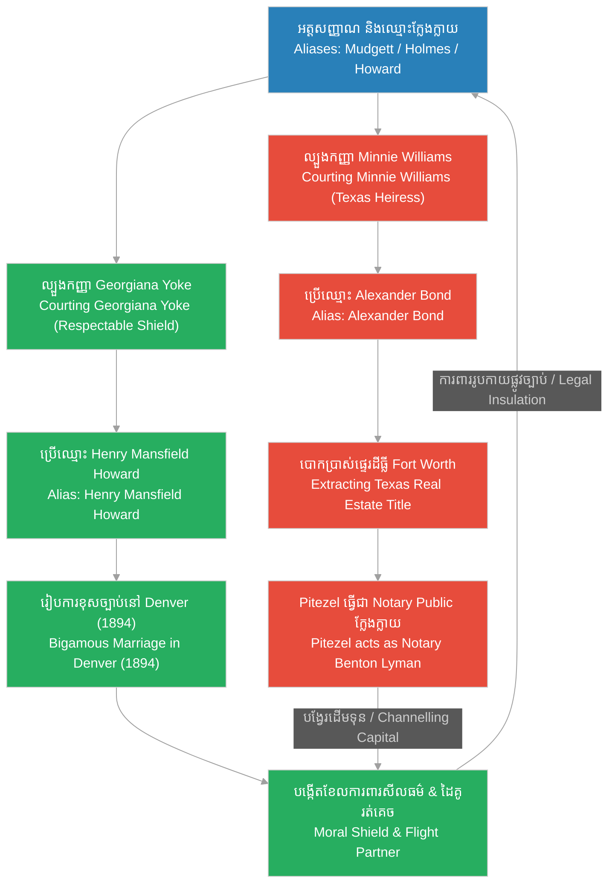

# Episode 11: អាពាហ៍ពិពាហ៍ក្លែងក្លាយ (Wives and Aliases)

**Author:** ichamrong  
**Date:** 2026-06-07  
**Tags:** #hh-holmes #screenplay #episode-11 #gilded-age #chicago #bigamy #matrimonial-fraud #minnie-williams #georgiana-yoke #alexander-bond #historical-case-study  
**Category:** Biographies  
**Read Time:** ~15 min  

---

## 📌 មាតិកា (Table of Contents)
- [សេចក្តីផ្តើម៖ វិស្វកម្មហិរញ្ញវត្ថុនៃអាពាហ៍ពិពាហ៍ (Introduction: The Financial Engineering of Marriage)](#0)
- [១. ការល្បួងកញ្ញា Minnie Williams (Scene 1: Courting the Heiress Minnie Williams)](#1)
- [២. ការលួចប្លង់ដីធ្លីនៅ Texas (Scene 2: The Texas Land Deed Manipulation)](#2)
- [៣. ការបង្ហាញខ្លួនរបស់កញ្ញា Georgiana Yoke (Scene 3: Courting Georgiana Yoke)](#3)
- [៤. អាពាហ៍ពិពាហ៍នៅ Denver និងអត្តសញ្ញាណជាន់គ្នា (Scene 4: The Denver Wedding and Multiple Identities)](#4)
- [៥. យន្តការបោកប្រាស់អាពាហ៍ពិពាហ៍ និងការបង្វែរទ្រព្យសម្បត្តិ (Matrimonial Fraud & Asset Extraction Loops)](#5)
- [សេចក្តីសន្និដ្ឋាន (Conclusion)](#6)
- [🔗 ឯកសារទាក់ទង (Related Topics)](#7)

---

## សេចក្តីផ្តើម៖ វិស្វកម្មហិរញ្ញវត្ថុនៃអាពាហ៍ពិពាហ៍ (Introduction: The Financial Engineering of Marriage)

រឿងភាគទី ១១ នេះ ផ្អែកលើករណីសិក្សាប្រវត្តិសាស្ត្រពិតនៃវិធីសាស្ត្រ «បោកប្រាស់អាពាហ៍ពិពាហ៍ និងអត្តសញ្ញាណជាន់គ្នា» (Matrimonial Fraud and Multiple Aliases) ដែល H.H. Holmes ប្រើប្រាស់ដើម្បីទាញយកទ្រព្យសម្បត្តិហិរញ្ញវត្ថុ និងបង្កើតខែលការពារផ្លូវច្បាប់ក្នុងចន្លោះឆ្នាំ ១៨៩២ ដល់ ១៨៩៤។ Holmes មិនត្រឹមតែរៀបការជាមួយ Myrta Belknap ទាំងខ្លួននៅមានចំណងអាពាហ៍ពិពាហ៍ជាមួយ Clara Lovering ប៉ុណ្ណោះទេ គេថែមទាំងបានល្បួងយកដីធ្លីតម្លៃរាប់ម៉ឺនដុល្លារនៅរដ្ឋ Texas ពីកញ្ញា **Minnie Williams** ក្រោមឈ្មោះក្លែងក្លាយជា **Alexander Bond**។ លើសពីនេះ គេបានរៀបការជាមួយកញ្ញា **Georgiana Yoke** ក្រោមអត្តសញ្ញាណជា **Henry Mansfield Howard** ដែលធ្វើឱ្យគេក្លាយជាស្វាមីរបស់ស្ត្រីបីនាក់ក្នុងពេលតែមួយក្រោមឈ្មោះបីផ្សេងគ្នា ក្នុងគោលបំណងទាញយកទ្រព្យសកម្ម និងបង្កើតកេរ្តិ៍ឈ្មោះសង្គមបិទបាំងសកម្មភាពឧក្រិដ្ឋរបស់ខ្លួន។

This eleventh episode is based on the documented historical case study of the matrimonial fraud and multiple aliases H.H. Holmes deployed to extract financial assets and build legal insulation between 1892 and 1894. Holmes did not stop at bigamously marrying Myrta Belknap while still legally bound to Clara Lovering; he courted and swindled **Minnie Williams**, a wealthy heiress from Texas, transferring her valuable Fort Worth real estate to his dummy alias, **Alexander Bond**. Furthermore, he married **Georgiana Yoke** under the identity **Henry Mansfield Howard**, making him legally bound to three women simultaneously under three different names, structured entirely to extract wealth and engineer social shields.

---

## ១. ការល្បួងកញ្ញា Minnie Williams (Scene 1: Courting the Heiress Minnie Williams)

**ទីតាំង៖** ឱសថស្ថាន និងបន្ទប់ទទួលភ្ញៀវរបស់ Holmes ក្នុងអគារ Castle, ឆ្នាំ ១៨៩២ (វេលារសៀល)  
**Location:** The Drugstore and Parlor of the Castle, Englewood, 1892 (Afternoon)

**សកម្មភាព៖** Minnie Williams (នារីវ័យក្មេងមកពី Texas រូបរាងសាមញ្ញ ស្លូតបូត និងមានទឹកមុខទន់ភ្លន់ ធ្វើការជាលេខាកត់ត្រា) កំពុងវាយអង្គុលីលេខនៅលើតុ។ Holmes (ពាក់អាវធំប្រណីត បង្ហាញស្នាមញញឹមដ៏មានមន្តស្នេហ៍) ដើរចូលមកជិត និងដាក់ដៃលើស្មារបស់នាងថ្នម ៗ។ គេហុចកញ្ចប់កាដូតូចមួយដែលមានខ្សែកមាសប្រណីតឱ្យនាង។ Minnie ងើបមើលមកគេដោយទឹកភ្នែករំភើប និងកែវភ្នែកពោរពេញដោយក្តីស្រឡាញ់។  
**Action:** Minnie Williams (a young woman from Texas, with a plain, gentle appearance, working as Holmes' stenographer) types at her desk. Holmes (wearing a refined coat, presenting his charming smile) approaches and gently places his hand on her shoulder. He presents her with a small gift box containing a delicate gold necklace. Minnie looks up, her eyes bright with emotion and deep infatuation.

<!-- [IMAGE: H.H. Holmes courting Minnie Williams inside the Castle parlor. Minnie looks at him with infatuation. (Image generation rate-limited, to be added later)] -->

*   **ហូម (Holmes)៖** "Minnie អូនជាលេខាដែលឧស្សាហ៍ព្យាយាម និងឆ្លាតវៃបំផុតដែលបងធ្លាប់ជួប។ ខ្សែកមាសនេះ សមស្របនឹងសម្រស់ដ៏ទន់ភ្លន់របស់អូនណាស់។ បងមិនចង់ឱ្យអូនហត់នឿយនឹងការងារការិយាល័យបែបនេះពេញមួយជីវិតឡើយ។"  
    *   *"Minnie, you are the most diligent and intelligent assistant I have ever known. This gold necklace complements your gentle grace. I do not wish for you to spend your life burdened by office labor."*
*   **មីននី (Minnie)៖** (ទទួលខ្សែកមកពាក់ ដៃញាប់ញ័រដោយភាពរំភើប) "អូ! បង Herman... គ្មាននរណាម្នាក់ធ្លាប់ផ្តល់កាដូដ៏មានតម្លៃ និងនិយាយពាក្យផ្អែមល្ហែមដាក់ខ្ញុំបែបនេះឡើយ។ លោកពុករបស់ខ្ញុំបានចែកឋានទៅ ហើយបន្សល់ទុកតែដីធ្លីនៅ Texas ដែលខ្ញុំមិនដឹងថាត្រូវគ្រប់គ្រងបែបណា។ ខ្ញុំមានអារម្មណ៍ថាឯកោខ្លាំងណាស់ ទីក្រុង Chicago នេះធំធ្លីពេកសម្រាប់ខ្ញុំ។"  
    *   *(Taking the necklace, her hands trembling with emotion)* *"Oh! Herman... no one has ever treated me with such kindness or presented me with such valuable tokens. My father passed away, leaving me Fort Worth real estate that I have no capacity to manage. I have felt so isolated; Chicago is too vast and cold for me."*
*   **ហូម (Holmes)៖** (កាន់ដៃនាងយ៉ាងណែន និងនិយាយដោយសំឡេងទន់ភ្លន់) "អូនមិនឯកោទៀតឡើយ Minnie។ ចាប់ពីពេលនេះទៅ បងនឹងក្លាយជាអ្នកការពារ និងមើលថែអូន និងអនាគតហិរញ្ញវត្ថុរបស់អូន។ បងនឹងប្រើប្រាស់ចំណេះដឹងពាណិជ្ជកម្មរបស់បង ដើម្បីអភិវឌ្ឍទ្រព្យសម្បត្តិរបស់អូនឱ្យក្លាយជាអាណាចក្រពិតប្រាកដ។"  
    *   *(Holding her hands tightly, speaking in a soft, resonant tone)* *"You are no longer alone, Minnie. From this moment, I will be your protector, guarding your safety and your financial future. I will deploy my commercial expertise to develop your assets into a true empire."*

**ការពិពណ៌នា៖** Minnie ផ្អែកក្បាលលើទ្រូងរបស់ Holmes ទាំងក្តីទុកចិត្តទាំងស្រុង។ Holmes ឱបនាង និងថើបក្បាលនាងថ្នម ៗ ប៉ុន្តែកែវភ្នែកពណ៌ខៀវត្រជាក់របស់គេមិនព្រិចឡើយ គេសម្លឹងមើលទៅឯកសារដីធ្លីរដ្ឋ Texas របស់នាងដែលដាក់នៅលើតុដោយភាពត្រជាក់សំបកក្រៅ។ គេដឹងថា គេបានរកឃើញប្រភពធនធានថ្មីមួយទៀតដែលនឹងផ្តល់ដើមទុនដ៏ធំសម្រាប់ប្រតិបត្តិការបន្ទាប់។  
**Description:** Minnie rests her head on Holmes' chest in absolute trust. Holmes holds her, kissing her hair gently, but his cold blue eyes remain fixed on her Texas real estate documents lying on the desk. He knows he has secured a fresh resource stream that will fund his next operational steps.

---

## ២. ការលួចប្លង់ដីធ្លីនៅ Texas (Scene 2: The Texas Land Deed Manipulation)

**ទីតាំង៖** ការិយាល័យផ្ទាល់ខ្លួនរបស់ Holmes ក្នុងអគារ Castle, ឆ្នាំ ១៨៩២ (វេលាយប់ជ្រៅ)  
**Location:** Holmes' Private Office inside the Castle, 1892 (Late Night)

**សកម្មភាព៖** ចង្កៀងប្រេងកាតបំភ្លឺតុការិយាល័យ។ Holmes ហុចលិខិតផ្ទេរកម្មសិទ្ធិដីធ្លីរដ្ឋ Texas ឱ្យទៅ Minnie។ ក្នុងឯកសារនោះ ឈ្មោះអ្នកទទួលផ្ទេរគឺ «Alexander Bond»។ Pitezel (ស្លៀកពាក់អាវធំផ្លូវការ ពាក់វ៉ែនតា និងដើរតួជាភ្នាក់ងារច្បាប់ ឬ Notary ឈ្មោះ Benton T. Lyman) ឈរក្បែរតុ កាន់ត្រាដែកសម្រាប់វាយសញ្ញាសម្គាល់ផ្លូវការ។  
**Action:** A kerosene lamp illuminates the desk. Holmes presents a formal deed transfer document for the Fort Worth, Texas real estate to Minnie. In the document, the transferee is named "Alexander Bond." Pitezel (dressed in a formal suit and spectacles, playing the role of a legal notary named Benton T. Lyman) stands beside the desk, holding an official notary seal.

<!-- [IMAGE: Minnie Williams signing the real estate deed. H.H. Holmes stands behind her, looking at the paper. (Image generation rate-limited, to be added later)] -->

*   **ហូម (Holmes)៖** "Minnie កិច្ចសន្យានេះនឹងផ្ទេរដីធ្លីនៅ Fort Worth របស់អូន ទៅឱ្យដៃគូវិនិយោគរបស់បងគឺលោក «Alexander Bond» ជាបណ្តោះអាសន្ន។ លោក Bond នឹងប្រើប្រាស់ដីនេះជាទ្រព្យបញ្ចាំដើម្បីបើកឥណទានដកលុយពីធនាគារយកមកសាងសង់អាគារថ្មីសម្រាប់យើង។ លោក Lyman ទីនេះជាសាក្សីផ្លូវច្បាប់។ វិធីនេះនឹងជួយការពារអូនពីពន្ធដីធ្លីរដ្ឋដ៏ខ្ពស់។"  
    *   *"Minnie, this contract temporarily transfers your Fort Worth real estate to my investment associate, 'Alexander Bond.' Mr. Bond will leverage this title to secure bank credits to fund our new joint development. Mr. Lyman here is our legal notary. This structure insulates you from high state property taxes."*
*   **មីននី (Minnie)៖** (សម្លឹងមើល Pitezel ទាំងមិនសូវទុកចិត្ត) "ចុះ... ចុះហេតុអ្វីបានជាខ្ញុំមិនផ្ទេរឱ្យបងផ្ទាល់តែម្តង Herman? ខ្ញុំមិនស្គាល់លោក Alexander Bond នេះឡើយ។"  
    *   *(Looking at Pitezel with slight hesitation)* *"But... why cannot I transfer the title directly to you, Herman? I do not know this Mr. Alexander Bond."*
*   **ហូម (Holmes)៖** (អង្អែលដៃនាងយ៉ាងទន់ភ្លន់ និងយកប៊ិចហុចឱ្យនាង) "ដោយសារបងមានឈ្មោះក្នុងបញ្ជីប្តឹងផ្តល់បំណុលសំណង់ដែលយើងកំពុងដោះស្រាយ Pitezel។ ប្រសិនបើផ្ទេរមកបង ម្ចាស់បំណុលនឹងមករឹបអូសដីរបស់អូនភ្លាម។ លោក Bond គឺជាអ្នកតំណាងស្អាតស្អំផ្លូវច្បាប់។ បងធ្វើបែបនេះគឺដើម្បីការពារទ្រព្យសម្បត្តិរបស់អូន។ ជឿជាក់លើបងចុះ Minnie។"  
    *   *(Stroking her hand gently, presenting her with the fountain pen)* *"Because my name is currently tied to structural debt disputes we are resolving, Minnie. If transferred to me, creditors would place liens on your land instantly. Mr. Bond is a clean legal representative. I format this purely to safeguard your inheritance. Trust me, Minnie."*
*   **ផាយធាហ្សល (Pitezel)៖** (និយាយសំឡេងផ្លូវការ ដើរតួជា Notary) "ឯកសារផ្ទេរនេះមានលក្ខណៈស្របច្បាប់ទាំងស្រុង កញ្ញា Williams។ ខ្ញុំបានពិនិត្យ និងបញ្ជាក់អត្តសញ្ញាណភាគីរួចរាល់ហើយ។ សូមចុះហត្ថលេខានៅទីនេះ។"  
    *   *(Speaking in a professional notary tone)* *"The transfer deed is structured within complete legal parameters, Miss Williams. I have verified the parties' identities. Please execute your signature here."*

**ការពិពណ៌នា៖** Minnie ចុះហត្ថលេខាលើឯកសារផ្ទេរដីធ្លីយ៉ាងណែន។ Pitezel វាយត្រាដែក «Benton T. Lyman - Notary Public» លើក្រដាសភ្លាម ៗ ឮសូរផាច់។ Holmes ទទួលយកឯកសារនោះមកកាន់ក្ដាប់ក្នុងដៃដោយស្នាមញញឹមស្ងប់ស្ងាត់។ គេដឹងថា ឈ្មោះ «Alexander Bond» គឺជាអត្តសញ្ញាណក្លែងក្លាយដាច់ដោយឡែករបស់គេ ហើយឥឡូវនេះដីធ្លីតម្លៃរាប់ម៉ឺនដុល្លារនៅ Texas បានធ្លាក់មកក្នុងដៃរបស់គេទាំងស្រុងដោយគ្មានថ្នូរទូទាត់ប្រាក់សូម្បីតែមួយដុល្លារ។  
**Description:** Minnie executes her signature on the deed. Pitezel stamps the notary seal with a sharp click. Holmes takes the executed document into his grasp, smiling quietly. He knows "Alexander Bond" is his own fabricated alias, and that the valuable Fort Worth real estate has been extracted from her entirely without a single dollar of actual compensation.

---

## ៣. ការបង្ហាញខ្លួនរបស់កញ្ញា Georgiana Yoke (Scene 3: Courting Georgiana Yoke)

**ទីតាំង៖** ភោជនីយដ្ឋានលំដាប់ខ្ពស់មួយក្នុងក្រុង Chicago, ឆ្នាំ ១៨៩៣ (វេលាល្ងាច)  
**Location:** A High-Class Restaurant in Chicago, 1893 (Evening)

**សកម្មភាព៖** ភោជនីយដ្ឋានមានពន្លឺភ្លើងទៀនពណ៌លឿងទុំដ៏កក់ក្តៅ និងតន្ត្រីព្យាណូយ៉ាងពិរោះ។ Holmes (ស្លៀកពាក់អាវធំកាត់ប្រណីត បង្ហាញខ្លួនក្រោមឈ្មោះជា **Henry Mansfield Howard** ជាអ្នកជំនួញអ្នកមានទ្រព្យធន) អង្គុយទល់មុខ Georgiana Yoke (ស្ត្រីវ័យក្មេងស្អាតស្អំ មានរបៀបរៀបរយ និងស្លៀកពាក់រ៉ូបពណ៌ខៀវយ៉ាងប្រណីត)។ Holmes ហុចកែវស្រា និងនិយាយដោយសំឡេងទន់ភ្លន់ និងគ្មានការភ័យខ្លាចចំពោះជីវិតពិតរបស់គេឡើយ។  
**Action:** A high-class restaurant is lit with warm candlelight and soft piano music. Holmes (dressed in a tailored suit, presenting himself under the alias **Henry Mansfield Howard**, a wealthy businessman) sits opposite Georgiana Yoke (a beautiful, respectable young woman wearing an elegant blue Victorian dress). Holmes raises his glass, speaking in a smooth, confident voice, showing zero anxiety about his hidden realities.

<!-- [IMAGE: H.H. Holmes under the alias Henry Mansfield Howard dining with Georgiana Yoke. He acts as a refined gentleman. (Image generation rate-limited, to be added later)] -->

*   **ហូម (Holmes)៖** "កញ្ញា Yoke... ឬ Georgiana... ខ្ញុំពិតជាមានកិត្តិយសណាស់ដែលបានស្គាល់នាង។ នៅក្នុងពិភពលោកជំនួញដ៏មមាញឹកក្រុង Chicago នេះ ការបានជួបនារីដែលមានចិត្តស្ងប់ស្ងាត់ និងសីលធម៌ខ្ពស់ដូចជានាង គឺជាសេចក្តីសុខដ៏ធំបំផុតរបស់ខ្ញុំ។"  
    *   *"Miss Yoke... or Georgiana... I am deeply honored by your presence. In Chicago's chaotic commercial world, meeting a woman of such calm grace and moral character is my greatest privilege."*
*   **ចចជៀណា (Georgiana)៖** (ញញឹមដោយភាពអៀនប្រៀន និងចាប់អារម្មណ៍ខ្លាំង) "លោក Howard... លោកពិតជាមានពាក្យផ្អែមល្ហែមណាស់។ ខ្ញុំលឺថា លោកគ្រោងនឹងបង្កើតក្រុមហ៊ុនពាណិជ្ជកម្មថ្មី និងធ្វើដំណើរទៅកាន់ភាគខាងលិចមែនទេ? លោកហាក់ដូចជាមានការងារមមាញឹកខ្លាំងណាស់។"  
    *   *(Smiling shyly, highly captivated)* *"Mr. Howard... you are exceptionally generous with your words. I understand you are planning a new commercial venture and westward expansion? You seem to shoulder immense responsibilities."*
*   **ហូម (Holmes)៖** (និយាយដោយកែវភ្នែកស្មោះត្រង់បំភ័ន្ត) "ការងាររបស់ខ្ញុំ គឺដើម្បីកសាងមូលដ្ឋានគ្រឹះសម្រាប់អនាគតដ៏រឹងមាំមួយ។ ខ្ញុំចង់កសាងគ្រួសារមួយដែលរស់នៅដោយមានកិត្តិយស និងក្តីស្រឡាញ់។ ខ្ញុំជឿថា នាងនឹងក្លាយជាដៃគូជីវិតដ៏ល្អបំផុត ដែលអាចរួមដំណើរជាមួយខ្ញុំគ្រប់ទិសទី។"  
    *   *(Speaking with simulated sincerity)* *"My enterprises are configured to secure a stable future. I seek to build a family rooted in honor and devotion. I believe you possess the grace to share this path with me across every horizon."*

**ការពិពណ៌នា៖** Georgiana សម្លឹងមើល Holmes ដោយក្តីសង្ឃឹម និងជឿជាក់លើរូបភាពជា «Henry Mansfield Howard» ទាំងស្រុង។ Holmes មិនដែលនិយាយពីឈ្មោះ Herman Mudgett ឬ H.H. Holmes ឡើយ ហើយក៏មិនដែលឱ្យនាងដឹងពីអត្ថិភាពរបស់ Myrta Belknap ឬ Minnie Williams ដែរ។ គេបានបែងចែកជីវិតនាងឱ្យនៅដាច់ដោយឡែកពីពិភពងងឹតនៃ Castle ដើម្បីប្រើប្រាស់នាងជា «ខែលការពារសីលធម៌» និងជាដៃគូធ្វើដំណើររត់គេចខ្លួននាពេលអនាគត។  
**Description:** Georgiana gazes at Holmes with trust, believing fully in his "Henry Mansfield Howard" identity. Holmes never mentions the names Herman Mudgett or H.H. Holmes, keeping her entirely oblivious to Myrta Belknap or Minnie Williams. He insulates her from his Castle operations, formatting her to serve as his "moral shield" and traveling partner for his future escapes.

---

## ៤. អាពាហ៍ពិពាហ៍នៅ Denver និងអត្តសញ្ញាណជាន់គ្នា (Scene 4: The Denver Wedding and Multiple Identities)

**ទីតាំង៖** ព្រះវិហារតូចមួយក្នុងទីក្រុង Denver រដ្ឋ Colorado រួចបន្តទៅលើបន្ទះអេក្រង់បំបែកជាបី (Split Screen), ថ្ងៃទី ៩ ខែមករា ឆ្នាំ ១៨៩៤  
**Location:** A small chapel in Denver, Colorado, followed by a split-screen montage, January 9, 1894

**សកម្មភាព៖** Holmes (ឈរក្នុងនាមជា Henry Mansfield Howard) និង Georgiana Yoke ឈរចុះហត្ថលេខាលើលិខិតអាពាហ៍ពិពាហ៍ផ្លូវការនៅចំពោះមុខសាក្សី និងគ្រូគង្វាលក្នុងក្រុង Denver។ Holmes ញញឹមយ៉ាងស្ងប់ស្ងាត់ និងកាន់ដៃ Georgiana។ ភ្លាម ៗ នោះ អេក្រង់ត្រូវបានបែងចែកជាបី (Split Screen) បង្ហាញពីសៀវភៅបញ្ជីចុះឈ្មោះអាពាហ៍ពិពាហ៍ផ្លូវការចំនួនបីផ្សេងគ្នានៅក្នុងរដ្ឋបីផ្សេងគ្នា ដែលនៅមានអានុភាពផ្លូវច្បាប់រួមគ្នា៖  
**Action:** Holmes (standing as Henry Mansfield Howard) and Georgiana Yoke sign their official marriage certificate before witnesses and a clergyman in Denver, Colorado. Holmes smiles calmly, holding Georgiana's hand. The screen splits into three panels, displaying three active, legally binding marriage registries across different states:

<!-- [IMAGE: Split screen of H.H. Holmes' three marriage certificates. In the center, Holmes signs the certificate in Denver. (Image generation rate-limited, to be added later)] -->

1.  **បន្ទះទី ១ (Panel 1)៖** សៀវភៅបញ្ជីនៅរដ្ឋ New Hampshire៖ ឈ្មោះ **Herman W. Mudgett** រៀបការជាមួយ **Clara Lovering** (ឆ្នាំ ១៨៧៨)  
    *(New Hampshire Registry: **Herman W. Mudgett** married to **Clara Lovering**, 1878)*
2.  **បន្ទះទី ២ (Panel 2)៖** សៀវភៅបញ្ជីនៅរដ្ឋ Minnesota៖ ឈ្មោះ **Herman W. Mudgett** រៀបការជាមួយ **Myrta Belknap** (ឆ្នាំ ១៨៨៧)  
    *(Minnesota Registry: **Herman W. Mudgett** married to **Myrta Belknap**, 1887)*
3.  **បន្ទះទី ៣ (Panel 3)៖** សៀវភៅបញ្ជីនៅរដ្ឋ Colorado៖ ឈ្មោះ **Henry Mansfield Howard** រៀបការជាមួយ **Georgiana Yoke** (ឆ្នាំ ១៨៩៤)  
    *(Colorado Registry: **Henry Mansfield Howard** married to **Georgiana Yoke**, 1894)*

*   **គ្រូគង្វាល (Clergyman)៖** "ដោយអំណាចនៃច្បាប់រដ្ឋ Colorado ខ្ញុំសូមប្រកាសថា អ្នកទាំងពីរជាប្តីប្រពន្ធស្របច្បាប់ចាប់ពីពេលនេះតទៅ។ សូមលោកគ្រូ Howard ថើបកូនក្រមុំចុះ។"  
    *   *"By the authority vested in me by the State of Colorado, I pronounce you husband and wife. Mr. Howard, you may kiss your bride."*
*   **ហូម (Holmes)៖** (ថើបថ្ពាល់ Georgiana ថ្នម ៗ និងនិយាយខ្សឹប) "អូនជាលោកស្រី Howard របស់បងជារៀងរហូត។ គ្មានច្បាប់ ឬមនុស្សណាអាចមកបំបែកបំបាក់យើងបានឡើយ។"  
    *   *(Gently kissing Georgiana's cheek, whispering)* *"You are my Mrs. Howard forever. No law or man shall ever separate us."*

**ការពិពណ៌នា៖** Holmes ឱប Georgiana យ៉ាងណែន ទឹកមុខរបស់គេបង្ហាញពីភាពស្ងប់ស្ងាត់ឥតខ្ចោះ។ គេបានសម្រេចអាពាហ៍ពិពាហ៍ស្ទួនបីជាន់ (Triple Bigamy) ក្រោមឈ្មោះ និងអត្តសញ្ញាណផ្សេង ៗ គ្នា។ សម្រាប់ Holmes អាពាហ៍ពិពាហ៍នីមួយ ៗ មិនមែនជាចំណងស្នេហាឡើយ ប៉ុន្តែវាគឺជា «វិស្វកម្មហិរញ្ញវត្ថុ និងរដ្ឋបាល» ដ៏ល្អឥតខ្ចោះ ដើម្បីការពារខ្លួន ទាញយកផលប្រយោជន៍ និងបិទបាំងសកម្មភាពឧក្រិដ្ឋកម្មដ៏ខ្មៅងងឹតរបស់ខ្លួន ឱ្យនៅពីក្រោយខែលការពារសីលធម៌នៃសង្គម Gilded Age។  
**Description:** Holmes holds Georgiana close, his face showing perfect, undisturbed composure. He has engineered a system of triple bigamy under distinct names and files. For Holmes, each marriage is not a union of affection, but a mechanism of financial and administrative engineering, structured to insulate his person, extract capital, and shield his dark operations behind the respectable social conventions of the Gilded Age.

---

## ៥. យន្តការបោកប្រាស់អាពាហ៍ពិពាហ៍ និងការបង្វែរទ្រព្យសម្បត្តិ (Matrimonial Fraud & Asset Extraction Loops)

ដ្យាក្រាមខាងក្រោមបង្ហាញពីរង្វង់យន្តការដែល H.H. Holmes ប្រើប្រាស់ដើម្បីទាញយកទ្រព្យសម្បត្តិ និងបង្កើតខែលការពារខ្លួនតាមរយៈអាពាហ៍ពិពាហ៍ និងឈ្មោះក្លែងក្លាយ៖

The following diagram maps the strategic loop Holmes engineered to extract capital and establish social cover through multiple marriages and aliases:

> [!IMPORTANT]
> **🧠 យន្តការចិត្តសាស្ត្រ / Psychological Mechanism - [លំហូរនៃធនធាន និងការរៀបចំយន្តការ (Flow of Resources and Mechanics)](../keyword/flow-of-resources-and-mechanics.md):**
> * «នៅក្នុងប្លង់ទី ២ Holmes ចាត់ទុកមនោសញ្ចេតនារបស់ Minnie Williams ត្រឹមតែជាច្រកទ្វារសម្រាប់ស្រូបយកទ្រព្យសម្បត្តិដីធ្លីរបស់នាងប៉ុណ្ណោះ។ គេបង្កើតឈ្មោះ «Alexander Bond» ដើម្បីផ្ទេរទ្រព្យសកម្មចេញដោយគ្មានការប៉ះពាល់ផ្លូវច្បាប់ផ្ទាល់ខ្លួន ដោយសារចិត្តរបស់គេបានផ្តាច់អារម្មណ៍ទាំងស្រុងពីក្រមសីលធម៌គ្រួសារ។» (*"In Scene 2, Holmes treats Minnie Williams' affection merely as an access point to absorb her real estate inheritance. He engineers the 'Alexander Bond' alias to extract assets without personal legal liability, his mind entirely insulated from family ethics."*).
> 
> **🤫 យន្តការចិត្តសាស្ត្រ / Psychological Mechanism - [បញ្ជីវាស់វែងវិន័យ (Discipline Ledger)](../keyword/discipline-ledger.md):**
> * «នៅក្នុងប្លង់ទី ៤ Holmes អនុវត្តវិន័យដ៏ហ្មត់ចត់ក្នុងការគ្រប់គ្រងអត្តសញ្ញាណ និងកិច្ចសន្យាអាពាហ៍ពិពាហ៍ទាំងបី។ គេរក្សារាល់ការចុះបញ្ជីឱ្យនៅដាច់ដោយឡែកពីគ្នា ក្នុងរដ្ឋផ្សេងៗគ្នា ដោយមិនឱ្យមានការលេចធ្លាយ ឬការជួបគ្នាណាមួយរវាងភរិយាទាំងបីឡើយ ដើម្បីរក្សាពួកនាងជាឧបករណ៍សន្តិសុខ និងជាខែលការពារផ្លូវច្បាប់ដ៏មានប្រសិទ្ធភាពបំផុត។» (*"In Scene 4, Holmes exercises precise discipline in managing his three active marriages and identities. He registers them in separate states, preventing any leak or intersection between his three wives to maintain them as functional security assets and legal shields."*).

---

## សេចក្តីសន្និដ្ឋាន (Conclusion)

> **«នៅក្នុងពាណិជ្ជកម្ម Gilded Age អាពាហ៍ពិពាហ៍មិនមែនជាការរួបរួមនៃព្រលឹងឡើយ... វាគឺជាទម្រង់នៃការផ្ទេរទ្រព្យសកម្ម និងជាការចុះបញ្ជីអត្តសញ្ញាណដែលផ្តល់លំនឹងផ្លូវច្បាប់ល្អបំផុត» — H.H. Holmes**
> 
> **“In Gilded Age commerce, marriage is not a union of souls... it is a mechanism of asset transfer and identity registration that yields the ultimate legal stability.” — H.H. Holmes**

រឿងភាគទី ១១ បិទបញ្ចប់ដោយទិដ្ឋភាព Holmes និង Georgiana ចុះពីរថភ្លើងត្រឡប់មកក្រុង Chicago វិញ ក្រោយពិធីអាពាហ៍ពិពាហ៍នៅ Denver។ Holmes កាន់ដីកាផ្ទេរដីធ្លី Texas របស់ Minnie នៅក្នុងហោប៉ៅអាវធំ ត្រៀមខ្លួនសម្រាប់ភាគទី ១២ ដែលនឹងបង្ហាញពីការរៀបចំមន្ទីរពិសោធន៍ក្នុងបន្ទប់ក្រោមដី និងការចាប់ផ្តើមរំលាយសាកសពក្នុងអាស៊ីត។

Episode 11 concludes with Holmes and Georgiana stepping off the train back in Chicago after their Denver wedding. Holmes carries Minnie's Texas land deed in his breast pocket, setting the stage for Episode 12, which will cover the setup of the secret laboratory in the basement and the preparation of the chemical disposal vats.

---

## 🔗 ឯកសារទាក់ទង (Related Topics)
*   **[Episode 10: ជញ្ជាំងនិងអន្ទាក់ (The Castle Completed)](ep-10-the-castle-completed.md)** — ស្គ្រីបភាគទី ១០ ដែលបង្ហាញពីការបញ្ចប់សំណង់អគារ Castle និងប្រព័ន្ធជញ្ជាំងសម្ងាត់។
*   **[Episode 12: ឱសថស្ថានខ្មៅ (The Laboratory Cellar)](ep-12-the-laboratory-cellar.md)** — ស្គ្រីបភាគទី ១២ ដែល Holmes រៀបចំមន្ទីរពិសោធន៍គីមីក្នុងបន្ទប់ក្រោមដី។
*   **[លំហូរនៃធនធាន និងការរៀបចំយន្តការ (Flow of Resources and Mechanics)](../keyword/flow-of-resources-and-mechanics.md)** — វិធីសាស្ត្រចិត្តសាស្ត្រដែលចាត់ទុកជីវិតជាទ្រព្យសកម្មរូបវន្ត។
*   **[បញ្ជីវាស់វែងវិន័យ (Discipline Ledger)](../keyword/discipline-ledger.md)** — វិធីសាស្ត្រតាមដាន និងគ្រប់គ្រងចិត្តសាស្ត្ររបស់ Holmes។
*   **[ជីវប្រវត្តិ H.H. Holmes](../01-h-h-holmes-biography.md)** — ជីវប្រវត្តិនៃការវិវឌ្ឍជីវិត និងវិមានឃាតកម្មរបស់ Holmes។
*   **[គម្រោងរឿងភាគដ្រាម៉ា ៦៣ ភាគ](../08-holmes-drama-episode-guide.md)** — ផែនការ និងការសង្ខេបរឿងភាគទូរទស្សន៍ទាំង ៦៣ ភាគ។
