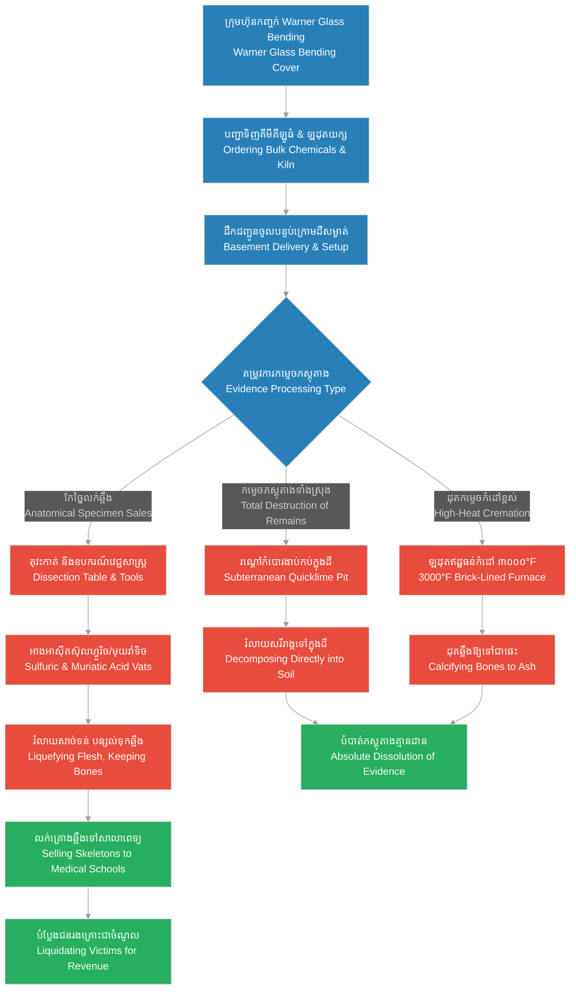

# Episode 12: ឱសថស្ថានខ្មៅ (The Laboratory Cellar)

**Author:** ichamrong  
**Date:** 2026-06-07  
**Tags:** #hh-holmes #screenplay #episode-12 #gilded-age #chicago #laboratory-cellar #dissection-table #acid-vats #furnace #historical-case-study  
**Category:** Biographies  
**Read Time:** ~15 min  

---

## 📌 មាតិកា (Table of Contents)
- [សេចក្តីផ្តើម៖ បន្ទប់ពិសោធន៍សម្ងាត់ និងការកម្ទេចភស្តុតាង (Introduction: The Secret Laboratory and Evidence Destruction)](#0)
- [១. ការដំឡើងឡដុតយក្សនៅក្នុងបន្ទប់ក្រោមដី (Scene 1: Installing the Basement Furnace)](#1)
- [២. ក្រុមហ៊ុនកញ្ចក់ Warner Glass Bending ជាខែលបិទបាំង (Scene 2: The Warner Glass Bending Cover)](#2)
- [៣. តុវះកាត់សាកសព និងសម្ភារៈវេជ្ជសាស្ត្រ (Scene 3: The Dissection Table and Surgical Tools)](#3)
- [៤. អាងអាស៊ីត និងរណ្តៅកំបោរងាប់ (Scene 4: The Acid Vats and Quicklime Pit)](#4)
- [៥. យន្តការចង្វាក់ផលិតកម្មកម្ទេចភស្តុតាង (Basement Disposal & Chemical Destruction Loops)](#5)
- [សេចក្តីសន្និដ្ឋាន (Conclusion)](#6)
- [🔗 ឯកសារទាក់ទង (Related Topics)](#7)

---

## សេចក្តីផ្តើម៖ បន្ទប់ពិសោធន៍សម្ងាត់ និងការកម្ទេចភស្តុតាង (Introduction: The Secret Laboratory and Evidence Destruction)

រឿងភាគទី ១២ នេះ ផ្អែកលើភស្តុតាងប្រវត្តិសាស្ត្រពិតដែលប៉ូលីសក្រុង Chicago បានរកឃើញអំឡុងពេលជីកកកាយបន្ទប់ក្រោមដីនៃអគារ Castle ក្នុងឆ្នាំ ១៨៩៥។ នៅក្នុងបន្ទប់ក្រោមដីនោះ ពួកគេបានរកឃើញឡដុតឥដ្ឋ និងដែកខ្នាតធំ អាងផ្ទុកអាស៊ីតគីមី រណ្តៅកំបោរងាប់ តុវះកាត់សាកសព និងឧបករណ៍វះកាត់ផ្សេង ៗ ព្រមទាំងបំណែកឆ្អឹង និងសក់មនុស្សដែលកប់ក្នុងដី។ ដើម្បីបិទបាំងការដឹកជញ្ជូនសារធាតុគីមីគ្រោះថ្នាក់ និងឡដុតខ្នាតយក្សនេះ Holmes បានបង្កើតក្រុមហ៊ុនខ្យល់មួយឈ្មោះថា **«Warner Glass Bending Company»** ដោយបន្លំថាជាអាជីវកម្មពត់ និងកែច្នៃកញ្ចក់ប្រណីត។ ភាគនេះបង្ហាញពីរបៀបដែល Holmes បង្កើតហេដ្ឋារចនាសម្ព័ន្ធបច្ចេកទេសក្នុងបន្ទប់ក្រោមដី ដោយបំប្លែងវាទៅជាចង្វាក់ផលិតកម្មឧស្សាហកម្មសម្រាប់ការរំលាយ និងបំបាត់ដានសាកសព ដោយមានការចូលរួមជួយពីដៃស្តាំរបស់គេគឺ Benjamin Pitezel។

This twelfth episode is based on the verified historical findings uncovered by the Chicago Police during their excavation of the Castle's basement in 1895. In the cellar, investigators discovered a massive brick-lined furnace, chemical acid vats, a quicklime pit, a heavy dissection table, surgical instruments, and fragmented human bones and hair embedded in the soil. To camouflage the delivery of industrial-grade acids and the oversized kiln, Holmes established a shell entity named the **"Warner Glass Bending Company,"** posing as a luxury glass-shaping enterprise. This episode details how Holmes engineered this subterranean technical infrastructure, converting his basement into an industrial-scale body disposal system with the compliant assistance of Benjamin Pitezel.

---

## ១. ការដំឡើងឡដុតយក្សនៅក្នុងបន្ទប់ក្រោមដី (Scene 1: Installing the Basement Furnace)

**ទីតាំង៖** បន្ទប់ក្រោមដីដ៏ងងឹត និងសើមនៃអគារ Castle, ឆ្នាំ ១៨៩២ (វេលារសៀល)  
**Location:** The dark, damp basement of the Castle, 1892 (Afternoon)

**សកម្មភាព៖** កម្មករដឹកជញ្ជូនពីរនាក់ កំពុងប្រឹងប្រែងទាំងញើសហូរស្រោចខ្លួន រុញច្រានឡដុតដែកប្រដាប់ដោយឥដ្ឋធន់នឹងកំដៅយ៉ាងធ្ងន់ ចុះតាមជណ្តើរឈើចង្អៀតមកកាន់បន្ទប់ក្រោមដី។ Pitezel (ជួយទប់ទាញ និងតម្រង់ទិសដៅ) បង្ហាញខ្លួនក្នុងសម្លៀកបំពាក់ការងារប្រឡាក់ដី។ Holmes (ឈរក្បែរនោះ កាន់សៀវភៅកត់ត្រា និងប៊ិច ពិនិត្យមើលការងារដោយទឹកមុខស្ងប់ស្ងាត់)។ ក្បាលកម្មករដឹកជញ្ជូនម្នាក់ងើបឡើង សម្លឹងមើលឡដុតទាំងងឿងឆ្ងល់ និងត្អូញត្អែរពីទម្ងន់ខុសធម្មតារបស់វា។  
**Action:** Two delivery workers, drenched in sweat, struggle to maneuver a heavy, brick-lined iron furnace kiln down the narrow wooden stairs into the basement. Pitezel (assisting and guiding the alignment) appears in dust-caked work clothes. Holmes (standing nearby with a ledger and pen, monitoring the placement with a calm composure) watches. The delivery leader looks up, wiping his brow, questioning the unusual weight and scale of the apparatus.

<!-- [IMAGE: H.H. Holmes and Benjamin Pitezel supervising the installation of a massive brick-lined furnace in the Castle basement. Dim lighting, brick walls. (Image generation rate-limited, to be added later)] -->

*   **មេជាងដឹកជញ្ជូន (Delivery Leader)៖** (ដកដង្ហើមធំ និយាយទាំងហត់) "លោក Howard ខ្ញុំមិនដែលដឹកឡដុតកញ្ចក់ណាធំ និងធ្ងន់បែបនេះឡើយ។ វាមានជញ្ជាំងឥដ្ឋក្រាស់ និងទ្វារដែកក្រាស់ដូចជាឡបូជាសពទៅហើយ។ តើលោកពិតជាត្រូវការកំដៅខ្លាំងដល់ថ្នាក់នេះសម្រាប់តែការពត់កញ្ចក់មែនទេ?"  
    *   *(Panting, speaking wearily)* *"Mr. Howard, I have never delivered a glass kiln this massive or heavy. It has firebrick lining and an iron door thick enough for a crematorium. Do you truly require this level of thermal output merely for shaping glass?"*
*   **ហូម (Holmes)៖** (ញញឹមយ៉ាងទន់ភ្លន់ និងហុចក្រដាសប្រាក់បន្ថែមឱ្យកម្មករ) "ការងារពត់កញ្ចក់សិល្បៈលំដាប់ខ្ពស់ ត្រូវការសីតុណ្ហភាពខ្ពស់បំផុត និងមានស្ថេរភាព ដើម្បីកុំឱ្យកញ្ចក់ស្រអាប់ ឬប្រេះស្រាំ។ ជញ្ជាំងឥដ្ឋក្រាស់នេះ គឺដើម្បីរក្សាកំដៅឱ្យនៅខាងក្នុង និងការពារកុំឱ្យកំដៅឡើងទៅលើប៉ះពាល់ដល់កម្រាលឈើនៃហាងខាងលើ។ នេះជាវិស្វកម្មសុវត្ថិភាពសាមញ្ញទេ មិត្តសម្លាញ់។"  
    *   *(Smiling smoothly, handing extra bills to the worker)* *"Artistic glass-bending of the highest caliber demands extreme, stable temperatures to prevent clouding or structural fractures. The heavy brick lining confines the thermal energy, ensuring no heat escapes to compromise the wooden floorboards of the drugstore above. It is simple safety engineering, my friend."*
*   **ផាយធាហ្សល (Pitezel)៖** (ជួយរុញឡដុតឱ្យចូលកន្លែង) "រួចរាល់ហើយ លោក Howard។ ឡនេះត្រូវបានដាក់ចំទីតាំងដែលតភ្ជាប់ទៅនឹងបំពង់ផ្សែងធំរួចជាស្រេច។ វានឹងដំណើរការដោយគ្មានផ្សែងហុយចេញមកក្រៅឡើយ។"  
    *   *(Pushing the furnace into position)* *"It is set, Mr. Howard. The kiln is aligned perfectly with the main chimney flue connection. It will draft cleanly without venting smoke into the lower chambers."*
*   **ហូម (Holmes)៖** "ល្អណាស់ ផាយធាហ្សល។ អរគុណពួកយើងទាំងអស់គ្នា។ អ្នកទាំងអស់គ្នាអាចត្រឡប់ទៅវិញបានហើយ។"  
    *   *"Excellent work, Pitezel. Thank you, gentlemen. You may take your leave."*

**ការពិពណ៌នា៖** កម្មករដឹកជញ្ជូនទទួលប្រាក់ រួចដើរចេញទៅវិញទាំងពេញចិត្តនឹងកម្រៃបន្ថែម។ Holmes ដើរទៅជិតឡដុតដែកខ្មៅនោះ អង្អែលទ្វារដែកដ៏ត្រជាក់របស់វាថ្នម ៗ។ គេដឹងថា ឡដុតនេះអាចបង្កើតកំដៅបានរហូតដល់ទៅ ៣០០០ ដឺក្រេហ្វារិនហៃ ដែលគ្រប់គ្រាន់សម្រាប់រំលាយបំណែកឆ្អឹង និងកម្ទេចភស្តុតាងសរីរាង្គទាំងអស់ឱ្យក្លាយជាផេះក្នុងរយៈពេលយ៉ាងខ្លី។  
**Description:** The delivery workers take the money and depart, satisfied with the generous gratuity. Holmes approaches the dark iron furnace, running his hand along its cold outer casing. He knows this kiln can sustain temperatures up to 3,000 degrees Fahrenheit—sufficient to calcify bones and reduce organic evidence to ash in a brief span.

---

## ២. ក្រុមហ៊ុនកញ្ចក់ Warner Glass Bending ជាខែលបិទបាំង (Scene 2: The Warner Glass Bending Cover)

**ទីតាំង៖** ការិយាល័យរបស់ Holmes ក្នុងឱសថស្ថាន, ឆ្នាំ ១៨៩២ (វេលាយប់)  
**Location:** Holmes' Drugstore Office, 1892 (Night)

**សកម្មភាព៖** ចង្កៀងម៉ាស៊ូតបញ្ចេញពន្លឺពណ៌លឿងនៅលើតុការិយាល័យដែលពោរពេញដោយលិខិតបញ្ជាទិញ និងឯកសារផ្លូវការ។ ឯកសារទាំងអស់មានក្បាលលិខិតវាយពុម្ពថា «Warner Glass Bending Co. - Chicago, IL»។ Holmes កំពុងសរសេរលិខិតបញ្ជាទិញសារធាតុគីមីគីឡូធំ ៗ។ Pitezel អង្គុយទល់មុខ ទឹកមុខរបស់គេបង្ហាញពីការងឿងឆ្ងល់ និងបារម្ភចំពោះបរិមាណសារធាតុគីមីដែល Holmes កំពុងកុម្ម៉ង់។  
**Action:** A kerosene lamp casts a yellow glow across the desk, which is piled with purchase orders and corporate documents. The stationery bears the official letterhead: "Warner Glass Bending Co. - Chicago, IL." Holmes drafts orders for industrial quantities of chemical agents. Pitezel sits opposite him, his expression displaying confusion and slight anxiety regarding the volume of chemicals Holmes is ordering.

<!-- [IMAGE: H.H. Holmes writing orders under the name Warner Glass Bending Co. Pitezel watches him, holding chemical brochures. (Image generation rate-limited, to be added later)] -->

*   **ផាយធាហ្សល (Pitezel)៖** "លោក Howard... ខ្ញុំបានពិនិត្យបញ្ជីទំនិញដែលលោកឱ្យខ្ញុំទៅទទួលពីស្ថានីយរថភ្លើង។ ហេតុអ្វីបានជាយើងត្រូវការអាស៊ីតស៊ុលហ្វួរិច និងអាស៊ីតមុយរ៉ាទិចច្រើនធុងខ្លាំងបែបនេះ? ហើយថែមទាំងមានកំបោររស់រាប់បារ៉ែលទៀត។ តើអាជីវកម្មពត់កញ្ចក់ពិតជាប្រើប្រាស់របស់ទាំងនេះច្រើនបែបនេះមែនទេ?"  
    *   *(Looking at the manifest)* *"Mr. Howard... I reviewed the freight list you asked me to retrieve from the railway depot. Why do we require so many carboys of sulfuric and muriatic acid? And barrels of quicklime as well. Does a glass-bending shop truly consume these materials in such volume?"*
*   **ហូម (Holmes)៖** (មិនងើបមុខពីការសរសេរ និយាយដោយសំឡេងស្ងប់ស្ងាត់) "កែវ និងកញ្ចក់សិល្បៈ ត្រូវការអាស៊ីតដើម្បីឆ្លាក់ក្បាច់ និងសម្អាតផ្ទៃមិនស្អាតចេញ។ ចំណែកកំបោររស់ គឺប្រើប្រាស់ក្នុងល្បាយរំលាយវត្ថុធាតុដើម។ នៅក្នុងពិភពជំនួញ ប្រសិនបើយើងកុម្ម៉ង់របស់ទាំងនេះក្នុងនាមបុគ្គល គេនឹងសង្ស័យ។ ប៉ុន្តែនៅពេលយើងធ្វើប្រតិបត្តិការក្រោមឈ្មោះ «Warner Glass Bending Company» របស់ទាំងអស់នេះនឹងក្លាយជាគ្រឿងផ្គត់ផ្គង់ឧស្សាហកម្មស្របច្បាប់ទាំងស្រុង។ គ្មាននរណាម្នាក់សួរដេញដោលឡើយ។"  
    *   *(Writing without looking up, speaking in a measured voice)* *"Artistic glass requires corrosive acids to etch patterns and eliminate impurities from the surface. Quicklime serves as a standard flux agent in our raw material mix. In commerce, purchasing these chemical agents as an individual invites scrutiny. But when we operate under the trade name 'Warner Glass Bending Company,' these hazardous shipments become routine industrial supplies. No one questions a manufacturing concern."*
*   **ផាយធាហ្សល (Pitezel)៖** (ងក់ក្បាលយឺត ៗ ទាំងស្ញប់ស្ញែងនឹងការរៀបចំ) "លោកតែងតែគិតគូរដោះស្រាយគ្រប់ចំណុចច្បាប់ជានិច្ច។ គ្មាននរណាម្នាក់អាចតាមដានដឹងឡើយថា សារធាតុទាំងនេះយកទៅប្រើប្រាស់ធ្វើអ្វីពិតប្រាកដក្នុងបន្ទប់ក្រោមដីនោះ។"  
    *   *(Nodding slowly, admiring the design)* *"You resolve every regulatory friction beforehand. No investigator would look past the bill of lading to see what actually happens to these chemicals in the cellar."*
*   **ហូម (Holmes)៖** (ងើបមុខឡើង សម្លឹងមើល Pitezel ដោយកែវភ្នែកមុតស្រួច) "ច្បាប់ គឺជាសំណាញ់ដែលមានចន្លោះប្រហោង ផាយធាហ្សល។ យើងគ្រាន់តែបង្កើតរចនាសម្ព័ន្ធសមស្របមួយដើម្បីដើរឆ្លងកាត់វាដោយសុវត្ថិភាព។ ភារកិច្ចរបស់អ្នក គឺត្រូវចាត់ចែងការដឹកជញ្ជូនទាំងនេះមកដល់បន្ទប់ក្រោមដីដោយស្ងាត់ស្ងៀមបំផុត។"  
    *   *(Looking up, holding Pitezel's gaze with intensity)* *"The law is a mesh of loopholes, Pitezel. We merely construct the appropriate administrative apparatus to pass through it safely. Your assignment is to manage the logistics, ensuring these containers reach the basement with complete discretion."*

**ការពិពណ៌នា៖** Holmes វាយត្រាក្រុមហ៊ុន «Warner Glass Bending Co.» លើលិខិតបញ្ជាទិញ។ គេប្រើប្រាស់ក្រុមហ៊ុននេះមិនត្រឹមតែដើម្បីទិញគីមីពុលប៉ុណ្ណោះទេ ថែមទាំងដើម្បីជួលកម្មករ និងគេចវេសពីម្ចាស់បំណុលសំណង់អគារ Castle ផងដែរ ដោយបង្វែររាល់កិច្ចសន្យាផ្លូវការទៅឱ្យនីតិបុគ្គលក្លែងក្លាយនេះ។  
**Description:** Holmes stamps the "Warner Glass Bending Co." seal onto the purchase order. He deploys this shell company not only to procure hazardous chemicals but also to hire laborers and insulate himself from construction creditors, shifting all formal liabilities to the fictitious legal entity.

---

## ៣. តុវះកាត់សាកសព និងសម្ភារៈវេជ្ជសាស្ត្រ (Scene 3: The Dissection Table and Surgical Tools)

**ទីតាំង៖** បន្ទប់ពិសោធន៍សម្ងាត់ក្នុងបន្ទប់ក្រោមដី, ឆ្នាំ ១៨៩២ (វេលាយប់ជ្រៅ)  
**Location:** The Secret Laboratory in the Basement, 1892 (Late Night)

**សកម្មភាព៖** ពន្លឺភ្លើងចង្កៀងប្រេងកាតជះទៅលើតុឈើវែងក្រាស់ និងរឹងមាំមួយ ដែលត្រូវបានដំឡើងនៅកណ្តាលបន្ទប់ក្រោមដី។ Holmes (ពាក់អាវអៀមស្បែកវែងពណ៌ខ្មៅ) កំពុងរៀបចំប្រអប់ឧបករណ៍វះកាត់ធ្វើពីដែកថែប រួមមានកាំបិតវះកាត់ (Scalpels) អាបកាត់ឆ្អឹង (Bone Saws) និងដង្កៀបដែក។ Pitezel ឈរក្បែរនោះ កាន់ចង្កៀងបំភ្លឺ និងសម្លឹងមើលឧបករណ៍វះកាត់ទាំងនោះដោយក្តីព្រឺក្បាល។  
**Action:** The light of a kerosene lantern falls on a long, heavy wooden table positioned in the center of the cellar floor. Holmes (wearing a long black leather apron) is arranging a steel case of surgical instruments, including scalpels, bone saws, and forceps. Pitezel stands nearby, holding the lantern, staring at the clinical steel with a sense of dread.

<!-- [IMAGE: H.H. Holmes in a leather apron arranging surgical tools on a heavy wooden dissection table in the basement. Pitezel holds a lantern. (Image generation rate-limited, to be added later)] -->

*   **ផាយធាហ្សល (Pitezel)៖** "លោក Howard... ឧបករណ៍ទាំងនេះមើលទៅដូចជាសម្ភារៈរបស់គ្រូពេទ្យវះកាត់សាកសពក្នុងមន្ទីរពេទ្យធំ ៗ។ តើលោកពិតជាចង់រៀបចំបន្ទប់ក្រោមដីនេះឱ្យទៅជាកន្លែងវះកាត់មនុស្សមែនទេ?"  
    *   *(Whispering, uneasy)* *"Mr. Howard... these instruments look like the equipment of an anatomist. Do you intend to structure this cellar as a private surgical clinic?"*
*   **ហូម (Holmes)៖** (យកម្រាមដៃវាស់លើមុខកាំបិតវះកាត់យ៉ាងត្រជាក់) "កាលខ្ញុំនៅរៀនពេទ្យនៅសាកលវិទ្យាល័យ Michigan ខ្ញុំបានរៀនយល់ច្បាស់ថា រាងកាយមនុស្សមិនខុសពីគ្រឿងម៉ាស៊ីនឡើយ។ វាជាការប្រមូលផ្តុំនៃសរីរាង្គ សាច់ដុំ និងឆ្អឹង ដែលត្រូវបានតភ្ជាប់គ្នា។ នៅពេលវាឈប់ដំណើរការ វាគ្រាន់តែជាវត្ថុធាតុដើមគ្មានវិញ្ញាណប៉ុណ្ណោះ។ នៅក្នុងបន្ទប់នេះ យើងនឹងសម្អាត និងរៀបចំ «វត្ថុធាតុដើម» ទាំងនោះឱ្យក្លាយជាគ្រោងឆ្អឹងស្អាត ដើម្បីលក់ទៅឱ្យសាលាពេទ្យ។ សាលាពេទ្យតែងតែខ្វះខាតគ្រោងឆ្អឹងសម្រាប់សិក្សា ហើយពួកគេមិនសួររកប្រភពដើមឡើយ។"  
    *   *(Running a finger along a scalpel blade)* *"During my medical training at the University of Michigan, I learned that the human body is merely a biological machine. It is an assembly of organs, muscle, and bone. Once the mechanics cease, it becomes inanimate raw material. In this space, we will process those 'raw materials' into clean skeletons to sell to medical academies. Medical schools suffer a chronic shortage of study specimens, and they rarely inquire about the source of title."*
*   **ផាយធាហ្សល (Pitezel)៖** (ដកដង្ហើមធំ សម្លឹងមើលតុឈើ) "វាជាវិធីរកលុយដ៏ឆ្លាតវៃ... តែវាក៏សាហាវខ្លាំងណាស់ដែរ លោក Howard។ ខ្ញុំសង្ឃឹមថា ខ្ញុំមិនបាច់ដោះស្រាយការងារផ្ទាល់ដៃលើតុនេះឡើយ។"  
    *   *(Sighing, looking at the table)* *"It is a highly profitable trade... yet cold, Mr. Howard. I trust my duties will not require me to perform the manual processing on this table."*
*   **ហូម (Holmes)៖** (និយាយដោយទឹកមុខស្ងប់ស្ងាត់ គ្មានអារម្មណ៍) "ផាយធាហ្សល... ភារកិច្ចរបស់អ្នកគឺគ្រាន់តែជួយសម្រួលការងារដឹកជញ្ជូន និងធានាសន្តិសុខខាងក្រៅប៉ុណ្ណោះ។ ការងារបច្ចេកវិទ្យា និងការវះកាត់គីមីសាស្ត្រ ទុកឱ្យខ្ញុំជាអ្នកចាត់ចែងចុះ។ វិន័យ និងចំណេះដឹងវិទ្យាសាស្ត្ររបស់ខ្ញុំ នឹងធានាថាគ្រប់យ៉ាងត្រូវបានបញ្ចប់ដោយគ្មានកំហុស និងគ្មានដានភស្តុតាង។"  
    *   *(Speaking with neutral, cold calm)* *"Pitezel... your assignment is limited to logistics and perimeter security. The chemical processing and anatomical disassembly are my technical domain. My scientific training ensures that every operation is executed with absolute precision, leaving zero traces."*

**ការពិពណ៌នា៖** Holmes រៀបចំកាំបិតវះកាត់ដាក់តាមលំដាប់លំដោយនៅលើធ្នើរដែកយ៉ាងមានរបៀប។ កែវភ្នែករបស់គេសម្លឹងមើលតុឈើវះកាត់នោះដោយភាពត្រជាក់សំបកក្រៅ គ្មានក្តីមេត្តា ឬស្ទាក់ស្ទើរឡើយ។ សម្រាប់គេ ទីនេះមិនមែនជាបន្ទប់ឃាតកម្មឡើយ ប៉ុន្តែវាជាបន្ទប់ពិសោធន៍កែច្នៃធនធាន ដែលបំប្លែងរាល់ឧបសគ្គឱ្យក្លាយជាដើមទុនហិរញ្ញវត្ថុ។  
**Description:** Holmes aligns the scalpels in precise order on a steel tray. His eyes remain fixed on the wooden table with absolute emotional detachment. To him, this space is not a murder room, but a resource-processing laboratory, configured to convert legal liabilities into liquid capital.

---

## ៤. អាងអាស៊ីត និងរណ្តៅកំបោរងាប់ (Scene 4: The Acid Vats and Quicklime Pit)

**ទីតាំង៖** បន្ទប់ក្រោមដីជ្រៅជិតជញ្ជាំងគ្រឹះអគារ, ឆ្នាំ ១៨៩២-១៨៩៣ (វេលាយប់)  
**Location:** The sub-cellar near the foundation wall, 1892-1893 (Night)

**សកម្មភាព៖** Holmes និង Pitezel ឈរក្បែរអាងថ្មធំមួយដែលមានផ្ទុកសារធាតុរាវពណ៌ថ្លាដែលកំពុងមានចំហាយហុយតិច ៗ។ នៅចំហៀងម្ខាងទៀត មានរណ្តៅដីជ្រៅមួយដែលពោរពេញដោយម្សៅពណ៌ស (កំបោររស់)។ Holmes ប្រើដង្កៀបដែកវែង ចាប់បំណែកសាច់សត្វឆៅមួយដុំ មកទម្លាក់ចូលទៅក្នុងអាងអាស៊ីត។  
**Action:** Holmes and Pitezel stand beside a large stone vat containing a clear liquid that emits a faint, chemical vapor. To the side lies a deep earthen pit filled with white powder (quicklime). Holmes uses long iron tongs to lower a piece of raw animal meat and bone into the chemical vat.

<!-- [IMAGE: H.H. Holmes using tongs to drop animal tissue into a chemical vat in the Castle basement. Pitezel watches, shocked. (Image generation rate-limited, to be added later)] -->

*   **សម្លេងគីមីប្រតិកម្ម (Chemical Sound)៖** (លាន់សូរខ្សក ៗ និងមានពពុះពុះកញ្ជ្រោលឡើងភ្លាម ៗ ពេលសាច់ប៉ះសារធាតុរាវ) *[A sharp, sizzling sound as bubbles and vapor erupt upon contact.]*
*   **ផាយធាហ្សល (Pitezel)៖** (ថយក្រោយបន្តិច យកដៃខ្ទប់ច្រមុះ) "អាស៊ីតនេះខ្លាំងណាស់ លោក Howard! សាច់នោះរលាយបាត់ភ្លាម ៗ តែម្តង។ តើវាប្រើពេលប៉ុន្មានដើម្បីរំលាយសាច់ទាំងអស់ចេញពីឆ្អឹង?"  
    *   *(Stepping back, covering his nose)* *"This acid is incredibly potent, Mr. Howard! The tissue is disintegrating instantly. How long does it take to strip a specimen clean to the bone?"*
*   **ហូម (Holmes)៖** (សម្លឹងមើលប្រតិកម្មគីមីដោយចិត្តទុកដាក់) "អាស៊ីតស៊ុលហ្វួរិចផ្សំជាមួយអាស៊ីតមុយរ៉ាទិច ក្នុងសមាមាត្រត្រឹមត្រូវ នឹងរំលាយសាច់ និងសរីរាង្គទន់ ៗ ទាំងអស់ក្នុងរយៈពេលតែប៉ុន្មានម៉ោងប៉ុណ្ណោះ ដោយបន្សល់ទុកតែឆ្អឹងរឹងដែលមិនខូចខាត។ ចំណែកឯរណ្តៅកំបោរងាប់ខាងនោះវិញ គឺសម្រាប់ដាក់សាកសពដែលមិនចង់យកឆ្អឹងលក់។ កំបោររស់នឹងស្រូបយកសំណើមទាំងអស់ និងរំលាយសរីរាង្គទាំងអស់ឱ្យទៅជាដីក្នុងរយៈពេលយ៉ាងលឿន។ នេះជាចង្វាក់បិទជិតនៃការកម្ទេចភស្តុតាង។ គ្មានរូបរាង គ្មានដានភស្តុតាង គ្មានសំណួរ។"  
    *   *(Watching the dissolution closely)* *"A calculated ratio of sulfuric and muriatic acid will liquefy soft tissues and organs within hours, leaving the skeletal structure intact for assembly. The quicklime pit, on the other hand, is designated for specimens we do not salvage. The quicklime absorbs all moisture and dissolves organic compounds directly into the soil. It is a closed-loop disposal system. No remains, no evidence, no questions."*
*   **ផាយធាហ្សល (Pitezel)៖** (ដកដបស្រាចេញមកផឹកមួយក្អឹកធំ ដើម្បីរំងាប់អារម្មណ៍) "ខ្ញុំយល់ហើយ... លោក Howard។ ផែនការរបស់លោកពិតជាគ្មានចន្លោះប្រហោងឡើយ។ ខ្ញុំនឹងធានាថាគ្មាននរណាម្នាក់ចូលមកជិតបន្ទប់ក្រោមដីនេះឡើយ។"  
    *   *(Taking a flask and drinking deeply to steady his nerves)* *"I see... Mr. Howard. Your system is seamless. I will ensure no unauthorized personnel ever gain access to this sub-level."*
*   **ហូម (Holmes)៖** "ល្អណាស់ ផាយធាហ្សល។ យើងនឹងចាប់ផ្តើមដំណើរការចង្វាក់ផលិតកម្មនេះភ្លាម នៅពេលយើងមាន «វត្ថុធាតុដើម» លើកដំបូង។"  
    *   *"Very good, Pitezel. We shall initiate this operational loop as soon as our first 'raw materials' are secured."*

**ការពិពណ៌នា៖** ផ្សែងអាស៊ីតហុយឡើងយឺត ៗ ទៅលើពិដានឈើ និងរលាយបាត់ទៅក្នុងប្រព័ន្ធបំពង់ខ្យល់ដែល Holmes បានរៀបចំទុក។ Holmes និង Pitezel សម្លឹងមើលទៅក្នុងអាងគីមីដ៏ខ្មៅងងឹតនោះ ឆ្លុះបញ្ចាំងពីស្រមោល និងសកម្មភាពឃោរឃៅដែលនឹងត្រូវកើតឡើងនៅក្នុងវិមានឃាតកម្មនេះក្នុងពេលអនាគតដ៏ខ្លីខាងមុខ។  
**Description:** The chemical vapors drift toward the ceiling, drawn away by the draft ventilation system Holmes installed. Holmes and Pitezel look down into the dark vat, reflecting the dark operations that will run inside this Murder Castle in the near future.

---

## ៥. យន្តការចង្វាក់ផលិតកម្មកម្ទេចភស្តុតាង (Basement Disposal & Chemical Destruction Loops)

ដ្យាក្រាមខាងក្រោមបង្ហាញពីលំហូរហេដ្ឋារចនាសម្ព័ន្ធបច្ចេកទេស និងការគ្រប់គ្រងចង្វាក់ផលិតកម្មបិទបាំងសកម្មភាពកម្ទេចភស្តុតាងនៅក្នុងបន្ទប់ក្រោមដីរបស់ H.H. Holmes៖

The following diagram maps the technical workflow and physical infrastructure Holmes constructed to dispose of bodies under commercial covers:

> [!IMPORTANT]
> **🧠 យន្តការចិត្តសាស្ត្រ / Psychological Mechanism - [លំហូរនៃធនធាន និងការរៀបចំយន្តការ (Flow of Resources and Mechanics)](../keyword/flow-of-resources-and-mechanics.md):**
> * «នៅក្នុងប្លង់ទី ២ និងទី ៣ Holmes ចាត់ទុករាងកាយមនុស្សគ្រាន់តែជាគ្រឿងផ្គត់ផ្គង់ និងជាវត្ថុធាតុដើមសម្រាប់អាជីវកម្មប៉ុណ្ណោះ។ គេរៀបចំក្រុមហ៊ុន «Warner Glass Bending Company» ជាខែលការពារផ្លូវច្បាប់ ដើម្បីដឹកជញ្ជូនអាស៊ីត និងឡដុត ដោយបំបែកអារម្មណ៍ និងមនសិការទាំងស្រុងពីការឈឺចាប់របស់ជនរងគ្រោះ។ សម្រាប់គេ ភាពជោគជ័យគឺវាស់វែងលើប្រសិទ្ធភាពនៃចង្វាក់ផលិតកម្មកម្ទេចភស្តុតាង និងការរកប្រាក់ចំណូលពីគ្រោងឆ្អឹង។» (*"In Scenes 2 and 3, Holmes views the human body strictly as biological supply and factory input. He structures the 'Warner Glass Bending Company' as an administrative shield to secure acids and the kiln, totally disconnecting his moral compass from the physical suffering of his victims. For him, success is quantified by the efficiency of the disposal loop and skeleton sales."*).
> 
> **🤫 យន្តការចិត្តសាស្ត្រ / Psychological Mechanism - [បញ្ជីវាស់វែងវិន័យ (Discipline Ledger)](../keyword/discipline-ledger.md):**
> * «នៅក្នុងប្លង់ទី ៤ Holmes បង្ហាញពីវិន័យវិទ្យាសាស្ត្រដ៏តឹងរ៉ឹងក្នុងការរៀបចំកំហាប់អាស៊ីត និងការជ្រើសរើសវិធីសាស្ត្រកម្ទេចសាកសពផ្សេង ៗ គ្នា។ គេមិនអនុញ្ញាតឱ្យអារម្មណ៍ស្អប់ខ្ពើម ឬភ័យខ្លាចមកបង្អាក់ប្រតិបត្តិការឡើយ គេគ្រប់គ្រងរាល់ដំណើរការបច្ចេកទេសក្នុងបន្ទប់ក្រោមដីយ៉ាងហ្មត់ចត់បំផុត ដើម្បីធានាថារាល់កិច្ចការទាំងអស់គ្មានកំហុស និងគ្មានដានបន្សល់ទុកឡើយ។» (*"In Scene 4, Holmes demonstrates rigid scientific discipline in configuring chemical concentrations and routing disposal methods. He allows no disgust or fear to compromise the operation, governing the technical processes in the cellar with exact precision to maintain zero traces and clean legal parameters."*).

---

## សេចក្តីសន្និដ្ឋាន (Conclusion)

> **«នៅក្នុងពិភពលោកឧស្សាហកម្មសម័យថ្មី... គ្មានអ្វីដែលមិនអាចកែច្នៃឡើងវិញបានឡើយ សូម្បីតែរាងកាយមនុស្សដែលគ្មានជីវិត។ គ្រប់យ៉ាងគឺគ្រាន់តែជាការផ្លាស់ប្តូរទ្រង់ទ្រាយរូបធាតុ និងតម្លៃហិរញ្ញវត្ថុប៉ុណ្ណោះ» — H.H. Holmes**
> 
> **“In a modern industrial world... nothing is waste, not even the inanimate human body. Everything is merely a transformation of material state and financial value.” — H.H. Holmes**

រឿងភាគទី ១២ បិទបញ្ចប់ដោយទិដ្ឋភាព Holmes និង Pitezel កំពុងឈរសម្លឹងមើលបន្ទប់ក្រោមដីដែលត្រូវបានរៀបចំរួចរាល់ទាំងស្រុង។ ឡដុតកំពុងឡើងកំដៅក្រហមងំ អាងអាស៊ីតកំពុងហុយផ្សែងយឺត ៗ ហើយតុវះកាត់ឈើវែងកំពុងរង់ចាំដោយស្ងៀមស្ងាត់។ នេះជាការរៀបចំឆាកយ៉ាងល្អឥតខ្ចោះសម្រាប់ភាគទី ១៣ និងទី ១៤ ដែលនឹងបង្ហាញពីការមកដល់ និងការបាត់ខ្លួនរបស់កញ្ញា Emeline Cigrand ដែលជាជនរងគ្រោះដំបូងគេបង្អស់នៅក្នុង Murder Castle នេះ។

Episode 12 concludes with Holmes and Pitezel surveying the fully prepared cellar. The kiln radiates a dull, red heat, the chemical vats emit their silent vapors, and the long wooden table stands waiting. The physical infrastructure is complete, setting the stage for Episodes 13 and 14, which will document the arrival and disappearance of Miss Emeline Cigrand, the first major victim processed inside the Murder Castle.

---

## 🔗 ឯកសារទាក់ទង (Related Topics)
*   **[Episode 11: អាពាហ៍ពិពាហ៍ក្លែងក្លាយ (Wives and Aliases)](ep-11-wives-and-aliases.md)** — ស្គ្រីបភាគទី ១១ ដែលបង្ហាញពីវិធីសាស្ត្របោកប្រាស់អាពាហ៍ពិពាហ៍ និងការលួចប្លង់ដីធ្លី។
*   **[Episode 13: ជំនួយការសម្ងាត់ (Emeline's Arrival)](ep-13-emelines-arrival.md)** — ស្គ្រីបភាគទី ១៣ ដែលបង្ហាញពីការចូលមកដល់របស់ Emeline Cigrand ក្នុងវិមាន។
*   **[លំហូរនៃធនធាន និងការរៀបចំយន្តការ (Flow of Resources and Mechanics)](../keyword/flow-of-resources-and-mechanics.md)** — វិធីសាស្ត្រចិត្តសាស្ត្រដែលចាត់ទុកជីវិតជាទ្រព្យសកម្មរូបវន្ត។
*   **[បញ្ជីវាស់វែងវិន័យ (Discipline Ledger)](../keyword/discipline-ledger.md)** — វិធីសាស្ត្រតាមដាន និងគ្រប់គ្រងចិត្តសាស្ត្ររបស់ Holmes។
*   **[ជីវប្រវត្តិ H.H. Holmes](../01-h-h-holmes-biography.md)** — ជីវប្រវត្តិនៃការវិវឌ្ឍជីវិត និងវិមានឃាតកម្មរបស់ Holmes។
*   **[គម្រោងរឿងភាគដ្រាម៉ា ៦៣ ភាគ](../08-holmes-drama-episode-guide.md)** — ផែនការ និងការសង្ខេបរឿងភាគទូរទស្សន៍ទាំង ៦៣ ភាគ។
