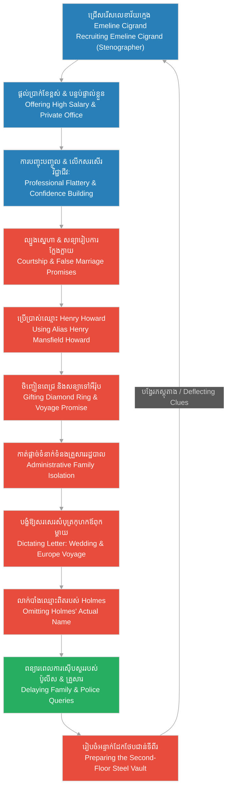

# Episode 13: ជំនួយការសម្ងាត់ (Emeline's Arrival)

**Author:** ichamrong  
**Date:** 2026-06-07  
**Tags:** #hh-holmes #screenplay #episode-13 #gilded-age #chicago #emeline-cigrand #stenographer #grooming #manipulation #historical-case-study  
**Category:** Biographies  
**Read Time:** ~15 min  

---

## 📌 មាតិកា (Table of Contents)
- [សេចក្តីផ្តើម៖ ការមកដល់របស់ Emeline Cigrand (Introduction: The Arrival of Emeline Cigrand)](#0)
- [១. ការសម្ភាសន៍ការងារនៅវិមាន Castle (Scene 1: The Job Interview)](#1)
- [២. ភារកិច្ចលេខា និងការបញ្ចុះបញ្ចូលផ្នែកវិជ្ជាជីវៈ (Scene 2: The Secretary's Duties & Flattery)](#2)
- [៣. ការល្បួងស្នេហា និងការសន្យារៀបការក្លែងក្លាយ (Scene 3: The Courtship & False Promise)](#3)
- [៤. លិខិតកាត់ផ្តាច់ទំនាក់ទំនងទៅគ្រួសារ (Scene 4: The Dictated Correspondence)](#4)
- [៥. យន្តការល្បួង និងការកាត់ផ្តាច់ទំនាក់ទំនងរដ្ឋបាល (Grooming & Administrative Isolation Loops)](#5)
- [សេចក្តីសន្និដ្ឋាន (Conclusion)](#6)
- [🔗 ឯកសារទាក់ទង (Related Topics)](#7)

---

## សេចក្តីផ្តើម៖ ការមកដល់របស់ Emeline Cigrand (Introduction: The Arrival of Emeline Cigrand)

រឿងភាគទី ១៣ នេះ ផ្អែកលើករណីសិក្សាប្រវត្តិសាស្ត្រពិតរបស់កញ្ញា **Emeline Cigrand** ដែលជានារីវ័យក្មេង ស្រស់ស្អាត និងមានចំណេះដឹងមកពីទីក្រុង Lafayette រដ្ឋ Indiana។ នាងធ្លាប់ធ្វើការជាលេខាកត់ត្រានៅវិទ្យាស្ថានព្យាបាលរោគអាល់កុល Dwight មុនពេល H.H. Holmes ជួប និងល្បួងឱ្យមកធ្វើការជាលេខាផ្ទាល់ខ្លួននៅអគារ Castle ក្នុងក្រុង Chicago នាឆ្នាំ ១៨៩២។ Holmes មិនត្រឹមតែផ្តល់ប្រាក់ខែខ្ពស់ខុសពីធម្មតាដើម្បីទាក់ទាញនាងប៉ុណ្ណោះទេ គេថែមទាំងបានប្រើប្រាស់មន្តស្នេហ៍ និងវោហារសាស្ត្រលួងលោមរៀបការជាមួយនាង បើទោះបីជាខ្លួនកំពុងមានចំណងអាពាហ៍ពិពាហ៍ស្របច្បាប់ជាមួយស្ត្រីផ្សេងទៀតក៏ដោយ។ ភាគនេះបង្ហាញពីយន្តការចិត្តសាស្ត្រ «Grooming» របស់ Holmes ក្នុងការបង្កើតភាពស្និទ្ធស្នាល ទំនុកចិត្ត និងការរៀបចំផែនការរដ្ឋបាលដើម្បីកាត់ផ្តាច់ទំនាក់ទំនងរបស់ Emeline ពីគ្រួសាររបស់នាង មុនពេលនាងបាត់ខ្លួនយ៉ាងអាថ៌កំបាំង។

This thirteenth episode is based on the documented historical case of Miss **Emeline Cigrand**, a young, beautiful, and educated woman from Lafayette, Indiana. She had been working as a stenographer at the Dwight Keeley Institute for alcohol treatment before H.H. Holmes met her and enticed her to become his personal secretary at the Castle in Chicago in 1892. Holmes did not merely offer an exceptionally high salary to attract her; he deployed his calculated charm and romantic overtures, promising marriage despite his existing legal unions. This episode details Holmes' psychological grooming mechanics, building trust and executing the administrative isolation of Emeline from her family before her tragic disappearance.

---

## ១. ការសម្ភាសន៍ការងារនៅវិមាន Castle (Scene 1: The Job Interview)

**ទីតាំង៖** ការិយាល័យរបស់ Holmes ក្នុងអគារ Castle, ឆ្នាំ ១៨៩២ (វេលាព្រឹក)  
**Location:** Holmes' Drugstore Office at the Castle, 1892 (Morning)

**សកម្មភាព៖** Emeline Cigrand (នារីវ័យក្មេងមានរូបរាងស្លូតបូត វៃឆ្លាត និងស្លៀកពាក់រ៉ូបពណ៌ប្រផេះសមរម្យ) អង្គុយទល់មុខ Holmes។ Holmes (ស្លៀកពាក់អាវកាត់ប្រណីត បង្ហាញស្នាមញញឹមដ៏ថ្លៃថ្នូរ និងកែវភ្នែកពោរពេញដោយការយកចិត្តទុកដាក់) កំពុងពិនិត្យមើលប្រវត្តិរូបសង្ខេបរបស់នាង។ ពន្លឺព្រះអាទិត្យពេលព្រឹកជះកាត់បង្អួចកញ្ចក់ធំ បង្កើតបរិយាកាសកក់ក្តៅ និងគួរឱ្យទុកចិត្ត។  
**Action:** Emeline Cigrand (a young woman of gentle grace, intelligence, and wearing a neat gray Victorian dress) sits opposite Holmes. Holmes (dressed in a tailored suit, presenting a warm, dignified smile and attentive eyes) reviews her resume. The morning sunlight streams through the large window, creating a warm, trustworthy atmosphere.

<!-- [IMAGE: H.H. Holmes interviewing the young, beautiful Emeline Cigrand in his clean, bright drugstore office. (Image generation rate-limited, to be added later)] -->

*   **ហូម (Holmes)៖** "កញ្ញា Cigrand... ប្រវត្តិការងាររបស់នាងនៅវិទ្យាស្ថាន Dwight ពិតជាល្អណាស់។ ខ្ញុំត្រូវការលេខាដែលមានភាពហ្មត់ចត់ និងអាចរក្សាសម្ងាត់ពាណិជ្ជកម្មបានល្អដូចជានាង។ ទីក្រុង Chicago ក្នុងសម័យពិព័រណ៍ពិភពលោកនេះមានភាពមមាញឹកខ្លាំងណាស់ ហើយអាជីវកម្មរបស់ខ្ញុំត្រូវការជំនួយការដែលអាចទុកចិត្តបាន។"  
    *   *"Miss Cigrand... your professional record at the Dwight Institute is exemplary. I require a secretary who is methodical and capable of maintaining absolute commercial confidentiality. Chicago during the World's Fair is chaotic, and my expanding enterprises demand a reliable assistant."*
*   **អិមមីលីន (Emeline)៖** (ញញឹមដោយក្តីសង្ឃឹម និងគោរព) "ចាស លោកគ្រូពេទ្យ Holmes។ ខ្ញុំចង់មកធ្វើការនៅទីក្រុងធំ ដើម្បីស្វែងរកបទពិសោធន៍ថ្មី និងជួយសម្រាលបន្ទុកគ្រួសារនៅ Indiana។ ខ្ញុំអាចវាយអង្គុលីលេខបានលឿន និងមានជំនាញខាងកត់ត្រាឯកសារច្បាប់ច្បាស់លាស់។"  
    *   *(Smiling with hope and respect)* *"Yes, Dr. Holmes. I sought to move to the city to gain broader experience and support my family in Indiana. I am highly proficient in stenography and familiar with legal correspondence."*
*   **ហូម (Holmes)៖** (បិទឯកសារយឺត ៗ និងនិយាយដោយសំឡេងទន់ភ្លន់) "ល្អណាស់។ ខ្ញុំនឹងផ្តល់ប្រាក់ខែឱ្យនាងទ្វេដង ធៀបនឹងប្រាក់ខែដែលនាងធ្លាប់ទទួលបាននៅ Dwight។ នាងនឹងមានបន្ទប់ធ្វើការផ្ទាល់ខ្លួននៅជាន់ទីពីរ។ សម្រាប់ខ្ញុំ ធនធានមនុស្សដែលមានសមត្ថភាព គឺមានតម្លៃបំផុត។ នាងអាចចាប់ផ្តើមការងារពីថ្ងៃស្អែកបានទេ?"  
    *   *(Closing the folder slowly, speaking in a warm tone)* *"Splendid. I will offer you double the compensation you received at Dwight. You will have a private office suite on the second floor. To me, talented personnel are the most valuable asset. Can you commence your duties tomorrow?"*
*   **អិមមីលីន (Emeline)៖** (កែវភ្នែកពោរពេញដោយភាពរីករាយ) "អូ! ពិតជាបាន ចាស លោកគ្រូពេទ្យ! ខ្ញុំពិតជាអរគុណលោកខ្លាំងណាស់ចំពោះឱកាសដ៏ល្អ និងការស្វាគមន៍យ៉ាងកក់ក្តៅនេះ។"  
    *   *(Her eyes bright with excitement)* *"Oh! Yes, indeed, Doctor! I am deeply grateful for this wonderful opportunity and your warm welcome."*

**ការពិពណ៌នា៖** Holmes ងើបឈរ និងហុចដៃទៅចាប់ដៃនាងយ៉ាងគួរសម។ Emeline ចាប់ដៃគេដោយក្តីសង្ឃឹម និងមានទំនុកចិត្តទាំងស្រុងលើរូបភាពជា «គ្រូពេទ្យ និងអ្នកជំនួញសប្បុរសធម៌» របស់ Holmes។ Holmes ញញឹមស្ងប់ស្ងាត់ ប៉ុន្តែកែវភ្នែកត្រជាក់របស់គេបានកត់ត្រាទុកនាងជាឧបករណ៍សន្តិសុខ និងជាជនរងគ្រោះបន្ទាប់រួចស្រេចទៅហើយ។  
**Description:** Holmes rises and politely extends his hand. Emeline shakes it with hope, placing absolute trust in Holmes' presentation as a benevolent physician and entrepreneur. Holmes smiles quietly, but his cold, calculating gaze has already registered her as his next operational asset.

---

## ២. ភារកិច្ចលេខា និងការបញ្ចុះបញ្ចូលផ្នែកវិជ្ជាជីវៈ (Scene 2: The Secretary's Duties & Flattery)

**ទីតាំង៖** ការិយាល័យលេខានៅជាន់ទីពីរនៃអគារ Castle, ឆ្នាំ ១៨៩២ (វេលារសៀល)  
**Location:** The Stenographer's Office on the Second Floor of the Castle, 1892 (Afternoon)

**សកម្មភាព៖** សម្លេងម៉ាស៊ីនវាយអង្គុលីលេខលាន់ឮរហ័សឆ្កាច់ ៗ។ Emeline កំពុងផ្ដោតអារម្មណ៍យ៉ាងខ្លាំងលើការវាយលិខិតជំនួញ។ Holmes ដើរចូលមកឈរក្បែរនាង ដាក់ដៃលើខ្នងកៅអីរបស់នាង និងពិនិត្យមើលក្រដាសដែលទើបតែវាយរួច។ គេហុចកែវទឹកក្រូចឆ្មារកក់ក្តៅមួយកែវឱ្យនាងដោយក្តីបារម្ភ។  
**Action:** The typewriter clacks rapidly. Emeline concentrates deeply on drafting business letters. Holmes enters, standing close beside her, placing a hand on the back of her chair to review the executed pages. He presents her with a glass of warm lemonade, displaying professional care.

<!-- [IMAGE: Emeline Cigrand typing business letters on a typewriter. H.H. Holmes stands beside her, looking at the papers with approval. (Image generation rate-limited, to be added later)] -->

*   **ហូម (Holmes)៖** "Emeline សម្រាកសិនទៅ។ នាងបានធ្វើការយ៉ាងហ្មត់ចត់ពេញមួយថ្ងៃហើយ។ ការវាយអក្សររបស់នាងពិតជាលឿន និងគ្មានកំហុសសូម្បីតែមួយតួអក្សរ។ នាងជាលេខាដ៏ឆ្លាតវៃបំផុតដែលខ្ញុំធ្លាប់មាន។"  
    *   *"Take a brief rest, Emeline. You have labored diligently all day. Your speed is remarkable, and your draft contains not a single error. You are the most proficient assistant I have ever employed."*
*   **អិមមីលីន (Emeline)៖** (ទទួលកែវទឹក និងញញឹមដោយភាពរីករាយ) "អរគុណចាស លោកគ្រូពេទ្យ Howard... អូ... ខ្ញុំសុំទោស ខ្ញុំតែងតែច្រឡំឈ្មោះលោកជានិច្ច។ នៅក្នុងឯកសារក្រុមហ៊ុនខ្លះ ឈ្មោះរបស់លោកគឺ Henry Mansfield Howard ហើយខ្លះទៀតគឺ H.H. Holmes។ តើហេតុអ្វីបានជាអាជីវកម្មរបស់លោកមានឈ្មោះតំណាងច្រើនបែបនេះ?"  
    *   *(Taking the glass, smiling brightly)* *"Thank you, Dr. Howard... oh... I apologize, I still confuse your names. In some corporate registry files, you are listed as Henry Mansfield Howard, and in others as H.H. Holmes. Why do your enterprises employ so many different trade names?"*
*   **ហូម (Holmes)៖** (និយាយដោយសំឡេងទន់ភ្លន់ និងយកប៊ិចមកចង្អុលលើក្រដាស) "នៅក្នុងជំនួញទំនើបសម័យ Gilded Age នេះ ការបង្កើតក្រុមហ៊ុនច្រើន និងឈ្មោះតំណាងផ្សេង ៗ គ្នា គឺដើម្បីការពារដើមទុន និងកាត់បន្ថយពន្ធដីធ្លី។ វាជាច្បាប់ការពារហិរញ្ញវត្ថុធម្មតាទេ។ នាងជាមនុស្សម្នាក់គត់ដែលខ្ញុំទុកចិត្តឱ្យដោះស្រាយឯកសារសម្ងាត់ទាំងនេះ ព្រោះនាងមានការយល់ដឹងខ្ពស់។"  
    *   *(Speaking in a reassuring tone, pointing to the documents)* *"In modern Gilded Age commerce, constructing multiple corporate identities is standard practice to insulate capital and manage tax liabilities. It is simple financial protection. You are the only person I trust with these sensitive files because of your superior intellect."*
*   **អិមមីលីន (Emeline)៖** (មានអារម្មណ៍ថាខ្លួនមានតម្លៃ និងមានមោទនភាព) "ខ្ញុំពិតជាមានកិត្តិយសណាស់ដែលលោកទុកចិត្តខ្ញុំដល់ថ្នាក់នេះ។ ខ្ញុំនឹងខិតខំធ្វើការឱ្យអស់ពីសមត្ថភាព ដើម្បីជួយសម្រេចគម្រោងរបស់លោក។"  
    *   *(Feeling valued and proud)* *"I am deeply honored by your confidence in me, Doctor. I will continue to apply my best efforts to facilitate your developments."*

**ការពិពណ៌នា៖** Holmes ញញឹម និងអង្អែលសក់របស់នាងថ្នម ៗ។ Emeline មិនមានអារម្មណ៍ភ័យខ្លាចឡើយ ផ្ទុយទៅវិញនាងមានអារម្មណ៍កក់ក្តៅ និងមានទំនាក់ទំនងផ្លូវចិត្តកាន់តែជ្រៅជាមួយគេ។ Holmes ប្រើប្រាស់ «ការបញ្ចុះបញ្ចូលផ្នែកវិជ្ជាជីវៈ» (Professional Flattery) ដើម្បីបង្កើតទំនុកចិត្ត និងបិទបាំងរាល់មន្ទិលសង្ស័យទាំងឡាយអំពីឈ្មោះក្លែងក្លាយរបស់គេ។  
**Description:** Holmes smiles, gently stroking her hair. Emeline shows no discomfort, feeling instead a deep sense of security and professional alignment. Holmes deploys calculated flattery to build psychological compliance, neutralizing any curiosity regarding his multiple aliases.

---

## ៣. ការល្បួងស្នេហា និងការសន្យារៀបការក្លែងក្លាយ (Scene 3: The Courtship & False Promise)

**ទីតាំង៖** បន្ទប់ទទួលភ្ញៀវដ៏ប្រណីតរបស់ Holmes ក្នុងវិមាន Castle, ឆ្នាំ ១៨៩២ (វេលាល្ងាច)  
**Location:** The private parlor of Holmes in the Castle, 1892 (Evening)

**សកម្មភាព៖** ពន្លឺភ្លើងទៀនពណ៌លឿងទុំជះកក់ក្តៅ។ តុអាហារខ្នាតតូចមានដបស្រាក្រហម និងកែវពីរ។ Holmes ហុចប្រអប់កាដូតូចមួយធ្វើពីវល្លិ៍ពណ៌ខៀវទៅឱ្យ Emeline។ នាងបើកប្រអប់នោះមកឃើញចិញ្ចៀនមាសប្រដាប់ដោយត្បូងពេជ្រដ៏ប្រណីតមួយ។ នាងយកដៃខ្ទប់មាត់ដោយភាពរំភើប និងភ្ញាក់ផ្អើលជាខ្លាំង។  
**Action:** Warm candlelight illuminates the parlor. A small dining table holds a bottle of red wine and two glasses. Holmes presents a small blue velvet gift box to Emeline. She opens it, revealing an elegant gold ring set with a diamond. She covers her mouth in surprise and deep emotion.

<!-- [IMAGE: H.H. Holmes proposing to Emeline Cigrand inside the Castle parlor, presenting a diamond ring. Emeline looks at him with tears of joy. (Image generation rate-limited, to be added later)] -->

*   **អិមមីលីន (Emeline)៖** (ទឹកភ្នែករលីងរលោងដោយភាពរំភើប) "អូ! លោក Howard... នេះ... នេះពិតជាចិញ្ចៀនរៀបការមែនទេ? តើលោក... លោកពិតជាចង់រៀបការជាមួយលេខាសាមញ្ញម្នាក់ដូចជាខ្ញុំមែនទេ?"  
    *   *(With tears of emotion)* *"Oh! Mr. Howard... is this... is this a betrothal ring? Do you... do you truly wish to marry a simple assistant like myself?"*
*   **ហូម (Holmes)៖** (កាន់ដៃនាងយ៉ាងណែន និងនិយាយដោយសំឡេងពោរពេញដោយមនោសញ្ចេតនា) "Emeline នាងមិនមែនជាលេខាសាមញ្ញឡើយ។ នាងគឺជាពន្លឺជីវិតរបស់ខ្ញុំ។ ខ្ញុំចង់ឱ្យនាងក្លាយជាលោកស្រី Howard របស់ខ្ញុំ។ យើងនឹងរៀបការជាមួយគ្នា និងចាកចេញពីទីក្រុង Chicago ដ៏មមាញឹកនេះ ទៅកសាងគ្រួសារដ៏មានសុភមង្គលមួយនៅភាគខាងលិច... ប្រហែលជាអូឡាំព្យា ឬអឺរ៉ុប។"  
    *   *(Holding her hands tightly, speaking with calculated romantic resonance)* *"Emeline, you are no simple assistant. You are the light of my life. I want you to become my Mrs. Howard legally. We shall wed and depart from Chicago's chaos to build a prosperous estate in the West... perhaps Olympia, or even travel to Europe."*
*   **អិមមីលីន (Emeline)៖** "ប៉ុន្តែ... ខ្ញុំធ្លាប់ឮកម្មករខ្លះនិយាយខ្សឹបខ្សៀវថា លោកមានភរិយារួចទៅហើយនៅ Wilmette... តើរឿងនោះជាការពិតទេ Herman?"  
    *   *(Hesitant)* *"But... I heard some workmen whisper that you already have a wife in Wilmette... is there any truth to this, Herman?"*
*   **ហូម (Holmes)៖** (ទឹកមុខមិនប្រែប្រួល និយាយដោយសំឡេងស្ងប់ស្ងាត់ និងគួរឱ្យអាណិត) "រឿងនោះជាការយល់ច្រឡំទាំងស្រុង។ នាងនោះជាអតីតដៃគូជីវិតដែលបានលែងលះគ្នាជាយូរមកហើយ ប៉ុន្តែនាងនៅតែព្យាយាមបង្កាច់បង្ខូចកេរ្តិ៍ឈ្មោះខ្ញុំដើម្បីទារលុយ។ ជឿជាក់លើខ្ញុំចុះ Emeline គ្មានស្ត្រីណាផ្សេងដែលមានតម្លៃនៅក្នុងចិត្តខ្ញុំក្រៅពីនាងឡើយ។"  
    *   *(Maintaining perfect composure, speaking in a soft, victimized tone)* *"That is a complete fabrication. She is an estranged former relation who seeks to damage my commercial reputation to extract capital. Trust in me, Emeline; no other woman holds a place in my life but you."*

**ការពិពណ៌នា៖** Emeline ងក់ក្បាល និងយល់ព្រមពាក់ចិញ្ចៀននោះដោយក្តីរំភើប។ នាងឱប Holmes យ៉ាងណែន ទាំងជឿជាក់លើការសន្យារបស់គេទាំងស្រុង។ Holmes ឱបនាងតបវិញ ប៉ុន្តែកែវភ្នែករបស់គេត្រជាក់ស្រេង គ្មានអារម្មណ៍ស្នេហាឡើយ។ គេដឹងថា ការសន្យារៀបការនេះ គឺជាវិធីសាស្ត្រចុងក្រោយដើម្បីទាក់ទាញនាងឱ្យចូលមកក្នុង «អន្ទាក់បិទជិត» ដោយមិនដឹងខ្លួន។  
**Description:** Emeline nods and allows him to place the ring on her finger. She embraces Holmes, placing absolute faith in his promises. Holmes holds her in return, but his eyes remain completely cold and devoid of affection. He knows this promise of marriage is the ultimate tool to lead her into his closed trap without resistance.

---

## ៤. លិខិតកាត់ផ្តាច់ទំនាក់ទំនងទៅគ្រួសារ (Scene 4: The Dictated Correspondence)

**ទីតាំង៖** ការិយាល័យរបស់ Holmes ក្នុងអគារ Castle, ខែធ្នូ ឆ្នាំ ១៨៩២  
**Location:** Holmes' Office inside the Castle, December 1892

**សកម្មភាព៖** Emeline អង្គុយនៅតុវាយអង្គុលីលេខ។ Holmes ឈរក្បែរបង្អួច សម្លឹងមើលទៅក្រៅអគារដែលមានព្រិលធ្លាក់ស និងនិយាយកត់ត្រាឱ្យនាងវាយតាម។ Pitezel (កំពុងរៀបចំប្រអប់ក្រដាស និងឯកសារនៅជ្រុងបន្ទប់) លួចមើលមកពួកគេដោយទឹកមុខព្រួយបារម្ភ និងតានតឹងផ្លូវចិត្ត ប៉ុន្តែមិនហ៊ាននិយាយអ្វីឡើយ។  
**Action:** Emeline sits at the typewriter. Holmes stands near the window, looking out at the snow-covered street, dictating a letter for her to type. Pitezel (arranging document boxes in the corner) casts worried and tense glances toward them, remaining completely silent.

<!-- [IMAGE: H.H. Holmes dictating a letter to Emeline Cigrand at the typewriter. Pitezel watches them with a tense expression in the background. (Image generation rate-limited, to be added later)] -->

*   **ហូម (Holmes)៖** "វាយតាមខ្ញុំណា Emeline... «ពុក និងម៉ែជាទីស្រឡាញ់... កូនសរសេរសំបុត្រនេះដើម្បីប្រាប់ពុកម៉ែថា កូនបានជួបនឹងបុរសដ៏ល្អម្នាក់ ហើយពួកយើងនឹងរៀបការជាមួយគ្នានៅថ្ងៃស្អែកនេះ។ ពួកយើងនឹងធ្វើដំណើរទៅកាន់អឺរ៉ុបភ្លាម ៗ ក្រោយអាពាហ៍ពិពាហ៍។ សូមពុកម៉ែកុំបារម្ភ ប្រសិនបើមិនបានទទួលដំណឹងពីកូនមួយរយៈ...»"  
    *   *"Type exactly as I dictate, Emeline... 'Dear Mother and Father... I write to inform you that I have met a wonderful gentleman, and we are to be wed tomorrow. We shall depart for Europe immediately following the ceremony. Please do not worry if you do not receive word from me for some time...'"*
*   **អិមមីលីន (Emeline)៖** (ឈប់វាយបន្តិច ងាកមកសួរដោយងឿងឆ្ងល់) "Herman... ហេតុអ្វីបានជាខ្ញុំមិនត្រូវសរសេរឈ្មោះបងចូលក្នុងសំបុត្រនេះ? ហើយហេតុអ្វីបានជាយើងត្រូវប្រញាប់ប្រញាល់ចាកចេញទៅដោយមិនប្រាប់គ្រួសារខ្ញុំឱ្យច្បាស់លាស់បែបនេះ?"  
    *   *(Stopping her typing, turning with slight confusion)* *"Herman... why should I omit your name from this letter? And why must we depart in such haste without providing my family with specific details?"*
*   **ហូម (Holmes)៖** (ដើរមកជិត លុតជង្គង់ក្បែរនាង និងសម្លឹងមើលភ្នែកនាងដោយក្តីអាណិត) "ព្រោះខ្ញុំមិនចង់ឱ្យគ្រួសាររបស់នាងបារម្ភពីបញ្ហាអាជីវកម្មដែលខ្ញុំកំពុងដោះស្រាយនៅទីនេះ Pitezel។ ការមិនបញ្ចេញឈ្មោះខ្ញុំ គឺដើម្បីសុវត្ថិភាពរបស់យើង និងដើម្បីកុំឱ្យមានការរំខានដល់ដំណើរកម្សាន្តរបស់យើង។ នៅពេលយើងទៅដល់អឺរ៉ុប យើងនឹងសរសេរសំបុត្រលម្អិតផ្ញើមកពួកគាត់ម្តងទៀត។ ជឿខ្ញុំចុះណា Emeline។"  
    *   *(Approaching, kneeling beside her, looking into her eyes with simulated warmth)* *"Because I wish to insulate your family from the commercial litigation I am currently resolving here, Emeline. Omitting my name prevents any legal complications from disrupting our journey. Once we are established in Europe, we will write them a detailed joint letter. Trust my judgment, my dear."*
*   **ផាយធាហ្សល (Pitezel)៖** (លួចដកដង្ហើមធំទាំងតានតឹង ដៃរបស់គាត់ញ័រពេលរៀបចំប្រអប់ឯកសារ) *[Sighs tensely, his hands trembling slightly as he stacks the document cases.]*
*   **អិមមីលីន (Emeline)៖** "ចាស Herman... ខ្ញុំជឿបងជានិច្ច។" (នាងបន្តវាយអក្សររហូតដល់ចប់ និងចុះហត្ថលេខាលើលិខិត)  
    *   *"Yes, Herman... I trust you always."* *(She resumes typing until complete, executing her signature on the page.)*

**ការពិពណ៌នា៖** Emeline ដាក់សំបុត្រចូលក្នុងស្រោមសំបុត្រ និងបិទវា។ Holmes ទទួលយកសំបុត្រនោះមកកាន់ក្នុងដៃដោយស្នាមញញឹមស្ងប់ស្ងាត់។ គេដឹងថា លិខិតនេះនឹងកាត់ផ្តាច់រាល់ការស៊ើបសួរពីគ្រួសារនាង និងពន្យារពេលការស្វែងរករបស់ប៉ូលីសបានរាប់ខែ។ Pitezel សម្លឹងមើលស្រោមសំបុត្រនោះទាំងដឹងច្បាស់ថា គ្មានអាពាហ៍ពិពាហ៍ ឬដំណើរកម្សាន្តទៅអឺរ៉ុបឡើយ មានតែអន្ទាក់ដែកថែបដែលកំពុងរង់ចាំនាងនៅជាន់ទីពីរនៃវិមាន Castle នេះប៉ុណ្ណោះ។  
**Description:** Emeline folds the letter, placing it into the envelope. Holmes takes the letter into his grasp, smiling quietly. He knows this dictated correspondence will sever direct inquiries from her family and delay any police tracking for months. Pitezel looks at the envelope, knowing fully that there is no wedding or European voyage—only the steel vault waiting for her on the second floor of the Castle.

---

## ៥. យន្តការល្បួង និងការកាត់ផ្តាច់ទំនាក់ទំនងរដ្ឋបាល (Grooming & Administrative Isolation Loops)

ដ្យាក្រាមខាងក្រោមបង្ហាញពីរង្វង់យន្តការដែល H.H. Holmes ប្រើប្រាស់ដើម្បីល្បួង បង្កើតទំនុកចិត្ត និងកាត់ផ្តាច់ទំនាក់ទំនងរបស់ Emeline Cigrand ពីគ្រួសាររបស់នាងតាមរយៈរដ្ឋបាល៖

The following diagram maps the strategic loop Holmes engineered to groom and administratively isolate Emeline Cigrand:

> [!IMPORTANT]
> **🧠 យន្តការចិត្តសាស្ត្រ / Psychological Mechanism - [លំហូរនៃធនធាន និងការរៀបចំយន្តការ (Flow of Resources and Mechanics)](../keyword/flow-of-resources-and-mechanics.md):**
> * «នៅក្នុងប្លង់ទី ២ និងទី ៣ Holmes ចាត់ទុកមនោសញ្ចេតនារបស់ Emeline ត្រឹមតែជាច្រកទ្វារសម្រាប់ស្រូបយកក្តីជំនឿ និងគ្រប់គ្រងសកម្មភាពរបស់នាងប៉ុណ្ណោះ។ គេផ្តល់ប្រាក់ខែខ្ពស់ និងគ្រឿងអលង្ការប្រណីតដើម្បីទាក់ទាញនាងឱ្យផ្តាច់ខ្លួនពីស្ថាប័នការងារចាស់ ដោយសារចិត្តរបស់គេបានផ្តាច់អារម្មណ៍ទាំងស្រុងពីក្រមសីលធម៌គ្រួសារ។» (*"In Scenes 2 and 3, Holmes treats Emeline's affection merely as an access point to absorb her trust and govern her movements. He offers high compensation and luxury jewelry to extract her from her previous employment, his mind entirely insulated from family ethics."*).
> 
> **🤫 យន្តការចិត្តសាស្ត្រ / Psychological Mechanism - [បញ្ជីវាស់វែងវិន័យ (Discipline Ledger)](../keyword/discipline-ledger.md):**
> * «នៅក្នុងប្លង់ទី ៤ Holmes អនុវត្តវិន័យដ៏ហ្មត់ចត់ក្នុងការគ្រប់គ្រងឯកសារសំបុត្រដែលផ្ញើទៅ Indiana។ គេតម្រូវឱ្យ Emeline សរសេរសេចក្តីលម្អិតដែលបង្វែរដាន ដោយមិនឱ្យមានឈ្មោះពិតរបស់គេនៅក្នុងលិខិតនោះឡើយ ដើម្បីបង្កើតខែលការពារច្បាប់ និងពន្យារពេលការស៊ើបសួរពីប៉ូលីសនាពេលអនាគត។» (*"In Scene 4, Holmes exercises precise discipline in managing the letter sent to Indiana. He mandates that Emeline write deflecting details while omitting his actual name, creating a legal shield and delaying future police queries."*).

---

## សេចក្តីសន្និដ្ឋាន (Conclusion)

> **«នៅក្នុងការិយាល័យទំនើប ជំនាញវាយអង្គុលីលេខរបស់លេខា មិនមែនជាឧបករណ៍តែមួយគត់ឡើយ... លិខិតដែលនាងសរសេរ គឺជាឯកសារផ្លូវការដែលអាចកាត់ផ្តាច់រូបរាងរបស់នាងពីប្រព័ន្ធសង្គមដោយស្ងៀមស្ងាត់បំផុត» — H.H. Holmes**
> 
> **“In a modern office, a secretary's typing is not her only output... the letters she signs are the administrative records that erase her physical presence from the social system.” — H.H. Holmes**

រឿងភាគទី ១៣ បិទបញ្ចប់ដោយទិដ្ឋភាព Holmes យកសំបុត្រដែល Emeline ចុះហត្ថលេខារួច ទៅដាក់ក្នុងប្រអប់សំបុត្រប្រៃសណីយ៍ក្រុង Chicago ក្រោមព្រិលធ្លាក់យ៉ាងត្រជាក់។ Holmes ត្រឡប់មកវិញ ឈរសម្លឹងមើល Emeline ដែលកំពុងវាយឯកសារនៅក្នុងការិយាល័យជាន់ទីពីរ ទាំងស្នាមញញឹមស្ងប់ស្ងាត់ ត្រៀមខ្លួនសម្រាប់ភាគទី ១៤ ដែលជានាទីចុងក្រោយរបស់នាងនៅក្នុងបន្ទប់ដែកមិនឮសំឡេង។

Episode 13 concludes with Holmes dropping Emeline's signed letter into a Chicago mailbox amidst the cold, falling snow. Holmes returns, standing at the doorway, observing Emeline as she types in her second-floor office with a quiet smile, setting the stage for Episode 14, which will depict her final moments locked inside the soundproof steel vault.

---

## 🔗 ឯកសារទាក់ទង (Related Topics)
*   **[Episode 12: ឱសថស្ថានខ្មៅ (The Laboratory Cellar)](ep-12-the-laboratory-cellar.md)** — ស្គ្រីបភាគទី ១២ ដែល Holmes រៀបចំមន្ទីរពិសោធន៍គីមីក្នុងបន្ទប់ក្រោមដី។
*   **[Episode 14: ស្នាមជើងនៅលើទ្វារដែក (The Footprint in the Vault)](ep-14-the-footprint-in-the-vault.md)** — ស្គ្រីបភាគទី ១៤ ដែលបង្ហាញពីការបង្ហូរហ្គាសពុលសម្លាប់ Emeline Cigrand។
*   **[លំហូរនៃធនធាន និងការរៀបចំយន្តការ (Flow of Resources and Mechanics)](../keyword/flow-of-resources-and-mechanics.md)** — វិធីសាស្ត្រចិត្តសាស្ត្រដែលចាត់ទុកជីវិតជាទ្រព្យសកម្មរូបវន្ត។
*   **[បញ្ជីវាស់វែងវិន័យ (Discipline Ledger)](../keyword/discipline-ledger.md)** — វិធីសាស្ត្រតាមដាន និងគ្រប់គ្រងចិត្តសាស្ត្ររបស់ Holmes។
*   **[ជីវប្រវត្តិ H.H. Holmes](../01-h-h-holmes-biography.md)** — ជីវប្រវត្តិនៃការវិវឌ្ឍជីវិត និងវិមានឃាតកម្មរបស់ Holmes។
*   **[គម្រោងរឿងភាគដ្រាម៉ា ៦៣ ភាគ](../08-holmes-drama-episode-guide.md)** — ផែនការ និងការសង្ខេបរឿងភាគទូរទស្សន៍ទាំង ៦៣ ភាគ។
