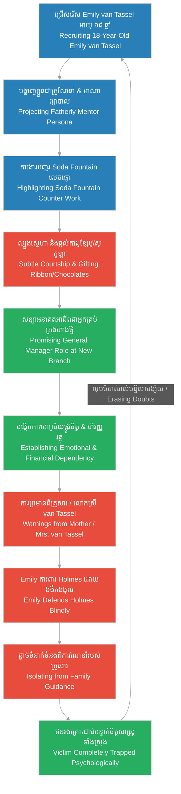

# Episode 15: យុវតីនៅហាងលក់ថ្នាំ (Emily's Promise)

**Author:** ichamrong  
**Date:** 2026-06-07  
**Tags:** #hh-holmes #screenplay #episode-15 #gilded-age #chicago #emily-van-tassel #soda-fountain #grooming #manipulation #historical-case-study  
**Category:** Biographies  
**Read Time:** ~15 min  

---

## 📌 មាតិកា (Table of Contents)
- [សេចក្តីផ្តើម៖ ការជ្រើសរើស Emily van Tassel (Introduction: The Recruitment of Emily van Tassel)](#0)
- [១. ការទទួលយុវតីឱ្យចូលធ្វើការ (Scene 1: The Hiring of the Young Clerk)](#1)
- [២. បញ្ជរលក់ភេសជ្ជៈ និងការលួងលោមដោយកាដូ (Scene 2: The Soda Fountain & Courtship)](#2)
- [៣. ការសន្យាអនាគតអាជីព និងការបង្កើតក្តីសង្ឃឹម (Scene 3: The Professional Promise)](#3)
- [៤. ការព្រមានពីគ្រួសារ និងការការពារដោយងងឹតងងុល (Scene 4: The Family's Warning & Blind Defense)](#4)
- [៥. យន្តការល្បួង និងការបង្កើតភាពអាស្រ័យផ្នែកអាជីព (Grooming & Career Dependency Loops)](#5)
- [សេចក្តីសន្និដ្ឋាន (Conclusion)](#6)
- [🔗 ឯកសារទាក់ទង (Related Topics)](#7)

---

## សេចក្តីផ្តើម៖ ការជ្រើសរើស Emily van Tassel (Introduction: The Recruitment of Emily van Tassel)

រឿងភាគទី ១៥ នេះ ផ្អែកលើករណីសិក្សាប្រវត្តិសាស្ត្រពិតរបស់យុវតីអាយុ ១៨ ឆ្នាំ **Emily van Tassel** ដែលត្រូវបាន H.H. Holmes ជួលឱ្យមកធ្វើការជាអ្នកគិតលុយ និងជាអ្នកលក់ភេសជ្ជៈនៅបញ្ជរ Soda Fountain ក្នុងឱសថស្ថានរបស់គេនាឆ្នាំ ១៨៩២។ Holmes បានអនុវត្តយន្តការចិត្តសាស្ត្រល្បួងដ៏ស្មុគស្មាញ ដោយបង្ហាញខ្លួនជា «គ្រូណែនាំដ៏ចិត្តល្អ និងជាអាណាព្យាបាល» ដើម្បីបន្សាបការការពាររបស់នាង និងទាក់ទាញនាងដោយកាដូ ក៏ដូចជាការសន្យាផ្តល់ឱកាសគ្រប់គ្រងក្រុមហ៊ុនថ្មី ៗ។ ថ្វីបើគ្រួសាររបស់ Emily មានការសង្ស័យ និងព្យាយាមព្រមាននាងយ៉ាងណាក្តី ក៏ឥទ្ធិពលចិត្តសាស្ត្រដែល Holmes បង្កើតឡើង បានធ្វើឱ្យនាងការពារគេដោយងងឹតងងុល និងបដិសេធមិនចាកចេញពីការងារ ដែលនេះជាការត្រៀមឆាកសម្រាប់ការបាត់ខ្លួនរបស់នាង។

This fifteenth episode is based on the documented historical case of 18-year-old **Emily van Tassel**, who was hired by H.H. Holmes as a cashier and soda fountain clerk in his drugstore in 1892. Holmes executed a calculated psychological grooming strategy, presenting himself as a paternal mentor and guardian to disarm her defenses, enticing her with small gifts and grand promises of managing his future business expansions. Despite the deep suspicion and warnings from Emily's family, the psychological grip Holmes established caused her to defend him blindly and reject any attempt to rescue her, setting the stage for her subsequent disappearance.

---

## ១. ការទទួលយុវតីឱ្យចូលធ្វើការ (Scene 1: The Hiring of the Young Clerk)

**ទីតាំង៖** ឱសថស្ថានរបស់ Holmes ក្នុងអគារ Castle, ឆ្នាំ ១៨៩២ (វេលាព្រឹក)  
**Location:** Holmes' Drugstore at the Castle, 1892 (Morning)

**សកម្មភាព៖** Emily van Tassel (យុវតីអាយុ ១៨ ឆ្នាំ មានទឹកមុខស្រស់ថ្លា ស្វាហាប់ និងស្លូតត្រង់) ឈរនៅមុខបញ្ជរឱសថស្ថាន។ Holmes (ពាក់អាវធំប្រណីត បង្ហាញស្នាមញញឹមដ៏ទន់ភ្លន់ និងរាក់ទាក់បំផុត) កំពុងនិយាយជាមួយនាងដោយអាកប្បកិរិយាគួរឱ្យគោរព។  
**Action:** Emily van Tassel (an 18-year-old girl, with a bright, energetic, and innocent expression) stands before the drugstore counter. Holmes (wearing his refined coat, presenting a gentle and welcoming smile) speaks to her with a respectful, paternal demeanor.

<!-- [IMAGE: H.H. Holmes hiring the young, bright Emily van Tassel at the drugstore counter. Emily looks excited. (Image generation rate-limited, to be added later)] -->

*   **ហូម (Holmes)៖** "កញ្ញា van Tassel... ឬខ្ញុំអាចហៅនាងថា Emily បានទេ? ខ្ញុំត្រូវការយុវតីដែលមានភាពស្វាហាប់ និងរាក់ទាក់ដូចជានាង ដើម្បីគ្រប់គ្រងបញ្ជរភេសជ្ជៈ Soda Fountain ថ្មីរបស់យើង។ ហាងរបស់យើងជាបេះដូងនៃសហគមន៍ Englewood នេះ។"  
    *   *"Miss van Tassel... or may I call you Emily? I require a young woman of your bright energy and grace to manage our new soda fountain counter. Our drugstore is the social hub of the Englewood community."*
*   **អិមមីលី (Emily)៖** (និយាយដោយទឹកមុខរំភើប និងរីករាយ) "ចាស លោកគ្រូពេទ្យ Holmes! ខ្ញុំពិតជាមានសេចក្តីសោមនស្សណាស់ដែលបានមកធ្វើការទីនេះ។ ខ្ញុំចូលចិត្តជួបមនុស្ស និងចង់រៀនសូត្រពីរបៀបគ្រប់គ្រងអាជីវកម្ម។ ខ្ញុំនឹងខិតខំធ្វើការឱ្យល្អបំផុតចាស។"  
    *   *(Speaking with excitement)* *"Yes, Dr. Holmes! I am absolutely thrilled to work here. I enjoy meeting people and am eager to learn the mechanics of business management. I will apply my best efforts, Doctor."*
*   **ហូម (Holmes)៖** (ងក់ក្បាលយឺត ៗ និងនិយាយដោយសំឡេងទន់ភ្លន់) "ល្អណាស់ Emily។ យុវតីសម័យថ្មី គួរតែមានឱកាសកសាងអនាគតដោយខ្លួនឯង។ ខ្ញុំនឹងមិនត្រឹមតែបង្រៀននាងពីជំនួញឱសថស្ថានឡើយ ខ្ញុំថែមទាំងផ្តល់ប្រាក់ឈ្នួលដែលជួយនាងអាចមើលថែគ្រួសារបានយ៉ាងស្រួលទៀតផង។"  
    *   *(Nodding slowly, speaking in a warm tone)* *"Splendid, Emily. A modern young woman deserves the opportunity to build her own future. I will not only instruct you in drugstore operations; I will ensure your compensation allows you to support your household comfortably."*

**ការពិពណ៌នា៖** Emily ញញឹមយ៉ាងស្រស់ថ្លា និងបង្ហាញទឹកមុខគោរពកោតសរសើរ Holmes ជាខ្លាំង។ Holmes ណែនាំនាងទៅកាន់បុគ្គលិកដទៃទៀត ដោយបង្ហាញភាពស្និទ្ធស្នាល និងជាអាណាព្យាបាលដ៏ល្អ។ Emily មានអារម្មណ៍ថានាងបានជួបនឹងនិយោជកដ៏ល្អឥតខ្ចោះដែលគ្មាននរណាអាចប្រៀបផ្ទឹមបានឡើយ។  
**Description:** Emily smiles brightly, displaying deep admiration for Holmes. Holmes introduces her to the other drugstore staff, projecting his role as a protective guardian. Emily feels she has secured the perfect employer, completely oblivious to his underlying designs.

---

## ២. បញ្ជរលក់ភេសជ្ជៈ និងការលួងលោមដោយកាដូ (Scene 2: The Soda Fountain & Courtship)

**ទីតាំង៖** បញ្ជរ Soda Fountain ក្នុងឱសថស្ថាន, ឆ្នាំ ១៨៩២ (វេលារសៀល)  
**Location:** The Soda Fountain in the Drugstore, 1892 (Afternoon)

**សកម្មភាព៖** Emily កំពុងមមាញឹកនឹងការរៀបចំទឹកស៊ីរ៉ូ និងលក់ការ៉េមឱ្យទៅអតិថិជនយ៉ាងរហ័ស និងមានស្នាមញញឹមជានិច្ច។ Holmes ដើរចូលមកជិតបញ្ជរ ក្រោយពេលអតិថិជនចេញអស់។ គេហុចកញ្ចប់តូចមួយដែលមានខ្សែបូពណ៌ផ្កាឈូកប្រណីត និងប្រអប់នំសូកូឡាលំដាប់ខ្ពស់ឱ្យនាង។  
**Action:** Emily is busy preparing syrups and serving ice cream to customers with a persistent smile. Holmes approaches the counter after the customers depart. He presents her with a small, neatly wrapped gift containing a pink hair ribbon and a box of premium chocolates.

<!-- [IMAGE: Emily van Tassel serving ice cream at the drugstore soda fountain. H.H. Holmes hands her a small gift box. (Image generation rate-limited, to be added later)] -->

*   **ហូម (Holmes)៖** "Emily... នេះជាកាដូតូចតាចសម្រាប់ការខិតខំប្រឹងប្រែងរបស់នាង។ ស្នាមញញឹម និងភាពស្វាហាប់របស់នាង ធ្វើឱ្យបញ្ជរភេសជ្ជៈនេះក្លាយជាកន្លែងទាក់ទាញបំផុតក្នុងហាង។ ខ្សែបូពណ៌ផ្កាឈូកនេះ សមស្របនឹងសម្រស់យុវវ័យរបស់នាងណាស់។"  
    *   *"Emily... a small token for your excellent service. Your energy and grace have made this counter the most popular feature in the drugstore. This pink ribbon complements your youthful grace beautifully."*
*   **អិមមីលី (Emily)៖** (ទទួលកាដូដោយភាពខ្មាសអៀន និងរំភើប) "អូ! លោកគ្រូពេទ្យ... លោកពិតជាមានចិត្តល្អខ្លាំងណាស់។ គ្មាននិយោជកណាធ្លាប់ផ្តល់កាដូ និងយកចិត្តទុកដាក់ចំពោះខ្ញុំបែបនេះឡើយ។ ខ្ញុំនឹងយកវាទៅពាក់នៅថ្ងៃស្អែកចាស។"  
    *   *(Taking the gift shyly, blushing with delight)* *"Oh! Doctor... you are exceptionally generous. No employer has ever treated me with such personal care or kindness. I will wear the ribbon tomorrow."*
*   **ហូម (Holmes)៖** (និយាយសំឡេងខ្សឹបតិច ៗ និងសម្លឹងកែវភ្នែកនាងចំ) "នាងជាមនុស្សពិសេស Emily។ ខ្ញុំចង់ឃើញនាងរីកចម្រើន និងមានសេចក្តីសុខនៅក្នុងហាងរបស់ខ្ញុំ។ ប្រសិនបើនាងត្រូវការអ្វី សូមប្រាប់ខ្ញុំចុះ ខ្ញុំនឹងជួយសម្រេចគ្រប់យ៉ាង។"  
    *   *(Speaking in a soft, lower tone, locking eyes)* *"You are a special presence, Emily. I seek to see you flourish and find happiness in my establishment. If you ever require assistance, simply speak; I will facilitate it."*

**ការពិពណ៌នា៖** Emily ងើបសម្លឹងមើល Holmes ទាំងកែវភ្នែកពោរពេញដោយក្តីស្រឡាញ់ និងការលង់ជឿ។ នាងលាក់កញ្ចប់សូកូឡាក្នុងហោប៉ៅអៀមយ៉ាងលឿន។ Holmes អង្អែលដៃនាងថ្នម ៗ មុនពេលដើរត្រឡប់ទៅការិយាល័យវិញ ដោយបន្សល់ទុកនូវអារម្មណ៍កក់ក្តៅ និងការរំភើបចិត្តនៅក្នុងចិត្តយុវតីអាយុ ១៨ ឆ្នាំរូបនេះ។  
**Description:** Emily looks at Holmes, her eyes filled with growing affection and infatuation. She tucks the chocolates into her apron pocket. Holmes strokes her hand gently before retreating to his office, leaving the 18-year-old clerk captivated by his attention.

---

## ៣. ការសន្យាអនាគតអាជីព និងការបង្កើតក្តីសង្ឃឹម (Scene 3: The Professional Promise)

**ទីតាំង៖** ការិយាល័យផ្ទាល់ខ្លួនរបស់ Holmes ក្នុងអគារ Castle, ឆ្នាំ ១៨៩២ (វេលាល្ងាច)  
**Location:** Holmes' Private Office inside the Castle, 1892 (Evening)

**សកម្មភាព៖** Holmes បើកសៀវភៅកាតាឡុកដែលមានគំនូរប្លង់អគារ និងគំរូហាងថ្នាំថ្មី ៗ បង្ហាញ Emily។ Pitezel (កំពុងអង្គុយសម្អាតដបថ្នាំនៅជ្រុងបន្ទប់) លួចមើលមកពួកគេដោយខ្សែភ្នែកស្មុគស្មាញ និងតានតឹង ប៉ុន្តែបន្តធ្វើការងាររបស់ខ្លួនដោយស្ងៀមស្ងាត់។  
**Action:** Holmes opens a catalog featuring architectural plans and designs for new drugstore branches, displaying them to Emily. Pitezel (sitting in the corner cleaning pharmaceutical bottles) casts conflicted and tense glances toward them, continuing his work in silence.

<!-- [IMAGE: H.H. Holmes showing Emily van Tassel architectural catalogs in his office. Pitezel watches them silently in the background. (Image generation rate-limited, to be added later)] -->

*   **ហូម (Holmes)៖** "Emily... ខ្ញុំមានគម្រោងបង្កើតក្រុមហ៊ុន និងបើកហាងឱសថស្ថានថ្មីមួយទៀតនៅភាគខាងជើងក្រុង Chicago ក្នុងពេលឆាប់ ៗ នេះ។ ខ្ញុំបានតាមដានការងាររបស់នាង ហើយខ្ញុំជឿជាក់ថា នាងមានសមត្ថភាពគ្រប់គ្រាន់ក្នុងការធ្វើជា «អ្នកគ្រប់គ្រងទូទៅ» នៃហាងថ្មីនោះ។"  
    *   *"Emily... I am organizing a new drugstore expansion on the North Side of Chicago soon. I have monitored your administrative growth, and I believe you possess the capacity to serve as the 'General Manager' of this new branch."*
*   **អិមមីលី (Emily)៖** (កែវភ្នែកបើកធំ ៗ ទាំងមិនជឿ) "ពិតមែនទេ លោកគ្រូពេទ្យ? អ្នកគ្រប់គ្រងទូទៅ? ប៉ុន្តែ... ខ្ញុំទើបតែមានអាយុ ១៨ ឆ្នាំប៉ុណ្ណោះ ហើយគ្មានបទពិសោធន៍គ្រប់គ្រងហាងធំបែបនេះឡើយ។ តើខ្ញុំអាចធ្វើវាបានពិតមែនទេ?"  
    *   *(Her eyes wide with disbelief)* *"Truly, Doctor? General Manager? But... I am only eighteen, and I possess no experience running a large enterprise. Can I manage such a responsibility?"*
*   **ហូម (Holmes)៖** (កាន់ស្មារបស់នាង និងនិយាយដោយភាពជឿជាក់ខ្លាំង) "អាយុគ្រាន់តែជាតួលេខប៉ុណ្ណោះ Emily។ សំខាន់គឺភាពស្មោះត្រង់ និងវិន័យការងាររបស់នាង។ ខ្ញុំនឹងបណ្តុះបណ្តាលនាងដោយផ្ទាល់។ នេះជាឱកាសដើម្បីកសាងអនាគតដ៏រឹងមាំមួយ។ ខ្ញុំចង់ឱ្យនាងសន្យាថានឹងនៅក្បែរ និងជួយការងារខ្ញុំជានិច្ច។"  
    *   *(Placing a reassuring hand on her shoulder)* *"Age is merely an administrative detail, Emily. What matters is your loyalty and work ethic. I will instruct you personally. This is your path to secure a prosperous future. I only ask for your promise of absolute loyalty to my enterprises."*
*   **ផាយធាហ្សល (Pitezel)៖** (លួចដកដង្ហើមធំស្ងាត់ ៗ ដៃរបស់គាត់ញ័រពេលជូតដបកែវ) *[Sighs silently, his hands trembling slightly as he wipes a glass jar.]*
*   **អិមមីលី (Emily)៖** "ខ្ញុំសន្យាចាស លោកគ្រូពេទ្យ Holmes! ខ្ញុំនឹងធ្វើគ្រប់យ៉ាងដែលលោកណែនាំ និងមិនធ្វើឱ្យលោកខកចិត្តឡើយ។"  
    *   *"I promise, Dr. Holmes! I will execute every instruction you present and will never disappoint your trust."*

**ការពិពណ៌នា៖** Emily និយាយដោយក្តីរំភើប និងជឿជាក់លើអនាគតដ៏រុងរឿងដែល Holmes បានលាបពណ៌បង្ហាញ។ Holmes ញញឹមយ៉ាងស្ងប់ស្ងាត់ ប៉ុន្តែកែវភ្នែកពណ៌ខៀវត្រជាក់របស់គេមិនព្រិចឡើយ គេដឹងថាការបង្កើត «ក្តីសង្ឃឹមផ្នែកអាជីព» គឺជាខ្សែអូសទាញដ៏រឹងមាំបំផុតដែលធ្វើឱ្យជនរងគ្រោះមិនចង់ចាកចេញពីវិមានឃាតកម្មនេះ។  
**Description:** Emily speaks with excitement, believing in the prosperous future Holmes has painted. Holmes smiles quietly, but his cold blue eyes remain fixed, knowing that establishing "career hope" is the strongest anchor to prevent the victim from ever questioning or leaving the Castle.

---

## ៤. ការព្រមានពីគ្រួសារ និងការការពារដោយងងឹតងងុល (Scene 4: The Family's Warning & Blind Defense)

**ទីតាំង៖** ផ្ទះតូចសាមញ្ញរបស់គ្រួសារ Emily van Tassel ក្នុងក្រុង Chicago, ឆ្នាំ ១៨២ (វេលាយប់)  
**Location:** The modest home of Emily van Tassel's family in Chicago, 1892 (Night)

**សកម្មភាព៖** ចង្កៀងប្រេងកាតបំភ្លឺតុអាហារតូចមួយ។ ម្ដាយរបស់ Emily គឺលោកស្រី van Tassel (ស្ត្រីវ័យកណ្តាល ស្លៀកពាក់អាវសាមញ្ញ ទឹកមុខពោរពេញដោយការបារម្ភ និងសង្ស័យ) កំពុងនិយាយជាមួយ Emily។ Emily កំពុងពាក់ខ្សែបូពណ៌ផ្កាឈូកថ្មីលើសក់ និងបង្ហាញកាបូបលុយដែលមានក្រដាសប្រាក់ជាច្រើនសន្លឹក។  
**Action:** A kerosene lamp illuminates a small dining table. Emily's mother, Mrs. van Tassel (a middle-aged woman, with a worried and suspicious expression), speaks to Emily. Emily is wearing the new pink ribbon in her hair and showing her purse containing several banknotes.

<!-- [IMAGE: Emily van Tassel arguing with her worried mother in a modest Victorian living room. Emily gestures defensively. (Image generation rate-limited, to be added later)] -->

*   **លោកស្រី វ៉ាន់ ថាស្យែល (Mrs. van Tassel)៖** "Emily កូនស្រី... ម៉ែមានការបារម្ភខ្លាំងណាស់ចំពោះការងាររបស់កូននៅហាងថ្នាំនោះ។ លោក Holmes នោះតែងតែផ្តល់កាដូថ្លៃ ៗ និងឱ្យកូនធ្វើការហួសម៉ោងដល់យប់ជ្រៅជានិច្ច។ ម៉ែឮគេនិយាយថា គាត់ជាមនុស្សមានល្បិចច្រើន និងមានឈ្មោះក្លែងក្លាយច្រើនណាស់។ កូនគួរតែឈប់ពីការងារនោះទៅ។"  
    *   *"Emily, my child... I am deeply concerned regarding your employment at that drugstore. This Mr. Holmes presents you with expensive gifts and keeps you working late into the night. I hear rumors that he is highly manipulative and employs multiple aliases. You must resign from this position."*
*   **អិមមីលី (Emily)៖** (និយាយដោយកំហឹង និងការពារ Holmes ភ្លាម) "ម៉ែស្តាប់ពាក្យចចាមអារ៉ាមរបស់ពួកមនុស្សច្រណែនទាំងនោះធ្វើអ្វី! លោកគ្រូពេទ្យ Holmes ជាគ្រូពេទ្យដ៏ថ្លៃថ្នូរ និងជាមនុស្សល្អបំផុតដែលខ្ញុំធ្លាប់ជួប។ គាត់បានសន្យាថានឹងឱ្យខ្ញុំធ្វើជាអ្នកគ្រប់គ្រងហាងថ្នាំថ្មីនៅភាគខាងជើង។ គាត់ជួយសម្រាលបន្ទុកគ្រួសារយើង តើម៉ែចង់ឱ្យខ្ញុំត្រឡប់ទៅធ្វើការងាររោងចក្រដែលមានប្រាក់ខែទាបវិញមែនទេ?"  
    *   *(Speaking defensively, with irritation)* *"Why do you listen to the rumors of envious people, Mother! Dr. Holmes is a refined physician and the most generous employer I have ever known. He promised to make me the General Manager of the new North Side branch. He supports our household; do you wish for me to return to low-wage factory labor?"*
*   **លោកស្រី វ៉ាន់ ថាស្យែល (Mrs. van Tassel)៖** (កាន់ដៃកូនស្រីទាំងទឹកភ្នែក) "ម៉ែមិនខ្វល់ពីរឿងលុយឡើយ Emily! ម៉ែខ្វល់ពីសុវត្ថិភាពរបស់កូន។ ហាងថ្នាំ និងអគារដ៏ធំនោះមើលទៅគួរឱ្យខ្លាចណាស់ ហើយមានមនុស្សបាត់ខ្លួនជាហូរហែ... ម៉ែមានអារម្មណ៍មិនល្អទាល់តែសោះ។"  
    *   *(Holding her daughter's hand with tears)* *"I care nothing for the money, Emily! I care for your safety. That massive building looks ominous, and there are whispers of people disappearing... my instincts warn me of danger."*
*   **អិមមីលី (Emily)៖** "ខ្ញុំមិនឈប់ឡើយ ម៉ែ! ខ្ញុំជឿជាក់លើលោកគ្រូពេទ្យ Holmes ទាំងស្រុង។ គាត់ជាអនាគតរបស់ខ្ញុំ ហើយគ្មាននរណាម្នាក់អាចមកបង្ខំខ្ញុំឱ្យចាកចេញពីគាត់បានឡើយ។"  
    *   *"I will not resign, Mother! I place absolute trust in Dr. Holmes. He is my path to success, and no one shall force me to abandon my future."*

**ការពិពណ៌នា៖** Emily ដើរចូលទៅក្នុងបន្ទប់ដេករបស់នាង និងបិទទ្វារខ្លាំង ៗ បន្សល់ទុកឱ្យម្ដាយរបស់នាងអង្គុយយំតែម្នាក់ឯង។ ឥទ្ធិពលចិត្តសាស្ត្ររបស់ Holmes បានជ្រាបចូលទៅក្នុងចិត្តរបស់នាងយ៉ាងជ្រៅ រហូតធ្វើឱ្យនាងផ្តាច់ខ្លួនពីគ្រួសារ និងការពារជនដៃដល់ដោយស្មោះស្ម័គ្របំផុត ដែលនេះជាចំណុចចាប់ផ្តើមនៃសោកនាដកម្មរបស់នាងក្នុងភាគបន្ទាប់។  
**Description:** Emily retreats to her bedroom, slamming the door, leaving her mother weeping alone at the table. Holmes' psychological hold has penetrated her mind so deeply that she isolates herself from her family, defending her perpetrator. This complete compliance sets the stage for her tragedy in the next episode.

---

## ៥. យន្តការល្បួង និងការបង្កើតភាពអាស្រ័យផ្នែកអាជីព (Grooming & Career Dependency Loops)

ដ្យាក្រាមខាងក្រោមបង្ហាញពីរង្វង់យន្តការដែល H.H. Holmes ប្រើប្រាស់ដើម្បីល្បួង និងបង្កើតភាពអាស្រ័យផ្លូវចិត្ត និងអាជីពរបស់ Emily van Tassel ដើម្បីគ្រប់គ្រងនាងទាំងស្រុង៖

The following diagram maps the strategic loop Holmes engineered to groom and establish career dependency over Emily van Tassel:

> [!IMPORTANT]
> **🧠 យន្តការចិត្តសាស្ត្រ / Psychological Mechanism - [លំហូរនៃធនធាន និងការរៀបចំយន្តការ (Flow of Resources and Mechanics)](../keyword/flow-of-resources-and-mechanics.md):**
> * «នៅក្នុងប្លង់ទី ២ និងទី ៣ Holmes ចាត់ទុកមនោសញ្ចេតនារបស់ Emily ត្រឹមតែជាច្រកទ្វារសម្រាប់ស្រូបយកសកម្មភាពរបស់នាងប៉ុណ្ណោះ។ គេផ្តល់ចក្ខុវិស័យការងារ និងប្រាក់ខែខ្ពស់ដើម្បីទាក់ទាញនាងឱ្យផ្តាច់ខ្លួនពីស្ថាប័នគ្រួសារ ដោយសារចិត្តរបស់គេបានផ្តាច់អារម្មណ៍ទាំងស្រុងពីក្រមសីលធម៌សង្គម។» (*"In Scenes 2 and 3, Holmes treats Emily's affection merely as an access point to govern her movements. He offers career vision and high compensation to extract her from family insulation, his mind entirely disconnected from social ethics."*).
> 
> **🤫 យន្តការចិត្តសាស្ត្រ / Psychological Mechanism - [បញ្ជីវាស់វែងវិន័យ (Discipline Ledger)](../keyword/discipline-ledger.md):**
> * «នៅក្នុងប្លង់ទី ៤ Holmes ទទួលបានវិន័យដ៏ហ្មត់ចត់ក្នុងការគ្រប់គ្រងការយល់ឃើញរបស់ Emily។ គេបង្កើតភាពស្មោះត្រង់ និងក្តីសង្ឃឹមផ្នែកអាជីពដ៏រឹងមាំ ដែលជាខែលការពារគេពីបណ្តឹង ឬការស៊ើបអង្កេតពីក្រុមគ្រួសារនាង ដោយធ្វើឱ្យជនរងគ្រោះក្លាយជាអ្នកការពារដ៏មានប្រសិទ្ធភាពបំផុតរបស់ខ្លួន។» (*"In Scene 4, Holmes achieves rigid discipline in managing Emily's perception. He constructs a powerful shield of loyalty and career hope that insulates him from family complaints, turning the victim into his own most effective defender."*).

---

## សេចក្តីសន្និដ្ឋាន (Conclusion)

> **«នៅក្នុងពាណិជ្ជកម្មទំនើប ក្តីសង្ឃឹមផ្នែកអាជីព គឺជាខ្សែចងដែលរឹងមាំជាងច្រវាក់ដែកទៅទៀត... វាធ្វើឱ្យមនុស្សដើរចូលអន្ទាក់ដោយស្នាមញញឹម និងការពារជនដៃដល់ដោយក្តីស្មោះត្រង់បំផុត» — H.H. Holmes**
> 
> **“In modern commerce, career hope is a bond stronger than iron chains... it makes individuals walk into traps with a smile and defend their captor with absolute loyalty.” — H.H. Holmes**

រឿងភាគទី ១៥ បិទបញ្ចប់ដោយទិដ្ឋភាព Emily ត្រឡប់មកឱសថស្ថានវិញនៅព្រឹកបន្ទាប់ ដោយពាក់ខ្សែបូពណ៌ផ្កាឈូកលើសក់យ៉ាងស្អាត និងញញឹមដាក់ Holmes។ Holmes ងក់ក្បាលទទួលស្គាល់ដោយស្នាមញញឹមស្ងប់ស្ងាត់ ខណៈដែល Pitezel សម្លឹងមើលទៅនាងពី mezzanine ទាំងក្តីអាណិត និងព្រួយបារម្ភជាខ្លាំង។ នេះជាការរៀបចំឆាកយ៉ាងល្អឥតខ្ចោះសម្រាប់ភាគទី ១៦ ដែលនឹងបង្ហាញពីការបាត់ខ្លួនរបស់ Emily van Tassel និងការស៊ើបសួរឥតលទ្ធផលរបស់គ្រួសារនាង។

Episode 15 concludes with Emily returning to the drugstore the following morning, wearing the pink ribbon in her hair and smiling warmly at Holmes. Holmes acknowledges her with a quiet nod while Pitezel observes her from the mezzanine with deep pity and dread. This sets the stage for Episode 16, which will cover the sudden disappearance of Emily van Tassel and the fruitless search conducted by her family.

---

## 🔗 ឯកសារទាក់ទង (Related Topics)
*   **[Episode 14: ស្នាមជើងនៅលើទ្វារដែក (The Footprint in the Vault)](ep-14-the-footprint-in-the-vault.md)** — ស្គ្រីបភាគទី ១៤ ដែលបង្ហាញពីទីបញ្ចប់របស់ Emeline Cigrand។
*   **[Episode 16: ស្រមោលកប់បាត់ (Vanished without a Trace)](ep-16-vanished-without-a-trace.md)** — ស្គ្រីបភាគទី ១៦ ដែលបង្ហាញពីការបាត់ខ្លួនរបស់ Emily van Tassel។
*   **[លំហូរនៃធនធាន និងការរៀបចំយន្តការ (Flow of Resources and Mechanics)](../keyword/flow-of-resources-and-mechanics.md)** — វិធីសាស្ត្រចិត្តសាស្ត្រដែលចាត់ទុកជីវិតជាទ្រព្យសកម្មរូបវន្ត។
*   **[បញ្ជីវាស់វែងវិន័យ (Discipline Ledger)](../keyword/discipline-ledger.md)** — វិធីសាស្ត្រតាមដាន និងគ្រប់គ្រងចិត្តសាស្ត្ររបស់ Holmes។
*   **[ជីវប្រវត្តិ H.H. Holmes](../01-h-h-holmes-biography.md)** — ជីវប្រវត្តិនៃការវិវឌ្ឍជីវិត និងវិមានឃាកម្មរបស់ Holmes។
*   **[គម្រោងរឿងភាគដ្រាម៉ា ៦៣ ភាគ](../08-holmes-drama-episode-guide.md)** — ផែនការ និងការសង្ខេបរឿងភាគទូរទស្សន៍ទាំង ៦៣ ភាគ។
