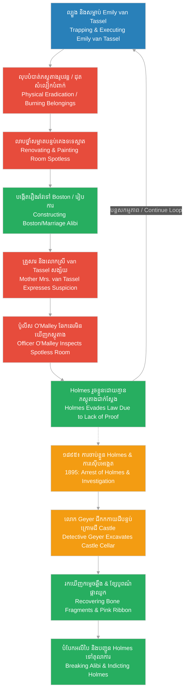

# Episode 16: ស្រមោលកប់បាត់ (Vanished without a Trace)

**Author:** ichamrong  
**Date:** 2026-06-07  
**Tags:** #hh-holmes #screenplay #episode-16 #gilded-age #chicago #emily-van-tassel #disappearance #investigation #police-search #excavation #cellar-findings #historical-case-study  
**Category:** Biographies  
**Read Time:** ~15 min  

---

## 📌 មាតិកា (Table of Contents)
- [សេចក្តីផ្តើម៖ ការរលាយបាត់ស្រមោល (Introduction: The Silent Erasure)](#0)
- [១. ការសម្លាប់ និងការលុបដានជាសម្ងាត់ (Scene 1: The Disappearance & Silent Erasure)](#1)
- [២. ការប្រឈមមុខស៊ើបសួររបស់គ្រួសារ (Scene 2: The Mother's Confrontation)](#2)
- [៣. ការត្រួតពិនិត្យ និងបន្ទប់ទទេស្អាត (Scene 3: The Spotless Quarters)](#3)
- [៤. ភស្តុតាងក្នុងបន្ទប់ក្រោមដី និងសោកនាដកម្មពិត (Scene 4: The Cellar Findings & Epilogue)](#4)
- [៥. យន្តការបង្វែរដាន និងការលុបបំបាត់ភស្តុតាង (Evasion, Cover-Up & Excavation Loops)](#5)
- [សេចក្តីសន្និដ្ឋាន (Conclusion)](#6)
- [🔗 ឯកសារទាក់ទង (Related Topics)](#7)

---

## សេចក្តីផ្តើម៖ ការរលាយបាត់ស្រមោល (Introduction: The Silent Erasure)

រឿងភាគទី ១៦ នេះ ផ្អែកលើករណីសិក្សាប្រវត្តិសាស្ត្រពិតនៃការបាត់ខ្លួនរបស់យុវតីអាយុ ១៨ ឆ្នាំ **Emily van Tassel** ក្នុងអំឡុងដើមឆ្នាំ ១៨៩៣។ បន្ទាប់ពីទទួលបានការទុកចិត្ត និងល្បួងដោយឱកាសការងារខ្ពស់ពី H.H. Holmes នាងត្រូវបានគេសម្លាប់យ៉ាងសម្ងាត់នៅក្នុងវិមាន Castle។ Holmes បានលុបដានយ៉ាងលឿន ដោយបង្ខំឱ្យ Benjamin Pitezel សម្អាតបន្ទប់ស្នាក់នៅរបស់នាង និងដុតកម្ទេចរបស់របរផ្ទាល់ខ្លួនរបស់នាង។ នៅពេលដែលម្តាយរបស់នាង គឺលោកស្រី van Tassel មកស៊ើបសួរ ហូមបានប្រើវោហារសាស្ត្របោកប្រាស់ ដោយអះអាងថានាងបានលាឈប់ពីការងារ ហើយចាកចេញទៅទីក្រុង Boston ជាមួយគូស្នេហ៍ថ្មី ឬរៀបការបាត់ទៅហើយ។ ថ្វីបើគ្រួសាររបស់នាងនាំប៉ូលីសមកត្រួតពិនិត្យយ៉ាងណាក្តី ក៏ពួកគេរកមិនឃើញភស្តុតាងអ្វីឡើយ ព្រោះបន្ទប់របស់នាងត្រូវបានលាបថ្នាំថ្មី និងសម្អាតយ៉ាងស្អាតឥតខ្ចោះ។ សោកនាដកម្មពិតត្រូវបានលាតត្រដាងតែនៅក្នុងឆ្នាំ ១៨៩៥ ប៉ុណ្ណោះ គឺនៅពេលដែលលោកស៊ើបអង្កេត **Frank Geyer** ជីកកកាយរកឃើញកម្ទេចឆ្អឹង សក់ និងកម្ទេចក្រណាត់ រួមទាំងខ្សែបូពណ៌ផ្កាឈូកដែលជាកាដូរបស់ Holmes នៅក្នុងភក់ដីនៃបន្ទប់ក្រោមដីវិមាន Castle។

This sixteenth episode is based on the historical documentation of the sudden disappearance of 18-year-old **Emily van Tassel** in early 1893. After securing her complete trust and manipulating her with career promises, Holmes executed her inside the Castle. Holmes swiftly erased all physical evidence, forcing Benjamin Pitezel to clean her room and burn her belongings. When her mother, Mrs. van Tassel, arrived seeking answers, Holmes deployed his deceptive cover story, claiming Emily left voluntarily to Boston with a suitor or got married. Even when the family returned with a police officer, they found nothing but a freshly painted, spotless room. The grim reality was only uncovered in July 1895, when Detective **Frank Geyer** excavated the Castle cellar and discovered bone fragments, hair, and remnants of clothing, including the pink hair ribbon Holmes had gifted Emily, buried in the cellar dirt.

---

## ១. ការសម្លាប់ និងការលុបដានជាសម្ងាត់ (Scene 1: The Disappearance & Silent Erasure)

**ទីតាំង៖** ជាន់ទីពីរនៃវិមាន Castle និងបន្ទប់គេងរបស់ Emily, ដើមឆ្នាំ ១៨៩៣ (វេលាយប់ជ្រៅ)  
**Location:** The Second Floor of the Castle and Emily's Quarters, Early 1893 (Late Night)

**សកម្មភាព៖** របៀងអគារមានពន្លឺស្រអាប់ និងស្ងាត់ជ្រងំ។ Holmes (ស្លៀកពាក់អាវធំសម្រាប់ធ្វើការងារ) នាំ Emily ដើរតម្រង់ទៅបន្ទប់ដែកសុវត្ថិភាព ឬបន្ទប់បិទជិតមួយ។ គេបង្ហាញឯកសារបញ្ជីឱសថស្ថានខ្លះដល់នាង។ Emily ដើរចូលទៅស្វែងរកឯកសារដោយគ្មានការសង្ស័យឡើយ។ Holmes រុញទ្វារបិទភ្លាម ៗ និងចាក់សោជាប់។ គេបង្វិលវ៉ាល់ហ្គាសពុលយ៉ាងលឿន និងឈរស្ដាប់សម្លេងស្រែកខ្សោយ ៗ របស់នាង។ បន្តិចក្រោយមក Holmes ឈរនៅក្នុងបន្ទប់គេងរបស់ Emily ជាមួយ Pitezel (ទឹកមុខស្លេកស្លាំង ដកដង្ហើមញាប់ញ័រ ដៃកាន់ធុងទឹក និងថ្នាំសម្អាត)។ Holmes ចង្អុលបង្ហាញកាបូបសម្លៀកបំពាក់ និងសៀវភៅកំណត់ហេតុរបស់ Emily នៅលើតុ។  
**Action:** The corridor is dimly lit and dead silent. Holmes (wearing his work coat) leads Emily toward a sealed vault room. He shows her a pharmacy ledger. Emily, completely trusting, steps inside to check the record. Holmes slams the door shut, locking it. He rapidly twists the gas valve, standing silently to listen to her muffled cries. A short time later, Holmes stands in Emily's living quarters with Pitezel (who is pale, breathing heavily, and holding a bucket of water and chemical cleaner). Holmes points to Emily's clothing bag and diary on the desk.

<!-- [IMAGE: H.H. Holmes trapping Emily van Tassel inside the vault room. (Image generation rate-limited, to be added later)] -->

*   **ហូម (Holmes)៖** "ផាយធាហ្សល... យកកាបូបសម្លៀកបំពាក់ និងរបស់ផ្ទាល់ខ្លួនទាំងអស់របស់កញ្ញា van Tassel ទៅដុតកម្ទេចចោលក្នុងឡដុតឥឡូវនេះ។ បន្ទាប់មក ជូតសម្អាតបន្ទប់នេះឱ្យស្អាត កុំឱ្យសេសសល់សូម្បីតែដានសក់មួយសរសៃ។ យើងត្រូវលាបថ្នាំជញ្ជាំងនេះឡើងវិញនៅព្រឹកស្អែក។"  
    *   *"Pitezel... take the clothing bag and all personal belongings of Miss van Tassel and incinerate them in the furnace immediately. Afterward, scrub this room; leave not a single strand of hair. We must repaint these walls tomorrow morning."*
*   **ផាយធាហ្សល (Pitezel)៖** (ដៃរបស់គាត់ញ័រពេលលើកសៀវភៅកំណត់ហេតុរបស់ Emily និយាយសំឡេងខ្សឹប) "លោក Howard... តើវាចាំបាច់ដល់ថ្នាក់នេះទេ? នាងទើបតែអាយុ ១៨ ឆ្នាំប៉ុណ្ណោះ។ គ្រួសារនាងនឹងមកតាមរកនាងមិនខានឡើយ ពួកគេនៅជិតទីនេះណាស់។"  
    *   *(His hands trembling as he picks up Emily's diary, speaking in a low whisper)* *"Mr. Howard... is this level of eradication required? She was only eighteen. Her family will come searching for her; they reside very close by."*
*   **ហូម (Holmes)៖** (និយាយសំឡេងត្រជាក់ និងម៉ឺងម៉ាត់បំផុត) "ភាពស្ទាក់ស្ទើរគឺជាប្រភពនៃគ្រោះថ្នាក់ ផាយធាហ្សល។ នៅក្នុងអាជីវកម្ម និងវិទ្យាសាស្ត្រ ការលុបបំបាត់កាកសំណល់ គឺជាដំណាក់កាលចាំបាច់ដើម្បីរក្សាប្រព័ន្ធឱ្យដំណើរការល្អ។ ប្រសិនបើគ្មានដានភស្តុតាងរូបវន្ត គ្មាននរណាម្នាក់អាចចោទប្រកាន់យើងបានឡើយ។ ធ្វើការងាររបស់អ្នកចុះ មុនពេលព្រះអាទិត្យរះ។"  
    *   *(Speaking in a cold, authoritative tone)* *"Hesitation is the source of failure, Pitezel. In commerce and science, waste elimination is a necessary phase to maintain system integrity. If there is no physical trace, there is no foundation for accusation. Complete your assignment before dawn."*
*   **ផាយធាហ្សល (Pitezel)៖** (ដកដង្ហើមធំទាំងក្តីអស់សង្ឃឹម និងឱនក្បាលយល់ព្រម) "បាទ លោក Howard... ខ្ញុំនឹងរៀបចំវាឱ្យរួចរាល់។"  
    *   *(Sighing in despair, nodding in compliance)* *"Yes, Mr. Howard... I will have it completed."*

**ការពិពណ៌នា៖** Pitezel យករបស់របររបស់ Emily ដើរចុះជណ្តើរទៅបន្ទប់ក្រោមដីទាំងស្មារតីធ្លាក់ចុះ។ Holmes ឈរត្រួតពិនិត្យបន្ទប់ទទេស្អាតនោះដោយខ្សែភ្នែកវាយតម្លៃ គេយកដៃស្ទាបជញ្ជាំងឈើដើម្បីប្រាកដថាគ្មានភស្តុតាងអ្វីបន្សល់ទុកឡើយ។  
**Description:** Pitezel carries Emily's belongings down to the cellar, his spirit crushed. Holmes inspects the vacated quarters with an analytical eye, running his hand along the wooden panels to ensure absolute cleanliness.

---

## ២. ការប្រឈមមុខស៊ើបសួររបស់គ្រួសារ (Scene 2: The Mother's Confrontation)

**ទីតាំង៖** បញ្ជរឱសថស្ថានរបស់ Holmes ក្នុងអគារ Castle, ពីរថ្ងៃក្រោយមក (វេលារសៀល)  
**Location:** Holmes' Drugstore Counter at the Castle, Two Days Later (Afternoon)

**សកម្មភាព៖** ឱសថស្ថានមានអតិថិជនដើរចេញចូលខ្លះ។ Holmes កំពុងឈររៀបចំដបថ្នាំនៅក្រោយបញ្ជរ។ លោកស្រី van Tassel (ម្តាយរបស់ Emily ទឹកមុខស្លេកស្លាំង ភ្នែកឡើងក្រហម និងហើមដោយសារយំ បង្ហាញភាពខឹងសម្បារ និងភ័យខ្លាច) ដើរចូលមកឱសថស្ថានយ៉ាងលឿន អមដំណើរដោយសាច់ញាតិម្នាក់។ នាងវាយដៃលើបញ្ជរដើម្បីទាមទារការបកស្រាយ។  
**Action:** The drugstore has moderate customer traffic. Holmes stands organizing medicine bottles behind the counter. Mrs. van Tassel (Emily's mother, looking pale, her eyes red and swollen from crying, showing frustration and fear) enters quickly, accompanied by a relative. She taps the counter, demanding answers.

<!-- [IMAGE: Mrs. van Tassel confronting Holmes at the drugstore counter. (Image generation rate-limited, to be added later)] -->

*   **លោកស្រី វ៉ាន់ ថាស្យែល (Mrs. van Tassel)៖** "លោក Holmes! តើកូនស្រីខ្ញុំ Emily នៅឯណា? នាងមិនបានត្រឡប់ទៅផ្ទះពីរថ្ងៃហើយ! នាងមិនដែលខកខានក្នុងការប្រាប់ខ្ញុំឡើយ។ ខ្ញុំដឹងថានាងនៅទីនេះ... នាងស្រឡាញ់ការងារនេះ និងគោរពលោកណាស់។ តើលោកធ្វើអ្វីដាក់កូនស្រីខ្ញុំ?"  
    *   *"Mr. Holmes! Where is my daughter Emily? She has not returned home for two days! She never fails to inform me of her movements. I know she was here... she valued this job and respected you deeply. What have you done with my daughter?"*
*   **ហូម (Holmes)៖** (សម្តែងទឹកមុខភ្ញាក់ផ្អើល និងព្រួយបារម្ភជាខ្លាំង គេលូកដៃទៅជួយកាន់ដៃនាង ប៉ុន្តែនាងដកដៃចេញ) "ព្រះអើយ... លោកស្រី van Tassel! តើ Emily បាត់ខ្លួនមែនទេ? នេះពិតជាគួរឱ្យតក់ស្លុតណាស់។ នាងបានលាឈប់ពីការងារតាំងពីល្ងាចថ្ងៃមុនមកម្ល៉េះ។ នាងបានប្រាប់ខ្ញុំថានាងត្រូវចាកចេញទៅទីក្រុង Boston ភ្លាម ៗ។"  
    *   *(Feigning shock and deep concern, reaching out to comfort her, but she pulls away)* *"Good heavens... Mrs. van Tassel! Emily is missing? This is deeply distressing. She resigned from her position here the evening before last. She informed me that she had to depart for Boston immediately."*
*   **លោកស្រី វ៉ាន់ ថាស្យែល (Mrs. van Tassel)៖** (និយាយទាំងសម្លេងញ័រ ៗ និងស្រក់ទឹកភ្នែក) "កុហក! នាងទៅ Boston ធ្វើអ្វីដោយមិនប្រាប់ម៉ែរបស់នាង? នាងគ្មានលុយ និងគ្មានសាច់ញាតិនៅទីនោះឡើយ! លោកឯងជាអ្នកល្បួងនាងដោយកាដូ និងការសន្យាខ្យល់ទាំងនោះ!"  
    *   *(Her voice shaking, weeping)* *"Lies! Why would she go to Boston without telling her own mother? She has no funds and no relatives there! You groomed her with gifts and those hollow promises!"*
*   **ហូម (Holmes)៖** (និយាយដោយសំឡេងទន់ភ្លន់ និងគួរឱ្យអាណិតអាសូរ បង្ហាញភាពថ្លៃថ្នូរ) "ខ្ញុំយល់ពីការបារម្ភរបស់លោកស្រី។ ប៉ុន្តែ Emily ជាយុវតីដែលមានមហិច្ឆតាខ្ពស់។ នាងបានជួបនឹងបុរសវ័យក្មេងម្នាក់ដែលសន្យាថានឹងរៀបការជាមួយនាង និងនាំនាងទៅរស់នៅទីនោះ។ នាងបានយករបស់របរផ្ទាល់ខ្លួនរបស់នាងទាំងអស់ទៅជាមួយ។ ខ្ញុំថែមទាំងបានបើកប្រាក់ឈ្នួលចុងក្រោយឱ្យនាងទៀតផង។ ខ្ញុំសង្ឃឹមថានាងមានសុវត្ថិភាព។"  
    *   *(Speaking in a soft, empathetic, and professional tone)* *"I comprehend your maternal anxiety, madam. But Emily is an ambitious young woman. She met a young gentleman who promised marriage and a new life there. She gathered all her personal items and departed. I even paid her final wages in full. I pray she is safe."*

**ការពិពណ៌នា៖** លោកស្រី van Tassel យំខ្សឹកខ្សួល មិនព្រមជឿលើពាក្យសម្តីរបស់ Holmes ឡើយ ប៉ុន្តែភាពទន់ភ្លន់ និងភាពស្ងប់ស្ងាត់របស់គេ ធ្វើឱ្យសាច់ញាតិរបស់នាងចាប់ផ្តើមមានការងឿងឆ្ងល់ និងព្យាយាមសម្រាលសម្លេងស្រែករបស់នាង ដើម្បីកុំឱ្យប៉ះពាល់ដល់អតិថិជនដទៃ។  
**Description:** Mrs. van Tassel weeps, refusing to accept Holmes' narrative, but his calm and polite composure makes her relative hesitate, attempting to quiet her to avoid causing a scene in front of other clients.

---

## ៣. ការត្រួតពិនិត្យ និងបន្ទប់ទទេស្អាត (Scene 3: The Spotless Quarters)

**ទីតាំង៖** ជាន់ទីពីរនៃវិមាន Castle និងបន្ទប់គេងទទេរបស់ Emily, ថ្ងៃបន្ទាប់ (វេលាព្រឹក)  
**Location:** The Second Floor of the Castle and Emily's Empty Quarters, The Following Day (Morning)

**សកម្មភាព៖** Holmes ដើរដឹកនាំផ្លូវដោយភាពស្វាហាប់ និងសហការបំផុត។ ដើរតាមពីក្រោយគេមាន លោកស្រី van Tassel និងមន្ត្រីប៉ូលីសក្រុង Chicago ម្នាក់ឈ្មោះ មន្ត្រី O'Malley (មន្ត្រីវ័យកណ្តាល ស្លៀកពាក់ឯកសណ្ឋានប៉ូលីស កាន់សៀវភៅកត់ត្រា និងមានទឹកមុខម៉ឺងម៉ាត់)។ Holmes បើកទ្វារបន្ទប់គេងដែល Emily ធ្លាប់ស្នាក់នៅ។ បន្ទប់នេះមានក្លិនថ្នាំលាបថ្មី ៗ ជញ្ជាំងត្រូវបានលាបពណ៌សស្អាត គ្មានគ្រែ គ្មានតុ កៅអី ឬរបស់របរប្រើប្រាស់អ្វីទាំងអស់ គឺទទេស្អាតដូចជាមិនធ្លាប់មានមនុស្សរស់នៅឡើយ។  
**Action:** Holmes leads the way with an energetic, cooperative demeanor. Following him are Mrs. van Tassel and a Chicago police officer, Officer O'Malley (a middle-aged officer in uniform, holding a notebook, looking stern). Holmes opens the door to the room Emily formerly occupied. The room smells of fresh paint, the walls are painted a clean white, and there is no bed, desk, or personal items—completely vacant as if it had never been inhabited.

<!-- [IMAGE: A police officer inspecting Emily's spotless, empty Castle room. (Image generation rate-limited, to be added later)] -->

*   **ហូម (Holmes)៖** "សូមអញ្ជើញចូលមក មន្ត្រី O'Malley។ ខ្ញុំមានចិត្តស្មោះត្រង់ និងគ្មានអ្វីត្រូវលាក់បាំងឡើយ។ នេះជាបន្ទប់ដែល Emily ធ្លាប់ស្នាក់នៅពេលនាងធ្វើការទីនេះ។ ក្រោយពេលនាងលាឈប់ និងដឹករបស់របរចេញអស់ ខ្ញុំបានឱ្យជាងលាបថ្នាំជញ្ជាំងឡើងវិញភ្លាម ៗ ដើម្បីត្រៀមទទួលបុគ្គលិកថ្មី។ លោកស្រី van Tassel អាចពិនិត្យមើលដោយសេរីចុះ។"  
    *   *"Step inside, Officer O'Malley. I maintain absolute transparency and have nothing to conceal. This is the room Emily occupied during her employment. After she resigned and moved her effects, I had the walls repainted immediately to prepare for the next clerk. Mrs. van Tassel is free to inspect the premises."*
*   **លោកស្រី វ៉ាន់ ថាស្យែល (Mrs. van Tassel)៖** (ដើរស្ទាបជញ្ជាំង និងយំស្រែក) "ព្រះអើយ! នេះជាការលុបដាន! នាងទើបតែបាត់ខ្លួនពីរថ្ងៃ ហេតុអ្វីលោកត្រូវប្រញាប់លាបថ្នាំបន្ទប់នេះឡើងវិញ? របស់របរនាងទៅណាអស់ហើយ? លោកប៉ូលីស... សូមលោកជួយរកយុត្តិធម៌ឱ្យខ្ញុំផង! គាត់សម្លាប់កូនស្រីខ្ញុំហើយ!"  
    *   *(Touching the walls, crying out)* *"My God! This is an erasure! She has been gone only two days; why would you rush to repaint this room? Where are her things? Officer... please, secure justice for me! He has taken my daughter's life!"*
*   **មន្ត្រី អូឡេម៉ាលី (Officer O'Malley)៖** (ពិនិត្យជ្រុងបន្ទប់ ជូតដៃលើឥដ្ឋ និងពិនិត្យមើលជញ្ជាំង រួចដកដង្ហើមធំងាកមកនិយាយជាមួយលោកស្រី van Tassel) "លោកស្រី van Tassel... ខ្ញុំយល់ពីទុក្ខសោករបស់លោកស្រី។ ប៉ុន្តែគ្មានភស្តុតាងណាមួយបង្ហាញពីអំពើហឹង្សា ឬការបង្ខាំងមនុស្សនៅទីនេះឡើយ។ បន្ទប់នេះទទេស្អាត ហើយលោក Holmes សហការជាមួយយើងយ៉ាងល្អ។ គាត់មានសិទ្ធិលាបថ្នាំបន្ទប់របស់គាត់ឡើងវិញ។ យើងមិនអាចចាប់ខ្លួននរណាម្នាក់ដោយគ្មានភស្តុតាងច្បាស់លាស់ឡើយ។"  
    *   *(Checking corners, running his hand on the floor and walls, sighing as he turns to Mrs. van Tassel)* *"Mrs. van Tassel... I sympathize with your grief. However, there is no physical evidence of violence or restraint here. The quarters are empty, and Mr. Holmes has cooperated fully. He is within his rights to renovate his property. We cannot execute an arrest based on suspicion alone."*
*   **ហូម (Holmes)៖** "ខ្ញុំពិតជាសោកស្តាយណាស់។ ប្រសិនបើខ្ញុំទទួលបានព័ត៌មានណាមួយពី Emily ឬលោកស្រីចង់ឱ្យខ្ញុំជួយស៊ើបសួរអតិថិជន ខ្ញុំនឹងជួយដោយអស់ពីចិត្ត។ សុវត្ថិភាពរបស់បុគ្គលិកខ្ញុំ គឺជាអាទិភាពចម្បងរបស់ខ្ញុំជានិច្ច។"  
    *   *"I am deeply sympathetic to your plight. If I receive any word from Emily, or if you require me to query our clientele, I will assist without reservation. The safety of my staff remains my highest operational priority."*

**ការពិពណ៌នា៖** មន្ត្រី O'Malley ងក់ក្បាលដាក់ Holmes ដោយការគោរព និងនាំលោកស្រី van Tassel ចាកចេញទៅវិញទាំងគ្មានសង្ឃឹម។ Holmes ឈរមើលពួកគេចាកចេញពីរបៀងអគារ ដោយទឹកមុខស្ងប់ស្ងាត់បំផុត។ គេដឹងថាប្រព័ន្ធច្បាប់សម័យនេះពឹងផ្អែកតែលើ «ភស្តុតាងជាក់ស្តែង» ហើយការបោសសម្អាត និង compartmentalization របស់គេ គឺរឹងមាំជាងច្បាប់ទៅទៀត។  
**Description:** Officer O'Malley nods respectfully to Holmes, leading the grieving mother away in despair. Holmes watches them depart from the dark corridor with absolute tranquility, knowing that the legal system relies strictly on physical evidence, and his compartmentalization is stronger than their laws.

---

## ៤. ភស្តុតាងក្នុងបន្ទប់ក្រោមដី និងសោកនាដកម្មពិត (Scene 4: The Cellar Findings & Epilogue)

**ទីតាំង៖** បន្ទប់ក្រោមដីនៃអគារ Castle (Castle Cellar), ខែកក្កដា ឆ្នាំ ១៨៩៥ (វេលាថ្ងៃត្រង់)  
**Location:** The Basement Cellar of the Castle, July 1895 (Noon)

**សកម្មភាព៖** រំលងទៅពីរឆ្នាំក្រោយមក។ បន្ទប់ក្រោមដីងងឹត និងពោរពេញដោយធូលីដី។ ពន្លឺព្រះអាទិត្យចាំងចូលតាមរន្ធខ្យល់តូច ៗ បំភ្លឺដីដែលត្រូវបានកាយឡើងជាគំនរ ៗ។ លោកស៊ើបអង្កេត Frank Geyer (ពាក់អាវធំធ្វើការងារ ទឹកមុខម៉ឺងម៉ាត់ ហ្មត់ចត់ និងនឿយហត់) កំពុងកាន់ប៉ែល ឈរមើលមន្ត្រីប៉ូលីសពីរនាក់ដែលកំពុងប្រើដៃកាយដីភក់លាយថ្មក្នុងរណ្តៅជ្រៅមួយ។ ស្រាប់តែ មន្ត្រីម្នាក់លើករបស់ម្យ៉ាងចេញពីភក់ដីឡើងមក។  
**Action:** Flash-forward two years. The cellar is dark, damp, and dusty. Sunlight filters through small vents, illuminating piles of excavated dirt. Detective Frank Geyer (wearing his work coat, looking stern, meticulous, and exhausted) leans on a shovel, watching two officers dig into the mud and stone of a deep pit. Suddenly, one officer retrieves an object from the dirt.

<!-- [IMAGE: Detective Frank Geyer excavating the Castle cellar and finding the pink hair ribbon. (Image generation rate-limited, to be added later)] -->

*   **មន្ត្រីប៉ូលីស (Officer)៖** "លោកស៊ើបអង្កេត Geyer! ជួយមើលទីនេះបន្តិចមក។ យើងបានរកឃើញបំណែកឆ្អឹងដៃ និងសក់ស្ត្រីមួយដុំធំនៅក្នុងដីភក់នេះ។ ហើយ... មានរបស់របរមួយនេះជាប់មកជាមួយដែរ។"  
    *   *"Detective Geyer! Look here. We have uncovered arm bone fragments and a clump of female hair buried in this wet mud. And... there is this item entangled with them."*
*   **លោកស៊ើបអង្កេត ហ្គីយេ (Detective Geyer)៖** (លុតជង្គង់ចុះយឺត ៗ យកដង្កៀបដែកចាប់វត្ថុនោះមកលាងក្នុងចានទឹកយ៉ាងហ្មត់ចត់) "វាជាខ្សែបូ... ខ្សែបូសូត្រពណ៌ផ្កាឈូក ដែលខូចខាត និងពុកផុយខ្លះដោយសារជាតិអាស៊ីត និងសំណើមដី។ នេះជាភស្តុតាងច្បាស់ណាស់។"  
    *   *(Kneeling slowly, using metal forceps to rinse the object in a basin of water)* *"It is a ribbon... a pink silk ribbon, partially decayed by chemical action and soil moisture. This is concrete physical evidence."*
*   **មន្ត្រីប៉ូលីស (Officer)៖** (មើលខ្សែបូនោះទាំងទឹកមុខស្មុគស្មាញ) "តើវាជារបស់ Emily van Tassel មែនទេ លោកស៊ើបអង្កេត? ម្តាយរបស់នាងបានប្រាប់យើងអំពីខ្សែបូពណ៌ផ្កាឈូកដែល Holmes បានឱ្យនាងមុនពេលនាងបាត់ខ្លួន។"  
    *   *(Looking at the ribbon with a heavy expression)* *"Does it belong to Emily van Tassel, Detective? Her mother informed us of a pink ribbon Holmes presented to her just before she vanished."*
*   **លោកស៊ើបអង្កេត ហ្គីយេ (Detective Geyer)៖** (ងើបឈរយឺត ៗ កាន់ខ្សែបូនោះដាក់ក្នុងថង់ភស្តុតាង និងនិយាយដោយសំឡេងធ្ងន់ ៗ តែប្រកបដោយជំនឿចិត្ត) "បាទ គឺជានាងហើយ។ នាងមិនដែលបានទៅ Boston ដូចពាក្យសម្តីកុហករបស់ Holmes ឡើយ។ នាងត្រូវបានសម្លាប់ និងរំលាយសាកសពនៅក្នុងអាងអាស៊ីតជាន់ក្រោមដីនេះ រួចកប់កម្ទេចសេសសល់ក្នុងភក់ដី។ វិទ្យាសាស្ត្រ និងការស៊ើបសួរដ៏ហ្មត់ចត់ មិនអាចឱ្យ Holmes លាក់បាំងសោកនាដកម្មនេះរហូតបានឡើយ។ យុត្តិធម៌នឹងត្រូវសម្រេចនៅលើតុលាការ។"  
    *   *(Standing up slowly, securing the ribbon in an evidence bag, speaking in a grave but resolute tone)* *"Yes, it is her. She never departed for Boston as Holmes claimed in his fabricated alibi. She was executed and her remains processed in the acid vats here, the remnants buried in this cellar dirt. Articulated science and diligent tracking will not allow Holmes to bury this tragedy forever. Justice will be served in the court."*

**ការពិពណ៌នា៖** Geyer សម្លឹងមើលថង់ភស្តុតាងដែលផ្ទុកខ្សែបូពណ៌ផ្កាឈូកពុកផុយនោះ ទាំងខ្សែភ្នែកពោរពេញដោយភាពម៉ឺងម៉ាត់ និងគោរពដល់ជនរងគ្រោះ។ ខាងក្រៅអគារ Castle មហាជនក្រុង Chicago ឈរចាំស្តាប់ព័ត៌មានដោយក្តីរន្ធត់ ខណៈដែលការពិតដ៏ខ្មៅងងឹតកំពុងត្រូវបានកាយចេញពីដីម្តងបន្តិច ៗ។  
**Description:** Geyer stares at the evidence bag containing the decayed pink ribbon, his gaze resolute and honoring the victim's memory. Outside the Castle, the Chicago public gathers in suspense and horror as the dark reality is unearthed piece by piece.

---

## ៥. យន្តការបង្វែរដាន និងការលុបបំបាត់ភស្តុតាង (Evasion, Cover-Up & Excavation Loops)

ដ្យាក្រាមខាងក្រោមបង្ហាញពីរង្វង់យន្តការដែល H.H. Holmes ប្រើប្រាស់ដើម្បីសម្លាប់ លុបបំបាត់ភស្តុតាង បង្កើតរឿងរ៉ាវបោកប្រាស់ដើម្បីគេចពីច្បាប់ និងរបៀបដែលការស៊ើបអង្កេតរបស់លោក Frank Geyer អាចបំបែករង្វង់នេះបាន៖

The following diagram maps the strategic loop Holmes engineered to execute, cover up, and evade justice, and how Detective Geyer's scientific investigation ultimately broke the loop:

> [!IMPORTANT]
> **🧠 យន្តការចិត្តសាស្ត្រ / Psychological Mechanism - [លំហូរនៃធនធាន និងការរៀបចំយន្តការ (Flow of Resources and Mechanics)](../keyword/flow-of-resources-and-mechanics.md):**
> * «នៅក្នុងប្លង់ទី ១ និងទី ៣ Holmes ចាត់ទុកការលុបបំបាត់ភស្តុតាង និងការលាបថ្នាំបន្ទប់ឡើងវិញជាការងាររដ្ឋបាលស្តង់ដារ។ គេដកអារម្មណ៍អាណិតអាសូរចេញទាំងស្រុង ដោយបង្វែរជីវិតមនុស្សឱ្យទៅជាកន្លែងទំនេរសម្រាប់ជួលបន្ត ដើម្បីរក្សាលំនឹងហិរញ្ញវត្ថុ និងលាក់កំបាំងការសម្លាប់មនុស្សពីប្រព័ន្ធច្បាប់ជាក់ស្តែងនិយម។» (*"In Scenes 1 and 3, Holmes treats evidence eradication and room renovation as standard administrative tasks. He completely detaches empathy, converting a human life into vacant rental space to maintain financial stability and shield his homicides from a pragmatic legal system."*).
> 
> **🤫 យន្តការចិត្តសាស្ត្រ / Psychological Mechanism - [បញ្ជីវាស់វែងវិន័យ (Discipline Ledger)](../keyword/discipline-ledger.md):**
> * «នៅក្នុងប្លង់ទី ២ និងទី ៤ Holmes ប្រើប្រាស់វោហារសាស្ត្រគួរសម និងវិន័យរដ្ឋបាលដើម្បីបង្វែរដានគ្រួសារជនរងគ្រោះ។ ទោះជាយ៉ាងណា វិន័យ និងការស៊ើបសួរជាប្រព័ន្ធរបស់លោក Frank Geyer ក្នុងឆ្នាំ ១៨៩៥ តាមរយៈការជីកកកាយដីបន្ទប់ក្រោមដី បានបំបែកខែលការពាររបស់គេ ដោយបង្ហាញថា វិទ្យាសាស្ត្រស៊ើបអង្កេតអាចរកឃើញដាននៃការពិត ទោះជាវាត្រូវបានរំលាយ និងកប់ក្នុងដីក៏ដោយ។» (*"In Scenes 2 and 4, Holmes deploys polite rhetoric and administrative discipline to deflect the victim's family. However, Frank Geyer's systematic discipline and tracking in 1895 via cellar excavation shattered his shield, proving that forensic science can retrieve traces of truth even when dissolved and buried."*).

---

## សេចក្តីសន្និដ្ឋាន (Conclusion)

> **«គ្មានការលុបបំបាត់ណាអាចបំផ្លាញដាននៃការពិតទាំងស្រុងឡើយ... ទោះជាជាតិអាស៊ីតរំលាយសាច់ ហើយដីភក់កប់របស់របរយ៉ាងណាក្តី ក៏យុត្តិធម៌នឹងកាយវាឡើងមកវិញនៅថ្ងៃណាមួយ» — លោកស៊ើបអង្កេត Frank Geyer**
> 
> **“No amount of erasure can completely destroy the traces of truth... even if acid dissolves the flesh and mud buries the belongings, justice will eventually exhume them.” — Detective Frank Geyer**

រឿងភាគទី ១៦ បិទបញ្ចប់ដោយទិដ្ឋភាពដ៏ក្តុកក្តួល៖ លោកស្រី van Tassel អង្គុយយំខ្សឹកខ្សួលក្នុងតុលាការ ដៃរបស់នាងឱបថើបថង់ភស្តុតាងដែលផ្ទុកខ្សែបូពណ៌ផ្កាឈូកពុកផុយនោះ។ Holmes អង្គុយនៅកៅអីចុងចោទដោយទឹកមុខស្ងប់ស្ងាត់ឥតវិញ្ញាណ ខណៈដែល Pitezel ឱនមុខចុះដោយក្តីខ្មាស់អៀន និងវិប្បដិសារី។ នេះជាការបញ្ចប់ករណីរបស់ Emily van Tassel និងបញ្ចប់វគ្គទី ១ នៃរឿងភាគទាំងមូល ដោយត្រៀមចូលទៅកាន់វគ្គទី ២ (Arc 2) ដែលនឹងបង្ហាញពីឧក្រិដ្ឋកម្មរបស់ Holmes ក្នុងអំឡុងពិព័រណ៍ពិភពលោកឆ្នាំ ១៨៩៣ (1893 World's Fair)។

Episode 16 concludes with a poignant scene: Mrs. van Tassel sits weeping in the courtroom, clutching the evidence bag containing the decayed pink ribbon to her chest. Holmes sits at the defense table with a cold, vacant expression, while Pitezel hangs his head in shame and remorse. This closes the case of Emily van Tassel and concludes Arc 1 of the drama series, setting the stage for Arc 2, which will document Holmes' industrial-scale crimes during the 1893 World's Fair.

---

## 🔗 ឯកសារទាក់ទង (Related Topics)
*   **[Episode 15: យុវតីនៅហាងលក់ថ្នាំ (Emily's Promise)](ep-15-emilys-promise.md)** — ស្គ្រីបភាគទី ១៥ ដែលបង្ហាញពីការជ្រើសរើស និងការលួងលោម Emily van Tassel។
*   **[Episode 17: ស្វាគមន៍មកកាន់វិមាន (Welcome to the Castle)](ep-17-welcome-to-the-castle.md)** — ស្គ្រីបភាគទី ១៧ ដែលបង្ហាញពីការចាប់ផ្តើមនៃពិព័រណ៍ឆ្នាំ ១៨៩៣ និងការមកដល់នៃភ្ញៀវទេសចរដំបូង។
*   **[លំហូរនៃធនធាន និងការរៀបចំយន្តការ (Flow of Resources and Mechanics)](../keyword/flow-of-resources-and-mechanics.md)** — វិធីសាស្ត្រចិត្តសាស្ត្រដែលចាត់ទុកជីវិតជាទ្រព្យសកម្មរូបវន្ត។
*   **[បញ្ជីវាស់វែងវិន័យ (Discipline Ledger)](../keyword/discipline-ledger.md)** — វិធីសាស្ត្រតាមដាន និងគ្រប់គ្រងចិត្តសាស្ត្ររបស់ Holmes។
*   **[ជីវប្រវត្តិ H.H. Holmes](../01-h-h-holmes-biography.md)** — ជីវប្រវត្តិនៃការវិវឌ្ឍជីវិត និងវិមានឃាតកម្មរបស់ Holmes។
*   **[គម្រោងរឿងភាគដ្រាម៉ា ៦៣ ភាគ](../08-holmes-drama-episode-guide.md)** — ផែនការ និងការសង្ខេបរឿងភាគទូរទស្សន៍ទាំង ៦៣ ភាគ។
