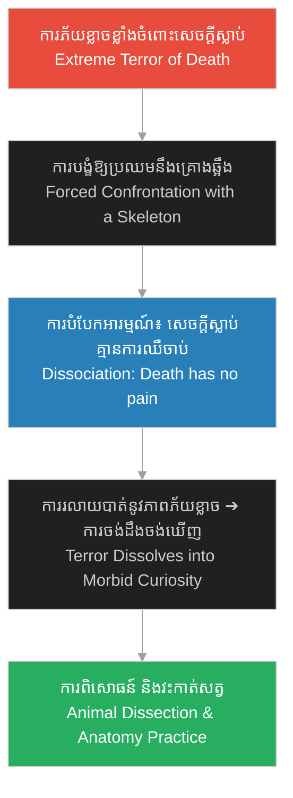

# ការចាប់អារម្មណ៍លើកាយវិភាគវិទ្យា (Anatomical Fascination)៖ Psychology of Herman Mudgett

**Author:** ichamrong  
**Date:** 2026-06-06  
**Tags:** #psychology #anatomical-fascination #holmes-analysis #medical-obsession #forensics  
**Category:** Keywords  
**Read Time:** ~4 min  

---

## 📌 មាតិកា (Table of Contents)
- [១. តើអ្វីជាការចាប់អារម្មណ៍លើកាយវិភាគវិទ្យា? (What is Anatomical Fascination?)](#1)
- [២. របៀបដែលការចាប់អារម្មណ៍នេះបានវិវឌ្ឍ (How this Fascination Evolved)](#2)
- [៣. ករណីសិក្សា៖ Herman Mudgett (Case Study: Herman Mudgett)](#3)
- [៤. ផលវិបាករយៈពេលវែង៖ ពីចំណង់ចំណូលចិត្តទៅជាអាជីវកម្មឃាតកម្ម (Long-term Impact: From Hobby to Murder Business)](#4)
- [ឯកសារយោង (References)](#5)

---

## ១. តើអ្វីជាការចាប់អារម្មណ៍លើកាយវិភាគវិទ្យា? (What is Anatomical Fascination?)

**ការចាប់អារម្មណ៍លើកាយវិភាគវិទ្យា (Anatomical Fascination)** នៅក្នុងបរិបទចិត្តសាស្ត្រឧក្រិដ្ឋកម្ម គឺជាការចង់ដឹងចង់ឃើញដ៏ខ្លាំងក្លា និងខុសប្រក្រតីអំពីទម្រង់ សរីរាង្គ ឆ្អឹង និងយន្តការកាយវិភាគវិទ្យារបស់សត្វ ឬមនុស្ស។ ជារឿយៗ ចំពោះឃាតករស៊េរី វាកើតចេញពីការបំប្លែងភាពភ័យខ្លាចចំពោះសេចក្តីស្លាប់ ឬការឈឺចាប់ ឱ្យទៅជាចំណង់ចង់គ្រប់គ្រង និងរុះរើរូបវន្តរបស់សរីរាង្គ។

**Anatomical Fascination** in the context of criminal psychology refers to an intense, obsessive curiosity about the physical structures, organs, bones, and biological mechanics of animals or humans. For serial offenders, this often stems from transforming a profound fear of death or pain into a desire to control, manipulate, and dismantle physical systems.

---

## ២. របៀបដែលការចាប់អារម្មណ៍នេះបានវិវឌ្ឍ (How this Fascination Evolved)

ចំពោះ Herman Mudgett ការចាប់អារម្មណ៍លើកាយវិភាគវិទ្យាមិនមែនកើតឡើងដោយចៃដន្យនោះទេ ប៉ុន្តែវាគឺជាលទ្ធផលនៃការបំប្លែងរបួសផ្លូវចិត្តកុមារភាព (Trauma Transformation)៖

---

## ៣. ករណីសិក្សា៖ Herman Mudgett (Case Study: Herman Mudgett)

នៅក្នុង [រឿងភាគទី ១ (Episode 1)](../episodes/ep-01-shadows-of-new-hampshire.md) ការវិវឌ្ឍនៃយន្តការនេះត្រូវបានបង្ហាញជាពីរដំណាក់កាលសំខាន់ៗ៖

1.  **ការប្រឈមមុខនឹងគ្រោងឆ្អឹង (Scene 2)៖** នៅពេលដែលក្មេងទំនើងសាលាបង្ខំ Herman ឱ្យទៅប៉ះគ្រោងឆ្អឹងនៅក្នុងគ្លីនិកងងឹត ភាពភ័យខ្លាចរបស់គេបានឈានដល់ចំណុចកំពូល រហូតដល់ចិត្តរបស់គេផ្តាច់ខ្លួនចេញ។ គេបានដឹងថា ឆ្អឹងទាំងនេះត្រជាក់ និងស្ងប់ស្ងាត់។ វាមិនអាចធ្វើបាបគេដូចឪពុកគេឡើយ។
2.  **ការវះកាត់សត្វនៅក្នុងព្រៃ (Scene 3)៖** នៅអាយុ ១២ ឆ្នាំ Herman បានចាប់ផ្តើមយកការចាប់អារម្មណ៍នេះទៅអនុវត្តជាក់ស្តែង ដោយចាប់សត្វកណ្តុរ និងសត្វបក្សីមកវះកាត់។ គេសិក្សាពីសាច់ ឆ្អឹង និងសរសៃឈាម ដើម្បីស្វែងយល់ពីរបៀបដែល "គ្រឿងម៉ាស៊ីនជីវិត" ដំណើរការ។

In [Episode 1](../episodes/ep-01-shadows-of-new-hampshire.md), the development of this fascination is dramatized through two key phases:
*   **Confronting the Skeleton:** Forced by bullies to touch a medical skeleton, Herman's initial terror triggers a mental shift. He realizes that the bones are cold, still, and completely free from the capacity to inflict pain, unlike his abusive father.
*   **Dissecting Animals in the Woods:** By age 12, this curiosity turns into physical experimentation. Herman catches and dissects small animals, analyzing flesh, bones, and blood vessels to dissect and understand the "machinery of life."

---

## ៤. ផលវិបាករយៈពេលវែង៖ ពីចំណង់ចំណូលចិត្តទៅជាអាជីវកម្មឃាតកម្ម (Long-term Impact: From Hobby to Murder Business)

ការចាប់អារម្មណ៍លើកាយវិភាគវិទ្យាកុមារភាពនេះ បានក្លាយជាគ្រឹះនៃជំនាញ និងទម្រង់ឧក្រិដ្ឋកម្មរបស់ Holmes នាពេលអនាគត៖

1.  **ការសិក្សាផ្នែកវេជ្ជសាស្ត្រ៖** វានាំឱ្យគេជ្រើសរើសចូលរៀនសាលាពេទ្យនៅសកលវិទ្យាល័យ Michigan ដែលជាកន្លែងគេទទួលបានជំនាញវះកាត់ផ្លូវការ និងរៀនសូត្រពីទីផ្សារងងឹតនៃសាកសព។
2.  **អាជីវកម្មលក់ឆ្អឹងមនុស្ស៖** Holmes មិនមែនគ្រាន់តែសម្លាប់មនុស្សដើម្បីកម្សាន្តឡើយ។ គេបានប្រើប្រាស់ចំណេះដឹងកាយវិភាគវិទ្យាយ៉ាងស្ទាត់ជំនាញ ដើម្បីសម្អាតសាច់ចេញពីសាកសពជនរងគ្រោះ រួចផ្គុំឆ្អឹងទាំងនោះឡើងវិញជា «គ្រោងឆ្អឹងកាយវិភាគវិទ្យា» ដើម្បីលក់ទៅឱ្យសាលាពេទ្យនានា ក្នុងតម្លៃខ្ពស់។

This early anatomical fascination directly shaped Holmes' future methods and criminal enterprise:
1.  **Formal Medical Training:** It drove him to attend the University of Michigan Medical School, where he acquired professional dissection skills and learned the logistics of the cadaver trade.
2.  **The Anatomical Skeleton Business:** Holmes commercialized his killings. He used his expert anatomical knowledge to cleanly strip flesh from his victims' bodies, reassembling the bones into medical-grade skeletons to sell to universities for substantial profits.

---

## ឯកសារយោង (References)

*   **Harold Schechter** — *Depraved: The Definitive True Story of H.H. Holmes, Whose Grotesque Crimes Shattered Turn-of-the-Century Chicago* (1994)។ ពិពណ៌នាអំពីកុមារភាព និងការផ្លាស់ប្តូរផ្នត់គំនិតរបស់ Holmes ក្រោយប្រឈមនឹងគ្រោងឆ្អឹង។
*   **University of Michigan Medical School Archives** — *Cadaver Procurement and Anatomical Studies in the late 19th Century*. Historical context on the legal and illegal trade of cadavers for dissection.
