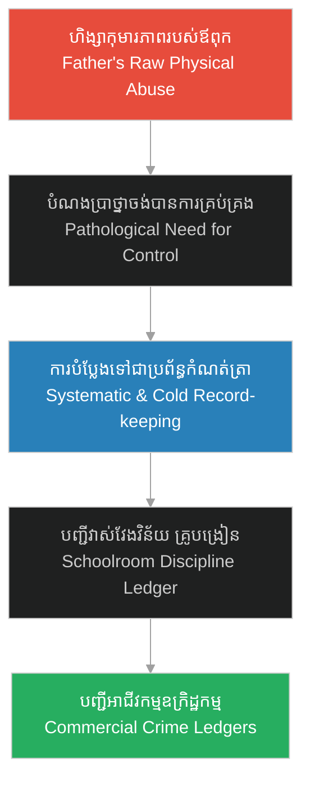

# បញ្ជីវាស់វែងវិន័យ (Discipline Ledger)៖ The Roots of Systematic Control

**Author:** ichamrong  
**Date:** 2026-06-06  
**Tags:** #psychology #control #hh-holmes #systematic-predation #ledgers  
**Category:** Keywords  
**Read Time:** ~4 min  

---

## 📌 មាតិកា (Table of Contents)
- [១. តើអ្វីជាបញ្ជីវាស់វែងវិន័យ? (What is the Discipline Ledger?)](#1)
- [២. ការបំប្លែងអំណាចពីហិង្សាមកជាការគ្រប់គ្រងប្រព័ន្ធ (From Physical Violence to Systematic Control)](#2)
- [៣. ករណីសិក្សា៖ Herman Mudgett ជាគ្រូបង្រៀន (Case Study: Herman Mudgett as a Schoolteacher)](#3)
- [៤. ស្ពានតភ្ជាប់ទៅកាន់ឧក្រិដ្ឋកម្មបែបអាជីវកម្ម (The Bridge to Commercialized Crime)](#4)
- [ឯកសារយោង (References)](#5)

---

## ១. តើអ្វីជាបញ្ជីវាស់វែងវិន័យ? (What is the Discipline Ledger?)

**បញ្ជីវាស់វែងវិន័យ (Discipline Ledger)** គឺជាការប្រើប្រាស់កំណត់ត្រាជាប្រព័ន្ធ ការកត់ចំណាំឥរិយាបថ និងការវាស់វែងទិន្នន័យមនុស្ស ដើម្បីបង្កើតជាអំណាចគ្រប់គ្រង និងការត្រួតពិនិត្យផ្លូវចិត្ត។ ជំនួសឱ្យការប្រើប្រាស់កម្លាំងបាយ ឬអំពើហិង្សាដោយផ្ទាល់ យន្តការនេះពឹងផ្អែកលើការកត់ត្រាការខុសឆ្គងរបស់បុគ្គលម្នាក់ ៗ ដើម្បីបង្កើតឱ្យមានការភ័យខ្លាច និងការចុះចូលដោយស្វ័យប្រវត្តិចំពោះច្បាប់។

The **Discipline Ledger** refers to the use of systematic documentation, behavioral metrics, and record-keeping to enforce psychological control and surveillance over others. Instead of relying on direct physical force or violence, this mechanism leverages the cold, objective recording of faults and compliance to induce anxiety and obedience under a system of rules.

---

## ២. ការបំប្លែងអំណាចពីហិង្សាមកជាការគ្រប់គ្រងប្រព័ន្ធ (From Physical Violence to Systematic Control)

នៅក្នុងការអភិវឌ្ឍផ្លូវចិត្តរបស់កុមារដែលរងការធ្វើបាប ពួកគេតែងតែបង្កើតចំណង់ខ្លាំងចំពោះ «ការគ្រប់គ្រង» (Need for Control) ដើម្បីការពារខ្លួនកុំឱ្យធ្លាក់ជាជនរងគ្រោះម្តងទៀត។ នៅពេលដែលពួកគេលូតលាស់ឡើង ពួកគេអាចបំប្លែងទម្រង់អំណាចដ៏ព្រៃផ្សៃរបស់ឪពុកម្តាយ (អំពើហិង្សាផ្លូវកាយ) ឱ្យទៅជាប្រព័ន្ធគ្រប់គ្រងបែបការិយាធិបតេយ្យ និងស្ងប់ស្ងាត់ ដែលមានប្រសិទ្ធភាពជាង និងមិនសូវបង្កការសង្ស័យ។

Abused children often develop an intense, pathology-driven need for control to insulate themselves from future vulnerability. As they grow, they may transform the raw, chaotic physical violence of their abusers into a quiet, bureaucratic, and highly structured control system. This is both more efficient and less likely to draw external suspicion.

---

## ៣. ករណីសិក្សា៖ Herman Mudgett ជាគ្រូបង្រៀន (Case Study: Herman Mudgett as a Schoolteacher)

នៅក្នុង [រឿងភាគទី ២ (Episode 2)](../episodes/ep-02-claras-sacrifice.md) Herman Mudgett (អាយុ ១៦ ឆ្នាំ) បានចាប់ផ្តើមអនុវត្តយន្តការនេះនៅក្នុងថ្នាក់រៀនក្រុង Alton៖

*   **ការប្រើប្រាស់បញ្ជីកត់វិន័យ៖** Herman មិនវាយដំសិស្សតូច ៗ ឡើយ តែគេប្រើ «បញ្ជីវាស់វែងវិន័យ» ដើម្បីចុះឈ្មោះ និងវាយតម្លៃរាល់កំហុសឆ្គងផ្លូវចិត្តរបស់សិស្ស។ ការណ៍នេះធ្វើឱ្យសិស្សមានអារម្មណ៍ភ័យខ្លាចចំពោះការចុះបញ្ជី និងការតាមដានរាល់សកម្មភាពរបស់ពួកគេ។
*   **ការលុបបំបាត់អារម្មណ៍ស្រឡាញ់៖** គេចាត់ទុកបន្ទប់រៀនជាយន្តការម៉ាស៊ីនមួយដែលត្រូវរៀបចំ ចំណែកសិស្សរៀនជាផ្នែកតូច ៗ នៃយន្តការនោះ។ គេលែងប្រើប្រាស់ក្តីមេត្តា ឬការយល់ចិត្តឡើយ ផ្ទុយទៅវិញ គឺការគ្រប់គ្រងដោយស្ងប់ស្ងាត់។

In [Episode 2](../episodes/ep-02-claras-sacrifice.md), we observe the prototype of this behavior in young Herman Mudgett:
*   **The Schoolroom Ledger:** As a 16-year-old teacher in Alton, Herman eschews physical strikes. Instead, he implements a "discipline ledger" to document student faults. The physical ledger acts as an instrument of surveillance, instilling a chilling compliance through documentation.
*   **Mechanization of Authority:** He reduces the classroom to an engine and the students to operational gears. Compliance is maintained through cold, bureaucratic tracking rather than human connection or empathy.

---

## ៤. ស្ពានតភ្ជាប់ទៅកាន់ឧក្រិដ្ឋកម្មបែបអាជីវកម្ម (The Bridge to Commercialized Crime)

យន្តការនៃ «បញ្ជីវាស់វែងវិន័យ» នេះ គឺជាគ្រឹះដែលអភិវឌ្ឍទៅជា **[យន្តការអាជីវកម្មឧក្រិដ្ឋកម្មរបស់ H.H. Holmes](../06-holmes-crime-business-model.md)** នាពេលអនាគត៖

1.  **ការចាត់ទុកជីវិតជាទិន្នន័យ (Quantification of Sentient Beings)៖** Holmes បានអនុវត្តការកត់ត្រានេះពេញមួយជីវិតរបស់គេ។ មនុស្សលែងជាមនុស្សទៀតហើយ តែពួកគេត្រូវបានបំប្លែងទៅជាឈ្មោះ ទិន្នន័យ លេខធានារ៉ាប់រង និងតម្លៃដីធ្លីនៅក្នុងបញ្ជីកត់ត្រារបស់គេ។
2.  **ការគូសឆូតលុបបំបាត់ (Operational Depreciation/Discarding)៖** ដូចដែលគេបានគូសឆូតលុបឈ្មោះ Clara Lovering ចេញពីសៀវភៅកត់ត្រាហិរញ្ញវត្ថុរបស់គេក្នុង Episode 2 នៅពេលដែលជនរងគ្រោះណាម្នាក់អស់តម្លៃប្រើប្រាស់ ពួកគេនឹងត្រូវលុបចេញពីប្រព័ន្ធដោយគ្មានវិប្បដិសារី ព្រោះសម្រាប់ Holmes ពួកគេគ្រាន់តែជាគ្រឿងបន្លាស់ដែលខូចគុណភាពប៉ុណ្ណោះ។

The behavioral loop of the schoolroom ledger directly bridges to Holmes' mature [Crime-as-a-Business Model](../06-holmes-crime-business-model.md):
1.  **Quantification of Beings:** In Holmes' ledger books, victims are reduced to data points—insurance values, deed numbers, and skeletal prices.
2.  **Depreciation and Discarding:** Just as he crosses out Clara Lovering's name in Episode 2, Holmes treats victims as depreciated inventory. When their utility drops to zero, they are discarded from his operational ledger with cold, mechanical efficiency.

---

## ឯកសារយោង (References)

*   **Michel Foucault** — *Discipline and Punish: The Birth of the Prison* (1975)។ ពិភាក្សាអំពីអំណាចនៃការតាមដាន និងការចុះបញ្ជីកត់ត្រា (Surveillance and Documentation) ក្នុងការគ្រប់គ្រងឥរិយាបថមនុស្ស។
*   **Robert D. Hare** — *Without Conscience: The Disturbing World of the Psychopaths Among Us* (1993). Explores the psychopathic trait of objectifying other human beings and utilizing systematic records for manipulation.
