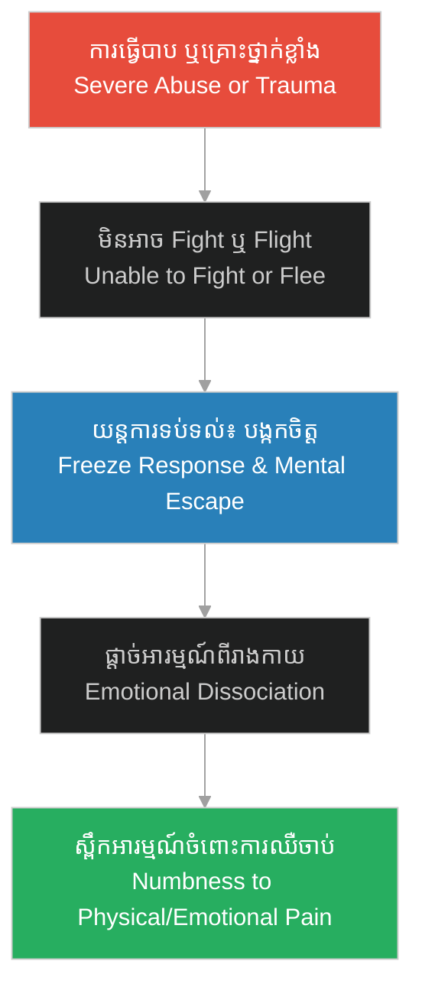

# យន្តការផ្តាច់អារម្មណ៍ (Emotional Dissociation)៖ Psychology of Herman Mudgett

**Author:** ichamrong  
**Date:** 2026-06-05  
**Tags:** #psychology #defense-mechanism #trauma #holmes-analysis #dissociation  
**Category:** Keywords  
**Read Time:** ~4 min  

---

## 📌 មាតិកា (Table of Contents)
- [១. តើអ្វីជាការផ្តាច់អារម្មណ៍? (What is Emotional Dissociation?)](#1)
- [២. របៀបដែលយន្តការនេះកើតឡើង (How Dissociation Develops)](#2)
- [៣. ករណីសិក្សា៖ Herman Mudgett (Case Study: Herman Mudgett's Trauma)](#3)
- [៤. ផលវិបាករយៈពេលវែង៖ ពីការការពារខ្លួនទៅជាភាពអមនុស្សធម៌ (Long-term Impact: From Self-Defense to Dehumanization)](#4)
- [ឯកសារយោង (References)](#5)

---

## ១. តើអ្វីជាការផ្តាច់អារម្មណ៍? (What is Emotional Dissociation?)

**ការផ្តាច់អារម្មណ៍ (Emotional Dissociation)** គឺជាយន្តការការពារផ្លូវចិត្តដោយស្វ័យប្រវត្តិនៃខួរក្បាល នៅពេលដែលបុគ្គលម្នាក់ជួបប្រទះនឹងស្ថានភាពប៉ះទង្គិចផ្លូវចិត្តខ្លាំង គ្រោះថ្នាក់ ឬការឈឺចាប់ដែលមិនអាចទ្រាំទ្របាន។ ក្នុងស្ថានភាពបែបនេះ ផ្លូវចិត្តរបស់ពួកគេនឹងផ្តាច់ខ្លួនចេញពីអារម្មណ៍ពិត និងរូបរាងកាយ ដើម្បីកាត់បន្ថយការឈឺចាប់។

**Emotional Dissociation** is an automatic psychological defense mechanism that occurs when an individual experiences severe trauma, danger, or overwhelming pain. The mind temporarily disconnects from physical sensations, emotions, or immediate reality as a way to buffer itself from intolerable distress.

---

## ២. របៀបដែលយន្តការនេះកើតឡើង (How Dissociation Develops)

នៅពេលដែលមនុស្សម្នាក់ (ជាពិសេសកុមារ) រងការធ្វើបាបផ្លូវកាយ ឬផ្លូវចិត្តដោយគ្មានច្រកចេញ ពួកគេមិនអាចតស៊ូ (Fight) ឬរត់គេច (Flight) បានឡើយ។ ជម្រើសចុងក្រោយរបស់ពួកគេគឺ «បង្កកចិត្ត» (Freeze) និង «ហោះហើរផ្លូវចិត្តចេញពីរាងកាយ» (Dissociate)។

When a person, especially a child, faces physical or emotional abuse with no escape, they cannot fight or flee. Their final survival response is to freeze and mentally drift away from their physical frame.

---

## ៣. ករណីសិក្សា៖ Herman Mudgett (Case Study: Herman Mudgett's Trauma)

នៅក្នុង [រឿងភាគទី ១ (Episode 1)](../episodes/ep-01-shadows-of-new-hampshire.md) យើងឃើញច្បាស់ពីរបៀបដែលយន្តការនេះបានចាប់ផ្តើមនៅក្នុងខ្លួនរបស់ Herman Mudgett៖

*   **ការផ្តាច់អារម្មណ៍ពីការវាយដំ៖** នៅពេលឪពុករបស់គេគឺ Levi Mudgett ប្រើអំពើហឹង្សា និងបង្ខំឱ្យគេលុតជង្គង់ Herman លែងយំ ឬបង្ហាញការឈឺចាប់ទៀតហើយ។ ភ្នែករបស់គេសម្លឹងមើលផេះស្ងប់ស្ងាត់ក្នុងឡភ្លើង ខណៈដែលគំនិតរបស់គេបានហោះចេញពីរាងកាយ ដើម្បីការពារខ្លួនពីខ្សែតីរបស់ឪពុក។
*   **ការមើលឃើញសេចក្តីស្លាប់ជាភាពស្ងប់ស្ងាត់៖** យន្តការនេះធ្វើឱ្យគេយល់ថា ភាពត្រជាក់ និងការគ្មានវិញ្ញាណ (ដូចជាសាកសព ឬគ្រោងឆ្អឹង) គឺជាកន្លែងតែមួយគត់ដែលគ្មានការឈឺចាប់ និងគ្មានភាពភ័យខ្លាច។

In [Episode 1](../episodes/ep-01-shadows-of-new-hampshire.md), we observe this process in young Herman Mudgett:
*   **Dissociating from Abuse:** When punished by his father, Levi Mudgett, Herman stops crying or reacting. His mind retreats, staring at the ashes in the cold hearth, leaving his physical body behind to numb the strikes of the strap.
*   **Associating Death with Peace:** This dissociation causes him to associate coldness and lifelessness (skeletons and dead specimens) with ultimate peace, as they can no longer feel pain.

---

## ៤. ផលវិបាករយៈពេលវែង៖ ពីការការពារខ្លួនទៅជាភាពអមនុស្សធម៌ (Long-term Impact: From Self-Defense to Dehumanization)

ខណៈពេលដែលការផ្តាច់អារម្មណ៍ជួយការពារកុមារពីការឈឺចាប់ភ្លាមៗ វាក៏បានបង្កើតផលប៉ះពាល់ដ៏ខ្មៅងងឹតចំពោះការលូតលាស់ផ្នែក EQ របស់គេផងដែរ៖

1.  **ការបាត់បង់សមត្ថភាពយល់ចិត្ត (Depersonalization & Empathy Loss)៖** នៅពេលដែល Herman អាចផ្តាច់អារម្មណ៍ឈឺចាប់របស់ខ្លួនឯងបាន គេក៏លែងដឹង ឬខ្វល់ខ្វាយពីការឈឺចាប់របស់អ្នកដទៃដូចគ្នា។
2.  **ការចាត់ទុកមនុស្សជាវត្ថុ (Dehumanization/Objectification)៖** សម្រាប់ Holmes មនុស្សមិនមែនជាសត្វមានវិញ្ញាណដែលមានអារម្មណ៍ស្រឡាញ់ ឬឈឺចាប់ឡើយ។ ពួកគេគ្រាន់តែជាគ្រឿងម៉ាស៊ីនជីវសាស្ត្រ (Biological Machines) ដែលគេអាចវះកាត់ រុះរើ និងទាញយកផលប្រយោជន៍ (ដូចជាការបោកធានារ៉ាប់រង ឬលក់គ្រោងឆ្អឹង)។

While dissociation protects a child from immediate trauma, it severely damages emotional development:
1.  **Eradication of Empathy:** Since Herman successfully numbed his own pain, he became completely disconnected from the pain of others.
2.  **Dehumanization:** Humans ceased to be living, feeling entities to him. Instead, he viewed them merely as biological machines that could be dissected, manipulated, and processed for commercial profit.

---

## ឯកសារយោង (References)

*   **American Psychological Association (APA)** — *Trauma and Dissociative Disorders* (2020)។ វិភាគអំពីយន្តការការពារខ្លួនរបស់កុមារដែលរងការធ្វើបាបផ្លូវកាយ។
*   **Dr. Alice Miller** — *For Your Own Good: Cruelty in Child Rearing and the Roots of Violence* (1983). A study on how harsh domestic discipline shapes violent adult behaviors.
