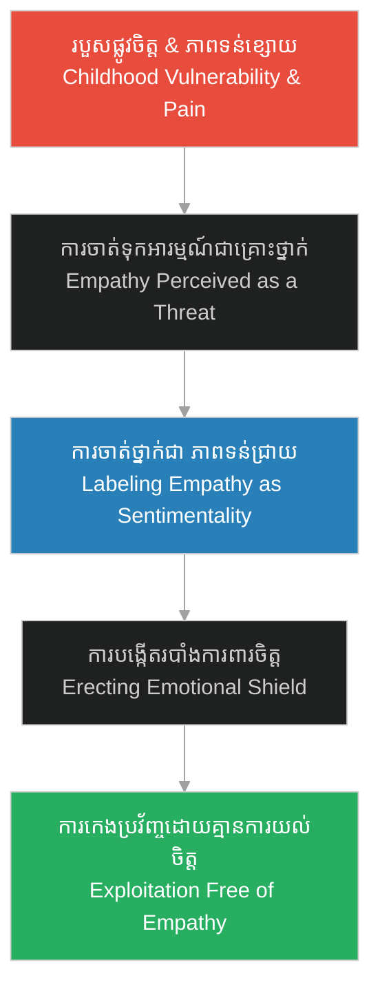

# ភាពទន់ជ្រាយផ្លូវចិត្ត (Emotional Sentimentality)

**Author:** ichamrong  
**Date:** 2026-06-06  
**Tags:** #psychology #sociopathy #hh-holmes #empathy #emotional-defense  
**Category:** Keywords  
**Read Time:** ~4 min  

---

## 📌 មាតិកា (Table of Contents)
- [១. តើអ្វីជាភាពទន់ជ្រាយផ្លូវចិត្ត? (What is Emotional Sentimentality?)](#1)
- [២. របាំងការពារខ្លួនពីភាពទន់ខ្សោយ (Defense Mechanism Against Vulnerability)](#2)
- [៣. ករណីសិក្សា៖ ការបដិសេធក្តីស្រឡាញ់របស់ Clara (Case Study: Rejecting Clara's Devotion)](#3)
- [៤. ផលវិបាកផ្លូវចិត្ត៖ ការលុបបំបាត់ធម៌មេត្តា (Psychological Outcome: The Death of Compassion)](#4)
- [ឯកសារយោង (References)](#5)

---

## ១. តើអ្វីជាភាពទន់ជ្រាយផ្លូវចិត្ត? (What is Emotional Sentimentality?)

**ភាពទន់ជ្រាយផ្លូវចិត្ត (Emotional Sentimentality)** គឺជាពាក្យបែបអគតិ និងមើលស្រាល ដែលបុគ្គលដែលមានបុគ្គលិកលក្ខណៈសង្គមប្រឆាំង (Psychopath/Sociopath) ប្រើប្រាស់ដើម្បីពណ៌នាអំពីអារម្មណ៍របស់មនុស្សធម្មតា ដូចជា ក្តីស្រឡាញ់ ភាពស្មោះត្រង់ វិប្បដិសារី និងការអាណិតអាសូរ។ ចំពោះចិត្តដែលត្រជាក់ស្រេបរបស់ពួកគេ អារម្មណ៍ទាំងនេះត្រូវបានចាត់ទុកជា «ភាពមិនមានប្រសិទ្ធភាព» (Functional Inefficiency) ឬជាឧបសគ្គរារាំងដល់ភាពជោគជ័យ និងការរីកចម្រើន។

The concept of **Emotional Sentimentality** is a dismissive, sociopathic classification of natural human emotions such as love, empathy, remorse, and attachment. Within a predatory mindset, these prosocial emotions are viewed as behavioral vulnerabilities, defects, or operational inefficiencies that impede progress and personal utility.

---

## ២. របាំងការពារខ្លួនពីភាពទន់ខ្សោយ (Defense Mechanism Against Vulnerability)

នៅក្នុងចិត្តសាស្ត្ររបស់ Herman Mudgett ការចាត់ទុកអារម្មណ៍ជា «ភាពទន់ជ្រាយ» គឺជាការការពារខ្លួនពីរបួសផ្លូវចិត្តកុមារភាព។ ដោយសារតែគេធ្លាប់រងទុក្ខវេទនាពីអំពើហិង្សារបស់ឪពុក និងការធ្វើបាបពីមិត្តភក្តិ គេបានយល់ឃើញថា ភាពទន់ខ្សោយផ្លូវចិត្ត និងក្តីស្រឡាញ់ គឺជាច្រកទ្វារដែលនាំឱ្យគេរងការឈឺចាប់។ ដូចនេះ គេជ្រើសរើស «បង្កកចិត្ត» និងមើលងាយរាល់អារម្មណ៍ទន់ភ្លន់ទាំងអស់ ដើម្បីបង្ហាញថាខ្លួនខ្លាំង និងមិនអាចរងរបួសបានឡើយ។

For Herman Mudgett, pathologizing empathy as mere "sentimentality" was a defense mechanism to insulate himself from childhood pain. Having suffered from severe domestic abuse and school bullying, his young mind associated emotional vulnerability and love with helplessness and agony. To survive, he adopted a posture of cold superiority, dismissing all soft emotions to convince himself he was untouchable and invulnerable.

---

## ៣. ករណីសិក្សា៖ ការបដិសេធក្តីស្រឡាញ់របស់ Clara (Case Study: Rejecting Clara's Devotion)

នៅក្នុង [រឿងភាគទី ២ (Scene 3, Episode 2)](../episodes/ep-02-claras-sacrifice.md) Clara យំសម្រក់ទឹកភ្នែក និងបង្ហាញពីក្តីស្រឡាញ់ស្មោះស្ម័គ្រចំពោះភរិយា ប៉ុន្តែ Herman ឆ្លើយតបយ៉ាងត្រជាក់បំផុត៖ «ភាពទន់ជ្រាយផ្លូវចិត្តគ្មានតម្លៃបម្រើដល់ភាពជោគជ័យរបស់យើងឡើយ»។

*   **Clara:** តំណាងឱ្យមនោសញ្ចេតនាមនុស្សធម្មតា (Prosocial Attachment) ដែលស្វែងរកការយល់ចិត្ត ការចែករំលែក និងក្តីស្រឡាញ់។
*   **Herman:** តំណាងឱ្យយន្តការស្ពឹកអារម្មណ៍ (Sociopathic Numbness) ដែលចាត់ទុកទឹកភ្នែក និងការទាមទារសេចក្តីស្រឡាញ់របស់ Clara ជាការរំខានដល់ប្រតិបត្តិការសិក្សា និងការងាររបស់គេ។

In the narrative, this dynamic is highlighted in his marriage:
*   **Clara's Devotion:** Represents natural human attachment, seeking mutual support, warmth, and shared emotions.
*   **Herman's Rejection:** Represents predatory detachment. He views Clara's tears and requests for emotional connection as operational drag, dismissing them as "sentimental nonsense" that gets in the way of his study schedule and financial plans.

---

## ៤. ផលវិបាកផ្លូវចិត្ត៖ ការលុបបំបាត់ធម៌មេត្តា (Psychological Outcome: The Death of Compassion)

ការបដិសេធអារម្មណ៍ និងការចាត់ទុកមេត្តាធម៌ជា «ភាពទន់ជ្រាយ» គឺជាការចាប់ផ្តើមនៃការរលត់ភាពជាមនុស្សទាំងស្រុង៖

1.  **ការលុបបំបាត់វិប្បដិសារី (Eradication of Remorse)៖** នៅពេលដែល Holmes លែងយល់ឃើញថាអារម្មណ៍មានតម្លៃ គេក៏លែងមានអារម្មណ៍ខុសឆ្គង ឬស្តាយក្រោយចំពោះការធ្វើបាប និងសម្លាប់ជនរងគ្រោះដែរ។
2.  **ការប្រើប្រាស់មន្តស្នេហ៍ជាអាវុធ (Weaponized Empathy)៖** ទោះបីជាគេគ្មានអារម្មណ៍មេត្តាពិតប្រាកដ តែគេអាចសិក្សាពីឥរិយាបថមនុស្ស ដើម្បីលួងលោម និងទាក់ទាញជនរងគ្រោះឱ្យធ្លាក់ចូលក្នុងអន្ទាក់ដោយងាយស្រួល មុននឹងសម្លាប់ពួកគេដោយគ្មានការរារែកចិត្ត។

Rejecting emotional attachment and categorizing compassion as a weakness leads to the absolute destruction of his moral framework:
1.  **Elimination of Guilt:** Since Holmes views remorse as a sentimental flaw, he experiences no cognitive friction or guilt when destroying lives.
2.  **Weaponized Charm:** While he lacks genuine empathy, he studies human emotions intellectually. This allows him to simulate warmth and charm, easily drawing victims into his traps while remaining completely immune to their suffering.

---

## ឯកសារយោង (References)

*   **Daniel Goleman** — *Emotional Intelligence: Why It Can Matter More Than IQ* (1995)។ វិភាគអំពីតួនាទីនៃការយល់ចិត្ត (Empathy) ក្នុងការបង្កើតទំនាក់ទំនងមនុស្សធម៌។
*   **Hervey M. Cleckley** — *The Mask of Sanity* (1941). The pioneering clinical study on psychopathy, detailing how individuals mimic normal human emotions (like sentimentality) while remaining entirely devoid of genuine feeling.
