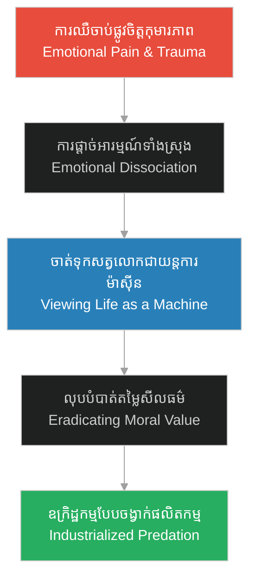

# លំហូរនៃធនធាន និងការរៀបចំយន្តការ (Flow of Resources and Mechanics)

**Author:** ichamrong  
**Date:** 2026-06-06  
**Tags:** #psychology #materialism #hh-holmes #predation #dehumanization  
**Category:** Keywords  
**Read Time:** ~4 min  

---

## 📌 មាតិកា (Table of Contents)
- [១. តើអ្វីជាលំហូរនៃធនធាន និងការរៀបចំយន្តការ? (What is the Flow of Resources and Mechanics?)](#1)
- [២. ឫសគល់ផ្លូវចិត្ត៖ ការការពារពីការឈឺចាប់ (Psychological Roots: Shield against Vulnerability)](#2)
- [៣. ករណីសិក្សា៖ Herman Mudgett វះកាត់សរីរាង្គ (Case Study: Herman Mudgett's Dissections)](#3)
- [៤. ផលវិបាក៖ ការចាត់ទុកជីវិតជាសម្ភារៈ (Consequences: Life as Mere Material)](#4)
- [ឯកសារយោង (References)](#5)

---

## ១. តើអ្វីជាលំហូរនៃធនធាន និងការរៀបចំយន្តការ? (What is the Flow of Resources and Mechanics?)

**លំហូរនៃធនធាន និងការរៀបចំយន្តការ (Flow of Resources and Mechanics)** គឺជាទស្សនៈបែបសម្ភារៈនិយមជ្រុល (Extreme Materialism) ដែលចាត់ទុកជីវិតរបស់សត្វលោកទាំងអស់ គ្មានតម្លៃវិញ្ញាណ សីលធម៌ ឬព្រលឹងឡើយ។ ផ្ទុយទៅវិញ ជីវិតគ្រាន់តែជាការផ្លាស់ប្តូររូបធាតុ រូបវន្ត និងប្រតិបត្តិការជីវសាស្ត្រ ដែលអាចវាស់វែង គ្រប់គ្រង និងរុះរើបានដូចជាគ្រឿងម៉ាស៊ីន។

The concept **Flow of Resources and Mechanics** is an extreme materialistic worldview that reduces all living existence to physical inputs, chemical outputs, and biological operations. In this mindset, life possesses no sacredness, spiritual soul, or moral boundaries; it is merely a mechanical system to be measured, manipulated, and dismantled for utility.

---

## ២. ឫសគល់ផ្លូវចិត្ត៖ ការការពារពីការឈឺចាប់ (Psychological Roots: Shield against Vulnerability)

សម្រាប់ Herman Mudgett យន្តការនេះត្រូវបានបង្កើតឡើងដើម្បីការពារផ្លូវចិត្តរបស់គេពីការគំរាមកំហែង។ នៅក្នុងកុមារភាពដែលរងការធ្វើបាបដោយអំពើហិង្សាដ៏ព្រៃផ្សៃ ពិភពលោករបស់គេពោរពេញដោយភាពមិនច្បាស់លាស់ និងការឈឺចាប់។ ដើម្បីរស់រាន ខួរក្បាលរបស់គេបានបំប្លែងការពិតឱ្យទៅជាប្រព័ន្ធរូបវន្តដ៏ត្រជាក់ និងសាមញ្ញ៖ «សាច់ ឆ្អឹង និងសរសៃឈាម» ដែលគ្មានការឈឺចាប់ខាងផ្លូវចិត្ត។

For young Herman Mudgett, this view was developed as a defense mechanism to survive childhood trauma. Facing unpredictable violence and emotional neglect, his mind sought safety in predictability. By reducing living beings to physical components (flesh, bone, and vessels), he stripped them of the capacity to inflict or feel emotional pain, converting a chaotic world into a cold, controllable equation.

---

## ៣. ករណីសិក្សា៖ Herman Mudgett វះកាត់សរីរាង្គ (Case Study: Herman Mudgett's Dissections)

*   **ការវះកាត់សត្វក្នុងព្រៃ (Scene 3, Episode 1)៖** Herman (អាយុ ១២ ឆ្នាំ) វះកាត់សត្វតូច ៗ ក្នុងព្រៃ និងសន្និដ្ឋានថា ពួកវាគ្រាន់តែជាគ្រឿងម៉ាស៊ីន គ្មានព្រលឹងពិតប្រាកដឡើយ។
*   **ការកេងប្រវ័ញ្ចលើភរិយា (Scene 3, Episode 2)៖** Herman (អាយុ ១៨ ឆ្នាំ) ប្រាប់ Clara ថា៖ «ជីវិតគឺជាលំហូរនៃធនធាន និងការរៀបចំយន្តការ»។ គេមិនខ្វល់ខ្វាយពីភាពហត់នឿយ ឬទឹកភ្នែករបស់នាងឡើយ ព្រោះនាងគ្រាន់តែជាកម្លាំងពលកម្ម (Input) ដើម្បីបង្កើតប្រាក់ (Output) បម្រើដល់ការរៀនសាលាពេទ្យ។

In the narrative, we trace the active application of this worldview:
*   **Animal Dissections (Ep 1):** Herman (age 12) dissects forest animals, concluding they are merely biological engines without a soul.
*   **Marital Exploitation (Ep 2):** Herman (age 18) tells Clara: "Life is merely a flow of resources and mechanics." He remains indifferent to her physical exhaustion, treating her work and emotions only as energy inputs to produce financial output for his medical schooling.

---

## ៤. ផលវិបាក៖ ការចាត់ទុកជីវិតជាសម្ភារៈ (Consequences: Life as Mere Material)

នៅពេលដែលទស្សនៈនេះគ្របដណ្តប់លើចិត្តទាំងស្រុង វានាំឱ្យកើតមានការលុបបំបាត់មនុស្សធម៌យ៉ាងធ្ងន់ធ្ងរ៖

1.  **ការរំលាយសីលធម៌ (Abolition of Moral Boundaries)៖** បើជីវិតជាគ្រឿងម៉ាស៊ីន នោះការសម្លាប់មនុស្សក៏មិនខុសពីការរុះរើគ្រឿងម៉ាស៊ីនឡើយ។ Holmes លែងមានការឈឺចាប់ក្នុងចិត្ត ឬវិប្បដិសារីទៀតហើយ។
2.  **វិស្វកម្មឃាតកម្ម (Murder Engineering)៖** ទស្សនៈនេះអនុញ្ញាតឱ្យ Holmes សាងសង់ «វិមានឃាតកម្ម» (Murder Castle) នៅក្នុងទីក្រុង Chicago ដោយប្រើប្រាស់គោលការណ៍ចង្វាក់ផលិតកម្មឧស្សាហកម្ម ដើម្បីសម្លាប់មនុស្ស និងកែច្នៃសាកសពលក់យកលុយ ដូចជាដំណើរការរោងចក្រធម្មតាមួយ។

When this mechanical framework dominates the mind, it yields catastrophic consequences:
1.  **Moral Depravity:** If a human body is merely a machine, then murder is reduced to disassembly. Empathy is entirely bypassed, eliminating any capacity for guilt.
2.  **Murder Automation:** This worldview allowed Holmes to design the Murder Castle in Chicago like an assembly-line factory, converting human bodies into commercial assets (skeletons and insurance claims) with calculated efficiency.

---

## ឯកសារយោង (References)

*   **René Descartes** — *Discourse on the Method* (1637)។ សិក្សាពីគោលគំនិត «សត្វជាគ្រឿងម៉ាស៊ីន» (Bête-machine) ដែលចាត់ទុកជីវសាស្ត្រគ្មានព្រលឹងវិញ្ញាណ។
*   **B.F. Skinner** — *Beyond Freedom and Dignity* (1971). A behavioral study analyzing human beings purely as mechanical systems responding to environmental inputs.
