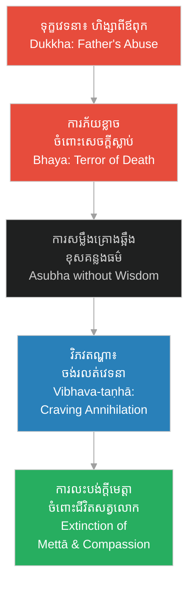

# ទស្សនៈព្រះពុទ្ធសាសនា៖ ការសង្កេតលើជីវិតរបស់ Young Herman ក្នុងរឿងភាគទី ១ (Buddhist Perspective: Observing Young Herman's Life in Episode 1)

**Author:** ichamrong  
**Date:** 2026-06-06  
**Tags:** #theology #buddhist-perspective #karma #five-aggregates #mindfulness #asubha  
**Category:** Theology  
**Read Time:** ~5 min  

---

## 📌 មាតិកា (Table of Contents)
- [១. កំហុសឆ្គងនៃវិន័យគ្រួសារ និងការបង្កើតកម្មពៀរ៖ Levi Mudgett (The Perversity of Family Discipline and the Cycle of Kamma)](#1)
- [២. គ្រោងឆ្អឹង និងសេចក្តីស្លាប់៖ ពីអសុភកម្មដ្ឋានទៅជាការរលត់ធម៌មេត្តា (The Skeleton and Death: From Asubha to the Deconstruction of Empathy)](#2)
- [៣. ធម្មជាតិនៃជីវិត៖ យន្តការម៉ាស៊ីន ឬជារបូរនៃខន្ធប្រាំ? (The Nature of Life: Machine vs. Flow of the Five Aggregates)](#3)
- [៤. សេចក្តីសន្និដ្ឋាន៖ ការសាបសូន្យនៃសតិ និងមេត្តាធម៌ (Conclusion: The Extinction of Mindfulness and Compassion)](#4)
- [ឯកសារយោងពីព្រះត្រៃបិដក (Buddhist Scriptural References)](#5)

---

## ១. កំហុសឆ្គងនៃវិន័យគ្រួសារ និងការបង្កើតកម្មពៀរ៖ Levi Mudgett (The Perversity of Family Discipline and the Cycle of Kamma)

នៅក្នុង [រឿងភាគទី ១ (Scene 1)](../episodes/ep-01-shadows-of-new-hampshire.md) Levi Mudgett បានប្រើប្រាស់គោលការណ៍វិន័យដ៏តឹងរ៉ឹង ដើម្បីបង្ហាញពីភាពត្រឹមត្រូវនៃអំពើហិង្សាលើកូនប្រុសរបស់ខ្លួនគឺ Herman ដោយអះអាងថា៖ «ភាពខ្ជិលច្រអូសគឺជាមាត់ច្រកនៃអារក្ស»។ តាមទស្សនៈព្រះពុទ្ធសាសនា នេះជាការយល់ខុសដ៏ធ្ងន់ធ្ងរ និងជាការបង្កើតកម្មពៀរដ៏ខ្មៅងងឹត។ ឪពុកម្តាយមានកាតព្វកិច្ចចិញ្ចឹមបីបាច់ និងអប់រំកូនដោយក្តីមេត្តា មិនមែនដោយការធ្វើទារុណកម្មផ្លូវចិត្ត និងផ្លូវកាយឡើយ។

Levi Mudgett weaponizes rigid Puritan dogmatism to justify his physical abuse of young Herman in [Episode 1 (Scene 1)](../episodes/ep-01-shadows-of-new-hampshire.md), asserting that "idleness is the devil's playground." From a Buddhist perspective, this violent discipline is a tragic delusion (Moha) and a seed of harmful karma (Akusala-kamma). Parents have a duty to nurture and guide their children with loving-kindness, not to break their spirits through physical and mental abuse.

> [!WARNING]
> **⚠️ ព្រះធម៌ចែងច្បាស់លាស់ពីកាតព្វកិច្ចមាតាបិតា (Scriptural Clarity on Parental Duties):**
> * នៅក្នុង **[សិង្គាលោវាទសូត្រ (Sigalovada Sutta)](https://suttacentral.net/dn31)** ព្រះសម្មាសម្ពុទ្ធបានសម្តែងអំពីកាតព្វកិច្ចរបស់មាតាបិតាចំពោះបុត្រធីតា៖ «មាតាបិតា​អនុគ្រោះ​ដល់​បុត្រ​ដោយ​ស្ថាន​ទាំង ៥ គឺ ហាមឃាត់​ចាក​អំពើ​អាក្រក់ ១ ដឹកនាំ​ឱ្យ​តម្កល់​នៅក្នុង​អំពើ​ល្អ ១ ឱ្យ​រៀន​សិល្បសាស្ត្រ ១ រៀបចំ​គូស្រករ​ដ៏​សមគួរ ១ ប្រគល់​ទ្រព្យសម្បត្តិ​ឱ្យ​ក្នុង​សម័យ ១។» (*"In five ways, parents look after their children: they restrain them from evil, guide them to do good, train them in a profession, arrange a suitable marriage, and hand over their inheritance."* — **[ឌីឃនិកាយ ៣១ / Digha Nikaya 31](https://suttacentral.net/dn31)**).
> * អំពើហិង្សាដែល Levi បានធ្វើឡើង គឺកើតចេញពីទោសៈ (កំហឹង) និងមោហៈ (ការវង្វេង) ដែលនាំទៅរកការចងពៀរវេរា ផ្ទុយស្រឡះពីធម៌អហិង្សា (Ahiṃsā)។

---

## ២. គ្រោងឆ្អឹង និងសេចក្តីស្លាប់៖ ពីអសុភកម្មដ្ឋានទៅជាការរលត់ធម៌មេត្តា (The Skeleton and Death: From Asubha to the Deconstruction of Empathy)

នៅពេលដែល Herman ត្រូវបានក្មេងទំនើងបង្ខំឱ្យប្រឈមមុខនឹងគ្រោងឆ្អឹងនៅក្នុងបន្ទប់ងងឹត (Scene 2) ភាពភ័យខ្លាចដ៏ខ្លាំងក្លាបានផ្លាស់ប្តូរទៅជា «ការបំបែកអារម្មណ៍ពីរូបវន្ត» និង «ការចាប់អារម្មណ៍លើកាយវិភាគវិទ្យា»។ គេយល់ឃើញថា សេចក្តីស្លាប់គឺជាសភាវៈត្រជាក់ ស្ងប់ស្ងាត់ និងគ្មានការឈឺចាប់ មិនដូចជាកំហឹង និងរំពាត់របស់ឪពុកគេឡើយ។

When Herman is forced to confront the skeleton in the darkness (Scene 2), his raw terror undergoes a psychological shift, transforming into detachment and anatomical fascination. He begins to view death as a cold, silent sanctuary that feels no pain, contrasting it with his father's violent anger.

តាមទស្សនៈព្រះពុទ្ធសាសនា ការសម្លឹងមើលគ្រោងឆ្អឹងគឺជាការអនុវត្ត **អសុភកម្មដ្ឋាន (Asubha-bhavana)** ឬ **មរណានុស្សតិ (Mindfulness of Death)** ដើម្បីលះបង់ការរុះរើអត្តា និងការតោងស្អិតនឹងរាងកាយ ក្នុងគោលបំណងបណ្តុះមេត្តាធម៌ចំពោះសត្វលោកទាំងអស់ដែលត្រូវជួបសេចក្តីស្លាប់ដូចគ្នា។ ប៉ុន្តែសម្រាប់ Herman វិញ ការយល់ឃើញរបស់គេបានក្លាយជាកំហុសឆ្គងផ្លូវចិត្តដ៏គ្រោះថ្នាក់។ គេបានស្វែងរកទីជម្រកក្នុងសេចក្តីស្លាប់ តាមរយៈការកើតឡើងនៃ **វិភវតណ្ហា (Vibhava-taṇhā)** គឺការចង់រលត់បាត់បង់អារម្មណ៍ដើម្បីគេចចេញពីទុក្ខវេទនា។ នេះជាការចាប់ផ្តើមនៃការរលត់ធម៌មេត្តា និងការកសាងរបាំងការពារខ្លួនដ៏ត្រជាក់ស្រេប។

From a Buddhist perspective, contemplating a skeleton is akin to practicing **Asubha-bhavana** (contemplating the foulness/impermanence of the body) or **Maraṇānussati** (mindfulness of death). In Buddhism, this practice is meant to dissolve the ego and attachments, cultivating compassion for all living beings bound to the same fate. However, young Herman's mind warps this realization. Driven by **Vibhava-taṇhā** (the craving for non-existence or numbness to escape suffering), he mistakes the stillness of death for a shield. Instead of finding wisdom, he desensitizes his mind, extinguishing his capacity for empathy.

---

## ៣. ធម្មជាតិនៃជីវិត៖ យន្តការម៉ាស៊ីន ឬជារបូរនៃខន្ធប្រាំ? (The Nature of Life: Machine vs. Flow of the Five Aggregates)

នៅអាយុ ១២ ឆ្នាំ Herman វះកាត់សត្វតូច ៗ នៅក្នុងព្រៃស្ងាត់ជ្រងំ (Scene 3) ហើយសន្និដ្ឋានថា៖ «សាច់ ឆ្អឹង និងសរសៃឈាម... គ្មានព្រលឹងពិតប្រាកដទេ។ មានតែយន្តការម៉ាស៊ីនប៉ុណ្ណោះ»។

At age 12, Herman dissects small animals in the quiet woods (Scene 3) and concludes: "Flesh, bone, and vessels... there is no soul. Just a machine."

> [!IMPORTANT]
> **🌱 ការយល់ច្រឡំចំពោះធម៌អនត្តា (The Misunderstanding of Anattā):**
> * ព្រះពុទ្ធសាសនាបដិសេធចំពោះអត្ថិភាពនៃព្រលឹងអចិន្ត្រៃយ៍ ឬអាត្ម័ន (Attā/Soul) ប៉ុន្តែមិនបានកាត់បន្ថយជីវិតឱ្យទៅជាត្រឹមតែគ្រឿងម៉ាស៊ីនឥតវិញ្ញាណនោះឡើយ។ ជីវិតគឺជាលំហូរនៃ **ខន្ធទាំង ៥ (Five Aggregates)** រួមមាន រូប វេទនា សញ្ញា សង្ខារ និងវិញ្ញាណ ដែលមានសមត្ថភាពទទួលរងទុក្ខ និងបង្កើតកម្មពៀរ។
> * ព្រះត្រៃបិដកចែងថា៖ «កាលបើខន្ធទាំងឡាយមានកាលណា ឈ្មោះសន្មតថា "សត្វលោក" ក៏មានកាលនោះ ដូចជាការផ្សំឡើងនៃគ្រឿងបន្លាស់ ទើបហៅថា "រថ" ដូច្នោះដែរ។» (*"Just as, with an assemblage of parts, the word 'chariot' is used, so, when the aggregates are present, there's the convention 'a living being.'"* — **[វជិរាសូត្រ សំយុត្តនិកាយ / Vajira Sutta - Samyutta Nikaya](https://suttacentral.net/sn5.10)**).

ការដែល Herman ចាត់ទុកសត្វលោកជាគ្រឿងម៉ាស៊ីនដែលគ្មានព្រលឹង គឺជាជំហានដំបូងនៃមោហៈ (ការមិនដឹងពិត)។ គេជឿថា ជីវិតអាចរុះរើ និងគ្រប់គ្រងបានដោយគ្មានវិប្បដិសារី។ តាមរយៈការចាត់ទុកជីវិតជាសម្ភារៈគ្មានវិញ្ញាណ គេបានកាត់ផ្តាច់ខ្លួនពីស្មារតីយល់ដឹងអំពីទុក្ខរបស់អ្នកដទៃ។ ការណ៍នេះនាំឱ្យគេងាយស្រួលសម្លាប់ និងបំផ្លាញជីវិតមនុស្សដទៃទៀតនាពេលអនាគត ព្រោះគេលែងមើលឃើញសត្វលោកមានវិញ្ញាណ និងវេទនាដូចខ្លួនគេទៀតហើយ។

By reducing living creatures to mere mechanical parts, Herman falls into deep Moha (delusion). He believes life is a machine that can be dismantled and controlled without moral consequences. In Buddhist psychology, reducing a sentient being to an inanimate object is a form of materialistic views (Uccheda-diṭṭhi). By denying the conscious, feeling nature of other beings, he shields himself from their pain, paving the way for future acts of violence (Hiṃsā) and cruelty without remorse.

---

## ៤. សេចក្តីសន្និដ្ឋាន៖ ការសាបសូន្យនៃសតិ និងមេត្តាធម៌ (Conclusion: The Extinction of Mindfulness and Compassion)

ព្រះធម៌បង្រៀនថា ចិត្តជាប្រធាន ចិត្តជាធំ អ្វី ៗ សម្រេចមកពីចិត្ត ([ធម្មបទ គាថា ១](https://suttacentral.net/dhp1-20))។ ជីវិតកុមារភាពរបស់ Herman Mudgett គឺជាសង្វាក់នៃ **ហេតុ និងបច្ច័យ (Hetu-paccaya)** ដ៏សោកសៅបំផុត។ អំពើហិង្សារបស់ឪពុក និងការធ្វើបាបពីមិត្តភក្តិ គឺជាបច្ច័យអាក្រក់ដែលជំរុញឱ្យចិត្តរបស់គេបង្កើតជាកំហឹង និងការស្អប់ខ្ពើម។ ប៉ុន្តែជំនួសឱ្យការប្រើប្រាស់ «សតិ» (Mindfulness) ដើម្បីស្វែងរកការរំដោះទុក្ខ គេបែរជាជ្រើសរើសផ្លូវ «បំបែកអារម្មណ៍» និង «លុបបំបាត់ក្តីមេត្តា» ដើម្បីការពារខ្លួន។

The Buddha teaches that the mind is the forerunner of all states, and that all actions are shaped by our thoughts ([Dhammapada Verse 1](https://suttacentral.net/dhp1-20)). The early life of Herman Mudgett is a tragic chain of **Cause and Conditions (Hetu-paccaya)**. His father's cruelty and the school bullying were unwholesome conditions that induced states of aversion and fear in his young mind. However, instead of cultivating mindfulness (Sati) to heal and understand suffering, Herman constructed a shield of dissociation, extinguishing his capacity for loving-kindness (Mettā) and compassion (Karuṇā).

ការបាត់បង់ពន្លឺនៃធម៌មេត្តា នៅក្នុងព្រៃស្ងាត់នៃ Gilmanton គឺជាទីកន្លែងដែលក្មេងប្រុស Herman ស្លាប់ខាងវិញ្ញាណ ហើយបន្សល់ទុកតែ «ម៉ាស៊ីនជីវសាស្ត្រ» ដ៏ត្រជាក់ស្រេបម្នាក់ ដែលនឹងដើរទៅបំផ្លាញជីវិតមនុស្សរាប់រយនាក់នាពេលអនាគត។

The death of compassion in the quiet woods of Gilmanton was where the spiritual life of young Herman ceased, leaving behind a cold biological machine that would eventually bring immense suffering to countless victims.

---

## ឯកសារយោងពីព្រះត្រៃបិដក (Buddhist Scriptural References)

*   **[សិង្គាលោវាទសូត្រ (Sigalovada Sutta - Dīgha Nikāya 31)](https://suttacentral.net/dn31)** — ការបង្ហាញអំពីតួនាទី និងកាតព្វកិច្ចរបស់មាតាបិតា និងបុត្រធីតា ក្នុងការរស់នៅប្រកបដោយធម៌។
*   **[ធម្មបទ គាថា ១-២, ១២៩ (Dhammapada Verses 1-2, 129)](https://suttacentral.net/dhp1-20)** — ចិត្តជាប្រធាននៃធម៌ទាំងឡាយ និងធម៌អហិង្សា (ការប្រៀបធៀបខ្លួនទៅនឹងអ្នកដទៃមុននឹងធ្វើបាបគេ)។
*   **[វជិរាសូត្រ (Vajira Sutta - Saṃyutta Nikāya 5.10)](https://suttacentral.net/sn5.10)** — ធម្មជាតិនៃជីវិតដែលកើតឡើងពីការផ្សំគ្នានៃខន្ធប្រាំ (ខន្ធសមុទាយ)។
*   **[តណ្ហាសូត្រ (Taṇhā Sutta - Anguttara Nikaya 4.199)](https://suttacentral.net/an4.199)** — ការពន្យល់អំពីសភាវៈនៃតណ្ហា រួមទាំងវិភវតណ្ហា ដែលនាំទៅរកការចង់រលត់ និងសេចក្តីវង្វេង។

---

## 🔗 ឯកសារទាក់ទង (Related Topics)
*   **[Episode 1: ស្រមោលកុមារភាព (Shadows of New Hampshire)](../episodes/ep-01-shadows-of-new-hampshire.md)** — ស្គ្រីបភាគទី ១ ដែលបង្ហាញពីសាច់រឿងកុមារភាពរបស់ Young Herman។
*   **[ទស្សនៈព្រះវិញ្ញាណលើរឿងភាគទី ១ (Divine Perspective on Episode 1)](ep-01-divine-perspective.md)** — ការវិភាគសញ្ជឹងគិតលើជីវិតរបស់ Herman តាមរយៈទស្សនៈគ្រីស្ទសាសនា។
*   **[ជីវប្រវត្តិ H.H. Holmes](../01-h-h-holmes-biography.md)** — ស្វែងយល់លម្អិតអំពីប្រវត្តិផ្ទាល់ខ្លួន និងជីវិតទាំងមូលរបស់ H.H. Holmes។
