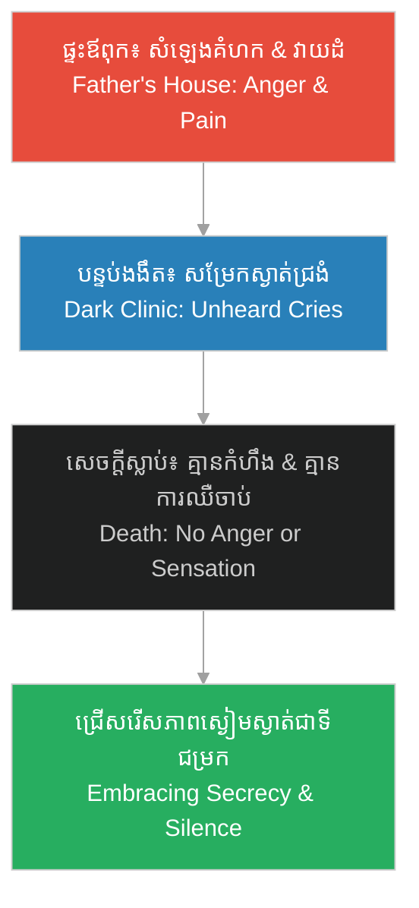

# ទស្សនៈព្រះវិញ្ញាណ៖ ការសង្កេតលើជីវិតរបស់ Young Herman ក្នុងរឿងភាគទី ១ (Divine Perspective: Observing Young Herman's Life in Episode 1)

**Author:** ichamrong  
**Date:** 2026-06-06  
**Tags:** #theology #divine-perspective #psychological-reflection #bible-study #holmes-trauma  
**Category:** Theology  
**Read Time:** ~5 min  

---

## 📌 មាតិកា (Table of Contents)
- [១. ការបកស្រាយខុសពីវិន័យរបស់ព្រះ៖ Levi Mudgett (The Perversion of Divine Discipline)](#1)
- [២. ភាពស្ងៀមស្ងាត់ និងសេចក្តីស្លាប់ជាទីជម្រក (Secrecy and Death as a False Sanctuary)](#2)
- [៣. ការវះកាត់សត្វ៖ ជីវិតជាគ្រឿងម៉ាស៊ីន ឬជាដង្ហើមរបស់ព្រះ? (Dissection: Life as a Machine vs. Breath of God)](#3)
- [៤. សេចក្តីសន្និដ្ឋាន៖ ទុក្ខសោករបស់ព្រះវិញ្ញាណ (Conclusion: The Grief of the Divine Spirit)](#4)
- [ឯកសារយោងពីគម្ពីរ (Biblical References)](#5)

---

## ១. ការបកស្រាយខុសពីវិន័យរបស់ព្រះ៖ Levi Mudgett (The Perversion of Divine Discipline)

នៅក្នុង [រឿងភាគទី ១ (Scene 1)](../episodes/ep-01-shadows-of-new-hampshire.md) Levi Mudgett បានប្រើប្រាស់ជំនឿបែប Puritan យ៉ាងតឹងរ៉ឹងដើម្បីបង្ហាញពីភាពត្រឹមត្រូវនៃអំពើហឹង្សារបស់ខ្លួនលើកុមារ Herman ដោយអះអាងថា៖ «ភាពខ្ជិលច្រអូសគឺជាមាត់ច្រកនៃអារក្ស»។ តាមទស្សនៈព្រះវិញ្ញាណ នេះជាការបកស្រាយខុស និងជាការប្រមាថដល់ព្រះនាមព្រះ។ ព្រះជាម្ចាស់មិនមែនជាព្រះដែលសព្វព្រះហឫទ័យនឹងការវាយដំទារុណកម្មកុមារឡើយ។

Levi Mudgett weaponizes rigid Puritan dogmatism to justify his physical abuse of young Herman, asserting in [Episode 1 (Scene 1)](../episodes/ep-01-shadows-of-new-hampshire.md) that "idleness is the devil's playground." From a divine perspective, this is a grotesque perversion of God's character. God is not a tyrant who delights in the terror and breaking of a child's spirit.

> [!WARNING]
> **⚠️ ព្រះគម្ពីរបញ្ជាក់ច្បាស់លាស់ (Scriptural Clarity):**
> * «លោកឪពុកទាំងឡាយអើយ កុំធ្វើឱ្យកូនៗរបស់ខ្លួនកើតកំហឹងឡើយ ក្រែងលោពួកគេបាក់ទឹកចិត្ត។» (*«Fathers, do not provoke your children, lest they become discouraged.»* — **កូឡូស ៣:២១ / Colossians 3:21**).
> * ព្រះយេស៊ូវបានមានព្រះបន្ទូលយ៉ាងតឹងរ៉ឹងចំពោះអ្នកដែលធ្វើបាបកុមារតូចៗ៖ «តែអ្នកណាដែលធ្វើឱ្យតូចម្នាក់ក្នុងពួកអ្នកជឿនេះរំពើកចិត្តដួល នោះបើចងត្បាល់កិនស្រូវនឹងករបស់គេ ទម្លាក់ទៅក្នុងសមុទ្រជ្រៅវិញ នោះប្រសើរជាង។» (*«But whoever causes one of these little ones who believe in Me to sin, it would be better for him if a millstone were hung around his neck, and he were drowned in the depth of the sea.»* — **ម៉ាថាយ ១៨:៦ / Matthew 18:6**).

---

## ២. ភាពស្ងៀមស្ងាត់ និងសេចក្តីស្លាប់ជាទីជម្រក (Secrecy and Death as a False Sanctuary)

នៅពេល Herman ត្រូវបានបង្ខំឱ្យប្រឈមនឹងគ្រោងឆ្អឹងនៅក្នុងបន្ទប់ងងឹត (Scene 2) សម្រែកសុំជំនួយរបស់គេត្រូវបានលេបបាត់ទៅក្នុងភាពស្ងប់ស្ងាត់។ គេចាប់ផ្តើមយល់ឃើញថា «សេចក្តីស្លាប់» និង «ភាពស្ងៀមស្ងាត់» គឺជាទីជម្រកដែលមានសុវត្ថិភាពជាងផ្ទះរបស់ឪពុកគេ ព្រោះសេចក្តីស្លាប់មិនបង្កការឈឺចាប់ឡើយ។ 

When Herman is forced to confront the skeleton in the darkness (Scene 2), his cries are swallowed by silence. He begins to view "death" and "silence" as a safer sanctuary than his father's house, because the dead feel no pain.

តាមទស្សនៈព្រះវិញ្ញាណ សេចក្តីស្លាប់គឺជា «សត្រូវចុងក្រោយបង្អស់» (១ កូរិនថូស ១៥:២៦) ដែលបំផ្លាញការបង្កើតរបស់ព្រះ។ វាជាសេចក្តីសោកសៅយ៉ាងខ្លាំងរបស់ព្រះវរបិតា នៅពេលដែលឃើញកុមារម្នាក់ស្វែងរកសន្តិភាពនៅក្នុងសេចក្តីស្លាប់ និងភាពស្ងៀមស្ងាត់ ជំនួសឱ្យក្តីស្រឡាញ់ និងពន្លឺរបស់ព្រះអង្គ។

From a divine perspective, death is the "last enemy" (1 Corinthians 15:26) that ravages God's creation. It is a profound grief to the Father when a child feels forced to run to the coldness of the grave and secrecy for comfort, rather than the warmth of His love and light.

---

## ៣. ការវះកាត់សត្វ៖ ជីវិតជាគ្រឿងម៉ាស៊ីន ឬជាដង្ហើមរបស់ព្រះ? (Dissection: Life as a Machine vs. Breath of God)

នៅអាយុ ១២ ឆ្នាំ Herman វះកាត់សត្វតូចៗនៅក្នុងព្រៃស្ងាត់ (Scene 3) ហើយសន្និដ្ឋានថា៖ «សាច់ ឆ្អឹង និងសរសៃឈាម... គ្មានព្រលឹងពិតប្រាកដទេ។ មានតែយន្តការម៉ាស៊ីនប៉ុណ្ណោះ»។ 

At age 12, Herman dissects small animals in the quiet woods (Scene 3) and concludes: "Flesh, bone, and vessels... there is no soul. Just a machine."

> [!IMPORTANT]
> **🌱 ដង្ហើមនៃជីវិត (The Breath of Life):**
> * ព្រះគម្ពីរចែងថា៖ «ជីវិតរបស់សត្វលោកទាំងអស់ និងដង្ហើមរបស់មនុស្សជាតិទាំងឡាយ សុទ្ធតែស្ថិតនៅក្នុងព្រះហស្តរបស់ព្រះអង្គ។» (*«In whose hand is the life of every living thing, and the breath of all mankind.»* — **យ៉ូប ១២:១០ / Job 12:10**).

ការដែល Herman ចាត់ទុកជីវិតជាគ្រឿងម៉ាស៊ីនដែលគ្មានព្រលឹង គឺជាជំហានដំបូងនៃការរលត់ភាពជាមនុស្ស (Dehumanization) នៅក្នុងចិត្តរបស់គេ។ គេបានផ្ដាច់ខ្លួនពីដង្ហើមរបស់ព្រះវរបិតា ដែលលាក់ទុកនៅក្នុងធម្មជាតិ ដើម្បីការពារខ្លួនពីការឈឺចាប់។ យន្តការនេះបានបើកផ្លូវឱ្យគេអាចបំផ្លាញជីវិតមនុស្សដទៃទៀតនាពេលអនាគតដោយគ្មានវិប្បដិសារី ព្រោះគេលែងមើលឃើញមនុស្សជាផលបង្កើតរបស់ព្រះទៀតហើយ។

By reducing living creations to mere soulless machinery, Herman undergoes cognitive dehumanization. He detaches himself from the Father's breath woven within creation to buffer his own vulnerability. This tragic steps shuts his eyes to the sacredness of life, making it easy for him to later dismantle human beings without guilt, seeing them only as biological engines.

---

## ៤. សេចក្តីសន្និដ្ឋាន៖ ទុក្ខសោករបស់ព្រះវិញ្ញាណ (Conclusion: The Grief of the Divine Spirit)

ព្រះវរបិតា និងព្រះយេស៊ូវមិនមែនគ្រាន់តែមើលជីវិតរបស់ Herman Mudgett ដោយភាពវិនិច្ឆ័យទោសនោះទេ ប៉ុន្តែគឺដោយសេចក្តីទុក្ខសោកជាខ្លាំង។ ព្រះអង្គបានឃើញកុមារតូចម្នាក់ដែលត្រូវបានបង្កើតមកក្នុងរូបភាពនៃព្រះ (Imago Dei) ត្រូវបានបំផ្លាញផ្លូវចិត្តដោយសារអំពើបាបរបស់ឪពុក និងការធ្វើបាបពីសង្គម រហូតដល់ចិត្តរបស់គេប្រែក្លាយទៅជាត្រជាក់ និងងងឹត។ 

The Father and Jesus do not merely observe Herman Mudgett's life with cold judgment, but with profound sorrow. They see a child created in the Image of God (Imago Dei) whose soul is deformed by the sins of his father and the cruelty of the world, hardening into a cold, dark void. 

ព្រះយេស៊ូវដែលធ្លាប់យំចំពោះសេចក្តីស្លាប់របស់ឡាសារ និងមានព្រះហឫទ័យក្តៅក្រហាយចំពោះអ្នកធ្វើបាបក្មេងៗ ក៏កំពុងយំចំពោះការបាត់បង់ព្រលឹងរបស់ Herman នៅក្នុងព្រៃស្ងប់ស្ងាត់នៃ Gilmanton ផងដែរ។

Jesus, who wept over Lazarus' death and defended the little children, weeps over the spiritual death and dissociation of Herman in the quiet woods of Gilmanton.

---

## ឯកសារយោងពីគម្ពីរ (Biblical References)

*   **លោកុប្បត្តិ ១:២៧ (Genesis 1:27)** — មនុស្សត្រូវបានបង្កើតឡើងតាមរូបភាពតំណាងព្រះ (Imago Dei)។
*   **កូឡូស ៣:២១ (Colossians 3:21)** — បម្រាមមិនឱ្យឪពុកម្តាយធ្វើបាបកូនរហូតដល់បាក់ទឹកចិត្ត។
*   **យ៉ូប ១២:១០ (Job 12:10)** — ជីវិត និងដង្ហើមរបស់សត្វលោកទាំងអស់ស្ថិតក្នុងដៃរបស់ព្រះ។
*   **១ កូរិនថូស ១៥:២៦ (1 Corinthians 15:26)** — សេចក្តីស្លាប់គឺជាសត្រូវចុងក្រោយបង្អស់ដែលត្រូវបំផ្លាញ។
*   **យ៉ូហាន ១១:៣៥ (John 11:35)** — ព្រះយេស៊ូវទ្រង់យំ (Jesus wept).

---

## 🔗 ឯកសារទាក់ទង (Related Topics)
*   **[មគ្គុទ្ទេសក៍ខែលការពារជំនឿព្រះត្រីឯក (Shield of the Trinity Guide)](shield-of-trinity.md)** — សិក្សាពីឡូហ្សិក និងប្រវត្តិនិមិត្តសញ្ញាព្រះត្រីឯក Scutum Fidei។
*   **[Episode 1: ស្រមោលកុមារភាព (Shadows of New Hampshire)](../episodes/ep-01-shadows-of-new-hampshire.md)** — ស្គ្រីបភាគទី ១ ដែលជាសាច់រឿងគ្រឹះនៃកុមារភាពរបស់ Young Herman។
