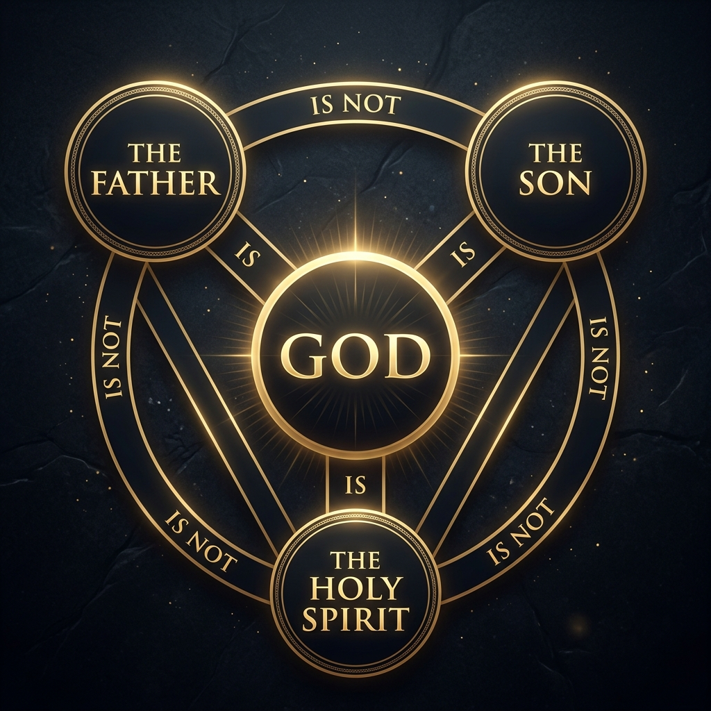

# ខែលការពារជំនឿព្រះត្រីឯក (The Shield of the Trinity)៖ Scutum Fidei Guide

**Author:** ichamrong  
**Date:** 2026-06-06  
**Tags:** #theology #trinity #scutum-fidei #christian-orthodoxy #divine-nature  
**Category:** Theology  
**Read Time:** ~4 min  

---

---

## 📌 មាតិកា (Table of Contents)
- [១. តើអ្វីជាខែលការពារជំនឿព្រះត្រីឯក? (What is the Shield of the Trinity?)](#1)
- [២. ទំនាក់ទំនងទាំង ៦ នៃព្រះត្រីឯក (The Six Relationships of the Trinity)](#2)
- [៣. ការការពារប្រឆាំងនឹងជំនឿមិនត្រឹមត្រូវ (Defending Against Heresies)](#3)
- [៤. សេចក្តីសន្និដ្ឋាន៖ ធម្មជាតិដ៏អស្ចារ្យរបស់ព្រះ (Conclusion: The Divine Mystery)](#4)
- [ឯកសារយោង (References)](#5)

---

## ១. តើអ្វីជាខែលការពារជំនឿព្រះត្រីឯក? (What is the Shield of the Trinity?)

**ខែលការពារជំនឿព្រះត្រីឯក (Shield of the Trinity)** ឬជាភាសាឡាតាំងហៅថា **Scutum Fidei** គឺជានិមិត្តសញ្ញាគ្រីស្ទសាសនាបុរាណមួយ ដែលត្រូវបានបង្កើតឡើងក្នុងយុគសម័យកណ្តាល (ប្រហែលសតវត្សទី ១២) ដើម្បីពន្យល់ពីគោលគំនិតនៃជំនឿ **ព្រះត្រីឯក (Trinity)** យ៉ាងសាមញ្ញ ឡូហ្សិក និងស្របតាមគោលលទ្ធិផ្លូវការ។

The **Shield of the Trinity (Scutum Fidei)** is a traditional Christian visual symbol developed in the Middle Ages (around the 12th century) to represent the central doctrine of the **Trinity** in a clear, logical, and orthodox manner.

---

## ២. ទំនាក់ទំនងទាំង ៦ នៃព្រះត្រីឯក (The Six Relationships of the Trinity)

ដ្យាក្រាមនេះបង្ហាញពីទំនាក់ទំនងរវាងតួអង្គទាំងបីនៃព្រះត្រីឯក និងធម្មជាតិតែមួយរបស់ព្រះ តាមរយៈការបញ្ជាក់ឡូហ្សិកចំនួន ៦៖

This diagram outlines the relationships between the three Persons of the Trinity and the single essence of God through six logical assertions:

1.  **ការរួមបញ្ចូលគ្នាជាមួយព្រះវិញ្ញាណ (Identities - "IS" / "គឺជា"):**
    *   **ព្រះវរបិតា គឺជាព្រះ** (*The Father IS God*).
    *   **ព្រះរាជបុត្រា គឺជាព្រះ** (*The Son IS God*).
    *   **ព្រះវិញ្ញាណបរិសុទ្ធ គឺជាព្រះ** (*The Holy Spirit IS God*).
2.  **ការបែងចែកដាច់ដោយឡែកពីគ្នា (Distinctions - "IS NOT" / "មិនមែនជា"):**
    *   **ព្រះវរបិតា មិនមែនជាព្រះរាជបុត្រាឡើយ** (*The Father IS NOT the Son*).
    *   **ព្រះរាជបុត្រា មិនមែនជាព្រះវិញ្ញាណបរិសុទ្ធឡើយ** (*The Son IS NOT the Holy Spirit*).
    *   **ព្រះវិញ្ញាណបរិសុទ្ធ មិនមែនជាព្រះវរបិតាឡើយ** (*The Holy Spirit IS NOT the Father*).

---

## ៣. ការការពារប្រឆាំងនឹងជំនឿមិនត្រឹមត្រូវ (Defending Against Heresies)

ដ្យាក្រាមនេះត្រូវបានរចនាឡើងដើម្បីការពារជំនឿពីការយល់ច្រឡំ ឬការបកស្រាយខុសឆ្គងធំៗពីរ (Heresies)៖

The diagram was engineered to visually protect the faith from two major historical heresies:

*   **Modalism (សំបកក្រៅ):** ជំនឿខុសឆ្គងដែលយល់ថា ព្រះវរបិតា ព្រះរាជបុត្រា និងព្រះវិញ្ញាណបរិសុទ្ធ គ្រាន់តែជា «របាំងមុខ» ឬទម្រង់បណ្តោះអាសន្នផ្សេងគ្នារបស់ព្រះតែមួយ។ ដ្យាក្រាមនេះការពារដោយបង្កើតបន្ទាត់ **«មិនមែនជា» (IS NOT)** នៅរង្វង់ខាងក្រៅ ដើម្បីបញ្ជាក់ថាតួអង្គទាំងបីដាច់ឡែកពីគ្នាជានិច្ច។
    *   *Modalism:* The error of teaching that the Father, Son, and Holy Spirit are merely different roles or "masks" worn by a single divine person. The outer triangle's **"IS NOT"** links emphasize their co-eternal, distinct personal identities.
*   **Tritheism (ពហុព្រះនិយម):** ជំនឿខុសឆ្គងដែលយល់ថាមានព្រះបីផ្សេងគ្នាដាច់ស្រឡះ។ ដ្យាក្រាមនេះការពារដោយភ្ជាប់តួអង្គទាំងបីទៅកាន់ចំណុចកណ្តាលតែមួយគឺ **«ព្រះ» (GOD)** តាមរយៈពាក្យ **«គឺជា» (IS)** ដើម្បីបញ្ជាក់ថាព្រះមានតែមួយព្រះអង្គគត់ (One Divine Essence)។
    *   *Tritheism:* The error of teaching that there are three separate gods. The inner lines **"IS"** pointing to the center reaffirm that all three persons share the single, undivided essence of the one true **God**.

---

## ៤. សេចក្តីសន្និដ្ឋាន៖ ធម្មជាតិដ៏អស្ចារ្យរបស់ព្រះ (Conclusion: The Divine Mystery)

ព្រះត្រីឯកមិនមែនមានន័យថាព្រះបីអង្គនោះទេ ហើយក៏មិនមែនមានន័យថាព្រះមួយអង្គដើរតួបីផ្សេងគ្នានោះដែរ។ ផ្ទុយទៅវិញ គឺ **«ព្រះតែមួយព្រះអង្គគត់ តែមានបីតួអង្គ» (One God in Three Persons)**។ នេះជាអាថ៌កំបាំងដ៏ជ្រាលជ្រៅនៃសេចក្តីស្រឡាញ់របស់ព្រះអង្គ ដែលតួអង្គនីមួយៗរស់នៅដើម្បីលើកតម្កើងតួអង្គផ្សេងទៀតនៅក្នុងសាមគ្គីភាពដ៏ឥតខ្ចោះ។

The Trinity does not teach that there are three gods, nor does it teach that there is one person playing three different roles. Rather, it defines **One God in Three Persons**. This remains a profound mystery of divine love, where each Person eternally exists to glorify and dwell with the others in perfect unity.

---

## ឯកសារយោង (References)

*   **Saint Augustine of Hippo** — *De Trinitate* (On the Trinity, early 5th Century). The foundational theological study of the Trinity.
*   **The Athanasian Creed** (circa 5th-6th Century). The historical confession of faith from which the propositions of the Shield are derived.
