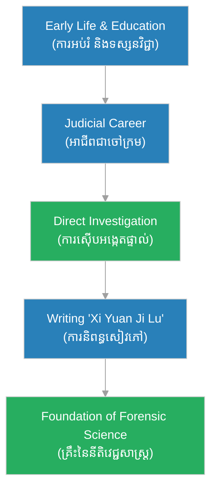

# The Biography of Song Ci (ជីវប្រវត្តិសុង ស៊ី)

**Author:** ichamrong  
**Date:** 2026-06-11  
**Tags:** #song-ci #biography #forensic-science #justice #history  
**Category:** Biographies  
**Read Time:** ~10 min  

---

## 📌 មាតិកា (Table of Contents)
- [សេចក្តីផ្តើម៖ បិតានៃនីតិវេជ្ជសាស្ត្រ (Intro: The Father of Forensic Medicine)](#0)
- [១. កុមារភាព និងការអប់រំ (1. Childhood and Education)](#1)
- [២. ការចាប់ផ្តើមក្នុងវិស័យយុត្តិធម៌ (2. Entering the Judicial System)](#2)
- [៣. កំណត់ត្រានៃការជម្រះភាពអយុត្តិធម៌ (3. The Washing Away of Wrongs)](#3)
- [៤. វិធីសាស្ត្រស៊ើបអង្កេតបែបវិទ្យាសាស្ត្រ (4. Scientific Investigative Methods)](#4)
- [៥. ជីវិតចុងក្រោយ និងមរណភាព (5. Later Life and Death)](#5)
- [៦. តុល្យភាពចិត្តសាស្ត្រ និងទស្សនវិជ្ជា (The Stoic-Daoist Psychological Synthesis)](#6)
- [៧. ភាពផ្ទុយគ្នា និងការរិះគន់ (Paradoxes & Criticisms)](#7)
- [៨. កេរដំណែលយុទ្ធសាស្ត្រ (Legacy Flow)](#8)
- [៩. តើ Song Ci បានបំផុសគំនិតអ្វីខ្លះ? (What Did Song Ci Inspire?)](#9)
- [សេចក្តីសន្និដ្ឋាន (Conclusion)](#10)
- [🔗 ឯកសារទាក់ទង (Related Topics)](#11)
- [ឯកសារយោង (References)](#12)

---

## សេចក្តីផ្តើម៖ បិតានៃនីតិវេជ្ជសាស្ត្រ (Intro: The Father of Forensic Medicine)

> **«កំហុសដ៏តូចមួយក្នុងការពិនិត្យសាកសព អាចនាំឱ្យមានការកាត់ទោសខុសដ៏ធំមួយ។» — Song Ci**  
> *(“A tiny error in examining a corpse can lead to a massive miscarriage of justice.” — Song Ci)*

Song Ci (១១៨៦–១២៤៩) គឺជាគ្រូពេទ្យ ចៅក្រម អ្នកវិទ្យាសាស្ត្រ និងជាអ្នកនិពន្ធដ៏ឆ្នើមម្នាក់ក្នុងរាជវង្សសុង (Song Dynasty) នៃប្រទេសចិន។ គាត់ត្រូវបានពិភពលោកទទួលស្គាល់ថាជា "បិតានៃនីតិវេជ្ជសាស្ត្រ" (Father of Forensic Medicine)។ ផ្ទុយពីអ្នកដែលមានចំណេះដឹងផ្នែកកាយវិភាគវិទ្យាដែលប្រើវាដើម្បីប្រយោជន៍ផ្ទាល់ខ្លួន ឬប្រព្រឹត្តបទឧក្រិដ្ឋ Song Ci បានប្រើប្រាស់ចំណេះដឹងនេះដើម្បីស្វែងរកការពិត និងផ្តល់យុត្តិធម៌ដល់ជនរងគ្រោះ ដែលធ្វើឱ្យគាត់ក្លាយជានិមិត្តរូបនៃការស៊ើបអង្កេតបែបវិទ្យាសាស្ត្រ។

---

## ១. កុមារភាព និងការអប់រំ (1. Childhood and Education)

Song Ci កើតក្នុងត្រកូលមន្ត្រីនៅ Jianyang (បច្ចុប្បន្នជាខេត្ត Fujian)។ គាត់បានទទួលការអប់រំខ្ពស់ និងបានប្រឡងជាប់សញ្ញាបត្រកម្រិតកំពូល (Jinshi) ដែលអនុញ្ញាតឱ្យគាត់ចូលបម្រើការងារក្នុងជួររដ្ឋាភិបាល។

### 🏛️ គ្រឹះទស្សនវិជ្ជា / Philosophical Core - The Pursuit of Truth
ទស្សនវិជ្ជារបស់ Song Ci ត្រូវបានចាក់ឫសយ៉ាងជ្រៅនៅក្នុងលទ្ធិខុងជឺ (Confucianism) ដែលសង្កត់ធ្ងន់ទៅលើសីលធម៌ យុត្តិធម៌ និងការទទួលខុសត្រូវចំពោះសង្គម។ គាត់ជឿជាក់ថាការពិតគឺមាននៅលើសាកសព ហើយភស្តុតាងវិទ្យាសាស្ត្រគឺជាសម្លេងរបស់អ្នកដែលមិនអាចនិយាយបាន។

---

## ២. ការចាប់ផ្តើមក្នុងវិស័យយុត្តិធម៌ (2. Entering the Judicial System)

ក្នុងនាមជាចៅក្រម Song Ci តែងតែចុះទៅពិនិត្យកន្លែងកើតហេតុដោយផ្ទាល់រាល់ពេលមានករណីឃាតកម្ម ឬការវាយប្រហារលើរាងកាយដែលស្មុគស្មាញ។ គាត់មិនព្រមពឹងផ្អែកតែលើការសារភាព (ដែលជារឿយៗបានមកពីការធ្វើទារុណកម្ម) ឬសាក្សីបញ្ជាក់នោះទេ គាត់ជឿជាក់លើការពិនិត្យសាកសពដោយផ្ទាល់។

> [!IMPORTANT]
> **🧠 យន្តការចិត្តសាស្ត្រ / Psychological Mechanism - Evidence Over Assumption:**
> * «ការពិតមិនមែនជារឿងដែលគេនិយាយប្រាប់ទេ ប៉ុន្តែជារឿងដែលភស្តុតាងបង្ហាញ។» (*“Truth is not what is told, but what evidence reveals.”*).

---

## ៣. កំណត់ត្រានៃការជម្រះភាពអយុត្តិធម៌ (3. The Washing Away of Wrongs)

ស្នាដៃដ៏អស្ចារ្យបំផុតរបស់គាត់គឺសៀវភៅ "Collected Cases of Injustice Rectified" (Xi Yuan Ji Lu) ដែលសរសេរឡើងនៅឆ្នាំ ១២៤៧។ សៀវភៅនេះបានក្លាយជាមូលដ្ឋានគ្រឹះសម្រាប់ការស៊ើបអង្កេតបទល្មើសព្រហ្មទណ្ឌ និងត្រូវបានប្រើប្រាស់យ៉ាងទូលំទូលាយ។

> [!TIP]
> **🚀 មេរៀនអនុវត្ត / Practical Application - Systematic Investigation**
> *   **ការសង្កេតល្អិតល្អន់៖** ត្រូវយកចិត្តទុកដាក់លើរាល់ព័ត៌មានលម្អិតទាំងអស់ទោះបីជាតូចតាចក៏ដោយ។
> *   **ការប្រើប្រាស់តក្កវិជ្ជា និងវិទ្យាសាស្ត្រ៖** ប្រើប្រាស់ភស្តុតាងដែលអាចវាស់វែង និងបញ្ជាក់បាន ដើម្បីបំបាត់ការសន្និដ្ឋានខុស។

---

## ៤. វិធីសាស្ត្រស៊ើបអង្កេតបែបវិទ្យាសាស្ត្រ (4. Scientific Investigative Methods)

Song Ci បានបង្កើតវិធីសាស្ត្រជាច្រើនដែលនៅតែមានតម្លៃរហូតដល់សព្វថ្ងៃ៖
- **នីតិបាណកវិទ្យា (Forensic Entomology):** ករណីល្បីល្បាញបំផុតគឺការស្វែងរកឃាតកដោយប្រើសត្វរុយ។ ពេលមានករណីសម្លាប់ដោយប្រើកណ្តៀវ គាត់បានឱ្យអ្នកភូមិយកកណ្តៀវរបស់ពួកគេមកតម្រៀបគ្នា។ រុយបានទាក់ទាញដោយក្លិនឈាមដែលមើលមិនឃើញនៅលើកណ្តៀវរបស់ឃាតក ដែលធ្វើឱ្យឃាតកព្រមសារភាព។
- **កាយវិភាគសាស្ត្រ៖** របៀបបែងចែករវាងការស្លាប់ដោយការលង់ទឹក និងការច្របាច់ក។

---

## ៥. ជីវិតចុងក្រោយ និងមរណភាព (5. Later Life and Death)

Song Ci បានបន្តបម្រើការជាចៅក្រមនិងជាអ្នកជំនាញខាងនីតិវេជ្ជសាស្ត្ររហូតដល់គាត់ទទួលមរណភាពនៅឆ្នាំ ១២៤៩។ សៀវភៅរបស់គាត់នៅតែត្រូវបានប្រើប្រាស់ជាសៀវភៅគោលសម្រាប់មន្ត្រីស៊ើបអង្កេតចិនអស់ជាច្រើនសតវត្ស។

---

## ៦. តុល្យភាពចិត្តសាស្ត្រ និងទស្សនវិជ្ជា (The Stoic-Daoist Psychological Synthesis)

ចិត្តសាស្ត្ររបស់ Song Ci គឺជាការរួមបញ្ចូលគ្នារវាងការប្តេជ្ញាចិត្តដើម្បីយុត្តិធម៌ (Confucian) និងភាពស្ងប់ស្ងាត់ក្នុងការប្រឈមមុខនឹងភាពសាហាវយង់ឃ្នង (Stoic/Daoist)។ គាត់អាចរក្សាភាពមិនលំអៀង និងប្រើប្រាស់វិទ្យាសាស្ត្រជាឧបករណ៍ដើម្បីរកយុត្តិធម៌។

---

## ៧. ភាពផ្ទុយគ្នា និងការរិះគន់ (Paradoxes & Criticisms)

> [!WARNING]
> **⚠️ ភាពផ្ទុយគ្នា និងការរិះគន់ / Paradoxes & Criticisms**
> ១. **ដែនកំណត់បច្ចេកវិទ្យា៖** ទោះបីជាគាត់មានគំនិតឈានមុខ ក៏វិធីសាស្ត្រមួយចំនួនរបស់គាត់មានដែនកំណត់ ដោយសារកង្វះបច្ចេកវិទ្យាវិទ្យាសាស្ត្រទំនើប។
> ២. **ការប្រឆាំងពីសង្គម៖** ក្នុងសម័យកាលនោះ ការវះកាត់ ឬរុករកសាកសពត្រូវបានចាត់ទុកថាជាការមិនគោរពដល់អ្នកស្លាប់ ប៉ុន្តែគាត់ហ៊ានបំបែកប្រពៃណីនេះដើម្បីយុត្តិធម៌។

---

## ៨. កេរដំណែលយុទ្ធសាស្ត្រ (Legacy Flow)

---

## ៩. តើ Song Ci បានបំផុសគំនិតអ្វីខ្លះ? (What Did Song Ci Inspire?)

1. **Forensic Pathology:** The systematic examination of corpses to determine the cause of death.
2. **Forensic Entomology:** Using insects to aid in legal investigations, famously sparked by his sickle and fly case.
3. **Modern Criminal Investigation:** The shift from relying on confessions to physical evidence.

---

## 🐇 ធ្លាក់ចូលក្នុងរន្ធទន្សាយយុទ្ធសាស្ត្រ (Enter the Strategic Rabbit Hole)
ដើម្បីស្វែងយល់កាន់តែស៊ីជម្រៅអំពី Forensic Science សូមចាប់ផ្តើមដំណើររុករករបស់អ្នកដោយចុចលើតំណភ្ជាប់ខាងក្រោម៖

* 🚀 **[ចាប់ផ្តើមដំណើររុករក (Start the Journey) ➔ H.H. Holmes](../h-h-holmes/01-h-h-holmes-biography.md)**

---

## សេចក្តីសន្និដ្ឋាន (Conclusion)

Song Ci មិនត្រឹមតែជាអ្នកត្រួសត្រាយផ្លូវក្នុងវិទ្យាសាស្ត្រប៉ុណ្ណោះទេ ប៉ុន្តែគាត់ក៏ជានិមិត្តរូបនៃយុត្តិធម៌ផងដែរ។ កេរដំណែលរបស់គាត់បានបង្ហាញថា ចំណេះដឹងខាងវេជ្ជសាស្ត្រនៅពេលដែលត្រូវបានប្រើប្រាស់ដោយមានសីលធម៌ អាចក្លាយជាឧបករណ៍ដ៏មានឥទ្ធិពលបំផុតក្នុងការការពារជនស្លូតត្រង់ និងស្វែងរកការពិត។

---

## 🔗 ឯកសារទាក់ទង (Related Topics)
* [[H.H. Holmes Biography]](../h-h-holmes/01-h-h-holmes-biography.md)

## ឯកសារយោង (References)
* **Song Ci** — *Collected Cases of Injustice Rectified (Xi Yuan Ji Lu)* (1247). The world's first documented text on forensic medicine.
