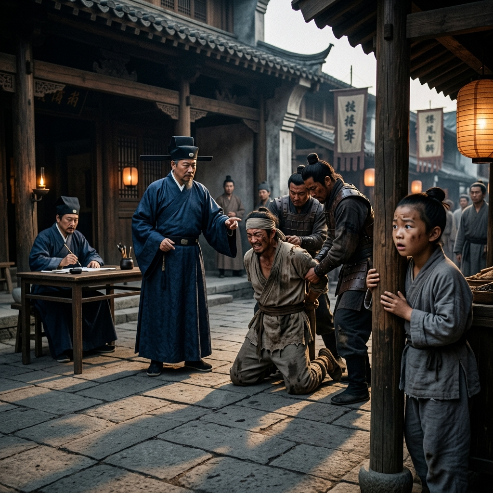

# Episode 1: ស្រមោលអយុត្តិធម៌ (Shadows of Injustice)

**Author:** ichamrong  
**Date:** 2026-06-11  
**Tags:** #song-ci #episode-1 #injustice #historical-drama #childhood  
**Category:** Biographies  
**Read Time:** ~8 min  

---

## 📌 មាតិកា (Table of Contents)
- [សេចក្តីផ្តើម៖ គ្រាប់ពូជនៃយុត្តិធម៌ (Introduction: Seeds of Justice)](#0)
- [១. ប្លង់ទី ១៖ សវនាការដ៏ឃោរឃៅ (Scene 1: The Brutal Interrogation)](#1)
- [២. ប្លង់ទី ២៖ ការសារភាពក្លែងក្លាយ (Scene 2: The False Confession)](#2)
- [៣. យន្តការចិត្តសាស្ត្រ (Psychological Mechanism)](#3)
- [សេចក្តីសន្និដ្ឋាន (Conclusion)](#4)
- [🔗 ឯកសារទាក់ទង (Related Topics)](#5)

---

## សេចក្តីផ្តើម៖ គ្រាប់ពូជនៃយុត្តិធម៌ (Introduction: Seeds of Justice)

រឿងភាគដំបូងនេះបង្ហាញពីកុមារភាពរបស់ Song Ci។ វាផ្តោតលើព្រឹត្តិការណ៍ដែលធ្វើឱ្យក្មេងប្រុសនេះភ្ញាក់រលឹកអំពីភាពទន់ខ្សោយនៃប្រព័ន្ធយុត្តិធម៌ ដែលពឹងផ្អែកលើការសន្មត និងការធ្វើទារុណកម្ម ជាជាងការរកភស្តុតាង។

This premiere episode introduces the childhood of Song Ci, focusing on the traumatic event that awakened him to the profound flaws in a judicial system that relied on assumptions and torture rather than concrete evidence.

---

## ១. ប្លង់ទី ១៖ សវនាការដ៏ឃោរឃៅ (Scene 1: The Brutal Interrogation)

**ទីតាំង៖** សាលាស្រុក, ទីក្រុង Jianyang (វេលាថ្ងៃត្រង់)  
**Location:** The County Courthouse, Jianyang City (Midday)

**សកម្មភាព៖** កុមារ Song Ci អាយុ ១០ ឆ្នាំ កំពុងលួចមើលពីចម្ងាយតាមចន្លោះទ្វារ។ នៅកណ្តាលទីលាន ចៅក្រមស្រុកកំពុងបញ្ជាឱ្យទាហានវាយដំកសិករក្រីក្រម្នាក់ដែលត្រូវចោទប្រកាន់ពីបទលួច។  
**Action:** Ten-year-old Song Ci peeks through the crack of the courtyard doors. In the center, the local magistrate orders guards to violently beat a poor peasant accused of theft.

*   **ចៅក្រមស្រុក (Magistrate)៖** "វាយវាទាល់តែវាព្រមសារភាព! ចោរថោកទាប!"  
    *   *"Beat him until he confesses! Wretched thief!"*
*   **កសិករ (Peasant)៖** (ស្រែកយំឈឺចាប់) "ខ្ញុំមិនបានលួចទេ! ខ្ញុំអង្វរលោកម្ចាស់!"  
    *   *(Crying in agony)* *"I didn't steal it! I beg you, my lord!"*

**ការពិពណ៌នា៖** Song Ci សង្កេតមើលដោយភ្នែកបើកធំៗ។ គេឃើញថាកសិករនោះមានរូបរាងស្គមស្គាំង និងមានរបួសជើងស្រាប់ ដែលមិនអាចទៅលួចទ្រព្យសម្បត្តិធ្ងន់ៗឆ្លងកាត់ជញ្ជាំងខ្ពស់បានទេ។ ប៉ុន្តែចៅក្រមមិនខ្វល់ពីរូបរាងកាយនេះទេ គាត់ខ្វល់តែពីការបិទសំណុំរឿង។  
**Description:** Song Ci watches with wide eyes. He observes that the peasant is frail and has a pre-existing leg injury, making it physically impossible for him to have vaulted a high wall with heavy stolen goods. Yet the magistrate cares nothing for physical reality; he only cares about closing the case.

---

## ២. ប្លង់ទី ២៖ ការសារភាពក្លែងក្លាយ (Scene 2: The False Confession)

**ទីតាំង៖** ទីលានប្រហារជីវិត (ប៉ុន្មានថ្ងៃក្រោយមក)  
**Location:** The Execution Ground (A few days later)

**សកម្មភាព៖** កសិករដែលទ្រាំនឹងការវាយដំមិនបាន ក៏បានព្រមសារភាពថាខ្លួនជាចោរ ដើម្បីបញ្ចប់ការឈឺចាប់។ គាត់ត្រូវបានគេកាត់ទោសប្រហារជីវិតជាសាធារណៈ។  
**Action:** Unable to endure the torture, the peasant falsely confesses just to stop the pain. He is publicly sentenced to death.

*   **កសិករ (Peasant)៖** (និយាយទាំងអស់សង្ឃឹមមុនពេលប្រហារ) "មេឃមានភ្នែក... ខ្ញុំមិនបានធ្វើទេ..."  
    *   *(Speaking hopelessly before the blade falls)* *"Heaven has eyes... I did not do it..."*

**ការពិពណ៌នា៖** ឈាមប្រឡាក់ដី។ Song Ci រត់ចេញពីទីលាននោះទាំងទឹកភ្នែក និងកំហឹង។ ក្នុងចិត្តក្មេងតូច គេបានស្វែងយល់យ៉ាងច្បាស់ថា "ការសារភាព" មិនមែនមានន័យថាជា "ការពិត" នោះទេ។  
**Description:** Blood stains the earth. Song Ci runs from the square in tears and silent rage. In his young mind, a crystalline realization is born: a "confession" does not equal the "truth".

---

## ៣. យន្តការចិត្តសាស្ត្រ (Psychological Mechanism)

> [!IMPORTANT]
> **🧠 យន្តការចិត្តសាស្ត្រ / Psychological Mechanism - [Evidence Over Assumption](../keyword/evidence-over-assumption.md):**
> * «ព្រឹត្តិការណ៍នេះបានបណ្តុះគ្រាប់ពូជនៃការសង្ស័យលើគ្រប់ពាក្យសម្តី។ វាបង្រៀន Song Ci ថា មានតែភស្តុតាងដែលមិនចេះនិយាយ (សាកសព និងកន្លែងកើតហេតុ) ប៉ុណ្ណោះដែលមិនចេះភូតកុហក។» (*"This trauma planted the seed of skepticism toward spoken words. It taught Song Ci that only silent evidence—the body and the scene—cannot lie."*).

---

## សេចក្តីសន្និដ្ឋាន (Conclusion)

> **«យុត្តិធម៌ដែលបានមកពីការធ្វើទារុណកម្ម គឺជាឧក្រិដ្ឋកម្មដែលស្របច្បាប់។»**
> 
> **“Justice extracted through torture is merely legalized crime.”**

ភាគទី ១ បញ្ចប់ដោយ Song Ci ឈរមើលផ្ទៃមេឃពណ៌ប្រផេះ ដោយសន្យានឹងខ្លួនឯងថា ថ្ងៃណាមួយគេនឹងស្វែងរកវិធីដើម្បីការពារជនស្លូតត្រង់ពីប្រព័ន្ធដ៏ងងឹតងងល់នេះ។
Episode 1 ends with Song Ci staring at the grey sky, promising himself that one day, he will find a way to shield the innocent from this blind system.

---

## 🔗 ឯកសារទាក់ទង (Related Topics)
*   [គម្រោងរឿងភាគដ្រាម៉ា ៦១ ភាគ](../03-song-ci-drama-episode-guide.md) — ត្រឡប់ទៅកាន់បញ្ជីរឿងភាគទាំងមូល។
*   [Episode 2: មេរៀនពីឪពុក (Lessons from the Father)](ep-02-lessons-from-the-father.md) — ភាគបន្ត។
