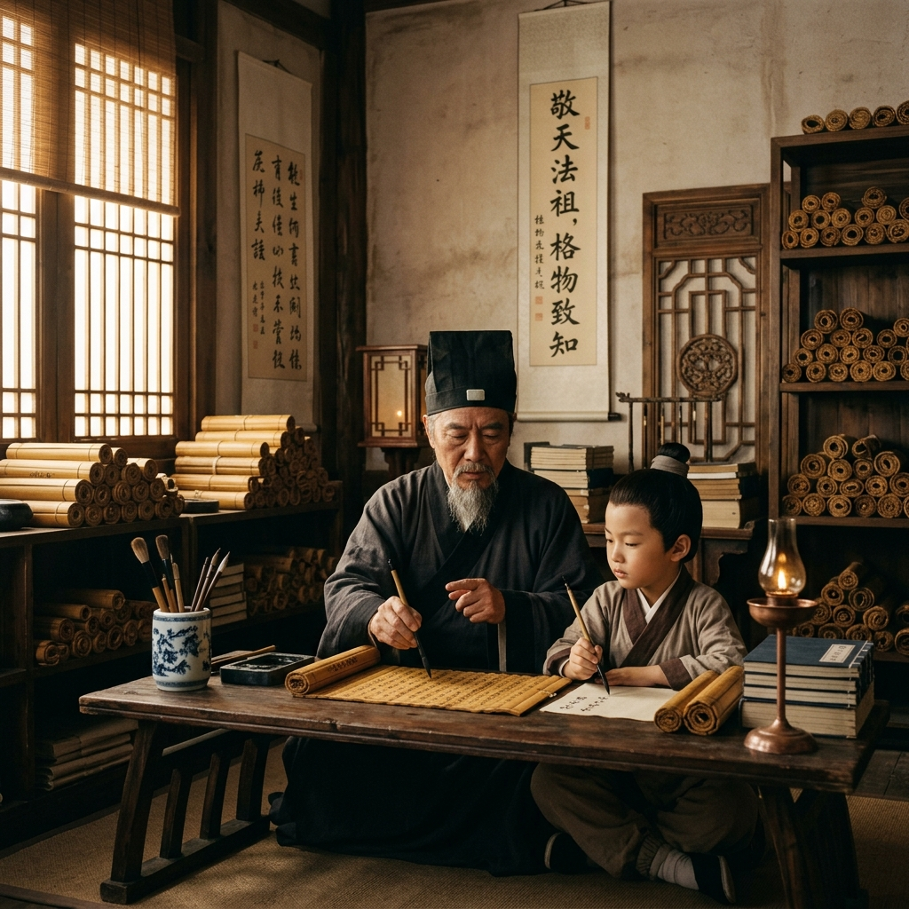

# Episode 2: មេរៀនពីឪពុក (Lessons from the Father)

**Author:** ichamrong  
**Date:** 2026-06-11  
**Tags:** #song-ci #episode-2 #confucianism #education #historical-drama  
**Category:** Biographies  
**Read Time:** ~8 min  

---

## 📌 មាតិកា (Table of Contents)
- [សេចក្តីផ្តើម៖ គ្រឹះនៃសីលធម៌ (Introduction: Foundation of Morality)](#0)
- [១. ប្លង់ទី ១៖ បន្ទប់អានសៀវភៅ (Scene 1: The Study Room)](#1)
- [២. ប្លង់ទី ២៖ ការសន្យា (Scene 2: The Promise)](#2)
- [៣. យន្តការទស្សនវិជ្ជា (Philosophical Mechanism)](#3)
- [សេចក្តីសន្និដ្ឋាន (Conclusion)](#4)
- [🔗 ឯកសារទាក់ទង (Related Topics)](#5)

---

## សេចក្តីផ្តើម៖ គ្រឹះនៃសីលធម៌ (Introduction: Foundation of Morality)

ក្រោយពីរងការប៉ះទង្គិចផ្លូវចិត្តពីការប្រហារជីវិតមនុស្សស្លូតត្រង់ Song Ci ស្វែងរកការណែនាំពីឪពុករបស់ខ្លួន ដែលជាមន្ត្រីរាជការប្រកាន់ខ្ជាប់នូវក្រមសីលធម៌ខុងជឺ (Confucianism) ។

Following the trauma of witnessing an innocent's execution, young Song Ci seeks guidance from his father, a dedicated official who strictly adheres to Confucian moral codes.

---

## ១. ប្លង់ទី ១៖ បន្ទប់អានសៀវភៅ (Scene 1: The Study Room)

**ទីតាំង៖** បន្ទប់សិក្សាក្នុងផ្ទះគ្រួសារ Song (វេលាល្ងាច)  
**Location:** The Study Room of the Song Residence (Evening)

**សកម្មភាព៖** ឪពុករបស់ Song Ci កំពុងអង្គុយពន្យល់ពីអត្ថបទបុរាណដល់កូនប្រុស ក្រោមពន្លឺចង្កៀងប្រេងដ៏កក់ក្តៅ។  
**Action:** Song Ci's father sits explaining ancient texts to his son under the warm glow of an oil lamp.

*   **ឪពុក (Father)៖** "អ្នកដឹកនាំដែលពឹងផ្អែកលើការភ័យខ្លាចដើម្បីគ្រប់គ្រង គឺជាជនផ្តាច់ការ។ អ្នកដឹកនាំដែលពឹងផ្អែកលើការពិត គឺជាអ្នកប្រាជ្ញ។"  
    *   *"A leader who relies on fear to govern is a tyrant. A leader who relies on truth is a sage."*
*   **Song Ci៖** "ចុះបើការពិតត្រូវបានគេលាក់បាំងដោយអ្នកមានអំណាច តើយើងគួរធ្វើដូចម្តេចលោកពុក?"  
    *   *"And if the truth is hidden by those in power, what should we do, father?"*
*   **ឪពុក (Father)៖** "ជីវិតមួយមានតម្លៃស្មើនឹងភ្នំ តាយសាន។ ការពារជីវិតនោះគឺជាកាតព្វកិច្ចរបស់មន្ត្រី។ ទោះស្លាប់ក៏មិនត្រូវបំភ្លៃការពិតដែរ។"  
    *   *"A single human life is as weighty as Mount Tai. Protecting it is an official's duty. Even unto death, the truth must not be twisted."*

---

## ២. ប្លង់ទី ២៖ ការសន្យា (Scene 2: The Promise)

**ទីតាំង៖** ទីធ្លាផ្ទះខាងមុខ (វេលាយប់)  
**Location:** The Front Courtyard (Night)

**សកម្មភាព៖** Song Ci លុតជង្គង់នៅមុខឪពុក ដោយធ្វើការសន្យាថានឹងប្រឡងចូលធ្វើមន្ត្រី ដើម្បីក្លាយជាចៅក្រមដែលយុត្តិធម៌បំផុត។  
**Action:** Song Ci kneels before his father, making a solemn vow to pass the imperial exams and become the most just magistrate.

*   **Song Ci៖** "កូនសន្យាថានឹងប្រើប្រាស់ជីវិតនេះ ដើម្បីជម្រះរាល់ភាពអយុត្តិធម៌ដែលកូនបានឃើញ។"  
    *   *"I promise to use this life to wash away every injustice I have witnessed."*

---

## ៣. យន្តការទស្សនវិជ្ជា (Philosophical Mechanism)

> [!TIP]
> **📜 ទស្សនវិជ្ជា / Philosophy - Confucian Virtue (សីលធម៌ខុងជឺ):**
> * ទស្សនវិជ្ជានេះបង្រៀនថា អំណាចមិនមែនសម្រាប់សង្កត់សង្កិនទេ តែសម្រាប់ការពារអ្នកទន់ខ្សោយ។ នេះជាត្រីវិស័យសីលធម៌ដែលរារាំង Song Ci មិនឱ្យក្លាយជាមន្ត្រីពុករលួយ។

---

## សេចក្តីសន្និដ្ឋាន (Conclusion)

> **«កាតព្វកិច្ចធំបំផុតរបស់បញ្ញវន្ត មិនមែនជាការអានសៀវភៅទេ តែជាការការពារជីវិតមនុស្ស។»**
> 
> **“The greatest duty of a scholar is not to read books, but to protect human lives.”**

ភាគទី ២ បិទបញ្ចប់ដោយ Song Ci ចាប់ផ្តើមសិក្សាយ៉ាងស្វិតស្វាញ ទាំងយប់ទាំងថ្ងៃ។
Episode 2 concludes with Song Ci beginning his rigorous studies, day and night.

---

## 🔗 ឯកសារទាក់ទង (Related Topics)
*   [Episode 1: ស្រមោលអយុត្តិធម៌ (Shadows of Injustice)](ep-01-shadows-of-injustice.md) — ភាគមុន។
*   [Episode 3: សៀវភៅនិងដាវ (The Pen and the Sword)](ep-03-the-pen-and-the-sword.md) — ភាគបន្ត។
