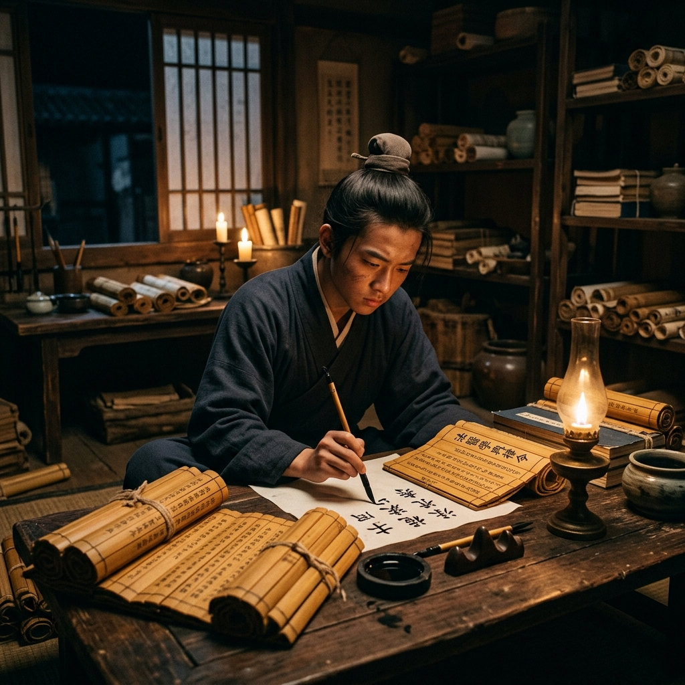

# Episode 3: សៀវភៅនិងដាវ (The Pen and the Sword)

**Author:** ichamrong  
**Date:** 2026-06-11  
**Tags:** #song-ci #episode-3 #imperial-exams #studying #determination  
**Category:** Biographies  
**Read Time:** ~8 min  

---

## 📌 មាតិកា (Table of Contents)
- [សេចក្តីផ្តើម៖ ការតស៊ូនៃយុវវ័យ (Introduction: Teenage Struggle)](#0)
- [១. ប្លង់ទី ១៖ រាត្រីកណ្តាលអធ្រាត្រ (Scene 1: Midnight Studies)](#1)
- [២. ប្លង់ទី ២៖ ការហ្វឹកហាត់ដាវ (Scene 2: Training with the Sword)](#2)
- [៣. យន្តការចិត្តសាស្ត្រ (Psychological Mechanism)](#3)
- [សេចក្តីសន្និដ្ឋាន (Conclusion)](#4)
- [🔗 ឯកសារទាក់ទង (Related Topics)](#5)

---

## សេចក្តីផ្តើម៖ ការតស៊ូនៃយុវវ័យ (Introduction: Teenage Struggle)

ពេលវេលាកន្លងផុតទៅ Song Ci ក្លាយជាយុវជនម្នាក់។ ការប្រឡងសញ្ញាបត្រកម្រិតខ្ពស់ (Imperial Examination) គឺជាផ្លូវតែមួយគត់ដើម្បីទទួលបានអំណាចក្នុងការជម្រះក្តីអយុត្តិធម៌។

Years pass, and Song Ci grows into a teenager. The rigorous Imperial Examination is the only path to acquiring the power needed to rectify injustices.

---

## ១. ប្លង់ទី ១៖ រាត្រីកណ្តាលអធ្រាត្រ (Scene 1: Midnight Studies)

**ទីតាំង៖** បន្ទប់របស់ Song Ci (វេលាយប់ជ្រៅ)  
**Location:** Song Ci's Quarters (Deep Night)

**សកម្មភាព៖** Song Ci អង្គុយហាត់សរសេរអក្សរផ្ចង់ និងអានរមូរឬស្សីក្រាស់ៗ ក្រោមពន្លឺទានដែលជិតរលត់។  
**Action:** Song Ci sits practicing calligraphy and reading thick bamboo scrolls under the flickering light of a dying candle.

*   **Song Ci (គិតក្នុងចិត្ត)៖** "ច្បាប់មានរាប់ម៉ឺនត្រា ប៉ុន្តែយុត្តិធម៌មានតែមួយ។ ខ្ញុំត្រូវទន្ទេញវាឱ្យចាំដើម្បីវាយបំបែកភាពខិលខូច។"  
    *   *(Thinking to himself)* *"There are tens of thousands of laws, but only one justice. I must memorize them all to break through corruption."*

---

## ២. ប្លង់ទី ២៖ ការហ្វឹកហាត់ដាវ (Scene 2: Training with the Sword)

**ទីតាំង៖** ទីលានហាត់ប្រាណ (ព្រឹកព្រលឹម)  
**Location:** The Training Ground (Dawn)

**សកម្មភាព៖** មិនត្រឹមតែរៀនសូត្រទេ Song Ci ហ្វឹកហាត់ក្បាច់គុន និងប្រើដាវ ដើម្បីការពារខ្លួនពីគ្រោះថ្នាក់នៃការស៊ើបអង្កេតនាពេលអនាគត។  
**Action:** Not only studying, Song Ci trains in martial arts and swordsmanship to protect himself from the physical dangers of future investigations.

*   **គ្រូគុន (Martial Arts Master)៖** "ដាវមិនអាចកាត់ទោសបានទេ មានតែប៊ិចទេ។ ប៉ុន្តែបើគ្មានដាវការពារ ប៊ិចរបស់អ្នកក៏គ្មានន័យដែរ។"  
    *   *"A sword cannot pass judgment, only a pen can. But without a sword to protect it, your pen is useless."*

---

## ៣. យន្តការចិត្តសាស្ត្រ (Psychological Mechanism)

> [!NOTE]
> **⚔️ យន្តការប្រដាប់អាវុធគំនិត (Arming the Mind):**
> * ការបូកបញ្ចូលគ្នារវាងកម្លាំងបញ្ញា (សៀវភៅ) និងកម្លាំងកាយ (ដាវ) ធ្វើឱ្យគាត់មិនត្រឹមតែជាអ្នកប្រាជ្ញទន់ខ្សោយទេ ប៉ុន្តែជាអ្នកចម្បាំងដើម្បីយុត្តិធម៌។

---

## សេចក្តីសន្និដ្ឋាន (Conclusion)

> **«បញ្ញាផ្តល់ឱ្យយើងនូវទិសដៅ ចំណែកកម្លាំងការពារយើងឱ្យដើរដល់ទីដៅនោះ។»**
> 
> **“Intellect provides the direction, while strength protects us until we reach the destination.”**

---

## 🔗 ឯកសារទាក់ទង (Related Topics)
*   [Episode 2: មេរៀនពីឪពុក (Lessons from the Father)](ep-02-lessons-from-the-father.md) — ភាគមុន។
*   [Episode 4: ការប្រឡងនៅរាជធានី (The Capital Examination)](ep-04-the-capital-examination.md) — ភាគបន្ត។
