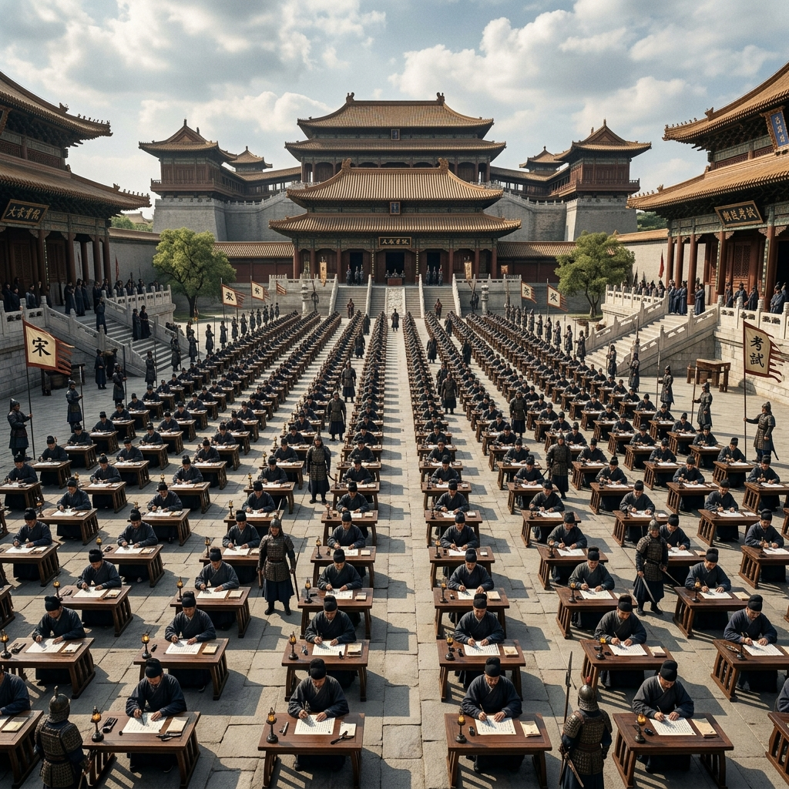

# Episode 4: ការប្រឡងនៅរាជធានី (The Capital Examination)

**Author:** ichamrong  
**Date:** 2026-06-11  
**Tags:** #song-ci #episode-4 #imperial-exams #scholar #song-dynasty  
**Category:** Biographies  
**Read Time:** ~8 min  

---

## 📌 មាតិកា (Table of Contents)
- [សេចក្តីផ្តើម៖ វិញ្ញាសានៃវាសនា (Introduction: The Test of Destiny)](#0)
- [១. ប្លង់ទី ១៖ សមុទ្រប៊ិច (Scene 1: The Sea of Scholars)](#1)
- [២. ប្លង់ទី ២៖ សំណួរអធិរាជ (Scene 2: The Emperor's Question)](#2)
- [៣. យន្តការចិត្តសាស្ត្រ (Psychological Mechanism)](#3)
- [សេចក្តីសន្និដ្ឋាន (Conclusion)](#4)
- [🔗 ឯកសារទាក់ទង (Related Topics)](#5)

---

## សេចក្តីផ្តើម៖ វិញ្ញាសានៃវាសនា (Introduction: The Test of Destiny)

បន្ទាប់ពីចំណាយពេលជាច្រើនឆ្នាំក្នុងការសិក្សា Song Ci ធ្វើដំណើរមកកាន់រាជធានី Lin'an ដើម្បីចូលរួមការប្រឡងកម្រិតខ្ពស់បំផុត ដែលជាការសាកល្បងដ៏តឹងរ៉ឹងបំផុតនៅក្នុងចក្រភព។

After years of intense studying, Song Ci travels to the capital, Lin'an, to partake in the highest level of the Imperial Examinations—the most rigorous test in the empire.

---

## ១. ប្លង់ទី ១៖ សមុទ្រប៊ិច (Scene 1: The Sea of Scholars)

**ទីតាំង៖** ទីលានប្រឡងរាជធានី (ព្រឹកព្រលឹម)  
**Location:** The Capital Examination Courtyard (Dawn)

**សកម្មភាព៖** បេក្ខជនរាប់ពាន់នាក់អង្គុយនៅតុរៀងៗខ្លួនក្នុងទីលានដ៏ធំល្វឹងល្វើយ ក្រោមការយាមកាមយ៉ាងតឹងរ៉ឹង។ Song Ci អង្គុយសរសេរដោយទឹកមុខស្ងប់ស្ងាត់ និងមានទំនុកចិត្ត។  
**Action:** Thousands of candidates sit at their individual desks in a massive, sprawling courtyard under strict guard. Song Ci sits writing with a calm, confident expression.

*   **មន្ត្រីយាម (Exam Guard)៖** "ហាមងាកឆ្វេងស្តាំ! អ្នកណាដែលលួចមើល នឹងត្រូវដកសិទ្ធិអស់មួយជីវិត!"  
    *   *"No looking left or right! Anyone caught cheating will be disqualified for life!"*

---

## ២. ប្លង់ទី ២៖ សំណួរអធិរាជ (Scene 2: The Emperor's Question)

**ទីតាំង៖** ក្នុងទីលានប្រឡង (រសៀល)  
**Location:** Within the Examination Courtyard (Afternoon)

**សកម្មភាព៖** វិញ្ញាសាចុងក្រោយសួរអំពី "តើអ្វីទៅជាគ្រឹះនៃភាពរុងរឿងរបស់ចក្រភព?" ។ ខណៈអ្នកដទៃសរសេរលើកសរសើរអំណាចអធិរាជ Song Ci សរសេរអំពី "យុត្តិធម៌ចំពោះប្រជារាស្ត្រសាមញ្ញ"។  
**Action:** The final question asks: "What is the foundation of the empire's prosperity?" While others write flattering essays praising imperial power, Song Ci writes about "justice for the common people."

*   **Song Ci (អានអត្ថបទរបស់ខ្លួនក្នុងចិត្ត)៖** "នគរមួយរឹងមាំ មិនមែនដោយសារជញ្ជាំងវាំងខ្ពស់ទេ តែដោយសារប្រជារាស្ត្រជឿជាក់លើច្បាប់។ បើច្បាប់កោងវៀច ទោះជញ្ជាំងខ្ពស់ប៉ុណ្ណាក៏គង់តែបាក់ស្រុត។"  
    *   *"A kingdom is strong not because of high palace walls, but because the people believe in the law. If the law is crooked, even the highest walls will crumble."*

---

## ៣. យន្តការចិត្តសាស្ត្រ (Psychological Mechanism)

> [!IMPORTANT]
> **⚖️ យន្តការចិត្តសាស្ត្រ - ភាពក្លាហានក្នុងការនិយាយការពិត (Courage to Speak Truth):**
> * Song Ci ហ៊ានប្រថុយការប្រឡងធ្លាក់ ដោយសរសេរការពិតដែលខ្លួនយល់ឃើញ ជំនួសឱ្យការសរសេរបញ្ជោរអ្នកមានអំណាច។ នេះបង្ហាញពីចរិតពិតរបស់គាត់ដែលមិនអាចត្រូវគេទិញបាន។

---

## សេចក្តីសន្និដ្ឋាន (Conclusion)

> **«ចំណេះដឹងដែលគ្មានសីលធម៌ គ្រាន់តែជាអាវុធរបស់ជនពុករលួយ។»**
> 
> **“Knowledge without morality is merely a weapon for the corrupt.”**

ភាគនេះបញ្ចប់ដោយអ្នកដាក់ពិន្ទុភ្ញាក់ផ្អើលនឹងអត្ថបទដ៏មុតស្រួចរបស់ Song Ci។
The episode ends with the examiners stunned by the sharp, unyielding nature of Song Ci's essay.

---

## 🔗 ឯកសារទាក់ទង (Related Topics)
*   [Episode 3: សៀវភៅនិងដាវ (The Pen and the Sword)](ep-03-the-pen-and-the-sword.md) — ភាគមុន។
*   [Episode 5: សញ្ញាបត្រជិនស៊ី (The Jinshi Degree)](ep-05-the-jinshi-degree.md) — ភាគបន្ត។
