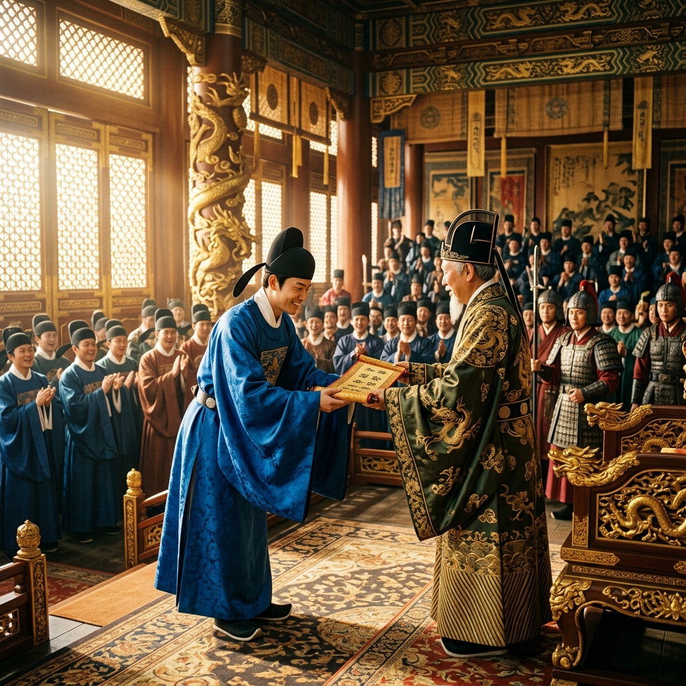

# Episode 5: សញ្ញាបត្រជិនស៊ី (The Jinshi Degree)

**Author:** ichamrong  
**Date:** 2026-06-11  
**Tags:** #song-ci #episode-5 #jinshi #success #official-robes  
**Category:** Biographies  
**Read Time:** ~8 min  

---

## 📌 មាតិកា (Table of Contents)
- [សេចក្តីផ្តើម៖ កិត្តិយសនិងទំនួលខុសត្រូវ (Introduction: Honor and Responsibility)](#0)
- [១. ប្លង់ទី ១៖ ការប្រកាសលទ្ធផល (Scene 1: The Announcement)](#1)
- [២. ប្លង់ទី ២៖ ឯកសណ្ឋានពណ៌ខៀវ (Scene 2: The Blue Robes)](#2)
- [៣. យន្តការចិត្តសាស្ត្រ (Psychological Mechanism)](#3)
- [សេចក្តីសន្និដ្ឋាន (Conclusion)](#4)
- [🔗 ឯកសារទាក់ទង (Related Topics)](#5)

---

## សេចក្តីផ្តើម៖ កិត្តិយសនិងទំនួលខុសត្រូវ (Introduction: Honor and Responsibility)

ក្រោយការរង់ចាំយ៉ាងអន្ទះសា លទ្ធផលនៃការប្រឡងថ្នាក់ជាតិត្រូវបានប្រកាស។ ការសរសេរអត្ថបទដ៏អស្ចារ្យរបស់ Song Ci ធ្វើឱ្យគាត់ទទួលបានជ័យលាភី។

After anxious waiting, the results of the national examinations are announced. Song Ci's exceptional essay earns him top honors.

---

## ១. ប្លង់ទី ១៖ ការប្រកាសលទ្ធផល (Scene 1: The Announcement)

**ទីតាំង៖** ព្រះបរមរាជវាំង, ទីក្រុង Lin'an (ពេលព្រឹក)  
**Location:** The Imperial Palace, Lin'an (Morning)

**សកម្មភាព៖** Song Ci ឈរក្នុងចំណោមអ្នកប្រាជ្ញកំពូលៗ ខណៈមន្ត្រីជាន់ខ្ពស់ប្រកាសឈ្មោះអ្នកប្រឡងជាប់សញ្ញាបត្រ Jinshi (ជិនស៊ី)។  
**Action:** Song Ci stands among the top scholars as a high-ranking official announces the names of those who have passed the prestigious Jinshi degree.

*   **មន្ត្រីជាន់ខ្ពស់ (High Official)៖** "Song Ci មកពីខេត្ត Fujian! ទទួលបានសញ្ញាបត្រ Jinshi!"  
    *   *"Song Ci of Fujian Province! Granted the degree of Jinshi!"*

---

## ២. ប្លង់ទី ២៖ ឯកសណ្ឋានពណ៌ខៀវ (Scene 2: The Blue Robes)

**ទីតាំង៖** បន្ទប់ផ្លាស់សម្លៀកបំពាក់មន្ត្រី (ថ្ងៃត្រង់)  
**Location:** The Official's Dressing Room (Noon)

**សកម្មភាព៖** Song Ci ស្លៀកឯកសណ្ឋានមន្ត្រីរាជការពណ៌ខៀវជាលើកដំបូង។ គាត់សម្លឹងមើលកញ្ចក់ស្ពាន់ ដោយនឹកឃើញដល់ពាក្យសន្យាដែលបានធ្វើចំពោះឪពុករបស់គាត់។  
**Action:** Song Ci dons the blue robes of an imperial official for the first time. He looks into the bronze mirror, recalling the promise he made to his father.

*   **Song Ci (សម្លឹងមើលកញ្ចក់)៖** "ឯកសណ្ឋាននេះធ្ងន់ណាស់... ព្រោះវាផ្ទុកនូវជីវិតរាស្ត្ររាប់ម៉ឺននាក់។"  
    *   *"These robes are heavy... for they carry the lives of tens of thousands of commoners."*

---

## ៣. យន្តការចិត្តសាស្ត្រ (Psychological Mechanism)

> [!NOTE]
> **⚖️ យន្តការចិត្តសាស្ត្រ - តុល្យភាពនៃអំណាច (Balance of Power):**
> * ខណៈមនុស្សភាគច្រើនចាត់ទុកសញ្ញាបត្រនេះថាជាផ្លូវទៅរកទ្រព្យសម្បត្តិ Song Ci ចាត់ទុកវាថាជាឧបករណ៍ដើម្បីអនុវត្តយុត្តិធម៌។ ភាពខុសគ្នានៃផ្នត់គំនិតនេះ បង្កើតឱ្យមានជម្លោះជាមួយមន្ត្រីចាស់ៗនាពេលអនាគត។

---

## សេចក្តីសន្និដ្ឋាន (Conclusion)

> **«អំណាចមិនអាចប្តូរចរិតមនុស្សបានទេ វាគ្រាន់តែលាតត្រដាងចរិតពិតប៉ុណ្ណោះ។»**
> 
> **“Power does not change a man's character; it merely reveals it.”**

---

## 🔗 ឯកសារទាក់ទង (Related Topics)
*   [Episode 4: ការប្រឡងនៅរាជធានី (The Capital Examination)](ep-04-the-capital-examination.md) — ភាគមុន។
*   [Episode 6: ការចុះកាន់តំណែងដំបូង (The First Post)](ep-06-the-first-post.md) — ភាគបន្ត។
