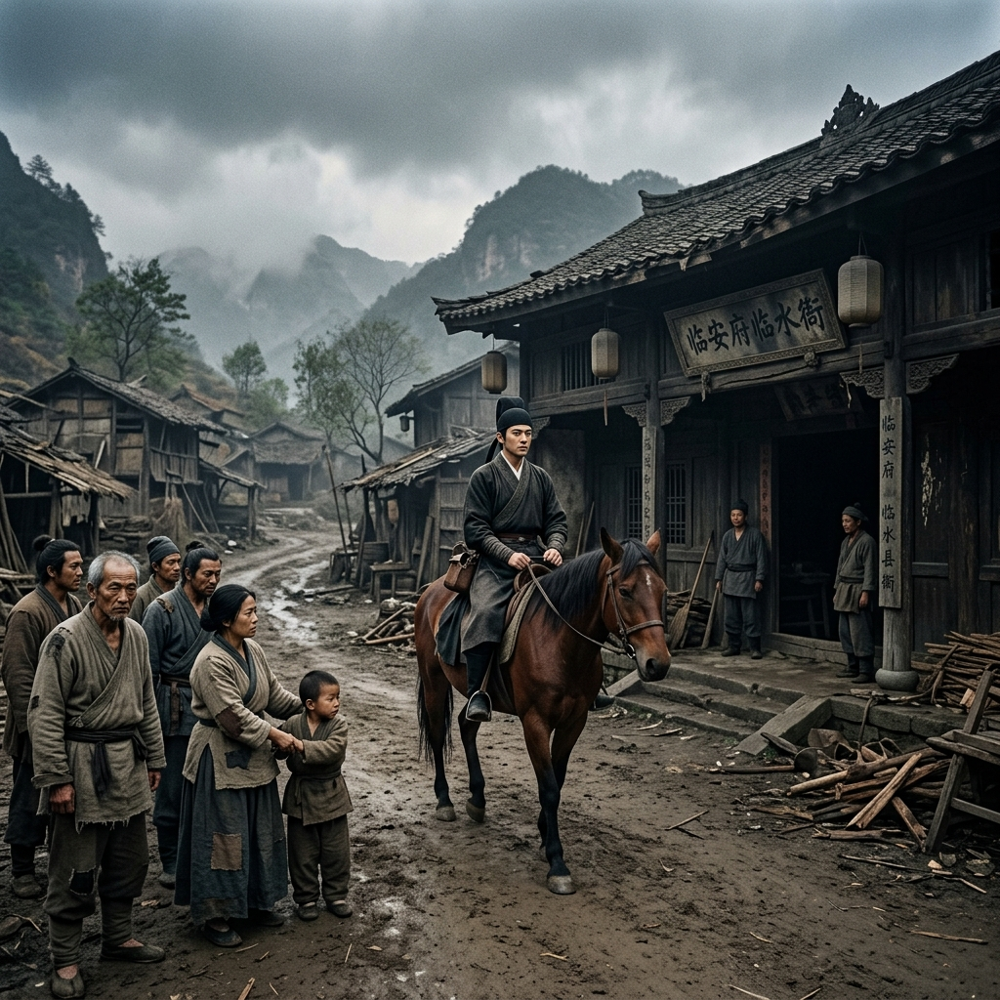

# Episode 6: ការចុះកាន់តំណែងដំបូង (The First Post)

**Author:** ichamrong  
**Date:** 2026-06-11  
**Tags:** #song-ci #episode-6 #magistrate #rural-village #corruption  
**Category:** Biographies  
**Read Time:** ~8 min  

---

## 📌 មាតិកា (Table of Contents)
- [សេចក្តីផ្តើម៖ ការស្វាគមន៍ដ៏ត្រជាក់ (Introduction: A Cold Welcome)](#0)
- [១. ប្លង់ទី ១៖ ទីក្រុងដាច់ស្រយាល (Scene 1: The Remote County)](#1)
- [២. ប្លង់ទី ២៖ បណ្ណសារដ្ឋានពោរពេញដោយធូលី (Scene 2: The Dusty Archives)](#2)
- [៣. យន្តការចិត្តសាស្ត្រ (Psychological Mechanism)](#3)
- [សេចក្តីសន្និដ្ឋាន (Conclusion)](#4)
- [🔗 ឯកសារទាក់ទង (Related Topics)](#5)

---

## សេចក្តីផ្តើម៖ ការស្វាគមន៍ដ៏ត្រជាក់ (Introduction: A Cold Welcome)

ក្នុងនាមជាមន្ត្រីថ្មីថ្មោង Song Ci មិនត្រូវបានបញ្ជូនទៅកាន់ខេត្តមានបានទេ ប៉ុន្តែត្រូវគេបញ្ជូនទៅធ្វើជាចៅក្រមនៅស្រុក Xinfeng ដែលជាស្រុកដាច់ស្រយាល និងពោរពេញដោយរឿងក្តីដែលគ្មានដំណោះស្រាយ។

As a novice official, Song Ci is not assigned to a prosperous province, but rather dispatched to serve as magistrate in Xinfeng County, a remote area plagued by unsolved cases.

---

## ១. ប្លង់ទី ១៖ ទីក្រុងដាច់ស្រយាល (Scene 1: The Remote County)

**ទីតាំង៖** ផ្លូវចូលស្រុក Xinfeng (ពេលរសៀល មេឃស្រអាប់)  
**Location:** The road into Xinfeng County (Gloomy afternoon)

**សកម្មភាព៖** Song Ci ជិះសេះចូលមកដល់ស្រុកដែលមានសភាពទ្រុឌទ្រោម។ អ្នកភូមិសម្លឹងមកគាត់ដោយក្រសែភ្នែកសង្ស័យ ព្រោះមន្ត្រីមុនៗសុទ្ធតែពុករលួយ និងមិនខ្វល់ពីរាស្ត្រ។  
**Action:** Song Ci arrives on horseback at the rundown county. The villagers eye him with deep suspicion, as previous officials were universally corrupt and apathetic.

*   **អ្នកភូមិទី ១ (Villager 1)៖** (ខ្សឹបគ្នា) "មើលចុះ មន្ត្រីថ្មីម្នាក់ទៀតហើយ។ ប្រហែលមកជញ្ជក់ឈាមយើងដូចមុនៗទៀតហើយ។"  
    *   *(Whispering)* *"Look, another new official. Probably here to suck our blood like the rest of them."*
*   **អ្នកភូមិទី ២ (Villager 2)៖** "ក្មេងណាស់... មិនអាចទប់ទល់នឹងពួកអ្នកមានអំណាចក្នុងភូមិនេះបានទេ។"  
    *   *"Too young... he won't survive against the powerful families here."*

---

## ២. ប្លង់ទី ២៖ បណ្ណសារដ្ឋានពោរពេញដោយធូលី (Scene 2: The Dusty Archives)

**ទីតាំង៖** បន្ទប់ផ្ទុកសំណុំរឿងក្នុងសាលាស្រុក (ពេលយប់)  
**Location:** The County Archives Room (Night)

**សកម្មភាព៖** ជំនួសឱ្យការជប់លៀងស្វាគមន៍តំណែងថ្មី Song Ci បែរជាចូលទៅក្នុងបន្ទប់ផ្ទុកសំណុំរឿងដែលពោរពេញដោយធូលី និងពីងពាង ដើម្បីអានរឿងក្តីចាស់ៗដែលមិនទាន់ដោះស្រាយ។  
**Action:** Instead of attending his own welcoming banquet, Song Ci heads straight into the dusty, cobweb-filled archives room to review unsolved cold cases.

*   **មន្ត្រីរង (Deputy Official)៖** "លោកម្ចាស់ ពិធីជប់លៀងរៀបចំរួចរាល់ហើយ លោកមិនទៅចូលរួមទេឬ?"  
    *   *"My Lord, the banquet is ready. Will you not attend?"*
*   **Song Ci៖** "ទុកអាហារនោះចែកឱ្យអ្នកក្រីក្រទៅ។ ខ្ញុំមានរឿងក្តីស្លាប់រស់រាប់រយដែលកំពុងរង់ចាំយុត្តិធម៌នៅក្នុងបន្ទប់នេះ។"  
    *   *"Distribute the food to the poor. I have hundreds of life-and-death cases waiting for justice in this very room."*

---

## ៣. យន្តការចិត្តសាស្ត្រ (Psychological Mechanism)

> [!IMPORTANT]
> **🤫 យន្តការចិត្តសាស្ត្រ - បដិសេធភាពសុខស្រួល (Rejecting Comfort):**
> * ភាពខុសប្លែករបស់ Song Ci ពីមន្ត្រីទូទៅគឺការបដិសេធនូវការសូកប៉ាន់តាមរយៈពិធីជប់លៀង និងអំណោយ។ គាត់ផ្តោតលើ "ឯកសារ" ជាជាង "ទំនាក់ទំនង" ដែលធ្វើឱ្យគាត់ក្លាយជាសត្រូវនឹងអ្នកមានអំណាចក្នុងតំបន់តាំងពីថ្ងៃដំបូង។

---

## សេចក្តីសន្និដ្ឋាន (Conclusion)

> **«នៅទីណាដែលច្បាប់ត្រូវបានបំភ្លេចចោល នៅទីនោះអ្នកមានអំណាចក្លាយជាព្រះ។»**
> 
> **“Where the law is forgotten, the powerful become gods.”**

---

## 🔗 ឯកសារទាក់ទង (Related Topics)
*   [Episode 5: សញ្ញាបត្រជិនស៊ី (The Jinshi Degree)](ep-05-the-jinshi-degree.md) — ភាគមុន។
*   [Episode 7: សាកសពអណ្តែតទឹក (The Floating Corpse)](ep-07-the-floating-corpse.md) — ភាគបន្ត។
