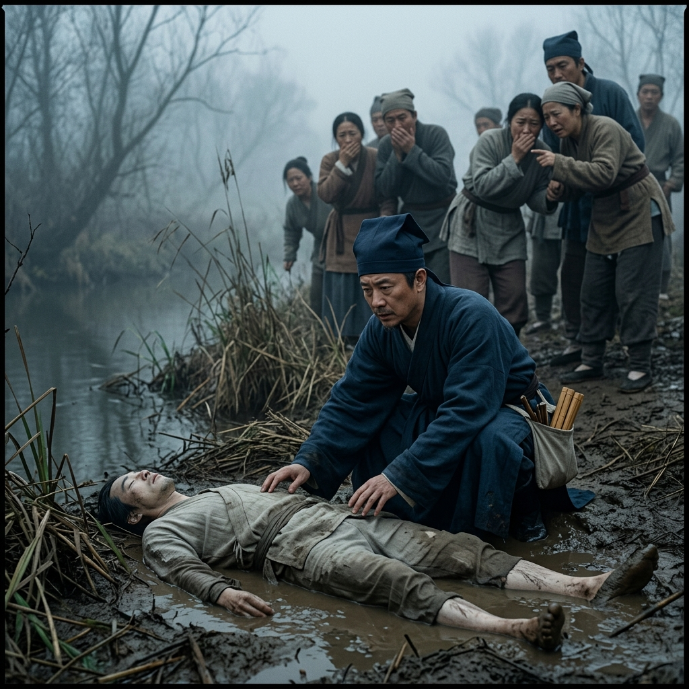

# Episode 7: សាកសពអណ្តែតទឹក (The Floating Corpse)

**Author:** ichamrong  
**Date:** 2026-06-11  
**Tags:** #song-ci #episode-7 #forensics #investigation #autopsy  
**Category:** Biographies  
**Read Time:** ~8 min  

---

## 📌 មាតិកា (Table of Contents)
- [សេចក្តីផ្តើម៖ សាកសពដែលគ្មានអ្នកខ្វល់ (Introduction: The Unwanted Corpse)](#0)
- [១. ប្លង់ទី ១៖ ច្រាំងទន្លេភក់ (Scene 1: The Muddy Riverbank)](#1)
- [២. ប្លង់ទី ២៖ ការពិនិត្យផ្ទាល់ (Scene 2: The Direct Examination)](#2)
- [៣. យន្តការវិទ្យាសាស្ត្រ (Scientific Mechanism)](#3)
- [សេចក្តីសន្និដ្ឋាន (Conclusion)](#4)
- [🔗 ឯកសារទាក់ទង (Related Topics)](#5)

---

## សេចក្តីផ្តើម៖ សាកសពដែលគ្មានអ្នកខ្វល់ (Introduction: The Unwanted Corpse)

រឿងក្តីដំបូងដែល Song Ci ត្រូវប្រឈមមុខ គឺសាកសពបុរសម្នាក់អណ្តែតទឹកមកទើរនៅច្រាំងទន្លេ។ មន្ត្រីថ្នាក់ក្រោមសន្និដ្ឋានយ៉ាងងាយស្រួលថាជា "ការលង់ទឹកស្លាប់ដោយចៃដន្យ" ដើម្បីបិទសំណុំរឿងឱ្យលឿន។

Song Ci's first case involves a man's body washed ashore on the riverbank. His subordinates quickly conclude it as an "accidental drowning" to close the case quickly.

---

## ១. ប្លង់ទី ១៖ ច្រាំងទន្លេភក់ (Scene 1: The Muddy Riverbank)

**ទីតាំង៖** ច្រាំងទន្លេនៅស្រុក Xinfeng (ពេលព្រឹកព្រលឹម និងមានអ័ព្ទ)  
**Location:** Riverbank in Xinfeng County (Foggy early morning)

**សកម្មភាព៖** សាកសពហើមប៉ោងមួយកំពុងដេកលើភក់។ Song Ci ក្នុងឯកសណ្ឋានមន្ត្រីរបស់ខ្លួន ចុះទៅលុតជង្គង់ក្នុងភក់ដើម្បីពិនិត្យសាកសពផ្ទាល់ ខណៈអ្នកភូមិឈរមើលដោយភាពខ្ពើមរអើមពីរចម្ងាយ។  
**Action:** A bloated corpse lies in the mud. Song Ci, in his official robes, kneels down in the mud to directly examine the body, while villagers watch in disgust from a distance.

*   **ជំនួយការ (Deputy)៖** "លោកម្ចាស់! កុំប៉ះវា! សាកសពមានផ្ទុកខ្យល់ពុល វាជាប្រផ្នូលអាក្រក់ណាស់!"  
    *   *"My Lord! Do not touch it! Corpses carry poisonous air, it is terrible luck!"*
*   **Song Ci៖** "សាកសពមិនមែនជាប្រផ្នូលអាក្រក់ទេ វាជាសាក្សីចុងក្រោយ។ បើយើងមិនស្តាប់គាត់ តើអ្នកណានឹងផ្តល់យុត្តិធម៌ឱ្យគាត់?"  
    *   *"A corpse is not an evil omen; it is the final witness. If we do not listen to him, who will grant him justice?"*

---

## ២. ប្លង់ទី ២៖ ការពិនិត្យផ្ទាល់ (Scene 2: The Direct Examination)

**ទីតាំង៖** កន្លែងដាក់សាកសពបណ្តោះអាសន្ន (ពេលថ្ងៃ)  
**Location:** Temporary Morgue (Day)

**សកម្មភាព៖** Song Ci ប្រើប្រាស់វិធីសាស្ត្រដែលគាត់ធ្លាប់រៀន។ គាត់បើកមាត់សាកសព ហើយពិនិត្យមើលផ្លូវដង្ហើម និងសួត។  
**Action:** Song Ci employs methods he has learned. He opens the corpse's mouth and inspects the airways and lungs.

*   **Song Ci៖** "ប្រសិនបើគាត់លង់ទឹកស្លាប់ គាត់ត្រូវតែលេបទឹកយ៉ាងច្រើន។ ក្នុងពោះ និងសួតរបស់គាត់គួរតែមានទឹក កខ្វក់ និងខ្សាច់។ ប៉ុន្តែផ្លូវដង្ហើមនេះស្អាត... មាត់របស់គាត់បិទជិត។ គាត់ស្លាប់មុនពេលធ្លាក់ចូលទឹក!"  
    *   *"If he drowned, he must have swallowed a large amount of water. His stomach and lungs should contain water, mud, and sand. But his airways are clean... his mouth is firmly shut. He died before he fell into the water!"*

---

## ៣. យន្តការវិទ្យាសាស្ត្រ (Scientific Mechanism)

> [!IMPORTANT]
> **🔬 យន្តការកោសល្យវិច័យ - ការស្លាប់មុន ឬក្រោយធ្លាក់ទឹក (Pre-mortem vs Post-mortem Immersion):**
> * Song Ci បានកំណត់គោលការណ៍យ៉ាងច្បាស់ថា បើមនុស្សនៅរស់ពេលធ្លាក់ទឹក ពួកគេនឹងតស៊ូ ដែលធ្វើឱ្យទឹក ខ្សាច់ និងសារាយចូលទៅក្នុងសួតនិងក្រពះ។ បើមនុស្សស្លាប់មុន ទើបត្រូវគេបោះចូលទឹក ផ្លូវដង្ហើមនឹងគ្មានផ្ទុកសារធាតុទាំងនេះទេ។ នេះជាការរកឃើញដ៏សំខាន់ដើម្បីបដិសេធ "ការលង់ទឹកក្លែងក្លាយ"។

---

## សេចក្តីសន្និដ្ឋាន (Conclusion)

> **«កុំជឿលើអ្វីដែលភ្នែកមើលឃើញមួយភ្លែត ត្រូវជឿលើអ្វីដែលសាកសពប្រាប់អ្នកជាសម្ងាត់។»**
> 
> **“Do not believe what the eye sees at a glance; believe what the corpse secretly tells you.”**

ភាគនេះបញ្ចប់ដោយ Song Ci ប្រកាសផ្លូវការថា នេះមិនមែនជាការលង់ទឹកទេ តែជាអំពើឃាតកម្ម។ ការស៊ើបអង្កេតពិតប្រាកដទើបតែចាប់ផ្តើម។
The episode ends with Song Ci officially declaring that it was not drowning, but murder. The true investigation has just begun.

---

## 🔗 ឯកសារទាក់ទង (Related Topics)
*   [Episode 6: ការចុះកាន់តំណែងដំបូង (The First Post)](ep-06-the-first-post.md) — ភាគមុន។
*   [Episode 8: ប្រឆាំងនឹងមេភូមិ (Defying the Village Elder)](ep-08-defying-the-village-elder.md) — ភាគបន្ត។
