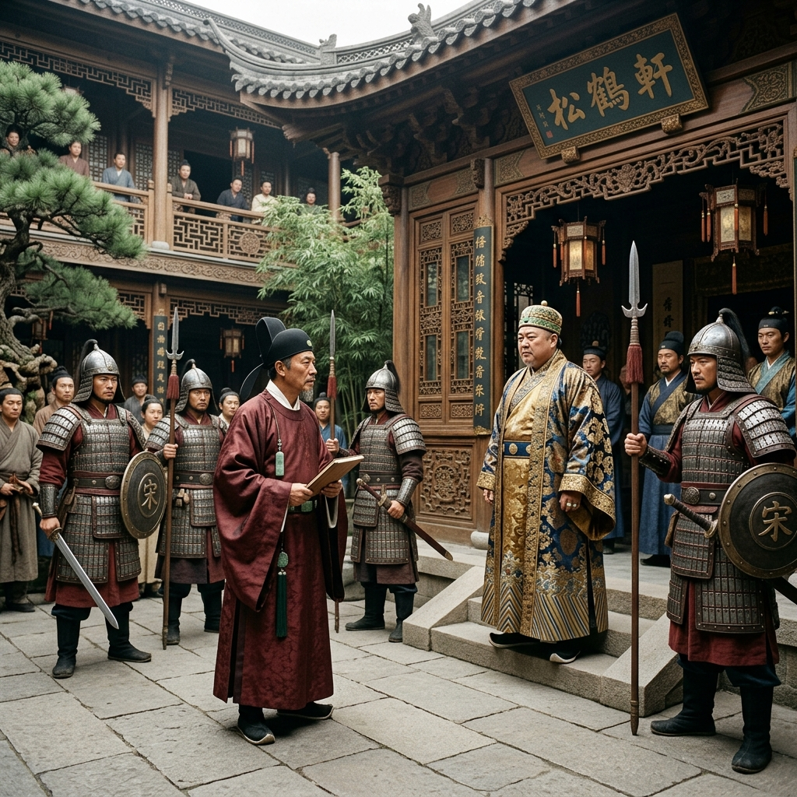

# Episode 8: ប្រឆាំងនឹងមេភូមិ (Defying the Village Elder)

**Author:** ichamrong  
**Date:** 2026-06-11  
**Tags:** #song-ci #episode-8 #corruption #power-struggle #justice  
**Category:** Biographies  
**Read Time:** ~8 min  

---

## 📌 មាតិកា (Table of Contents)
- [សេចក្តីផ្តើម៖ ដានជើងឆ្ពោះទៅរកអ្នកមានអំណាច (Introduction: Footsteps to the Powerful)](#0)
- [១. ប្លង់ទី ១៖ ភូមិគ្រឹះត្រកូលសេដ្ឋី (Scene 1: The Wealthy Estate)](#1)
- [២. ប្លង់ទី ២៖ ការប្រឈមមុខដាក់គ្នា (Scene 2: The Confrontation)](#2)
- [៣. យន្តការសង្គមសាស្ត្រ (Sociological Mechanism)](#3)
- [សេចក្តីសន្និដ្ឋាន (Conclusion)](#4)
- [🔗 ឯកសារទាក់ទង (Related Topics)](#5)

---

## សេចក្តីផ្តើម៖ ដានជើងឆ្ពោះទៅរកអ្នកមានអំណាច (Introduction: Footsteps to the Powerful)

ភស្តុតាងដែល Song Ci រកឃើញពីសាកសពអណ្តែតទឹក បានចង្អុលបង្ហាញទៅកាន់គ្រួសារសេដ្ឋី និងជាមេភូមិដ៏មានអំណាចម្នាក់នៅក្នុងតំបន់។ អ្នកផ្សេងសុទ្ធតែបោះបង់ តែ Song Ci ហ៊ានប្រថុយ។

The evidence Song Ci found on the floating corpse points toward a wealthy family and a powerful local village elder. Everyone else gives up, but Song Ci takes the risk.

---

## ១. ប្លង់ទី ១៖ ភូមិគ្រឹះត្រកូលសេដ្ឋី (Scene 1: The Wealthy Estate)

**ទីតាំង៖** ទីធ្លាភូមិគ្រឹះដ៏ធំទូលាយរបស់មេភូមិ (ពេលរសៀល)  
**Location:** The opulent courtyard of the Village Elder's estate (Afternoon)

**សកម្មភាព៖** Song Ci ដើរចូលទៅក្នុងទីធ្លាដែលពោរពេញដោយទាហានស៊ីឈ្នួល និងអ្នកបម្រើ។ មេភូមិស្លៀកសម្លៀកបំពាក់សូត្រឈរយ៉ាងក្រអឺតក្រទម។  
**Action:** Song Ci walks into the courtyard filled with mercenaries and servants. The Village Elder, dressed in fine silk, stands arrogantly.

*   **មេភូមិ (Village Elder)៖** "លោកចៅក្រមវ័យក្មេង ភ្នែកលោកច្បាស់ណាស់ តើលោកហ៊ានឆែកឆេរផ្ទះខ្ញុំដោយរបៀបណា? សូម្បីតែចៅហ្វាយខេត្តក៏ត្រូវផឹកតែជាមួយខ្ញុំដែរ។"  
    *   *"Young Magistrate, are you blind? How dare you search my home? Even the Provincial Governor drinks tea with me."*
*   **Song Ci៖** "តែមិនអាចលាងជម្រះឈាមបានទេ។ ខ្ញុំមិនខ្វល់ថាអ្នកផឹកតែជាមួយអ្នកណាទេ ប៉ុន្តែអ្នកដែលសម្លាប់មនុស្សត្រូវតែបង់សងជីវិត។"  
    *   *"Tea cannot wash away blood. I care not whom you drink tea with, but a murderer must pay with their life."*

---

## ២. ប្លង់ទី ២៖ ការប្រឈមមុខដាក់គ្នា (Scene 2: The Confrontation)

**ទីតាំង៖** កណ្តាលទីធ្លា (បន្តពីប្លង់មុន)  
**Location:** Center of the courtyard (Continuing from the previous scene)

**សកម្មភាព៖** កងអង្គរក្សរបស់មេភូមិដកអាវុធគម្រាម Song Ci។ មន្ត្រីរបស់ Song Ci ភ័យញ័រខ្លួន ប៉ុន្តែ Song Ci នៅតែឈរយ៉ាងរឹងមាំ និងមានទំនុកចិត្ត ដោយមានច្បាប់ក្នុងដៃ។  
**Action:** The Elder's guards draw their weapons, threatening Song Ci. Song Ci's own men tremble in fear, but Song Ci stands firm and confident, armed with the law.

*   **Song Ci៖** (ស្រែកដោយសំឡេងមានអំណាច) "អ្នកណាហ៊ានរារាំងការស៊ើបអង្កេតរបស់រាជការ គឺជាការក្បត់ជាតិ! ខ្ញុំមានភស្តុតាងថាឃាតករកំពុងលាក់ខ្លួននៅទីនេះ។"  
    *   *(Shouting with authority)* *"Whoever dares to obstruct an imperial investigation commits treason! I have evidence the killer is hiding here."*

---

## ៣. យន្តការសង្គមសាស្ត្រ (Sociological Mechanism)

> [!WARNING]
> **🛡️ យន្តការសង្គមសាស្ត្រ - បំបែកប្រព័ន្ធការពារអ្នកមានអំណាច (Breaking Elite Immunity):**
> * នៅក្នុងសង្គមចាស់ អ្នកមានអំណាចក្នុងស្រុកប្រើប្រាស់បណ្តាញទំនាក់ទំនង និងការគម្រាមកំហែងដើម្បីគេចពីច្បាប់។ ការឈរជើងរបស់ Song Ci គឺជាសកម្មភាពបដិវត្តន៍មួយ ដែលផ្តោតលើគោលការណ៍ "ច្បាប់តែមួយសម្រាប់អ្នកក្រ និងអ្នកមាន"។

---

## សេចក្តីសន្និដ្ឋាន (Conclusion)

> **«អំណាចមិនមែនស្ថិតនៅលើចំនួនទាហានដែលអ្នកមានទេ តែស្ថិតនៅលើសេចក្តីក្លាហានក្នុងការកាន់កាប់ការពិត។»**
> 
> **“Power does not reside in the number of soldiers you command, but in the courage to wield the truth.”**

ភាគនេះបញ្ចប់ដោយមេភូមិបង្ខំចិត្តប្រគល់ជនសង្ស័យ ដែលជាកូនប្រុសរបស់ខ្លួន មកឱ្យ Song Ci សួរចម្លើយ ដោយសារការគម្រាមចោទប្រកាន់ពីបទក្បត់ជាតិ។
The episode ends with the Village Elder forced to hand over the suspect—his own son—to Song Ci for interrogation, fearing the charge of treason.

---

## 🔗 ឯកសារទាក់ទង (Related Topics)
*   [Episode 7: សាកសពអណ្តែតទឹក (The Floating Corpse)](ep-07-the-floating-corpse.md) — ភាគមុន។
*   [Episode 9: ភក់នៅលើស្បែកជើង (Mud on the Shoes)](ep-09-mud-on-the-shoes.md) — ភាគបន្ត។
