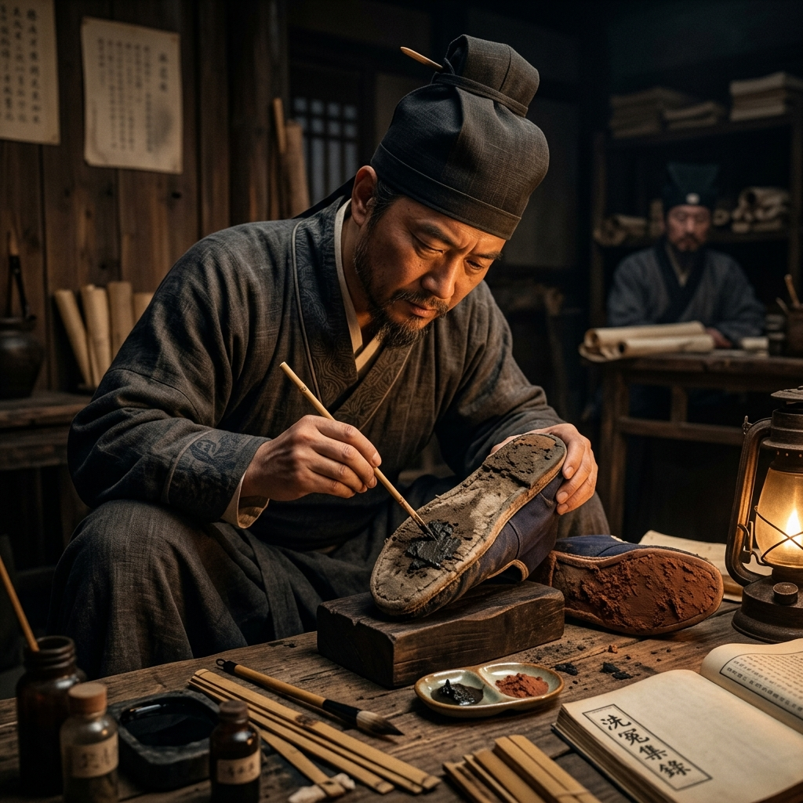

# Episode 9: ភក់នៅលើស្បែកជើង (Mud on the Shoes)

**Author:** ichamrong  
**Date:** 2026-06-11  
**Tags:** #song-ci #episode-9 #forensics #evidence #soil-analysis  
**Category:** Biographies  
**Read Time:** ~8 min  

---

## 📌 មាតិកា (Table of Contents)
- [សេចក្តីផ្តើម៖ ពាក្យដោះសាដ៏ល្អឥតខ្ចោះ (Introduction: The Perfect Alibi)](#0)
- [១. ប្លង់ទី ១៖ ការសួរចម្លើយ (Scene 1: The Interrogation)](#1)
- [២. ប្លង់ទី ២៖ ការវិភាគដីភក់ (Scene 2: The Mud Analysis)](#2)
- [៣. យន្តការវិទ្យាសាស្ត្រ (Scientific Mechanism)](#3)
- [សេចក្តីសន្និដ្ឋាន (Conclusion)](#4)
- [🔗 ឯកសារទាក់ទង (Related Topics)](#5)

---

## សេចក្តីផ្តើម៖ ពាក្យដោះសាដ៏ល្អឥតខ្ចោះ (Introduction: The Perfect Alibi)

ជនសង្ស័យដែលជាកូនប្រុសរបស់មេភូមិ មានសាក្សីបញ្ជាក់ពាក្យដោះសា (Alibi) យ៉ាងរឹងមាំថា គាត់មិនបានចេញពីភូមិគ្រឹះទេនៅយប់នោះ។ ប៉ុន្តែ Song Ci បានរកឃើញកំហុសបន្តិចបន្តួចដែលអ្នកផ្សេងមើលរំលង។

The suspect, the son of the village elder, has a rock-solid alibi backed by witnesses, claiming he never left the estate that night. However, Song Ci notices a tiny detail that everyone else overlooked.

---

## ១. ប្លង់ទី ១៖ ការសួរចម្លើយ (Scene 1: The Interrogation)

**ទីតាំង៖** សាលាក្តី (ពេលថ្ងៃ)  
**Location:** The Courtroom (Day)

**សកម្មភាព៖** ជនសង្ស័យអង្គុយយ៉ាងក្រអឺតក្រទម ដោយមានមេធាវីការពារ។ គាត់ប្រកែកថាគាត់កំពុងផឹកស្រានៅផ្ទះនៅពេលដែលជនរងគ្រោះត្រូវគេសម្លាប់នៅមាត់ទន្លេ។  
**Action:** The suspect sits arrogantly, flanked by a defender. He claims he was drinking at home during the time the victim was murdered by the river.

*   **ជនសង្ស័យ (Suspect)៖** "អ្នកបម្រើ១០នាក់អាចធ្វើសាក្សីបានថាខ្ញុំមិនបានចេញពីផ្ទះសូម្បីមួយជំហាន។ លោកមិនអាចចោទខ្ញុំដោយគ្មានភស្តុតាងទេ។"  
    *   *"Ten servants can testify I didn't step a foot outside. You cannot accuse me without evidence."*
*   **Song Ci៖** "អ្នកអាចទិញសាក្សីបាន ប៉ុន្តែអ្នកមិនអាចទិញធម្មជាតិបានទេ។ ដោះស្បែកជើងរបស់អ្នកមក!"  
    *   *"You can buy witnesses, but you cannot buy nature. Take off your shoes!"*

---

## ២. ប្លង់ទី ២៖ ការវិភាគដីភក់ (Scene 2: The Mud Analysis)

**ទីតាំង៖** តុពិនិត្យភស្តុតាងរបស់ Song Ci (បន្ទាប់ពីការសួរចម្លើយ)  
**Location:** Song Ci's Evidence Table (After the interrogation)

**សកម្មភាព៖** Song Ci យកស្បែកជើងក្រណាត់របស់ជនសង្ស័យមកពិនិត្យយ៉ាងល្អិតល្អន់។ គាត់ប្រើឈើតូចមួយកោសយកភក់ពីរប្រភេទផ្សេងគ្នាចេញពីបាតស្បែកជើង យកមកដាក់លើក្រដាស។  
**Action:** Song Ci meticulously examines the suspect's cloth shoes. Using a small stick, he scrapes two different types of mud from the soles and places them on paper.

*   **Song Ci៖** (និយាយទៅកាន់ជំនួយការ) "មើលទីនេះ។ ភក់នៅផ្ទះមេភូមិគឺជាដីលាយខ្សាច់ពណ៌លឿង (Yellow sandy soil)។ ប៉ុន្តែភក់ដែលជាប់ជ្រៅក្នុងបាតស្បែកជើងនេះ គឺជាភក់ស្អិតពណ៌ខ្មៅ (Black sticky mud) ដែលមានតែនៅតំបន់វាលស្មៅក្បែរមាត់ទន្លេប៉ុណ្ណោះ។ គាត់បានកុហក!"  
    *   *(Speaking to his deputy)* *"Look here. The mud at the elder's estate is yellow sandy soil. But the mud wedged deep in the soles of these shoes is black sticky mud—found only in the marshland by the river. He lied!"*

---

## ៣. យន្តការវិទ្យាសាស្ត្រ (Scientific Mechanism)

> [!IMPORTANT]
> **🔬 យន្តការកោសល្យវិច័យ - ការវិភាគដី (Soil Analysis/Trace Evidence):**
> * នេះគឺជាទម្រង់ដំបូងបំផុតមួយនៃការវិភាគភស្តុតាងតូចតាច (Trace Evidence) ។ Song Ci យល់ថា បរិស្ថានផ្សេងៗគ្នាមានសមាសធាតុដីផ្សេងៗគ្នា។ ការផ្ទេរដីពីកន្លែងកើតហេតុមកជាប់នឹងស្បែកជើងជនសង្ស័យ គឺជាភស្តុតាងដែលមិនអាចប្រកែកបាន ដើម្បីបំបែកពាក្យដោះសាក្លែងក្លាយ។ Locard's Exchange Principle (រាល់ការប៉ះទង្គិចសុទ្ធតែបន្សល់ទុកដាន) ត្រូវបានអនុវត្តដោយ Song Ci ជាច្រើនសតវត្សមុនពេលវាត្រូវបានបង្កើតឡើងនៅលោកខាងលិច។

---

## សេចក្តីសន្និដ្ឋាន (Conclusion)

> **«មនុស្សអាចនិយាយកុហក ប៉ុន្តែដីភក់ដែលពួកគេជាន់ មិនចេះកុហកទេ។»**
> 
> **“Men may tell lies, but the mud they tread upon does not.”**

ភាគនេះបញ្ចប់ដោយជនសង្ស័យស្លេកមុខ និងសារភាពកំហុសនៅពេលដែលភស្តុតាងដីភក់ត្រូវបានបង្ហាញ។
The episode ends with the suspect turning pale and confessing when the mud evidence is presented.

---

## 🔗 ឯកសារទាក់ទង (Related Topics)
*   [Episode 8: ប្រឆាំងនឹងមេភូមិ (Defying the Village Elder)](ep-08-defying-the-village-elder.md) — ភាគមុន។
*   [Episode 10: ការបើកបង្ហាញការពិត (Revealing the Truth)](ep-10-revealing-the-truth.md) — ភាគបន្ត។
