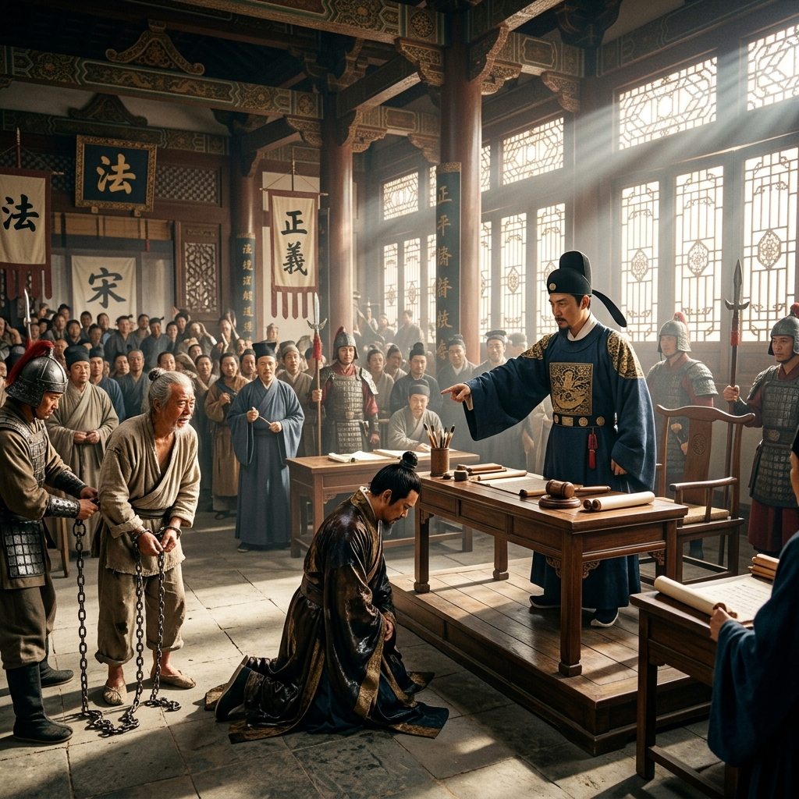

# Episode 10: ការបើកបង្ហាញការពិត (Revealing the Truth)

**Author:** ichamrong  
**Date:** 2026-06-11  
**Tags:** #song-ci #episode-10 #justice #courtroom #truth  
**Category:** Biographies  
**Read Time:** ~8 min  

---

## 📌 មាតិកា (Table of Contents)
- [សេចក្តីផ្តើម៖ ពន្លឺយុត្តិធម៌ (Introduction: The Light of Justice)](#0)
- [១. ប្លង់ទី ១៖ ការកាត់ក្តីជាសាធារណៈ (Scene 1: The Public Trial)](#1)
- [២. ប្លង់ទី ២៖ ការដោះលែង (Scene 2: The Release)](#2)
- [៣. យន្តការចិត្តសាស្ត្រ (Psychological Mechanism)](#3)
- [សេចក្តីសន្និដ្ឋាន (Conclusion)](#4)
- [🔗 ឯកសារទាក់ទង (Related Topics)](#5)

---

## សេចក្តីផ្តើម៖ ពន្លឺយុត្តិធម៌ (Introduction: The Light of Justice)

ដោយមានភស្តុតាងរឹងមាំពីការវិភាគដីភក់ Song Ci បានរៀបចំការសវនាការកាត់ក្តីជាសាធារណៈ ដើម្បីបង្ហាញការពិតដល់ប្រជាជនទាំងអស់ និងផ្តន្ទាទោសជនល្មើសពិតប្រាកដ។

Armed with solid evidence from the mud analysis, Song Ci organizes a public trial to reveal the truth to all the people and punish the true culprit.

---

## ១. ប្លង់ទី ១៖ ការកាត់ក្តីជាសាធារណៈ (Scene 1: The Public Trial)

**ទីតាំង៖** សាលាក្តីធំ (ពេលព្រឹក ពន្លឺថ្ងៃចាំងចូល)  
**Location:** The Grand Courtroom (Morning, sunlight streaming in)

**សកម្មភាព៖** Song Ci ឈរយ៉ាងមានអំណាច ចង្អុលមុខជនសង្ស័យដែលជាកូនសេដ្ឋី ដែលឥឡូវនេះកំពុងលុតជង្គង់ចុះចាញ់។  
**Action:** Song Ci stands with authority, pointing accusingly at the wealthy suspect, who is now kneeling in utter defeat.

*   **Song Ci៖** "អ្នកគិតថាទឹកប្រាក់អាចបិទបាំងអំពើឃោរឃៅរបស់អ្នកបាន ប៉ុន្តែអ្នកភ្លេចថា ធម្មជាតិគឺជាសាក្សីដែលមិនអាចសូកប៉ាន់បានឡើយ!"  
    *   *"You thought wealth could bury your cruelty, but you forgot that nature is an incorruptible witness!"*

---

## ២. ប្លង់ទី ២៖ ការដោះលែង (Scene 2: The Release)

**ទីតាំង៖** ខាងមុខសាលាក្តី (បន្ទាប់ពីការកាត់ក្តី)  
**Location:** Outside the Courtroom (After the trial)

**សកម្មភាព៖** កសិករស្លូតត្រង់ដែលត្រូវគេទម្លាក់កំហុសពីមុន ត្រូវបានដោះលែងពីច្រវាក់។ គាត់លុតជង្គង់អរគុណ Song Ci ទាំងទឹកភ្នែក។  
**Action:** The innocent peasant, previously framed for the crime, is released from chains. He kneels, thanking Song Ci with tears streaming down his face.

*   **កសិករ (Peasant)៖** "អរគុណលោកម្ចាស់... មេឃពិតជាមានភ្នែកមែន!"  
    *   *"Thank you, My Lord... Heaven truly has eyes!"*
*   **Song Ci៖** "មេឃមិនមានភ្នែកទេ តែច្បាប់មានភ្នែក។ សូមក្រោកឈរឡើងចុះ!"  
    *   *"Heaven does not have eyes, but the law does. Please, stand up!"*

---

## ៣. យន្តការចិត្តសាស្ត្រ (Psychological Mechanism)

> [!IMPORTANT]
> **⚖️ យន្តការចិត្តសាស្ត្រ - ការស្តារជំនឿ (Restoring Faith):**
> * សកម្មភាពរបស់ Song Ci មិនត្រឹមតែជួយសង្គ្រោះជីវិតមនុស្សម្នាក់ទេ តែវាជួយស្តារជំនឿរបស់ប្រជាជនរាប់ពាន់នាក់មកលើប្រព័ន្ធយុត្តិធម៌វិញ។ នៅពេលប្រជាជនជឿជាក់លើច្បាប់ នោះសង្គមនឹងមានសន្តិភាព។

---

## សេចក្តីសន្និដ្ឋាន (Conclusion)

> **«យុត្តិធម៌មិនមែនគ្រាន់តែជាការដាក់ទោសអ្នកខុសទេ តែវាជាការផ្តល់ក្តីសង្ឃឹមដល់អ្នកត្រូវ។»**
> 
> **“Justice is not merely punishing the guilty; it is giving hope to the innocent.”**

ភាគទី ១០ បញ្ចប់រដូវកាលទី ១ (Arc 1) ដោយភាពជោគជ័យ។ ឈ្មោះរបស់ចៅក្រមវ័យក្មេង Song Ci ចាប់ផ្តើមល្បីល្បាញពេញផ្ទៃប្រទេស ក្នុងនាមជាអ្នកប្រាជ្ញដែលប្រើប្រាស់វិទ្យាសាស្ត្រដើម្បីរកយុត្តិធម៌។
Episode 10 concludes Arc 1 with triumphant success. The name of the young magistrate Song Ci begins to echo across the nation as the scholar who uses science to find justice.

---

## 🔗 ឯកសារទាក់ទង (Related Topics)
*   [Episode 9: ភក់នៅលើស្បែកជើង (Mud on the Shoes)](ep-09-mud-on-the-shoes.md) — ភាគមុន។
*   [ជីវប្រវត្តិ Song Ci (The Biography of Song Ci)](../01-song-ci-biography.md) — ត្រឡប់ទៅជីវប្រវត្តិដើម។
