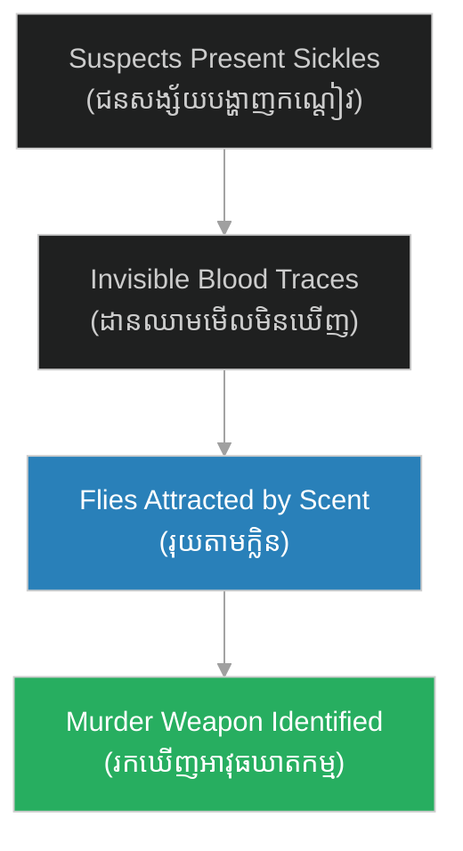

# នីតិបាណកវិទ្យា (Forensic Entomology)៖ Insect Science in Crime Solving

**Author:** ichamrong  
**Date:** 2026-06-11  
**Tags:** #forensic-science #entomology #song-ci #investigation  
**Category:** Keywords  
**Read Time:** ~3 min  

---

## 📌 មាតិកា (Table of Contents)
- [១. តើអ្វីជានីតិបាណកវិទ្យា? (What is Forensic Entomology?)](#1)
- [២. របកគំហើញដំបូងដោយ Song Ci (The First Discovery by Song Ci)](#2)
- [៣. ឥទ្ធិពលលើវិទ្យាសាស្ត្រទំនើប (Impact on Modern Science)](#3)

---

## ១. តើអ្វីជានីតិបាណកវិទ្យា? (What is Forensic Entomology?)

**នីតិបាណកវិទ្យា (Forensic Entomology)** គឺជាការសិក្សាអំពីសត្វល្អិត និងពពួកសត្វល្អិតដទៃទៀត ដើម្បីជួយក្នុងការស៊ើបអង្កេតផ្លូវច្បាប់ ជាពិសេសពាក់ព័ន្ធនឹងករណីឃាតកម្ម ឬការស្លាប់ដែលគួរឱ្យសង្ស័យ។ សត្វល្អិតដូចជាសត្វរុយ តែងតែទៅដល់សាកសពលឿនជាងគេ ដែលអាចជួយអ្នកស៊ើបអង្កេតកំណត់ពេលវេលានៃការស្លាប់ (Time of Death)។

**Forensic Entomology** is the study of insects and their arthropod relatives to aid in legal investigations, particularly concerning homicides or suspicious deaths. Insects like blowflies are often the first to arrive at a corpse, helping investigators estimate the time of death.

---

## ២. របកគំហើញដំបូងដោយ Song Ci (The First Discovery by Song Ci)

កំណត់ត្រាដំបូងបង្អស់នៃការប្រើប្រាស់នីតិបាណកវិទ្យាក្នុងប្រវត្តិសាស្ត្រពិភពលោកគឺនៅក្នុងសៀវភៅ **[Xi Yuan Ji Lu](../02-xi-yuan-ji-lu.md)** របស់ **[Song Ci](../01-song-ci-biography.md)** កាលពីឆ្នាំ ១២៤៧។

**ករណីជាក់ស្តែង៖** មានឃាតកម្មមួយដែលជនរងគ្រោះត្រូវបានកាប់សម្លាប់។ ដោយដឹងថាអាវុធគឺជាកណ្តៀវ Song Ci បានបញ្ជាឱ្យអ្នកភូមិទាំងអស់យកកណ្តៀវពួកគេមកតម្រៀបគ្នាក្រោមពន្លឺថ្ងៃ។ មិនយូរប៉ុន្មាន មានតែរុយប៉ុណ្ណោះដែលទៅរោមលើកណ្តៀវមួយដោយសារតែក្លិនឈាមដែលលាងមិនជ្រះ។ ម្ចាស់កណ្តៀវនោះក៏បានព្រមសារភាព។

---

## ៣. ឥទ្ធិពលលើវិទ្យាសាស្ត្រទំនើប (Impact on Modern Science)

គំនិតដែលសត្វល្អិតអាចធ្វើជា "សាក្សីស្ងៀមស្ងាត់" បានក្លាយជាមូលដ្ឋានគ្រឹះនៃវិទ្យាសាស្ត្រកោសល្យវិច័យសព្វថ្ងៃ។ វាបង្រៀនយើងថា ធម្មជាតិតែងតែបន្សល់ទុកដានជានិច្ច គ្រាន់តែថាតើយើងចេះសង្កេតវាឬទេ។
